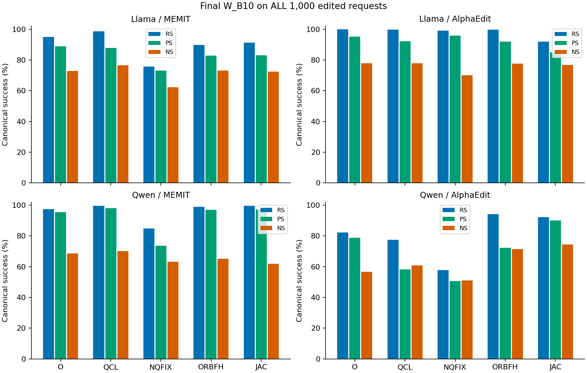
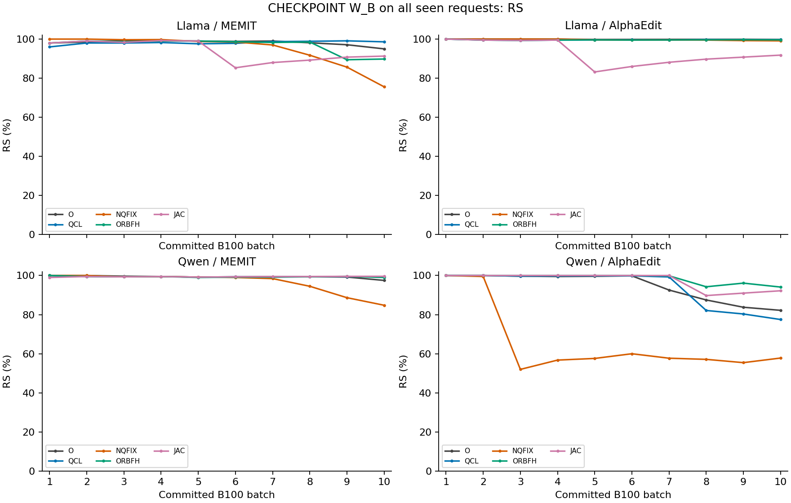
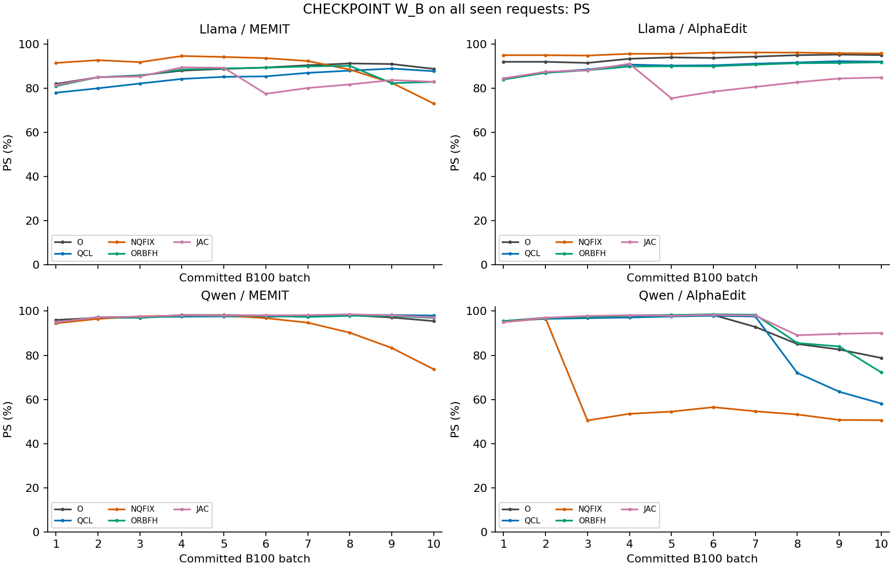
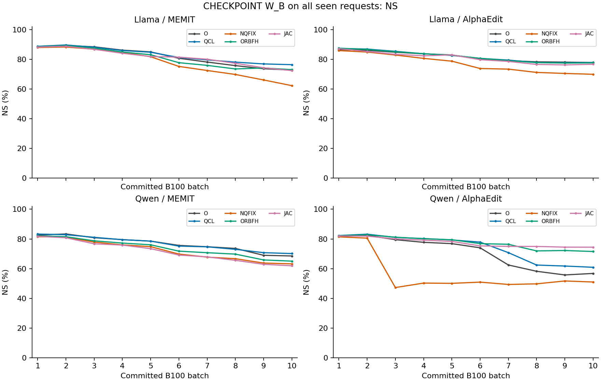
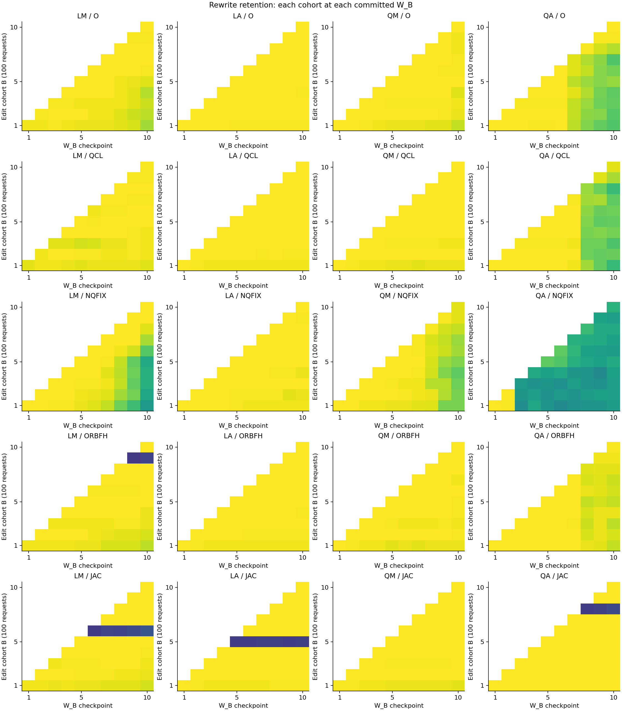
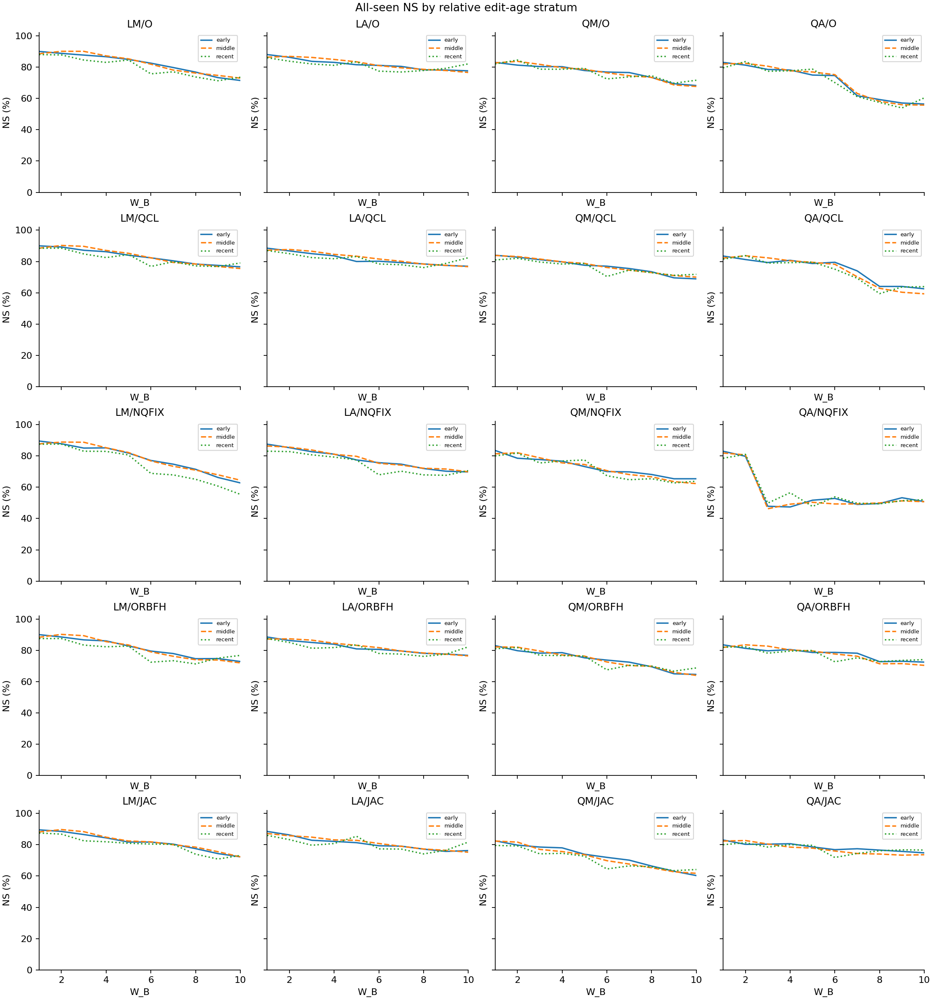
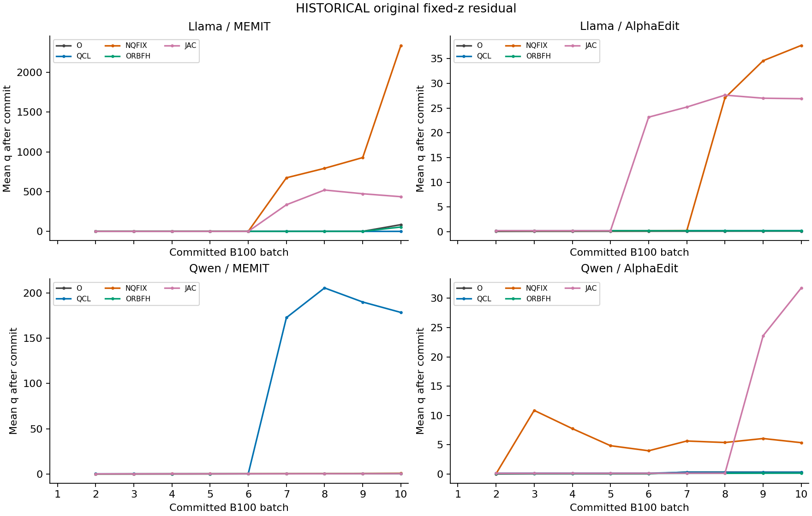
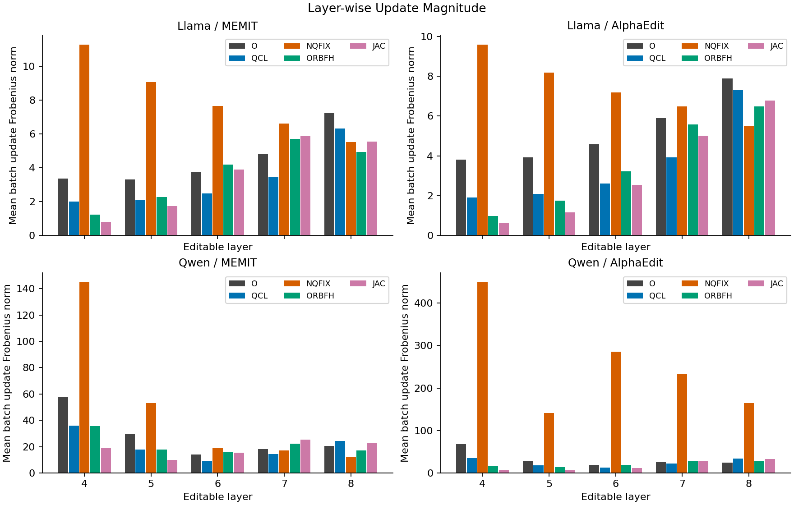
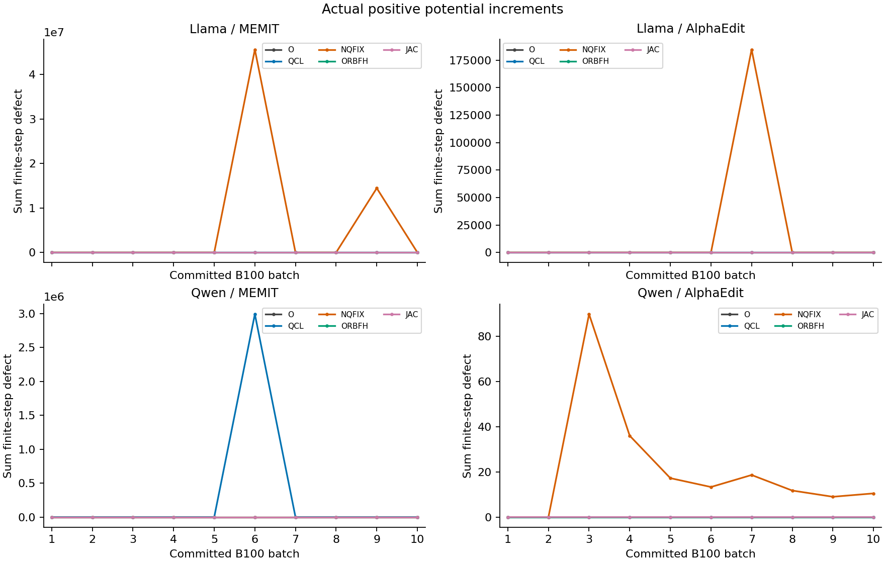
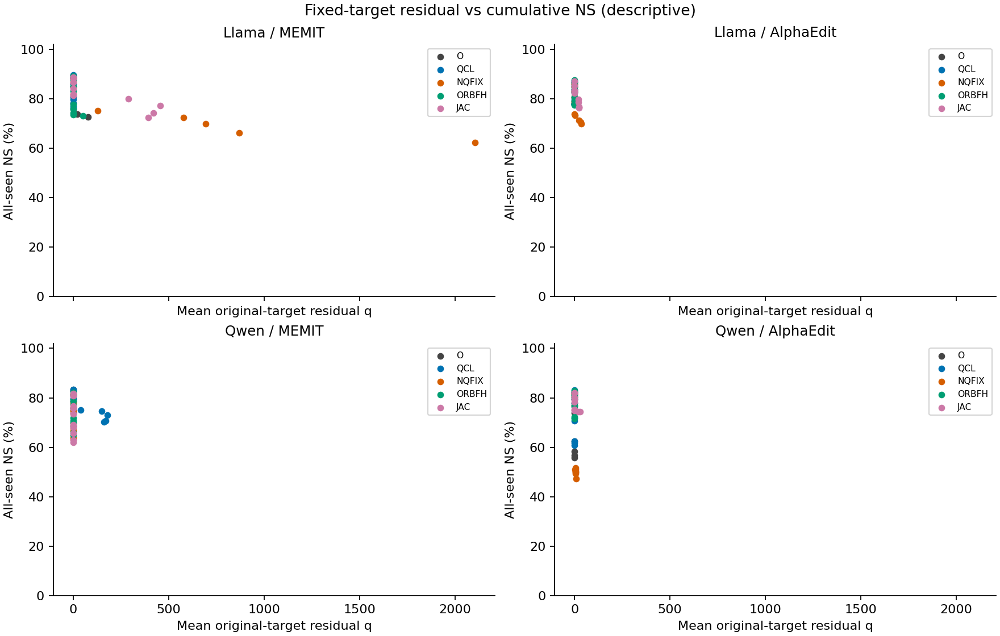

# ORBODE B100×10 cumulative rerun — 20-arm exhaustive factual report

Instruction: `ODEEDIT-S06-ORBODE-CUMULATIVE-RERUN-EXHAUSTIVE-REPORT-SH4-V1`. 새 누적 rerun의 실제 W_B 평가를 분석한 독립 canonical package다. 이전 sequential-v1의 online aggregate를 누적 retention으로 재명명하지 않았다. 이번 분석은 CPU-only; 새 model/evaluator/GPU/Slurm action=0. Scientific promotion=false.

## 1. 최종 성능 — 각 final W_B10에서 전체 1,000개 재평가

|cell|arm|RS|PS|PS_strict|NS|rewrite_acc|rephrase_acc|
|---|---|---|---|---|---|---|---|
|LM|O|950/1000 (95.00%)|1776/2000 (88.80%)|841/1000 (84.10%)|7276/10000 (72.76%)|834/1000 (83.40%)|1243/2000 (62.15%)|
|LM|QCL|986/1000 (98.60%)|1755/2000 (87.75%)|811/1000 (81.10%)|7643/10000 (76.43%)|934/1000 (93.40%)|1192/2000 (59.60%)|
|LM|NQFIX|756/1000 (75.60%)|1462/2000 (73.10%)|644/1000 (64.40%)|6232/10000 (62.32%)|420/1000 (42.00%)|744/2000 (37.20%)|
|LM|ORBFH|898/1000 (89.80%)|1658/2000 (82.90%)|770/1000 (77.00%)|7310/10000 (73.10%)|821/1000 (82.10%)|1097/2000 (54.85%)|
|LM|JAC|913/1000 (91.30%)|1659/2000 (82.95%)|765/1000 (76.50%)|7243/10000 (72.43%)|834/1000 (83.40%)|1121/2000 (56.05%)|
|LA|O|998/1000 (99.80%)|1901/2000 (95.05%)|921/1000 (92.10%)|7787/10000 (77.87%)|994/1000 (99.40%)|1423/2000 (71.15%)|
|LA|QCL|997/1000 (99.70%)|1841/2000 (92.05%)|874/1000 (87.40%)|7789/10000 (77.89%)|993/1000 (99.30%)|1307/2000 (65.35%)|
|LA|NQFIX|991/1000 (99.10%)|1916/2000 (95.80%)|929/1000 (92.90%)|6997/10000 (69.97%)|966/1000 (96.60%)|1460/2000 (73.00%)|
|LA|ORBFH|996/1000 (99.60%)|1836/2000 (91.80%)|870/1000 (87.00%)|7765/10000 (77.65%)|992/1000 (99.20%)|1294/2000 (64.70%)|
|LA|JAC|918/1000 (91.80%)|1698/2000 (84.90%)|803/1000 (80.30%)|7671/10000 (76.71%)|899/1000 (89.90%)|1187/2000 (59.35%)|
|QM|O|975/1000 (97.50%)|1910/2000 (95.50%)|925/1000 (92.50%)|6853/10000 (68.53%)|898/1000 (89.80%)|1328/2000 (66.40%)|
|QM|QCL|995/1000 (99.50%)|1960/2000 (98.00%)|969/1000 (96.90%)|7014/10000 (70.14%)|969/1000 (96.90%)|1388/2000 (69.40%)|
|QM|NQFIX|848/1000 (84.80%)|1474/2000 (73.70%)|609/1000 (60.90%)|6322/10000 (63.22%)|543/1000 (54.30%)|511/2000 (25.55%)|
|QM|ORBFH|990/1000 (99.00%)|1939/2000 (96.95%)|949/1000 (94.90%)|6505/10000 (65.05%)|927/1000 (92.70%)|1347/2000 (67.35%)|
|QM|JAC|996/1000 (99.60%)|1943/2000 (97.15%)|953/1000 (95.30%)|6193/10000 (61.93%)|940/1000 (94.00%)|1423/2000 (71.15%)|
|QA|O|822/1000 (82.20%)|1576/2000 (78.80%)|677/1000 (67.70%)|5678/10000 (56.78%)|454/1000 (45.40%)|500/2000 (25.00%)|
|QA|QCL|775/1000 (77.50%)|1163/2000 (58.15%)|437/1000 (43.70%)|6091/10000 (60.91%)|499/1000 (49.90%)|208/2000 (10.40%)|
|QA|NQFIX|578/1000 (57.80%)|1012/2000 (50.60%)|295/1000 (29.50%)|5101/10000 (51.01%)|9/1000 (0.90%)|5/2000 (0.25%)|
|QA|ORBFH|941/1000 (94.10%)|1445/2000 (72.25%)|567/1000 (56.70%)|7154/10000 (71.54%)|796/1000 (79.60%)|526/2000 (26.30%)|
|QA|JAC|922/1000 (92.20%)|1802/2000 (90.10%)|868/1000 (86.80%)|7444/10000 (74.44%)|894/1000 (89.40%)|1193/2000 (59.65%)|

공통 unique sample은 1,000개이며 20개 독립 arm-chain에서 반복 사용했다. 위 표는 20,000 arm-request endpoints이며 20,000개의 서로 다른 샘플이 아니다. Final W10 평가를 200개 누적 checkpoint 중 마지막 member로 한 번만 센다. RS/PS/NS는 canonical NLL pair, accuracy/strict는 secondary다.



### 1.1 Official O 대비 final 차이 (percentage points)

|cell|batch|arm|reference|RS_delta_pp|PS_delta_pp|PS_strict_delta_pp|NS_delta_pp|rewrite_acc_delta_pp|rephrase_acc_delta_pp|
|---|---|---|---|---|---|---|---|---|---|
|LM|10|QCL|O|3.6|-1.05|-3|3.67|10|-2.55|
|LM|10|NQFIX|O|-19.4|-15.7|-19.7|-10.44|-41.4|-24.95|
|LM|10|ORBFH|O|-5.2|-5.9|-7.1|0.34|-1.3|-7.3|
|LM|10|JAC|O|-3.7|-5.85|-7.6|-0.33|0|-6.1|
|LA|10|QCL|O|-0.1|-3|-4.7|0.02|-0.1|-5.8|
|LA|10|NQFIX|O|-0.7|0.75|0.8|-7.9|-2.8|1.85|
|LA|10|ORBFH|O|-0.2|-3.25|-5.1|-0.22|-0.2|-6.45|
|LA|10|JAC|O|-8|-10.15|-11.8|-1.16|-9.5|-11.8|
|QM|10|QCL|O|2|2.5|4.4|1.61|7.1|3|
|QM|10|NQFIX|O|-12.7|-21.8|-31.6|-5.31|-35.5|-40.85|
|QM|10|ORBFH|O|1.5|1.45|2.4|-3.48|2.9|0.95|
|QM|10|JAC|O|2.1|1.65|2.8|-6.6|4.2|4.75|
|QA|10|QCL|O|-4.7|-20.65|-24|4.13|4.5|-14.6|
|QA|10|NQFIX|O|-24.4|-28.2|-38.2|-5.77|-44.5|-24.75|
|QA|10|ORBFH|O|11.9|-6.55|-11|14.76|34.2|1.3|
|QA|10|JAC|O|10|11.3|19.1|17.66|44|34.65|

### 1.2 셀별 산술 관찰

**LM**: O RS/PS/NS=95.00/88.80/72.76%; QCL RS/PS/NS=98.60/87.75/76.43%; NQFIX RS/PS/NS=75.60/73.10/62.32%; ORBFH RS/PS/NS=89.80/82.90/73.10%; JAC RS/PS/NS=91.30/82.95/72.43%.

- QCL−O: RS +3.60, PS -1.05, NS +3.67 pp. 동일 요청의 서로 다른 end-to-end W/z 결과이며 동일 상태에서 controller만 바꾼 효과가 아니다.
- NQFIX−O: RS -19.40, PS -15.70, NS -10.44 pp. 동일 요청의 서로 다른 end-to-end W/z 결과이며 동일 상태에서 controller만 바꾼 효과가 아니다.
- ORBFH−O: RS -5.20, PS -5.90, NS +0.34 pp. 동일 요청의 서로 다른 end-to-end W/z 결과이며 동일 상태에서 controller만 바꾼 효과가 아니다.
- JAC−O: RS -3.70, PS -5.85, NS -0.33 pp. 동일 요청의 서로 다른 end-to-end W/z 결과이며 동일 상태에서 controller만 바꾼 효과가 아니다.

**LA**: O RS/PS/NS=99.80/95.05/77.87%; QCL RS/PS/NS=99.70/92.05/77.89%; NQFIX RS/PS/NS=99.10/95.80/69.97%; ORBFH RS/PS/NS=99.60/91.80/77.65%; JAC RS/PS/NS=91.80/84.90/76.71%.

- QCL−O: RS -0.10, PS -3.00, NS +0.02 pp. 동일 요청의 서로 다른 end-to-end W/z 결과이며 동일 상태에서 controller만 바꾼 효과가 아니다.
- NQFIX−O: RS -0.70, PS +0.75, NS -7.90 pp. 동일 요청의 서로 다른 end-to-end W/z 결과이며 동일 상태에서 controller만 바꾼 효과가 아니다.
- ORBFH−O: RS -0.20, PS -3.25, NS -0.22 pp. 동일 요청의 서로 다른 end-to-end W/z 결과이며 동일 상태에서 controller만 바꾼 효과가 아니다.
- JAC−O: RS -8.00, PS -10.15, NS -1.16 pp. 동일 요청의 서로 다른 end-to-end W/z 결과이며 동일 상태에서 controller만 바꾼 효과가 아니다.

**QM**: O RS/PS/NS=97.50/95.50/68.53%; QCL RS/PS/NS=99.50/98.00/70.14%; NQFIX RS/PS/NS=84.80/73.70/63.22%; ORBFH RS/PS/NS=99.00/96.95/65.05%; JAC RS/PS/NS=99.60/97.15/61.93%.

- QCL−O: RS +2.00, PS +2.50, NS +1.61 pp. 동일 요청의 서로 다른 end-to-end W/z 결과이며 동일 상태에서 controller만 바꾼 효과가 아니다.
- NQFIX−O: RS -12.70, PS -21.80, NS -5.31 pp. 동일 요청의 서로 다른 end-to-end W/z 결과이며 동일 상태에서 controller만 바꾼 효과가 아니다.
- ORBFH−O: RS +1.50, PS +1.45, NS -3.48 pp. 동일 요청의 서로 다른 end-to-end W/z 결과이며 동일 상태에서 controller만 바꾼 효과가 아니다.
- JAC−O: RS +2.10, PS +1.65, NS -6.60 pp. 동일 요청의 서로 다른 end-to-end W/z 결과이며 동일 상태에서 controller만 바꾼 효과가 아니다.

**QA**: O RS/PS/NS=82.20/78.80/56.78%; QCL RS/PS/NS=77.50/58.15/60.91%; NQFIX RS/PS/NS=57.80/50.60/51.01%; ORBFH RS/PS/NS=94.10/72.25/71.54%; JAC RS/PS/NS=92.20/90.10/74.44%.

- QCL−O: RS -4.70, PS -20.65, NS +4.13 pp. 동일 요청의 서로 다른 end-to-end W/z 결과이며 동일 상태에서 controller만 바꾼 효과가 아니다.
- NQFIX−O: RS -24.40, PS -28.20, NS -5.77 pp. 동일 요청의 서로 다른 end-to-end W/z 결과이며 동일 상태에서 controller만 바꾼 효과가 아니다.
- ORBFH−O: RS +11.90, PS -6.55, NS +14.76 pp. 동일 요청의 서로 다른 end-to-end W/z 결과이며 동일 상태에서 controller만 바꾼 효과가 아니다.
- JAC−O: RS +10.00, PS +11.30, NS +17.66 pp. 동일 요청의 서로 다른 end-to-end W/z 결과이며 동일 상태에서 controller만 바꾼 효과가 아니다.

## 2. 지표 읽는 법과 단위

|지표|정의·단위·방향|분모/주의|
|---|---|---|
|RS|rewrite에서 length-normalized NLL(new)<NLL(true); 높을수록 많은 성공|B_k까지100k rewrite prompts|
|PS|각 rephrase prompt에서 new<true; 높을수록 많은 성공|200k prompts; request 평균 NLL 비교가 아님|
|NS|각 neighborhood prompt에서 true<new; 높을수록 더 많은 원사실 선호|1000k prompts; PP token 보존과 다름|
|tie|strict 부등식이므로 동일 NLL은 실패|tolerance나 tie 개선 없이 원 reducer 그대로|
|PS_strict|request의 두 rephrase가 모두 canonical pair 성공|100k requests; PS와 분리|
|rewrite_acc/rephrase_acc|teacher-forced target-new의 모든 target token top-1 정답인 prompt 수|100k/200k prompts; token-mean accuracy가 아님|
|token accuracy|correct_token_num/target_token_den|category-distributions.csv; prompt strict와 다른 단위|
|PP|batch-entry 대비 neighborhood predicted-token preservation|CURRENT_B100에서만 기록; cumulative에는 NOT_RECORDED|
|NLL(new/true)|target span token별 NLL 평균, nat/token; 낮을수록 높은 해당 target 확률|prompt와 request_cluster를 별도 집계; latter는 request 안 prompts 평균 후 분포|
|margin|NLL(true)−NLL(new)|positive는 rewrite/rephrase new 선호; locality는 negative 선호. logit margin 아님|
|mean/median/IQR/p90/max|산술평균/50%/25–75%/90%/최댓값, linear quantile|request-cluster와 prompt 분포 혼합 금지. raw n=0은 NOT_RECORDED|
|R, q|해당 cohort의 원래 frozen z*−현재 terminal activation; q=||R||/||R_origin|||cohort마다 원래 entry scale; zero denominator typed missing|
|A, Y, E|current command A, 실제 activation 변화 Y, E=A−Y|Official A=현재 residual/remaining layers; dynamic A는 h·u native field command. 모든 norm은 별도|
|M|actual minus predicted response의 norm 및 원래 residual 정규화|dynamic JVP 예측 모델 오차; Official M 미기록|
|rho, tau|rho=<Y,A>/||A||²; tau=||Y−rho A||/||A|||0<rho<1 under, rho>1 over, rho<0 opposite; current command에만 적용|
|g,r,u|g=mean(<R,D>/||R0||²), r=mean(||D||²/||R0||²), D는 native-direction terminal JVP; u는 accepted multiplier|r 자체가 squared-response 통계; 다시 r²로 제곱하지 않는다. a*=max(g,0)/r, 실제 workload α=h·u|
|potential V|평균 1/2 normalized residual squared|current batch frozen origin; finite defect=max(V_after−V_before,0) 별도|
|과거 cohort damage|기존 z*/origin 대비 q와 자신의 immediate-post activation으로부터 거리|새 command 없음; current rho를 historical realization ratio로 적용 금지|
|Layer-wise Update Magnitude|실제 stored ΔW_l의 Frobenius norm|batch-net, W0-net, nominal low-rank path를 분리. layer block은 batch-level, request100개 독립 업데이트 아님|
|share / path / workload|magnitude share 및 squared share 구별; path Σ||αB||, work Σh·u|dynamic path는 nominal, 실제 FP32 rounding 차이 아님. Native C_reg action=UNBOUND|

## 3. 실행 provenance·분모·무결성

|cell|arm|batches|requests|W_links|M_links|fixed_z_compute|recompute|history_append_batches|terminal_restore|
|---|---|---|---|---|---|---|---|---|---|
|LM|O|10|1000|9|9|1000|0|0|True|
|LM|QCL|10|1000|9|9|1000|0|0|True|
|LM|NQFIX|10|1000|9|9|1000|0|0|True|
|LM|ORBFH|10|1000|9|9|1000|0|0|True|
|LM|JAC|10|1000|9|9|1000|0|0|True|
|LA|O|10|1000|9|9|1000|0|10|True|
|LA|QCL|10|1000|9|9|1000|0|10|True|
|LA|NQFIX|10|1000|9|9|1000|0|10|True|
|LA|ORBFH|10|1000|9|9|1000|0|10|True|
|LA|JAC|10|1000|9|9|1000|0|10|True|
|QM|O|10|1000|9|9|1000|0|0|True|
|QM|QCL|10|1000|9|9|1000|0|0|True|
|QM|NQFIX|10|1000|9|9|1000|0|0|True|
|QM|ORBFH|10|1000|9|9|1000|0|0|True|
|QM|JAC|10|1000|9|9|1000|0|0|True|
|QA|O|10|1000|9|9|1000|0|10|True|
|QA|QCL|10|1000|9|9|1000|0|10|True|
|QA|NQFIX|10|1000|9|9|1000|0|10|True|
|QA|ORBFH|10|1000|9|9|1000|0|10|True|
|QA|JAC|10|1000|9|9|1000|0|10|True|

전체 raw 5,965 members / 257,569,940,477 bytes를 SHA/size 재해시했다. Raw member root `65900f59dc967731e32debda33e36eb8d0ccc6c742a1736d6c21f6ddb83e55bd`. 200 checkpoint files의 5개 FP32 edited tensor를 CPU reload하여 W hash exact 확인; 200 frozen target/origin 파일도 재해시. W/M chain 각180 links, compute_z20,000 request calls, inner recompute0, terminal restore4/4. 중복/비유한/결과 imputation0. 관측된 finite scientific defect나 낮은 성능은 분모 제외하지 않았다.

Executed source `8610faf0e114059a5e08116f1164baf31c573e80` / tree `bec9b180de905e40ccc9e810b0a5f6a0d7c7797a`; analysis source `25b07ad31ffb1a8851143d500e2190973035f958` / tree `7fb27fc814372e16ce06eefe6825bc439ab2256a`. Run root `/data/janghj/ODE-edit/local/state/orbode-cumulative-rerun-v1/execution-r2`. Job37649_[0-3] 모두 COMPLETED0; 세부 child/timing/resource는 provenance.json. 1GPU/8CPU/59G, source/command/attention/backend/parameter inventory/EasyEdit/model bindings는 tables/integrity/source-runtime-provenance.json에 원 schema대로 포함한다.

LM/LA= Llama MEMIT/AlphaEdit, QM/QA=Qwen MEMIT/AlphaEdit. Llama parameter inventory291 tensors /8,030,261,248 elements, Qwen339 tensors /7,615,616,512 elements 모두 torch.float32. Autocast/TF32/quantization/BF16·FP16 cast0. Pinned stock EasyEdit HEAD14cea8245f06715684592ab55184939b99d70784/tree9c52aadbc0883da422badf0a730fff21aaa3a8a7, tracked-clean receipt. Eager attention은 terminal JVP/evaluator 공통이며 observation별 backend switch0. 원 runtime의 tokenizer 설정과 evaluator manual left-padding/attention/target-span code identity를 그대로 재사용한 결과이며 이번 CPU 분석에서 padding을 바꾸거나 forward parity를 새로 실행하지 않았다.

AlphaEdit: 각 arm cold 시작, 매 성공 B100 append100, 0→1000; arm 사이 이월0. MEMIT: static covariance 고정, history append0. Checkpoint는 five edited weights + pinned original model로 **평가 복구 가능**, cache는 hash만 있어 edit-resume snapshot이라고 주장하지 않는다. Source semantics를 재실행으로 검증한 것이 아니라 봉인 실행 receipt+파일/tensor 복구로 검증했다.

## 4. 모든 W_B에서 실제 all-seen 누적 성능 — 200 checkpoints

B_k의 동일 물리적 W에서 앞100k개 전체를 평가했다. 분모 증가와 W 변화가 함께 있으므로 인접 checkpoint rate 차이를 동일 cohort forgetting으로 단정하지 않는다. 동일 cohort의 변화는 §6 retention matrix로 분리한다.

### 4.1 LM: 5 arms × 10 checkpoints

|cell|arm|batch|RS|PS|PS_strict|NS|rewrite_acc|rephrase_acc|
|---|---|---|---|---|---|---|---|---|
|LM|O|1|98/100 (98.00%)|164/200 (82.00%)|77/100 (77.00%)|887/1000 (88.70%)|95/100 (95.00%)|97/200 (48.50%)|
|LM|O|2|197/200 (98.50%)|340/400 (85.00%)|158/200 (79.00%)|1787/2000 (89.35%)|194/200 (97.00%)|220/400 (55.00%)|
|LM|O|3|298/300 (99.33%)|515/600 (85.83%)|239/300 (79.67%)|2654/3000 (88.47%)|291/300 (97.00%)|342/600 (57.00%)|
|LM|O|4|397/400 (99.25%)|704/800 (88.00%)|328/400 (82.00%)|3449/4000 (86.22%)|391/400 (97.75%)|476/800 (59.50%)|
|LM|O|5|495/500 (99.00%)|888/1000 (88.80%)|416/500 (83.20%)|4252/5000 (85.04%)|486/500 (97.20%)|610/1000 (61.00%)|
|LM|O|6|593/600 (98.83%)|1073/1200 (89.42%)|503/600 (83.83%)|4845/6000 (80.75%)|576/600 (96.00%)|748/1200 (62.33%)|
|LM|O|7|693/700 (99.00%)|1266/1400 (90.43%)|598/700 (85.43%)|5474/7000 (78.20%)|666/700 (95.14%)|894/1400 (63.86%)|
|LM|O|8|785/800 (98.12%)|1460/1600 (91.25%)|694/800 (86.75%)|6065/8000 (75.81%)|738/800 (92.25%)|1008/1600 (63.00%)|
|LM|O|9|874/900 (97.11%)|1638/1800 (91.00%)|778/900 (86.44%)|6635/9000 (73.72%)|793/900 (88.11%)|1142/1800 (63.44%)|
|LM|O|10|950/1000 (95.00%)|1776/2000 (88.80%)|841/1000 (84.10%)|7276/10000 (72.76%)|834/1000 (83.40%)|1243/2000 (62.15%)|
|LM|QCL|1|96/100 (96.00%)|156/200 (78.00%)|69/100 (69.00%)|888/1000 (88.80%)|89/100 (89.00%)|88/200 (44.00%)|
|LM|QCL|2|196/200 (98.00%)|320/400 (80.00%)|143/200 (71.50%)|1794/2000 (89.70%)|187/200 (93.50%)|192/400 (48.00%)|
|LM|QCL|3|294/300 (98.00%)|493/600 (82.17%)|225/300 (75.00%)|2646/3000 (88.20%)|284/300 (94.67%)|320/600 (53.33%)|
|LM|QCL|4|393/400 (98.25%)|674/800 (84.25%)|308/400 (77.00%)|3439/4000 (85.97%)|383/400 (95.75%)|440/800 (55.00%)|
|LM|QCL|5|488/500 (97.60%)|852/1000 (85.20%)|388/500 (77.60%)|4241/5000 (84.82%)|478/500 (95.60%)|538/1000 (53.80%)|
|LM|QCL|6|587/600 (97.83%)|1025/1200 (85.42%)|469/600 (78.17%)|4875/6000 (81.25%)|572/600 (95.33%)|659/1200 (54.92%)|
|LM|QCL|7|691/700 (98.71%)|1218/1400 (87.00%)|563/700 (80.43%)|5578/7000 (79.69%)|665/700 (95.00%)|797/1400 (56.93%)|
|LM|QCL|8|791/800 (98.88%)|1408/1600 (88.00%)|648/800 (81.00%)|6252/8000 (78.15%)|758/800 (94.75%)|912/1600 (57.00%)|
|LM|QCL|9|892/900 (99.11%)|1601/1800 (88.94%)|746/900 (82.89%)|6925/9000 (76.94%)|850/900 (94.44%)|1058/1800 (58.78%)|
|LM|QCL|10|986/1000 (98.60%)|1755/2000 (87.75%)|811/1000 (81.10%)|7643/10000 (76.43%)|934/1000 (93.40%)|1192/2000 (59.60%)|
|LM|NQFIX|1|100/100 (100.00%)|183/200 (91.50%)|87/100 (87.00%)|880/1000 (88.00%)|100/100 (100.00%)|114/200 (57.00%)|
|LM|NQFIX|2|200/200 (100.00%)|371/400 (92.75%)|176/200 (88.00%)|1767/2000 (88.35%)|200/200 (100.00%)|256/400 (64.00%)|
|LM|NQFIX|3|299/300 (99.67%)|551/600 (91.83%)|265/300 (88.33%)|2605/3000 (86.83%)|298/300 (99.33%)|400/600 (66.67%)|
|LM|NQFIX|4|399/400 (99.75%)|757/800 (94.62%)|366/400 (91.50%)|3389/4000 (84.72%)|396/400 (99.00%)|564/800 (70.50%)|
|LM|NQFIX|5|494/500 (98.80%)|942/1000 (94.20%)|454/500 (90.80%)|4089/5000 (81.78%)|482/500 (96.40%)|706/1000 (70.60%)|
|LM|NQFIX|6|591/600 (98.50%)|1124/1200 (93.67%)|546/600 (91.00%)|4516/6000 (75.27%)|556/600 (92.67%)|822/1200 (68.50%)|
|LM|NQFIX|7|679/700 (97.00%)|1293/1400 (92.36%)|621/700 (88.71%)|5077/7000 (72.53%)|603/700 (86.14%)|935/1400 (66.79%)|
|LM|NQFIX|8|734/800 (91.75%)|1416/1600 (88.50%)|672/800 (84.00%)|5588/8000 (69.85%)|625/800 (78.12%)|954/1600 (59.62%)|
|LM|NQFIX|9|771/900 (85.67%)|1485/1800 (82.50%)|681/900 (75.67%)|5953/9000 (66.14%)|565/900 (62.78%)|928/1800 (51.56%)|
|LM|NQFIX|10|756/1000 (75.60%)|1462/2000 (73.10%)|644/1000 (64.40%)|6232/10000 (62.32%)|420/1000 (42.00%)|744/2000 (37.20%)|
|LM|ORBFH|1|98/100 (98.00%)|162/200 (81.00%)|75/100 (75.00%)|885/1000 (88.50%)|96/100 (96.00%)|97/200 (48.50%)|
|LM|ORBFH|2|198/200 (99.00%)|340/400 (85.00%)|154/200 (77.00%)|1786/2000 (89.30%)|196/200 (98.00%)|217/400 (54.25%)|
|LM|ORBFH|3|296/300 (98.67%)|514/600 (85.67%)|236/300 (78.67%)|2628/3000 (87.60%)|291/300 (97.00%)|353/600 (58.83%)|
|LM|ORBFH|4|396/400 (99.00%)|708/800 (88.50%)|327/400 (81.75%)|3399/4000 (84.97%)|391/400 (97.75%)|488/800 (61.00%)|
|LM|ORBFH|5|495/500 (99.00%)|890/1000 (89.00%)|416/500 (83.20%)|4157/5000 (83.14%)|485/500 (97.00%)|608/1000 (60.80%)|
|LM|ORBFH|6|592/600 (98.67%)|1072/1200 (89.33%)|503/600 (83.83%)|4667/6000 (77.78%)|575/600 (95.83%)|733/1200 (61.08%)|
|LM|ORBFH|7|688/700 (98.29%)|1259/1400 (89.93%)|592/700 (84.57%)|5318/7000 (75.97%)|666/700 (95.14%)|870/1400 (62.14%)|
|LM|ORBFH|8|788/800 (98.50%)|1443/1600 (90.19%)|674/800 (84.25%)|5886/8000 (73.58%)|739/800 (92.38%)|954/1600 (59.62%)|
|LM|ORBFH|9|805/900 (89.44%)|1482/1800 (82.33%)|686/900 (76.22%)|6680/9000 (74.22%)|745/900 (82.78%)|964/1800 (53.56%)|
|LM|ORBFH|10|898/1000 (89.80%)|1658/2000 (82.90%)|770/1000 (77.00%)|7310/10000 (73.10%)|821/1000 (82.10%)|1097/2000 (54.85%)|
|LM|JAC|1|98/100 (98.00%)|163/200 (81.50%)|76/100 (76.00%)|883/1000 (88.30%)|96/100 (96.00%)|96/200 (48.00%)|
|LM|JAC|2|198/200 (99.00%)|340/400 (85.00%)|155/200 (77.50%)|1777/2000 (88.85%)|195/200 (97.50%)|220/400 (55.00%)|
|LM|JAC|3|295/300 (98.33%)|512/600 (85.33%)|238/300 (79.33%)|2604/3000 (86.80%)|292/300 (97.33%)|345/600 (57.50%)|
|LM|JAC|4|397/400 (99.25%)|716/800 (89.50%)|334/400 (83.50%)|3365/4000 (84.12%)|392/400 (98.00%)|488/800 (61.00%)|
|LM|JAC|5|495/500 (99.00%)|893/1000 (89.30%)|419/500 (83.80%)|4097/5000 (81.94%)|485/500 (97.00%)|603/1000 (60.30%)|
|LM|JAC|6|512/600 (85.33%)|930/1200 (77.50%)|430/600 (71.67%)|4891/6000 (81.52%)|488/600 (81.33%)|610/1200 (50.83%)|
|LM|JAC|7|616/700 (88.00%)|1122/1400 (80.14%)|521/700 (74.43%)|5608/7000 (80.11%)|588/700 (84.00%)|745/1400 (53.21%)|
|LM|JAC|8|714/800 (89.25%)|1308/1600 (81.75%)|608/800 (76.00%)|6189/8000 (77.36%)|675/800 (84.38%)|866/1600 (54.12%)|
|LM|JAC|9|817/900 (90.78%)|1507/1800 (83.72%)|698/900 (77.56%)|6692/9000 (74.36%)|759/900 (84.33%)|1020/1800 (56.67%)|
|LM|JAC|10|913/1000 (91.30%)|1659/2000 (82.95%)|765/1000 (76.50%)|7243/10000 (72.43%)|834/1000 (83.40%)|1121/2000 (56.05%)|

- O: B1→B10 RS/PS/NS 변화 -3.00/+6.80/-15.94 pp; 누적 PS 최솟값 82.00% (B1), NS 최솟값 72.76% (B10).
- QCL: B1→B10 RS/PS/NS 변화 +2.60/+9.75/-12.37 pp; 누적 PS 최솟값 78.00% (B1), NS 최솟값 76.43% (B10).
- NQFIX: B1→B10 RS/PS/NS 변화 -24.40/-18.40/-25.68 pp; 누적 PS 최솟값 73.10% (B10), NS 최솟값 62.32% (B10).
- ORBFH: B1→B10 RS/PS/NS 변화 -8.20/+1.90/-15.40 pp; 누적 PS 최솟값 81.00% (B1), NS 최솟값 73.10% (B10).
- JAC: B1→B10 RS/PS/NS 변화 -6.70/+1.45/-15.87 pp; 누적 PS 최솟값 77.50% (B6), NS 최솟값 72.43% (B10).

### 4.2 LA: 5 arms × 10 checkpoints

|cell|arm|batch|RS|PS|PS_strict|NS|rewrite_acc|rephrase_acc|
|---|---|---|---|---|---|---|---|---|
|LA|O|1|100/100 (100.00%)|184/200 (92.00%)|89/100 (89.00%)|866/1000 (86.60%)|100/100 (100.00%)|120/200 (60.00%)|
|LA|O|2|200/200 (100.00%)|368/400 (92.00%)|176/200 (88.00%)|1722/2000 (86.10%)|200/200 (100.00%)|263/400 (65.75%)|
|LA|O|3|300/300 (100.00%)|549/600 (91.50%)|265/300 (88.33%)|2545/3000 (84.83%)|300/300 (100.00%)|397/600 (66.17%)|
|LA|O|4|400/400 (100.00%)|747/800 (93.38%)|360/400 (90.00%)|3350/4000 (83.75%)|400/400 (100.00%)|549/800 (68.62%)|
|LA|O|5|499/500 (99.80%)|940/1000 (94.00%)|456/500 (91.20%)|4150/5000 (83.00%)|498/500 (99.60%)|698/1000 (69.80%)|
|LA|O|6|599/600 (99.83%)|1125/1200 (93.75%)|543/600 (90.50%)|4816/6000 (80.27%)|597/600 (99.50%)|828/1200 (69.00%)|
|LA|O|7|699/700 (99.86%)|1321/1400 (94.36%)|637/700 (91.00%)|5542/7000 (79.17%)|697/700 (99.57%)|977/1400 (69.79%)|
|LA|O|8|799/800 (99.88%)|1520/1600 (95.00%)|735/800 (91.88%)|6268/8000 (78.35%)|796/800 (99.50%)|1126/1600 (70.37%)|
|LA|O|9|899/900 (99.89%)|1715/1800 (95.28%)|831/900 (92.33%)|7033/9000 (78.14%)|896/900 (99.56%)|1279/1800 (71.06%)|
|LA|O|10|998/1000 (99.80%)|1901/2000 (95.05%)|921/1000 (92.10%)|7787/10000 (77.87%)|994/1000 (99.40%)|1423/2000 (71.15%)|
|LA|QCL|1|100/100 (100.00%)|169/200 (84.50%)|79/100 (79.00%)|874/1000 (87.40%)|99/100 (99.00%)|108/200 (54.00%)|
|LA|QCL|2|199/200 (99.50%)|349/400 (87.25%)|163/200 (81.50%)|1739/2000 (86.95%)|199/200 (99.50%)|235/400 (58.75%)|
|LA|QCL|3|298/300 (99.33%)|531/600 (88.50%)|250/300 (83.33%)|2563/3000 (85.43%)|298/300 (99.33%)|363/600 (60.50%)|
|LA|QCL|4|398/400 (99.50%)|726/800 (90.75%)|344/400 (86.00%)|3352/4000 (83.80%)|398/400 (99.50%)|500/800 (62.50%)|
|LA|QCL|5|498/500 (99.60%)|903/1000 (90.30%)|426/500 (85.20%)|4133/5000 (82.66%)|498/500 (99.60%)|633/1000 (63.30%)|
|LA|QCL|6|598/600 (99.67%)|1085/1200 (90.42%)|513/600 (85.50%)|4840/6000 (80.67%)|597/600 (99.50%)|760/1200 (63.33%)|
|LA|QCL|7|697/700 (99.57%)|1276/1400 (91.14%)|604/700 (86.29%)|5567/7000 (79.53%)|695/700 (99.29%)|901/1400 (64.36%)|
|LA|QCL|8|798/800 (99.75%)|1467/1600 (91.69%)|695/800 (86.88%)|6233/8000 (77.91%)|796/800 (99.50%)|1027/1600 (64.19%)|
|LA|QCL|9|897/900 (99.67%)|1661/1800 (92.28%)|793/900 (88.11%)|6999/9000 (77.77%)|895/900 (99.44%)|1167/1800 (64.83%)|
|LA|QCL|10|997/1000 (99.70%)|1841/2000 (92.05%)|874/1000 (87.40%)|7789/10000 (77.89%)|993/1000 (99.30%)|1307/2000 (65.35%)|
|LA|NQFIX|1|100/100 (100.00%)|190/200 (95.00%)|93/100 (93.00%)|859/1000 (85.90%)|100/100 (100.00%)|126/200 (63.00%)|
|LA|NQFIX|2|200/200 (100.00%)|380/400 (95.00%)|185/200 (92.50%)|1699/2000 (84.95%)|200/200 (100.00%)|263/400 (65.75%)|
|LA|NQFIX|3|300/300 (100.00%)|569/600 (94.83%)|278/300 (92.67%)|2488/3000 (82.93%)|299/300 (99.67%)|402/600 (67.00%)|
|LA|NQFIX|4|400/400 (100.00%)|765/800 (95.62%)|374/400 (93.50%)|3227/4000 (80.67%)|396/400 (99.00%)|565/800 (70.62%)|
|LA|NQFIX|5|498/500 (99.60%)|956/1000 (95.60%)|465/500 (93.00%)|3940/5000 (78.80%)|495/500 (99.00%)|722/1000 (72.20%)|
|LA|NQFIX|6|597/600 (99.50%)|1154/1200 (96.17%)|566/600 (94.33%)|4432/6000 (73.87%)|593/600 (98.83%)|880/1200 (73.33%)|
|LA|NQFIX|7|697/700 (99.57%)|1347/1400 (96.21%)|661/700 (94.43%)|5142/7000 (73.46%)|690/700 (98.57%)|1041/1400 (74.36%)|
|LA|NQFIX|8|796/800 (99.50%)|1539/1600 (96.19%)|753/800 (94.12%)|5698/8000 (71.23%)|786/800 (98.25%)|1183/1600 (73.94%)|
|LA|NQFIX|9|893/900 (99.22%)|1726/1800 (95.89%)|840/900 (93.33%)|6348/9000 (70.53%)|877/900 (97.44%)|1330/1800 (73.89%)|
|LA|NQFIX|10|991/1000 (99.10%)|1916/2000 (95.80%)|929/1000 (92.90%)|6997/10000 (69.97%)|966/1000 (96.60%)|1460/2000 (73.00%)|
|LA|ORBFH|1|100/100 (100.00%)|168/200 (84.00%)|79/100 (79.00%)|875/1000 (87.50%)|99/100 (99.00%)|107/200 (53.50%)|
|LA|ORBFH|2|199/200 (99.50%)|348/400 (87.00%)|163/200 (81.50%)|1733/2000 (86.65%)|199/200 (99.50%)|233/400 (58.25%)|
|LA|ORBFH|3|298/300 (99.33%)|529/600 (88.17%)|247/300 (82.33%)|2555/3000 (85.17%)|298/300 (99.33%)|358/600 (59.67%)|
|LA|ORBFH|4|398/400 (99.50%)|719/800 (89.88%)|338/400 (84.50%)|3353/4000 (83.83%)|398/400 (99.50%)|499/800 (62.38%)|
|LA|ORBFH|5|498/500 (99.60%)|900/1000 (90.00%)|424/500 (84.80%)|4139/5000 (82.78%)|498/500 (99.60%)|630/1000 (63.00%)|
|LA|ORBFH|6|597/600 (99.50%)|1080/1200 (90.00%)|508/600 (84.67%)|4844/6000 (80.73%)|597/600 (99.50%)|756/1200 (63.00%)|
|LA|ORBFH|7|697/700 (99.57%)|1270/1400 (90.71%)|597/700 (85.29%)|5541/7000 (79.16%)|696/700 (99.43%)|890/1400 (63.57%)|
|LA|ORBFH|8|797/800 (99.62%)|1462/1600 (91.38%)|691/800 (86.38%)|6226/8000 (77.83%)|795/800 (99.38%)|1016/1600 (63.50%)|
|LA|ORBFH|9|897/900 (99.67%)|1647/1800 (91.50%)|780/900 (86.67%)|6976/9000 (77.51%)|892/900 (99.11%)|1153/1800 (64.06%)|
|LA|ORBFH|10|996/1000 (99.60%)|1836/2000 (91.80%)|870/1000 (87.00%)|7765/10000 (77.65%)|992/1000 (99.20%)|1294/2000 (64.70%)|
|LA|JAC|1|100/100 (100.00%)|169/200 (84.50%)|79/100 (79.00%)|872/1000 (87.20%)|100/100 (100.00%)|107/200 (53.50%)|
|LA|JAC|2|199/200 (99.50%)|350/400 (87.50%)|162/200 (81.00%)|1707/2000 (85.35%)|199/200 (99.50%)|236/400 (59.00%)|
|LA|JAC|3|298/300 (99.33%)|529/600 (88.17%)|246/300 (82.00%)|2502/3000 (83.40%)|298/300 (99.33%)|365/600 (60.83%)|
|LA|JAC|4|398/400 (99.50%)|729/800 (91.12%)|344/400 (86.00%)|3297/4000 (82.42%)|397/400 (99.25%)|505/800 (63.12%)|
|LA|JAC|5|416/500 (83.20%)|755/1000 (75.50%)|353/500 (70.60%)|4151/5000 (83.02%)|400/500 (80.00%)|507/1000 (50.70%)|
|LA|JAC|6|516/600 (86.00%)|942/1200 (78.50%)|441/600 (73.50%)|4788/6000 (79.80%)|500/600 (83.33%)|636/1200 (53.00%)|
|LA|JAC|7|617/700 (88.14%)|1129/1400 (80.64%)|529/700 (75.57%)|5505/7000 (78.64%)|601/700 (85.86%)|778/1400 (55.57%)|
|LA|JAC|8|718/800 (89.75%)|1324/1600 (82.75%)|626/800 (78.25%)|6129/8000 (76.61%)|700/800 (87.50%)|912/1600 (57.00%)|
|LA|JAC|9|817/900 (90.78%)|1520/1800 (84.44%)|720/900 (80.00%)|6865/9000 (76.28%)|800/900 (88.89%)|1059/1800 (58.83%)|
|LA|JAC|10|918/1000 (91.80%)|1698/2000 (84.90%)|803/1000 (80.30%)|7671/10000 (76.71%)|899/1000 (89.90%)|1187/2000 (59.35%)|

- O: B1→B10 RS/PS/NS 변화 -0.20/+3.05/-8.73 pp; 누적 PS 최솟값 91.50% (B3), NS 최솟값 77.87% (B10).
- QCL: B1→B10 RS/PS/NS 변화 -0.30/+7.55/-9.51 pp; 누적 PS 최솟값 84.50% (B1), NS 최솟값 77.77% (B9).
- NQFIX: B1→B10 RS/PS/NS 변화 -0.90/+0.80/-15.93 pp; 누적 PS 최솟값 94.83% (B3), NS 최솟값 69.97% (B10).
- ORBFH: B1→B10 RS/PS/NS 변화 -0.40/+7.80/-9.85 pp; 누적 PS 최솟값 84.00% (B1), NS 최솟값 77.51% (B9).
- JAC: B1→B10 RS/PS/NS 변화 -8.20/+0.40/-10.49 pp; 누적 PS 최솟값 75.50% (B5), NS 최솟값 76.28% (B9).

### 4.3 QM: 5 arms × 10 checkpoints

|cell|arm|batch|RS|PS|PS_strict|NS|rewrite_acc|rephrase_acc|
|---|---|---|---|---|---|---|---|---|
|QM|O|1|100/100 (100.00%)|192/200 (96.00%)|95/100 (95.00%)|826/1000 (82.60%)|100/100 (100.00%)|130/200 (65.00%)|
|QM|O|2|200/200 (100.00%)|388/400 (97.00%)|193/200 (96.50%)|1667/2000 (83.35%)|200/200 (100.00%)|265/400 (66.25%)|
|QM|O|3|299/300 (99.67%)|582/600 (97.00%)|286/300 (95.33%)|2425/3000 (80.83%)|294/300 (98.00%)|412/600 (68.67%)|
|QM|O|4|398/400 (99.50%)|786/800 (98.25%)|389/400 (97.25%)|3181/4000 (79.53%)|390/400 (97.50%)|550/800 (68.75%)|
|QM|O|5|496/500 (99.20%)|982/1000 (98.20%)|488/500 (97.60%)|3927/5000 (78.54%)|489/500 (97.80%)|691/1000 (69.10%)|
|QM|O|6|596/600 (99.33%)|1176/1200 (98.00%)|582/600 (97.00%)|4539/6000 (75.65%)|586/600 (97.67%)|825/1200 (68.75%)|
|QM|O|7|696/700 (99.43%)|1368/1400 (97.71%)|677/700 (96.71%)|5233/7000 (74.76%)|684/700 (97.71%)|968/1400 (69.14%)|
|QM|O|8|795/800 (99.38%)|1571/1600 (98.19%)|779/800 (97.38%)|5889/8000 (73.61%)|774/800 (96.75%)|1112/1600 (69.50%)|
|QM|O|9|893/900 (99.22%)|1748/1800 (97.11%)|857/900 (95.22%)|6209/9000 (68.99%)|847/900 (94.11%)|1253/1800 (69.61%)|
|QM|O|10|975/1000 (97.50%)|1910/2000 (95.50%)|925/1000 (92.50%)|6853/10000 (68.53%)|898/1000 (89.80%)|1328/2000 (66.40%)|
|QM|QCL|1|100/100 (100.00%)|189/200 (94.50%)|93/100 (93.00%)|833/1000 (83.30%)|99/100 (99.00%)|130/200 (65.00%)|
|QM|QCL|2|199/200 (99.50%)|389/400 (97.25%)|193/200 (96.50%)|1657/2000 (82.85%)|197/200 (98.50%)|268/400 (67.00%)|
|QM|QCL|3|298/300 (99.33%)|584/600 (97.33%)|289/300 (96.33%)|2433/3000 (81.10%)|294/300 (98.00%)|395/600 (65.83%)|
|QM|QCL|4|398/400 (99.50%)|780/800 (97.50%)|384/400 (96.00%)|3180/4000 (79.50%)|392/400 (98.00%)|540/800 (67.50%)|
|QM|QCL|5|496/500 (99.20%)|976/1000 (97.60%)|483/500 (96.60%)|3927/5000 (78.54%)|490/500 (98.00%)|687/1000 (68.70%)|
|QM|QCL|6|596/600 (99.33%)|1169/1200 (97.42%)|577/600 (96.17%)|4511/6000 (75.18%)|588/600 (98.00%)|824/1200 (68.67%)|
|QM|QCL|7|695/700 (99.29%)|1371/1400 (97.93%)|679/700 (97.00%)|5228/7000 (74.69%)|685/700 (97.86%)|962/1400 (68.71%)|
|QM|QCL|8|796/800 (99.50%)|1571/1600 (98.19%)|778/800 (97.25%)|5841/8000 (73.01%)|782/800 (97.75%)|1107/1600 (69.19%)|
|QM|QCL|9|895/900 (99.44%)|1768/1800 (98.22%)|877/900 (97.44%)|6368/9000 (70.76%)|878/900 (97.56%)|1257/1800 (69.83%)|
|QM|QCL|10|995/1000 (99.50%)|1960/2000 (98.00%)|969/1000 (96.90%)|7014/10000 (70.14%)|969/1000 (96.90%)|1388/2000 (69.40%)|
|QM|NQFIX|1|100/100 (100.00%)|189/200 (94.50%)|93/100 (93.00%)|815/1000 (81.50%)|100/100 (100.00%)|132/200 (66.00%)|
|QM|NQFIX|2|200/200 (100.00%)|386/400 (96.50%)|191/200 (95.50%)|1625/2000 (81.25%)|198/200 (99.00%)|267/400 (66.75%)|
|QM|NQFIX|3|298/300 (99.33%)|586/600 (97.67%)|291/300 (97.00%)|2337/3000 (77.90%)|291/300 (97.00%)|413/600 (68.83%)|
|QM|NQFIX|4|398/400 (99.50%)|784/800 (98.00%)|389/400 (97.25%)|3040/4000 (76.00%)|389/400 (97.25%)|554/800 (69.25%)|
|QM|NQFIX|5|496/500 (99.20%)|980/1000 (98.00%)|487/500 (97.40%)|3741/5000 (74.82%)|485/500 (97.00%)|700/1000 (70.00%)|
|QM|NQFIX|6|594/600 (99.00%)|1162/1200 (96.83%)|571/600 (95.17%)|4189/6000 (69.82%)|573/600 (95.50%)|802/1200 (66.83%)|
|QM|NQFIX|7|689/700 (98.43%)|1327/1400 (94.79%)|642/700 (91.71%)|4744/7000 (67.77%)|640/700 (91.43%)|925/1400 (66.07%)|
|QM|NQFIX|8|756/800 (94.50%)|1444/1600 (90.25%)|677/800 (84.62%)|5335/8000 (66.69%)|583/800 (72.88%)|751/1600 (46.94%)|
|QM|NQFIX|9|798/900 (88.67%)|1500/1800 (83.33%)|663/900 (73.67%)|5739/9000 (63.77%)|568/900 (63.11%)|687/1800 (38.17%)|
|QM|NQFIX|10|848/1000 (84.80%)|1474/2000 (73.70%)|609/1000 (60.90%)|6322/10000 (63.22%)|543/1000 (54.30%)|511/2000 (25.55%)|
|QM|ORBFH|1|100/100 (100.00%)|190/200 (95.00%)|94/100 (94.00%)|821/1000 (82.10%)|100/100 (100.00%)|133/200 (66.50%)|
|QM|ORBFH|2|199/200 (99.50%)|389/400 (97.25%)|193/200 (96.50%)|1630/2000 (81.50%)|197/200 (98.50%)|267/400 (66.75%)|
|QM|ORBFH|3|298/300 (99.33%)|582/600 (97.00%)|288/300 (96.00%)|2362/3000 (78.73%)|294/300 (98.00%)|410/600 (68.33%)|
|QM|ORBFH|4|398/400 (99.50%)|783/800 (97.88%)|387/400 (96.75%)|3089/4000 (77.22%)|390/400 (97.50%)|547/800 (68.37%)|
|QM|ORBFH|5|495/500 (99.00%)|978/1000 (97.80%)|485/500 (97.00%)|3803/5000 (76.06%)|490/500 (98.00%)|698/1000 (69.80%)|
|QM|ORBFH|6|595/600 (99.17%)|1174/1200 (97.83%)|581/600 (96.83%)|4307/6000 (71.78%)|583/600 (97.17%)|842/1200 (70.17%)|
|QM|ORBFH|7|694/700 (99.14%)|1363/1400 (97.36%)|672/700 (96.00%)|4951/7000 (70.73%)|679/700 (97.00%)|983/1400 (70.21%)|
|QM|ORBFH|8|795/800 (99.38%)|1566/1600 (97.88%)|773/800 (96.62%)|5583/8000 (69.79%)|769/800 (96.12%)|1122/1600 (70.12%)|
|QM|ORBFH|9|896/900 (99.56%)|1760/1800 (97.78%)|869/900 (96.56%)|5928/9000 (65.87%)|853/900 (94.78%)|1260/1800 (70.00%)|
|QM|ORBFH|10|990/1000 (99.00%)|1939/2000 (96.95%)|949/1000 (94.90%)|6505/10000 (65.05%)|927/1000 (92.70%)|1347/2000 (67.35%)|
|QM|JAC|1|99/100 (99.00%)|190/200 (95.00%)|94/100 (94.00%)|818/1000 (81.80%)|98/100 (98.00%)|131/200 (65.50%)|
|QM|JAC|2|199/200 (99.50%)|389/400 (97.25%)|193/200 (96.50%)|1616/2000 (80.80%)|197/200 (98.50%)|270/400 (67.50%)|
|QM|JAC|3|298/300 (99.33%)|585/600 (97.50%)|290/300 (96.67%)|2302/3000 (76.73%)|295/300 (98.33%)|413/600 (68.83%)|
|QM|JAC|4|398/400 (99.50%)|785/800 (98.12%)|390/400 (97.50%)|3035/4000 (75.88%)|393/400 (98.25%)|555/800 (69.37%)|
|QM|JAC|5|496/500 (99.20%)|980/1000 (98.00%)|486/500 (97.20%)|3674/5000 (73.48%)|490/500 (98.00%)|699/1000 (69.90%)|
|QM|JAC|6|596/600 (99.33%)|1177/1200 (98.08%)|586/600 (97.67%)|4150/6000 (69.17%)|585/600 (97.50%)|850/1200 (70.83%)|
|QM|JAC|7|696/700 (99.43%)|1375/1400 (98.21%)|684/700 (97.71%)|4754/7000 (67.91%)|681/700 (97.29%)|992/1400 (70.86%)|
|QM|JAC|8|796/800 (99.50%)|1577/1600 (98.56%)|783/800 (97.88%)|5249/8000 (65.61%)|768/800 (96.00%)|1150/1600 (71.88%)|
|QM|JAC|9|896/900 (99.56%)|1766/1800 (98.11%)|873/900 (97.00%)|5663/9000 (62.92%)|858/900 (95.33%)|1308/1800 (72.67%)|
|QM|JAC|10|996/1000 (99.60%)|1943/2000 (97.15%)|953/1000 (95.30%)|6193/10000 (61.93%)|940/1000 (94.00%)|1423/2000 (71.15%)|

- O: B1→B10 RS/PS/NS 변화 -2.50/-0.50/-14.07 pp; 누적 PS 최솟값 95.50% (B10), NS 최솟값 68.53% (B10).
- QCL: B1→B10 RS/PS/NS 변화 -0.50/+3.50/-13.16 pp; 누적 PS 최솟값 94.50% (B1), NS 최솟값 70.14% (B10).
- NQFIX: B1→B10 RS/PS/NS 변화 -15.20/-20.80/-18.28 pp; 누적 PS 최솟값 73.70% (B10), NS 최솟값 63.22% (B10).
- ORBFH: B1→B10 RS/PS/NS 변화 -1.00/+1.95/-17.05 pp; 누적 PS 최솟값 95.00% (B1), NS 최솟값 65.05% (B10).
- JAC: B1→B10 RS/PS/NS 변화 +0.60/+2.15/-19.87 pp; 누적 PS 최솟값 95.00% (B1), NS 최솟값 61.93% (B10).

### 4.4 QA: 5 arms × 10 checkpoints

|cell|arm|batch|RS|PS|PS_strict|NS|rewrite_acc|rephrase_acc|
|---|---|---|---|---|---|---|---|---|
|QA|O|1|100/100 (100.00%)|191/200 (95.50%)|94/100 (94.00%)|817/1000 (81.70%)|99/100 (99.00%)|132/200 (66.00%)|
|QA|O|2|200/200 (100.00%)|388/400 (97.00%)|192/200 (96.00%)|1648/2000 (82.40%)|200/200 (100.00%)|265/400 (66.25%)|
|QA|O|3|299/300 (99.67%)|583/600 (97.17%)|286/300 (95.33%)|2385/3000 (79.50%)|295/300 (98.33%)|395/600 (65.83%)|
|QA|O|4|398/400 (99.50%)|785/800 (98.12%)|389/400 (97.25%)|3109/4000 (77.72%)|394/400 (98.50%)|547/800 (68.37%)|
|QA|O|5|498/500 (99.60%)|982/1000 (98.20%)|486/500 (97.20%)|3842/5000 (76.84%)|494/500 (98.80%)|689/1000 (68.90%)|
|QA|O|6|599/600 (99.83%)|1179/1200 (98.25%)|584/600 (97.33%)|4442/6000 (74.03%)|596/600 (99.33%)|832/1200 (69.33%)|
|QA|O|7|648/700 (92.57%)|1300/1400 (92.86%)|617/700 (88.14%)|4373/7000 (62.47%)|446/700 (63.71%)|643/1400 (45.93%)|
|QA|O|8|700/800 (87.50%)|1362/1600 (85.12%)|599/800 (74.88%)|4658/8000 (58.23%)|461/800 (57.63%)|567/1600 (35.44%)|
|QA|O|9|754/900 (83.78%)|1487/1800 (82.61%)|652/900 (72.44%)|5018/9000 (55.76%)|431/900 (47.89%)|540/1800 (30.00%)|
|QA|O|10|822/1000 (82.20%)|1576/2000 (78.80%)|677/1000 (67.70%)|5678/10000 (56.78%)|454/1000 (45.40%)|500/2000 (25.00%)|
|QA|QCL|1|100/100 (100.00%)|191/200 (95.50%)|94/100 (94.00%)|823/1000 (82.30%)|99/100 (99.00%)|130/200 (65.00%)|
|QA|QCL|2|200/200 (100.00%)|386/400 (96.50%)|190/200 (95.00%)|1664/2000 (83.20%)|199/200 (99.50%)|262/400 (65.50%)|
|QA|QCL|3|299/300 (99.67%)|581/600 (96.83%)|287/300 (95.67%)|2432/3000 (81.07%)|298/300 (99.33%)|391/600 (65.17%)|
|QA|QCL|4|399/400 (99.75%)|777/800 (97.12%)|382/400 (95.50%)|3211/4000 (80.27%)|398/400 (99.50%)|530/800 (66.25%)|
|QA|QCL|5|499/500 (99.80%)|976/1000 (97.60%)|481/500 (96.20%)|3967/5000 (79.34%)|499/500 (99.80%)|668/1000 (66.80%)|
|QA|QCL|6|599/600 (99.83%)|1175/1200 (97.92%)|579/600 (96.50%)|4671/6000 (77.85%)|598/600 (99.67%)|803/1200 (66.92%)|
|QA|QCL|7|695/700 (99.29%)|1366/1400 (97.57%)|672/700 (96.00%)|4955/7000 (70.79%)|640/700 (91.43%)|882/1400 (63.00%)|
|QA|QCL|8|657/800 (82.12%)|1152/1600 (72.00%)|466/800 (58.25%)|4995/8000 (62.44%)|435/800 (54.37%)|320/1600 (20.00%)|
|QA|QCL|9|723/900 (80.33%)|1143/1800 (63.50%)|432/900 (48.00%)|5558/9000 (61.76%)|475/900 (52.78%)|282/1800 (15.67%)|
|QA|QCL|10|775/1000 (77.50%)|1163/2000 (58.15%)|437/1000 (43.70%)|6091/10000 (60.91%)|499/1000 (49.90%)|208/2000 (10.40%)|
|QA|NQFIX|1|100/100 (100.00%)|190/200 (95.00%)|94/100 (94.00%)|814/1000 (81.40%)|99/100 (99.00%)|133/200 (66.50%)|
|QA|NQFIX|2|199/200 (99.50%)|387/400 (96.75%)|191/200 (95.50%)|1611/2000 (80.55%)|197/200 (98.50%)|274/400 (68.50%)|
|QA|NQFIX|3|156/300 (52.00%)|303/600 (50.50%)|100/300 (33.33%)|1418/3000 (47.27%)|0/300 (0.00%)|0/600 (0.00%)|
|QA|NQFIX|4|227/400 (56.75%)|428/800 (53.50%)|152/400 (38.00%)|2011/4000 (50.28%)|3/400 (0.75%)|3/800 (0.37%)|
|QA|NQFIX|5|288/500 (57.60%)|545/1000 (54.50%)|183/500 (36.60%)|2505/5000 (50.10%)|14/500 (2.80%)|16/1000 (1.60%)|
|QA|NQFIX|6|360/600 (60.00%)|678/1200 (56.50%)|235/600 (39.17%)|3055/6000 (50.92%)|25/600 (4.17%)|27/1200 (2.25%)|
|QA|NQFIX|7|404/700 (57.71%)|765/1400 (54.64%)|251/700 (35.86%)|3455/7000 (49.36%)|11/700 (1.57%)|5/1400 (0.36%)|
|QA|NQFIX|8|457/800 (57.12%)|851/1600 (53.19%)|259/800 (32.37%)|3981/8000 (49.76%)|13/800 (1.62%)|2/1600 (0.12%)|
|QA|NQFIX|9|499/900 (55.44%)|913/1800 (50.72%)|282/900 (31.33%)|4653/9000 (51.70%)|5/900 (0.56%)|1/1800 (0.06%)|
|QA|NQFIX|10|578/1000 (57.80%)|1012/2000 (50.60%)|295/1000 (29.50%)|5101/10000 (51.01%)|9/1000 (0.90%)|5/2000 (0.25%)|
|QA|ORBFH|1|100/100 (100.00%)|191/200 (95.50%)|94/100 (94.00%)|822/1000 (82.20%)|99/100 (99.00%)|134/200 (67.00%)|
|QA|ORBFH|2|200/200 (100.00%)|387/400 (96.75%)|191/200 (95.50%)|1656/2000 (82.80%)|199/200 (99.50%)|265/400 (66.25%)|
|QA|ORBFH|3|300/300 (100.00%)|584/600 (97.33%)|288/300 (96.00%)|2435/3000 (81.17%)|299/300 (99.67%)|397/600 (66.17%)|
|QA|ORBFH|4|400/400 (100.00%)|783/800 (97.88%)|386/400 (96.50%)|3205/4000 (80.12%)|397/400 (99.25%)|531/800 (66.38%)|
|QA|ORBFH|5|500/500 (100.00%)|982/1000 (98.20%)|484/500 (96.80%)|3972/5000 (79.44%)|497/500 (99.40%)|681/1000 (68.10%)|
|QA|ORBFH|6|600/600 (100.00%)|1183/1200 (98.58%)|586/600 (97.67%)|4611/6000 (76.85%)|596/600 (99.33%)|827/1200 (68.92%)|
|QA|ORBFH|7|699/700 (99.86%)|1377/1400 (98.36%)|680/700 (97.14%)|5348/7000 (76.40%)|695/700 (99.29%)|968/1400 (69.14%)|
|QA|ORBFH|8|754/800 (94.25%)|1369/1600 (85.56%)|607/800 (75.88%)|5756/8000 (71.95%)|638/800 (79.75%)|542/1600 (33.88%)|
|QA|ORBFH|9|865/900 (96.11%)|1512/1800 (84.00%)|656/900 (72.89%)|6499/9000 (72.21%)|750/900 (83.33%)|749/1800 (41.61%)|
|QA|ORBFH|10|941/1000 (94.10%)|1445/2000 (72.25%)|567/1000 (56.70%)|7154/10000 (71.54%)|796/1000 (79.60%)|526/2000 (26.30%)|
|QA|JAC|1|100/100 (100.00%)|190/200 (95.00%)|94/100 (94.00%)|820/1000 (82.00%)|100/100 (100.00%)|132/200 (66.00%)|
|QA|JAC|2|200/200 (100.00%)|388/400 (97.00%)|192/200 (96.00%)|1638/2000 (81.90%)|200/200 (100.00%)|267/400 (66.75%)|
|QA|JAC|3|300/300 (100.00%)|587/600 (97.83%)|291/300 (97.00%)|2401/3000 (80.03%)|300/300 (100.00%)|400/600 (66.67%)|
|QA|JAC|4|400/400 (100.00%)|785/800 (98.12%)|389/400 (97.25%)|3168/4000 (79.20%)|399/400 (99.75%)|546/800 (68.25%)|
|QA|JAC|5|500/500 (100.00%)|979/1000 (97.90%)|482/500 (96.40%)|3917/5000 (78.34%)|499/500 (99.80%)|692/1000 (69.20%)|
|QA|JAC|6|600/600 (100.00%)|1180/1200 (98.33%)|582/600 (97.00%)|4519/6000 (75.32%)|599/600 (99.83%)|825/1200 (68.75%)|
|QA|JAC|7|700/700 (100.00%)|1372/1400 (98.00%)|675/700 (96.43%)|5250/7000 (75.00%)|697/700 (99.57%)|963/1400 (68.79%)|
|QA|JAC|8|718/800 (89.75%)|1425/1600 (89.06%)|690/800 (86.25%)|5997/8000 (74.96%)|700/800 (87.50%)|970/1600 (60.62%)|
|QA|JAC|9|819/900 (91.00%)|1615/1800 (89.72%)|784/900 (87.11%)|6704/9000 (74.49%)|795/900 (88.33%)|1090/1800 (60.56%)|
|QA|JAC|10|922/1000 (92.20%)|1802/2000 (90.10%)|868/1000 (86.80%)|7444/10000 (74.44%)|894/1000 (89.40%)|1193/2000 (59.65%)|

- O: B1→B10 RS/PS/NS 변화 -17.80/-16.70/-24.92 pp; 누적 PS 최솟값 78.80% (B10), NS 최솟값 55.76% (B9).
- QCL: B1→B10 RS/PS/NS 변화 -22.50/-37.35/-21.39 pp; 누적 PS 최솟값 58.15% (B10), NS 최솟값 60.91% (B10).
- NQFIX: B1→B10 RS/PS/NS 변화 -42.20/-44.40/-30.39 pp; 누적 PS 최솟값 50.50% (B3), NS 최솟값 47.27% (B3).
- ORBFH: B1→B10 RS/PS/NS 변화 -5.90/-23.25/-10.66 pp; 누적 PS 최솟값 72.25% (B10), NS 최솟값 71.54% (B10).
- JAC: B1→B10 RS/PS/NS 변화 -7.80/-4.90/-7.56 pp; 누적 PS 최솟값 89.06% (B8), NS 최솟값 74.44% (B10).







### 4.5 Final W10 NLL / margin 분포

아래는 request_cluster 단위: request별 prompt 평균 후 1,000 request 분포. 모든 checkpoint·current·entry의 prompt-level/cluster 별 full mean/median/IQR/p90/max 및 token numerator는 category-distributions.csv 7,200행에 보존한다. Margin은 true−new이며 new/true target 행에서 같은 pair margin을 중복 metric으로 세지 않는다.

#### LM (5 arms × 6 categories)

|arm|category|target|prompt_den|strict_num|nll_n|nll_mean|nll_median|nll_p90|nll_max|margin_true_minus_new_mean|margin_true_minus_new_median|margin_true_minus_new_p90|margin_true_minus_new_max|
|---|---|---|---|---|---|---|---|---|---|---|---|---|---|
|O|rewrite|new|1000|834|1000|0.886409|0.0351577|2.82554|19.0006|8.91884|9.216|15.4451|26.2844|
|O|rewrite|true|1000|16|1000|9.80525|9.72289|15.619|26.2852|8.91884|9.216|15.4451|26.2844|
|O|rephrase|new|2000|1243|1000|1.88875|0.889223|5.21069|17.181|6.26933|6.35112|12.3664|21.0419|
|O|rephrase|true|2000|66|1000|8.15808|7.93976|12.9338|21.0486|6.26933|6.35112|12.3664|21.0419|
|O|locality|new|10000|605|1000|7.29226|7.1428|11.4958|17.5816|-2.7396|-2.59228|1.92102|8.69423|
|O|locality|true|10000|1927|1000|4.55266|4.11243|7.8836|13.6662|-2.7396|-2.59228|1.92102|8.69423|
|QCL|rewrite|new|1000|934|1000|0.353662|0.00821231|0.477266|12.8621|10.93|10.8392|17.0014|25.6786|
|QCL|rewrite|true|1000|5|1000|11.2836|11.0453|17.0571|25.6795|10.93|10.8392|17.0014|25.6786|
|QCL|rephrase|new|2000|1192|1000|2.08801|1.0999|5.51498|16.7819|6.16185|5.99854|12.3691|19.191|
|QCL|rephrase|true|2000|66|1000|8.24986|8.10548|13.0285|19.1919|6.16185|5.99854|12.3691|19.191|
|QCL|locality|new|10000|486|1000|7.99256|7.89913|12.2138|17.4921|-3.45013|-3.32748|1.27142|8.19858|
|QCL|locality|true|10000|1990|1000|4.54243|4.13346|7.69217|13.5655|-3.45013|-3.32748|1.27142|8.19858|
|NQFIX|rewrite|new|1000|420|1000|3.40616|2.54758|8.18295|17.6058|3.80605|3.09282|10.785|26.1994|
|NQFIX|rewrite|true|1000|45|1000|7.21221|6.67879|12.0711|26.2001|3.80605|3.09282|10.785|26.1994|
|NQFIX|rephrase|new|2000|744|1000|3.77286|3.29546|7.97208|14.5563|3.14157|2.69464|9.29111|22.9956|
|NQFIX|rephrase|true|2000|104|1000|6.91442|6.65631|10.966|23.0039|3.14157|2.69464|9.29111|22.9956|
|NQFIX|locality|new|10000|615|1000|6.57671|6.44596|9.9671|14.4885|-1.09703|-1.14052|2.61755|7.80102|
|NQFIX|locality|true|10000|1143|1000|5.47968|5.14191|8.29781|13.5634|-1.09703|-1.14052|2.61755|7.80102|
|ORBFH|rewrite|new|1000|821|1000|1.23815|0.0111834|5.0522|20.0704|9.65271|10.603|16.8598|23.8877|
|ORBFH|rewrite|true|1000|28|1000|10.8909|10.9397|16.9268|23.8887|9.65271|10.603|16.8598|23.8877|
|ORBFH|rephrase|new|2000|1097|1000|2.52574|1.35415|7.22788|17.2809|5.65416|5.97959|12.5784|21.4884|
|ORBFH|rephrase|true|2000|100|1000|8.1799|8.01521|13.3154|21.5502|5.65416|5.97959|12.5784|21.4884|
|ORBFH|locality|new|10000|574|1000|7.7825|7.72524|12.0925|17.2813|-2.93124|-2.91021|1.94146|9.37636|
|ORBFH|locality|true|10000|1770|1000|4.85126|4.42637|8.13719|13.4474|-2.93124|-2.91021|1.94146|9.37636|
|JAC|rewrite|new|1000|834|1000|1.16929|0.00886818|5.22126|18.488|9.84995|10.7635|17.1167|26.3986|
|JAC|rewrite|true|1000|22|1000|11.0192|11.127|17.1735|26.399|9.84995|10.7635|17.1167|26.3986|
|JAC|rephrase|new|2000|1121|1000|2.57398|1.28767|7.5962|18.9408|5.60665|5.87879|12.3095|24.6566|
|JAC|rephrase|true|2000|81|1000|8.18062|7.89827|13.0902|24.6584|5.60665|5.87879|12.3095|24.6566|
|JAC|locality|new|10000|602|1000|7.66932|7.49186|11.9759|17.3375|-2.88801|-2.69279|1.97959|8.62568|
|JAC|locality|true|10000|1806|1000|4.78131|4.34715|7.9562|14.2508|-2.88801|-2.69279|1.97959|8.62568|

#### LA (5 arms × 6 categories)

|arm|category|target|prompt_den|strict_num|nll_n|nll_mean|nll_median|nll_p90|nll_max|margin_true_minus_new_mean|margin_true_minus_new_median|margin_true_minus_new_p90|margin_true_minus_new_max|
|---|---|---|---|---|---|---|---|---|---|---|---|---|---|
|O|rewrite|new|1000|994|1000|0.0324251|0.00083102|0.00446936|9.63158|14.7884|14.6788|20.5763|30.2465|
|O|rewrite|true|1000|0|1000|14.8208|14.6792|20.5765|30.2469|14.7884|14.6788|20.5763|30.2465|
|O|rephrase|new|2000|1423|1000|1.40397|0.432482|3.98875|13.4937|8.77676|8.85768|14.4405|22.9686|
|O|rephrase|true|2000|28|1000|10.1807|10.103|15.0096|22.9689|8.77676|8.85768|14.4405|22.9686|
|O|locality|new|10000|481|1000|8.80461|8.88659|12.9063|18.2746|-3.90858|-3.83216|1.04967|8.19273|
|O|locality|true|10000|2073|1000|4.89603|4.73875|8.03925|13.9107|-3.90858|-3.83216|1.04967|8.19273|
|QCL|rewrite|new|1000|993|1000|0.0515327|0.00135681|0.0065925|13.9453|13.9108|13.7625|19.4295|26.3754|
|QCL|rewrite|true|1000|1|1000|13.9623|13.7878|19.4296|26.3754|13.9108|13.7625|19.4295|26.3754|
|QCL|rephrase|new|2000|1307|1000|1.79624|0.84766|5.19073|12.5074|7.40809|7.51379|13.4901|22.8119|
|QCL|rephrase|true|2000|48|1000|9.20434|9.00773|14.073|22.8295|7.40809|7.51379|13.4901|22.8119|
|QCL|locality|new|10000|419|1000|8.81198|8.88234|12.985|18.1463|-3.9213|-3.74982|1.17208|6.79584|
|QCL|locality|true|10000|1986|1000|4.89068|4.70599|7.93738|14.636|-3.9213|-3.74982|1.17208|6.79584|
|NQFIX|rewrite|new|1000|966|1000|0.235344|0.00546954|0.107295|19.9033|12.1662|12.1444|18.5336|27.2465|
|NQFIX|rewrite|true|1000|2|1000|12.4015|12.2047|18.6647|27.2483|12.1662|12.1444|18.5336|27.2465|
|NQFIX|rephrase|new|2000|1460|1000|1.28461|0.367464|3.83328|11.5627|8.48837|8.33059|14.6906|22.8566|
|NQFIX|rephrase|true|2000|27|1000|9.77298|9.687|15.0223|23.0663|8.48837|8.33059|14.6906|22.8566|
|NQFIX|locality|new|10000|607|1000|7.51721|7.39972|11.4858|16.8694|-2.36202|-2.36707|2.57593|11.0189|
|NQFIX|locality|true|10000|1736|1000|5.15519|4.76506|8.63104|15.5992|-2.36202|-2.36707|2.57593|11.0189|
|ORBFH|rewrite|new|1000|992|1000|0.0556005|0.00115894|0.00568714|14.6788|14.0878|13.8543|19.6415|28.0239|
|ORBFH|rewrite|true|1000|1|1000|14.1434|13.8626|19.6418|28.0247|14.0878|13.8543|19.6415|28.0239|
|ORBFH|rephrase|new|2000|1294|1000|1.83066|0.85058|5.0103|12.8562|7.36348|7.35702|13.4812|21.2668|
|ORBFH|rephrase|true|2000|49|1000|9.19414|9.17483|14.038|21.9022|7.36348|7.35702|13.4812|21.2668|
|ORBFH|locality|new|10000|443|1000|8.81335|8.88782|12.8488|17.9986|-3.8502|-3.69732|0.911786|7.27848|
|ORBFH|locality|true|10000|1931|1000|4.96315|4.70071|8.02504|14.5241|-3.8502|-3.69732|0.911786|7.27848|
|JAC|rewrite|new|1000|899|1000|0.951178|0.00139634|1.59994|17.585|12.264|13.3721|19.462|26.6121|
|JAC|rewrite|true|1000|27|1000|13.2152|13.3773|19.4628|26.6124|12.264|13.3721|19.462|26.6121|
|JAC|rephrase|new|2000|1187|1000|2.46452|1.141|7.24254|15.6684|6.34122|6.87238|13.0586|23.4692|
|JAC|rephrase|true|2000|75|1000|8.80574|8.81609|13.7766|23.4803|6.34122|6.87238|13.0586|23.4692|
|JAC|locality|new|10000|462|1000|8.6583|8.68205|12.685|17.3974|-3.59963|-3.5904|1.29031|9.04384|
|JAC|locality|true|10000|1803|1000|5.05867|4.8109|8.0614|14.9129|-3.59963|-3.5904|1.29031|9.04384|

#### QM (5 arms × 6 categories)

|arm|category|target|prompt_den|strict_num|nll_n|nll_mean|nll_median|nll_p90|nll_max|margin_true_minus_new_mean|margin_true_minus_new_median|margin_true_minus_new_p90|margin_true_minus_new_max|
|---|---|---|---|---|---|---|---|---|---|---|---|---|---|
|O|rewrite|new|1000|898|1000|0.59791|0.0306504|1.26419|16.9197|11.9772|12.298|18.7007|28.6844|
|O|rewrite|true|1000|4|1000|12.5751|12.6513|18.7159|28.685|11.9772|12.298|18.7007|28.6844|
|O|rephrase|new|2000|1328|1000|1.73973|0.763252|4.82182|15.6277|9.80335|9.87533|16.0508|26.1829|
|O|rephrase|true|2000|14|1000|11.5431|11.4674|16.7296|26.1921|9.80335|9.87533|16.0508|26.1829|
|O|locality|new|10000|356|1000|8.19951|7.99124|11.9046|15.9406|-2.00171|-2.04441|2.27757|10.3155|
|O|locality|true|10000|1221|1000|6.1978|5.81608|9.86741|17.238|-2.00171|-2.04441|2.27757|10.3155|
|QCL|rewrite|new|1000|969|1000|0.266778|0.0139352|0.160638|17.3139|13.6353|13.668|19.9984|29.1909|
|QCL|rewrite|true|1000|0|1000|13.9021|13.7302|20.0157|29.1911|13.6353|13.668|19.9984|29.1909|
|QCL|rephrase|new|2000|1388|1000|1.54899|0.625242|4.27015|16.0259|10.0585|9.99196|16.3227|26.0023|
|QCL|rephrase|true|2000|2|1000|11.6075|11.5818|16.8344|26.0659|10.0585|9.99196|16.3227|26.0023|
|QCL|locality|new|10000|394|1000|7.91359|7.75387|11.807|15.5593|-2.15227|-2.06584|1.74734|12.4141|
|QCL|locality|true|10000|1219|1000|5.76132|5.25581|9.25102|15.4969|-2.15227|-2.06584|1.74734|12.4141|
|NQFIX|rewrite|new|1000|543|1000|2.73468|1.24785|8.16198|16.4973|5.86281|5.94523|13.3732|25.8078|
|NQFIX|rewrite|true|1000|33|1000|8.59749|8.36196|13.8478|25.8086|5.86281|5.94523|13.3732|25.8078|
|NQFIX|rephrase|new|2000|511|1000|4.99279|4.728|9.41364|15.4703|3.09056|2.83086|8.19446|19.0609|
|NQFIX|rephrase|true|2000|48|1000|8.08335|8.03986|11.9762|19.0705|3.09056|2.83086|8.19446|19.0609|
|NQFIX|locality|new|10000|346|1000|7.85904|7.72064|11.3695|15.7128|-1.26435|-1.21983|3.08222|13.3077|
|NQFIX|locality|true|10000|884|1000|6.59469|6.48103|10.193|14.609|-1.26435|-1.21983|3.08222|13.3077|
|ORBFH|rewrite|new|1000|927|1000|0.452044|0.0198992|0.590917|15.4954|12.6875|12.703|19.0929|29.5544|
|ORBFH|rewrite|true|1000|0|1000|13.1396|13.1289|19.1098|29.5545|12.6875|12.703|19.0929|29.5544|
|ORBFH|rephrase|new|2000|1347|1000|1.67554|0.737954|4.5741|15.4177|9.86455|9.7681|15.951|27.4764|
|ORBFH|rephrase|true|2000|5|1000|11.5401|11.3856|16.619|27.4765|9.86455|9.7681|15.951|27.4764|
|ORBFH|locality|new|10000|458|1000|7.95594|7.8064|11.9705|15.8707|-1.65147|-1.65369|2.92544|11.9393|
|ORBFH|locality|true|10000|1139|1000|6.30447|5.90797|10.1467|16.8999|-1.65147|-1.65369|2.92544|11.9393|
|JAC|rewrite|new|1000|940|1000|0.344105|0.019051|0.460304|16.7772|12.7209|12.6726|19.1432|29.1658|
|JAC|rewrite|true|1000|0|1000|13.065|12.8136|19.2189|29.1662|12.7209|12.6726|19.1432|29.1658|
|JAC|rephrase|new|2000|1423|1000|1.46209|0.595414|4.13896|14.7001|9.76065|9.61088|15.6643|25.5761|
|JAC|rephrase|true|2000|8|1000|11.2227|11.0754|16.0655|25.5822|9.76065|9.61088|15.6643|25.5761|
|JAC|locality|new|10000|608|1000|7.29573|7.07761|11.3145|14.9188|-1.18719|-1.22782|3.04986|12.3538|
|JAC|locality|true|10000|952|1000|6.10854|5.69772|9.62667|14.8212|-1.18719|-1.22782|3.04986|12.3538|

#### QA (5 arms × 6 categories)

|arm|category|target|prompt_den|strict_num|nll_n|nll_mean|nll_median|nll_p90|nll_max|margin_true_minus_new_mean|margin_true_minus_new_median|margin_true_minus_new_p90|margin_true_minus_new_max|
|---|---|---|---|---|---|---|---|---|---|---|---|---|---|
|O|rewrite|new|1000|454|1000|5.16258|2.29846|14.1655|24.7437|5.98112|5.85748|14.5373|26.8864|
|O|rewrite|true|1000|5|1000|11.1437|11.0209|16.7914|26.887|5.98112|5.85748|14.5373|26.8864|
|O|rephrase|new|2000|500|1000|6.18647|5.95278|11.5143|20.9303|4.14982|3.97885|9.72197|20.1181|
|O|rephrase|true|2000|16|1000|10.3363|10.3842|13.9564|22.2944|4.14982|3.97885|9.72197|20.1181|
|O|locality|new|10000|160|1000|10.3515|10.4567|13.5739|20.0694|-0.611772|-0.619995|2.82126|9.8352|
|O|locality|true|10000|274|1000|9.73971|9.79905|12.9012|19.0832|-0.611772|-0.619995|2.82126|9.8352|
|QCL|rewrite|new|1000|499|1000|4.6064|1.44098|13.1762|19.9361|6.4692|6.29701|15.8996|28.5638|
|QCL|rewrite|true|1000|12|1000|11.0756|10.7627|16.8622|28.566|6.4692|6.29701|15.8996|28.5638|
|QCL|rephrase|new|2000|208|1000|7.96109|7.87162|12.7725|19.4747|1.28804|1.19523|6.86874|19.1771|
|QCL|rephrase|true|2000|63|1000|9.24912|9.27795|13.4819|20.6034|1.28804|1.19523|6.86874|19.1771|
|QCL|locality|new|10000|227|1000|9.53756|9.57501|13.1998|17.5498|-1.23721|-1.19797|3.06804|10.9995|
|QCL|locality|true|10000|595|1000|8.30035|8.12895|12.2838|15.9872|-1.23721|-1.19797|3.06804|10.9995|
|NQFIX|rewrite|new|1000|9|1000|14.6932|14.5238|19.9705|27.3432|0.682674|0.653865|4.77708|19.5832|
|NQFIX|rewrite|true|1000|0|1000|15.3759|15.0545|20.1653|26.1761|0.682674|0.653865|4.77708|19.5832|
|NQFIX|rephrase|new|2000|5|1000|15.0862|14.9744|18.6548|26.1415|0.13803|0.063401|3.31339|20.4843|
|NQFIX|rephrase|true|2000|0|1000|15.2243|14.9385|18.9037|26.6341|0.13803|0.063401|3.31339|20.4843|
|NQFIX|locality|new|10000|10|1000|15.3781|15.2189|17.5802|23.1446|0.0234841|-0.0128207|2.2405|15.5682|
|NQFIX|locality|true|10000|0|1000|15.4016|15.2226|17.6707|23.1021|0.0234841|-0.0128207|2.2405|15.5682|
|ORBFH|rewrite|new|1000|796|1000|1.88401|0.044514|8.64241|21.0139|10.8462|11.4984|18.669|28.939|
|ORBFH|rewrite|true|1000|0|1000|12.7302|12.57|18.8305|28.9401|10.8462|11.4984|18.669|28.939|
|ORBFH|rephrase|new|2000|526|1000|5.94109|5.46011|11.4184|18.4322|3.76708|3.4187|9.93558|22.9837|
|ORBFH|rephrase|true|2000|26|1000|9.70817|9.45133|13.9329|23.015|3.76708|3.4187|9.93558|22.9837|
|ORBFH|locality|new|10000|182|1000|9.34727|9.13909|12.8693|17.6596|-2.49248|-2.37834|1.37853|7.59631|
|ORBFH|locality|true|10000|994|1000|6.85478|6.4046|10.9756|15.2663|-2.49248|-2.37834|1.37853|7.59631|
|JAC|rewrite|new|1000|894|1000|0.942907|0.0151837|2.70771|17.5003|12.5102|13.4907|20.1006|31.5855|
|JAC|rewrite|true|1000|17|1000|13.4531|13.5867|20.1108|31.5866|12.5102|13.4907|20.1006|31.5855|
|JAC|rephrase|new|2000|1193|1000|2.53905|1.21295|7.34643|16.2891|8.55591|9.10331|15.4124|25.8363|
|JAC|rephrase|true|2000|39|1000|11.095|11.158|16.2169|25.8383|8.55591|9.10331|15.4124|25.8363|
|JAC|locality|new|10000|230|1000|8.67969|8.62641|12.2773|16.0411|-2.76967|-2.77532|1.16655|11.0396|
|JAC|locality|true|10000|1228|1000|5.91002|5.61898|9.29911|15.3979|-2.76967|-2.77532|1.16655|11.0396|

## 5. Official 및 claim별 paired 비교

paired-prompt-transitions.csv는 동일 request/category/prompt index와 new/true input hash를 exact match한다. Loss=O 성공→arm 실패, recovery=O 실패→arm 성공이다. 각 arm은 이미 누적된 W/z가 달라서 controlled same-state causal 효과가 아니다.

|cell|arm|category|prompt_n|O_success|arm_success|loss|recovery|delta_rate|nll_new_delta_mean|nll_new_delta_median|nll_new_delta_p90|nll_new_delta_max|
|---|---|---|---|---|---|---|---|---|---|---|---|---|
|LM|QCL|rewrite|1000|950|986|3|39|0.036|-0.532747|-0.0179393|0.00974921|5.56807|
|LM|QCL|rephrase|2000|1776|1755|89|68|-0.0105|0.199255|0.00532645|1.87348|13.011|
|LM|QCL|locality|10000|7276|7643|406|773|0.0367|0.700301|0.525622|3.04905|10.0425|
|LM|NQFIX|rewrite|1000|950|756|205|11|-0.194|2.51975|1.77223|6.69702|15.252|
|LM|NQFIX|rephrase|2000|1776|1462|396|82|-0.157|1.88411|1.31029|6.07892|15.1758|
|LM|NQFIX|locality|10000|7276|6232|1646|602|-0.1044|-0.71555|-0.781626|2.88411|14.3258|
|LM|ORBFH|rewrite|1000|950|898|85|33|-0.052|0.351737|-0.0148578|2.62588|20.0587|
|LM|ORBFH|rephrase|2000|1776|1658|198|80|-0.059|0.636989|0.00103385|3.45032|17.6957|
|LM|ORBFH|locality|10000|7276|7310|584|618|0.0034|0.490245|0.35358|2.68346|11.2459|
|LM|JAC|rewrite|1000|950|913|77|40|-0.037|0.282885|-0.0104385|1.79632|18.4663|
|LM|JAC|rephrase|2000|1776|1659|203|86|-0.0585|0.685224|0.00352197|3.31591|19.2734|
|LM|JAC|locality|10000|7276|7243|672|639|-0.0033|0.377067|0.279178|2.71496|11.3212|
|LA|QCL|rewrite|1000|998|997|3|2|-0.001|0.0191076|0.000293682|0.00401763|12.4509|
|LA|QCL|rephrase|2000|1901|1841|78|18|-0.03|0.392272|0.0216135|1.83989|11.126|
|LA|QCL|locality|10000|7787|7789|427|429|0.0002|0.00736966|0.0239215|1.91848|8.7274|
|LA|NQFIX|rewrite|1000|998|991|7|0|-0.007|0.202918|0.00399194|0.102312|19.8766|
|LA|NQFIX|rephrase|2000|1901|1916|42|57|0.0075|-0.119358|0.0015294|1.12324|10.564|
|LA|NQFIX|locality|10000|7787|6997|1238|448|-0.079|-1.2874|-1.1552|1.86929|11.3819|
|LA|ORBFH|rewrite|1000|998|996|3|1|-0.002|0.0231754|0.000200562|0.00295373|13.1844|
|LA|ORBFH|rephrase|2000|1901|1836|89|24|-0.0325|0.426687|0.0232647|1.80843|13.4319|
|LA|ORBFH|locality|10000|7787|7765|448|426|-0.0022|0.00873539|0.00450123|2.01733|8.82128|
|LA|JAC|rewrite|1000|998|918|82|2|-0.08|0.918753|0.000354316|0.998935|17.467|
|LA|JAC|rephrase|2000|1901|1698|227|24|-0.1015|1.06055|0.0361382|4.45856|17.8641|
|LA|JAC|locality|10000|7787|7671|623|507|-0.0116|-0.146316|-0.0696301|2.18815|14.2447|
|QM|QCL|rewrite|1000|975|995|1|21|0.02|-0.331132|-0.00867651|0.0462636|5.27438|
|QM|QCL|rephrase|2000|1910|1960|17|67|0.025|-0.190744|-0.00230225|1.57014|13.3684|
|QM|QCL|locality|10000|6853|7014|775|936|0.0161|-0.285929|-0.190898|2.34885|12.1052|
|QM|NQFIX|rewrite|1000|975|848|139|12|-0.127|2.13677|0.856475|7.13743|14.1043|
|QM|NQFIX|rephrase|2000|1910|1474|472|36|-0.218|3.25306|2.7897|8.9077|17.1838|
|QM|NQFIX|locality|10000|6853|6322|1517|986|-0.0531|-0.340474|-0.318244|3.36785|17.8571|
|QM|ORBFH|rewrite|1000|975|990|5|20|0.015|-0.145866|-0.00496296|0.125016|12.1103|
|QM|ORBFH|rephrase|2000|1910|1939|35|64|0.0145|-0.0641926|-0.00359192|2.081|12.866|
|QM|ORBFH|locality|10000|6853|6505|1089|741|-0.0348|-0.243578|-0.237629|2.64559|16.3137|
|QM|JAC|rewrite|1000|975|996|1|22|0.021|-0.253805|-0.00452195|0.112752|9.96235|
|QM|JAC|rephrase|2000|1910|1943|31|64|0.0165|-0.277641|-0.00741786|1.48546|12.4695|
|QM|JAC|locality|10000|6853|6193|1404|744|-0.066|-0.903787|-0.811129|2.18256|12.5008|
|QA|QCL|rewrite|1000|822|775|146|99|-0.047|-0.556179|-0.0632493|6.86506|18.1984|
|QA|QCL|rephrase|2000|1576|1163|576|163|-0.2065|1.77462|1.67374|8.17026|26.179|
|QA|QCL|locality|10000|5678|6091|1338|1751|0.0413|-0.81392|-0.537108|4.1839|18.3997|
|QA|NQFIX|rewrite|1000|822|578|335|91|-0.244|9.53061|10.6645|16.815|26.2302|
|QA|NQFIX|rephrase|2000|1576|1012|752|188|-0.282|8.89976|9.04006|15.2759|26.3141|
|QA|NQFIX|locality|10000|5678|5101|2625|2048|-0.0577|5.0266|5.04993|11.0633|24.6402|
|QA|ORBFH|rewrite|1000|822|941|31|150|0.119|-3.27857|-0.972133|0.903496|15.7048|
|QA|ORBFH|rephrase|2000|1576|1445|369|238|-0.0655|-0.245377|-0.0574253|6.59998|16.7799|
|QA|ORBFH|locality|10000|5678|7154|977|2453|0.1476|-1.00422|-0.629836|4.24162|19.1815|
|QA|JAC|rewrite|1000|822|922|68|168|0.1|-4.21967|-1.79475|0.0627133|17.4842|
|QA|JAC|rephrase|2000|1576|1802|150|376|0.113|-3.64742|-3.05479|2.16606|18.0349|
|QA|JAC|locality|10000|5678|7444|899|2665|0.1766|-1.67179|-1.23924|3.47551|16.5065|

Quota/response/JAC 대비도 같은 sample의 end-to-end 산술차이다. NQFIX−QCL, ORBFH−NQFIX, ORBFH−JAC 모든 checkpoint 차이는 paired-arm-deltas.csv에 완전 수록. NQFIX가 큰 업데이트/낮은 성능을 보여도 제외하거나 다른 arm으로 대체하지 않는다.

## 6. Retention·forgetting·recovery·충돌

rewrite-retention matrix 1,100행은 각100-request cohort를 W_B에서 추적한다. 최초 at-write 실패와 이후 성공의 소실을 분리하고, 실패 후 recovery도 보존한다.

|cell|arm|requests|at_write_success|initial_failure|success_to_loss|recovery|final_RS|
|---|---|---|---|---|---|---|---|
|LM|O|1000|995|5|46|1|950|
|LM|QCL|1000|986|14|11|11|986|
|LM|NQFIX|1000|1000|0|244|0|756|
|LM|ORBFH|1000|912|88|22|8|898|
|LM|JAC|1000|913|87|17|17|913|
|LA|O|1000|1000|0|2|0|998|
|LA|QCL|1000|1000|0|3|0|997|
|LA|NQFIX|1000|1000|0|9|0|991|
|LA|ORBFH|1000|1000|0|4|0|996|
|LA|JAC|1000|918|82|1|1|918|
|QM|O|1000|1000|0|25|0|975|
|QM|QCL|1000|1000|0|5|0|995|
|QM|NQFIX|1000|993|7|145|0|848|
|QM|ORBFH|1000|1000|0|10|0|990|
|QM|JAC|1000|999|1|3|0|996|
|QA|O|1000|992|8|170|0|822|
|QA|QCL|1000|974|26|204|5|775|
|QA|NQFIX|1000|718|282|251|111|578|
|QA|ORBFH|1000|992|8|54|3|941|
|QA|JAC|1000|918|82|0|4|922|



### 6.1 정확한 neighborhood prompt loss/recovery

|cell|arm|prompts|atwrite_success|final_success|loss|recovery|conditional_loss_den|nll_new_change_mean|nll_true_change_mean|margin_true_minus_new_change_mean|
|---|---|---|---|---|---|---|---|---|---|---|
|LM|O|10000|8078|7276|1124|322|8078|-1.81787|-0.0361669|1.78171|
|LM|QCL|10000|8260|7643|852|235|8260|-1.35426|-0.0710169|1.28324|
|LM|NQFIX|10000|7449|6232|1781|564|7449|-1.71553|0.640116|2.35565|
|LM|ORBFH|10000|8012|7310|985|283|8012|-1.37347|0.125063|1.49854|
|LM|JAC|10000|8066|7243|1148|325|8066|-1.43336|0.116116|1.54947|
|LA|O|10000|8186|7787|605|206|8186|-0.501442|0.169861|0.671303|
|LA|QCL|10000|8228|7789|623|184|8228|-0.561577|0.14501|0.706587|
|LA|NQFIX|10000|7585|6997|1018|430|7585|-0.829424|0.24861|1.07803|
|LA|ORBFH|10000|8200|7765|638|203|8200|-0.531533|0.200022|0.731555|
|LA|JAC|10000|8120|7671|660|211|8120|-0.599958|0.219029|0.818987|
|QM|O|10000|7686|6853|1187|354|7686|-0.69691|0.508156|1.20507|
|QM|QCL|10000|7634|7014|936|316|7634|-0.809427|0.183881|0.993308|
|QM|NQFIX|10000|7167|6322|1540|695|7167|-0.737208|0.508777|1.24598|
|QM|ORBFH|10000|7389|6505|1309|425|7389|-0.659425|0.534987|1.19441|
|QM|JAC|10000|7102|6193|1313|404|7102|-0.861933|0.364071|1.226|
|QA|O|10000|7057|5678|2086|707|7057|0.689992|2.5439|1.85391|
|QA|QCL|10000|7401|6091|1867|557|7401|-0.127247|1.57785|1.70509|
|QA|NQFIX|10000|5728|5101|2104|1477|5728|0.869359|1.70347|0.834115|
|QA|ORBFH|10000|7737|7154|986|403|7737|-0.171437|0.746424|0.917861|
|QA|JAC|10000|7774|7444|556|226|7774|-0.405429|0.188177|0.593605|

전체 NS 점수가 비슷해도 서로 다른 prompt의 loss와 recovery가 상쇄될 수 있다. 위 분해는 원래 prompt input/order hash가 일치하는 범위만 계산했다. Rewrite/rephrase 동형 40행도 동일 CSV에 존재한다.

### 6.2 Exact metadata 충돌

|previous_ordinal|next_ordinal|previous_case_id|next_case_id|previous_request_sha256|next_request_sha256|subject_relation_sha256|previous_target_sha256|next_target_sha256|classification|
|---|---|---|---|---|---|---|---|---|---|
|390|985|21600|6930|5abd3eacc2d9d05cc7ca87403cf11e70f930a513e505a3fdd178946f2b51a3f2|6a6616c04cffa10de1c2ef907e300d61f67bdf8519bbb3442ba9cdd428b76e02|0ef532826a39da688fde20d1349b83df18b10db703999017afa066c91ae700ef|516e29335debcb678111fcda5c7c83c0d128360a75120198b143a29427922720|f8f5aaefe1ff993895de6a659bc1ac3f63a3723da60cf3574f105b6ee88af1f1|EXACT_SUBJECT_RELATION_DIFFERENT_TARGET_METADATA_ONLY|

한 쌍의 exact subject+relation / 다른 target metadata 충돌을 발견했다. Raw prompt/subject/target 문자열은 publish하지 않고 case/request/metadata hash만 남긴다. 인과적 overwrite 원인으로 확정하지 않는다. 60-row atwrite-final-conflict-strata.csv에 전체/metadata 노출/비노출을 분리하며 primary exclusion0. 초기 scalar extraction의 metadata-unavailable 표시는 이 후속 exact dataset audit로 보완했다.

### 6.3 Early/middle/recent

각 checkpoint seen prefix의 first20%/middle60%/last20%로 사전 고정. B1은20/60/20, B10은200/600/200 requests다. 상대 위치이므로 checkpoint 사이 age label이 고정 cohort를 뜻하지 않는다. 600-row 모든 checkpoint age rates와 7,200-row age category 분포를 제공한다.

|cell|arm|age|request_n|RS|PS|PS_strict|NS|rewrite_acc|rephrase_acc|
|---|---|---|---|---|---|---|---|---|---|
|LM|O|early|200|176/200 (88.00%)|328/400 (82.00%)|153/200 (76.50%)|1429/2000 (71.45%)|125/200 (62.50%)|195/400 (48.75%)|
|LM|O|middle|600|575/600 (95.83%)|1068/1200 (89.00%)|504/600 (84.00%)|4377/6000 (72.95%)|510/600 (85.00%)|742/1200 (61.83%)|
|LM|O|recent|200|199/200 (99.50%)|380/400 (95.00%)|184/200 (92.00%)|1470/2000 (73.50%)|199/200 (99.50%)|306/400 (76.50%)|
|LM|QCL|early|200|193/200 (96.50%)|332/400 (83.00%)|152/200 (76.00%)|1532/2000 (76.60%)|165/200 (82.50%)|204/400 (51.00%)|
|LM|QCL|middle|600|595/600 (99.17%)|1063/1200 (88.58%)|489/600 (81.50%)|4530/6000 (75.50%)|572/600 (95.33%)|712/1200 (59.33%)|
|LM|QCL|recent|200|198/200 (99.00%)|360/400 (90.00%)|170/200 (85.00%)|1581/2000 (79.05%)|197/200 (98.50%)|276/400 (69.00%)|
|LM|NQFIX|early|200|113/200 (56.50%)|224/400 (56.00%)|88/200 (44.00%)|1255/2000 (62.75%)|35/200 (17.50%)|57/400 (14.25%)|
|LM|NQFIX|middle|600|443/600 (73.83%)|844/1200 (70.33%)|362/600 (60.33%)|3868/6000 (64.47%)|195/600 (32.50%)|364/1200 (30.33%)|
|LM|NQFIX|recent|200|200/200 (100.00%)|394/400 (98.50%)|194/200 (97.00%)|1109/2000 (55.45%)|190/200 (95.00%)|323/400 (80.75%)|
|LM|ORBFH|early|200|184/200 (92.00%)|336/400 (84.00%)|154/200 (77.00%)|1457/2000 (72.85%)|149/200 (74.50%)|192/400 (48.00%)|
|LM|ORBFH|middle|600|594/600 (99.00%)|1089/1200 (90.75%)|512/600 (85.33%)|4318/6000 (71.97%)|566/600 (94.33%)|752/1200 (62.67%)|
|LM|ORBFH|recent|200|120/200 (60.00%)|233/400 (58.25%)|104/200 (52.00%)|1535/2000 (76.75%)|106/200 (53.00%)|153/400 (38.25%)|
|LM|JAC|early|200|190/200 (95.00%)|337/400 (84.25%)|155/200 (77.50%)|1445/2000 (72.25%)|158/200 (79.00%)|200/400 (50.00%)|
|LM|JAC|middle|600|523/600 (87.17%)|950/1200 (79.17%)|434/600 (72.33%)|4335/6000 (72.25%)|476/600 (79.33%)|626/1200 (52.17%)|
|LM|JAC|recent|200|200/200 (100.00%)|372/400 (93.00%)|176/200 (88.00%)|1463/2000 (73.15%)|200/200 (100.00%)|295/400 (73.75%)|
|LA|O|early|200|199/200 (99.50%)|366/400 (91.50%)|174/200 (87.00%)|1552/2000 (77.60%)|195/200 (97.50%)|248/400 (62.00%)|
|LA|O|middle|600|599/600 (99.83%)|1146/1200 (95.50%)|558/600 (93.00%)|4594/6000 (76.57%)|599/600 (99.83%)|861/1200 (71.75%)|
|LA|O|recent|200|200/200 (100.00%)|389/400 (97.25%)|189/200 (94.50%)|1641/2000 (82.05%)|200/200 (100.00%)|314/400 (78.50%)|
|LA|QCL|early|200|197/200 (98.50%)|346/400 (86.50%)|162/200 (81.00%)|1539/2000 (76.95%)|195/200 (97.50%)|225/400 (56.25%)|
|LA|QCL|middle|600|600/600 (100.00%)|1117/1200 (93.08%)|531/600 (88.50%)|4602/6000 (76.70%)|598/600 (99.67%)|792/1200 (66.00%)|
|LA|QCL|recent|200|200/200 (100.00%)|378/400 (94.50%)|181/200 (90.50%)|1648/2000 (82.40%)|200/200 (100.00%)|290/400 (72.50%)|
|LA|NQFIX|early|200|195/200 (97.50%)|358/400 (89.50%)|167/200 (83.50%)|1395/2000 (69.75%)|181/200 (90.50%)|243/400 (60.75%)|
|LA|NQFIX|middle|600|597/600 (99.50%)|1161/1200 (96.75%)|565/600 (94.17%)|4191/6000 (69.85%)|586/600 (97.67%)|877/1200 (73.08%)|
|LA|NQFIX|recent|200|199/200 (99.50%)|397/400 (99.25%)|197/200 (98.50%)|1411/2000 (70.55%)|199/200 (99.50%)|340/400 (85.00%)|
|LA|ORBFH|early|200|197/200 (98.50%)|342/400 (85.50%)|159/200 (79.50%)|1535/2000 (76.75%)|194/200 (97.00%)|222/400 (55.50%)|
|LA|ORBFH|middle|600|599/600 (99.83%)|1112/1200 (92.67%)|526/600 (87.67%)|4586/6000 (76.43%)|598/600 (99.67%)|782/1200 (65.17%)|
|LA|ORBFH|recent|200|200/200 (100.00%)|382/400 (95.50%)|185/200 (92.50%)|1644/2000 (82.20%)|200/200 (100.00%)|290/400 (72.50%)|
|LA|JAC|early|200|199/200 (99.50%)|353/400 (88.25%)|166/200 (83.00%)|1525/2000 (76.25%)|197/200 (98.50%)|239/400 (59.75%)|
|LA|JAC|middle|600|519/600 (86.50%)|967/1200 (80.58%)|456/600 (76.00%)|4512/6000 (75.20%)|502/600 (83.67%)|664/1200 (55.33%)|
|LA|JAC|recent|200|200/200 (100.00%)|378/400 (94.50%)|181/200 (90.50%)|1634/2000 (81.70%)|200/200 (100.00%)|284/400 (71.00%)|
|QM|O|early|200|188/200 (94.00%)|380/400 (95.00%)|183/200 (91.50%)|1364/2000 (68.20%)|158/200 (79.00%)|243/400 (60.75%)|
|QM|O|middle|600|589/600 (98.17%)|1150/1200 (95.83%)|558/600 (93.00%)|4057/6000 (67.62%)|545/600 (90.83%)|807/1200 (67.25%)|
|QM|O|recent|200|198/200 (99.00%)|380/400 (95.00%)|184/200 (92.00%)|1432/2000 (71.60%)|195/200 (97.50%)|278/400 (69.50%)|
|QM|QCL|early|200|197/200 (98.50%)|386/400 (96.50%)|190/200 (95.00%)|1378/2000 (68.90%)|186/200 (93.00%)|271/400 (67.75%)|
|QM|QCL|middle|600|598/600 (99.67%)|1184/1200 (98.67%)|588/600 (98.00%)|4200/6000 (70.00%)|585/600 (97.50%)|849/1200 (70.75%)|
|QM|QCL|recent|200|200/200 (100.00%)|390/400 (97.50%)|191/200 (95.50%)|1436/2000 (71.80%)|198/200 (99.00%)|268/400 (67.00%)|
|QM|NQFIX|early|200|160/200 (80.00%)|275/400 (68.75%)|106/200 (53.00%)|1308/2000 (65.40%)|78/200 (39.00%)|68/400 (17.00%)|
|QM|NQFIX|middle|600|496/600 (82.67%)|862/1200 (71.83%)|351/600 (58.50%)|3737/6000 (62.28%)|296/600 (49.33%)|245/1200 (20.42%)|
|QM|NQFIX|recent|200|192/200 (96.00%)|337/400 (84.25%)|152/200 (76.00%)|1277/2000 (63.85%)|169/200 (84.50%)|198/400 (49.50%)|
|QM|ORBFH|early|200|196/200 (98.00%)|378/400 (94.50%)|182/200 (91.00%)|1292/2000 (64.60%)|173/200 (86.50%)|258/400 (64.50%)|
|QM|ORBFH|middle|600|594/600 (99.00%)|1172/1200 (97.67%)|577/600 (96.17%)|3838/6000 (63.97%)|556/600 (92.67%)|802/1200 (66.83%)|
|QM|ORBFH|recent|200|200/200 (100.00%)|389/400 (97.25%)|190/200 (95.00%)|1375/2000 (68.75%)|198/200 (99.00%)|287/400 (71.75%)|
|QM|JAC|early|200|196/200 (98.00%)|375/400 (93.75%)|179/200 (89.50%)|1206/2000 (60.30%)|175/200 (87.50%)|266/400 (66.50%)|
|QM|JAC|middle|600|600/600 (100.00%)|1177/1200 (98.08%)|580/600 (96.67%)|3704/6000 (61.73%)|566/600 (94.33%)|851/1200 (70.92%)|
|QM|JAC|recent|200|200/200 (100.00%)|391/400 (97.75%)|194/200 (97.00%)|1283/2000 (64.15%)|199/200 (99.50%)|306/400 (76.50%)|
|QA|O|early|200|147/200 (73.50%)|295/400 (73.75%)|120/200 (60.00%)|1128/2000 (56.40%)|59/200 (29.50%)|71/400 (17.75%)|
|QA|O|middle|600|476/600 (79.33%)|910/1200 (75.83%)|378/600 (63.00%)|3343/6000 (55.72%)|233/600 (38.83%)|235/1200 (19.58%)|
|QA|O|recent|200|199/200 (99.50%)|371/400 (92.75%)|179/200 (89.50%)|1207/2000 (60.35%)|162/200 (81.00%)|194/400 (48.50%)|
|QA|QCL|early|200|144/200 (72.00%)|221/400 (55.25%)|80/200 (40.00%)|1251/2000 (62.55%)|91/200 (45.50%)|52/400 (13.00%)|
|QA|QCL|middle|600|448/600 (74.67%)|691/1200 (57.58%)|258/600 (43.00%)|3561/6000 (59.35%)|280/600 (46.67%)|89/1200 (7.42%)|
|QA|QCL|recent|200|183/200 (91.50%)|251/400 (62.75%)|99/200 (49.50%)|1279/2000 (63.95%)|128/200 (64.00%)|67/400 (16.75%)|
|QA|NQFIX|early|200|111/200 (55.50%)|208/400 (52.00%)|56/200 (28.00%)|1016/2000 (50.80%)|0/200 (0.00%)|0/400 (0.00%)|
|QA|NQFIX|middle|600|347/600 (57.83%)|603/1200 (50.25%)|176/600 (29.33%)|3044/6000 (50.73%)|2/600 (0.33%)|2/1200 (0.17%)|
|QA|NQFIX|recent|200|120/200 (60.00%)|201/400 (50.25%)|63/200 (31.50%)|1041/2000 (52.05%)|7/200 (3.50%)|3/400 (0.75%)|
|QA|ORBFH|early|200|185/200 (92.50%)|281/400 (70.25%)|108/200 (54.00%)|1449/2000 (72.45%)|155/200 (77.50%)|104/400 (26.00%)|
|QA|ORBFH|middle|600|559/600 (93.17%)|835/1200 (69.58%)|317/600 (52.83%)|4224/6000 (70.40%)|465/600 (77.50%)|276/1200 (23.00%)|
|QA|ORBFH|recent|200|197/200 (98.50%)|329/400 (82.25%)|142/200 (71.00%)|1481/2000 (74.05%)|176/200 (88.00%)|146/400 (36.50%)|
|QA|JAC|early|200|200/200 (100.00%)|385/400 (96.25%)|189/200 (94.50%)|1496/2000 (74.80%)|198/200 (99.00%)|247/400 (61.75%)|
|QA|JAC|middle|600|522/600 (87.00%)|1024/1200 (85.33%)|485/600 (80.83%)|4416/6000 (73.60%)|497/600 (82.83%)|670/1200 (55.83%)|
|QA|JAC|recent|200|200/200 (100.00%)|393/400 (98.25%)|194/200 (97.00%)|1532/2000 (76.60%)|199/200 (99.50%)|276/400 (69.00%)|



### 6.4 Online-at-write·current-B100와 혼동하지 않기

online-own-write.csv는 각 request 자신의 편집 직후 값을 pooling한200행이며 하나의 W에서 평가한 성능이 아니다. current-B100.csv는 매 batch 새100개만이다. cumulative-vs-online-gaps.csv는 산술차이를 보이되 동형 prompt identity가 확인된 것이지 상태가 같은 것은 아니다.

|cell|arm|batch|RS_cumulative_minus_online_pp|PS_cumulative_minus_online_pp|PS_strict_cumulative_minus_online_pp|NS_cumulative_minus_online_pp|
|---|---|---|---|---|---|---|
|LM|O|10|-4.5|-1.55|-1.6|-8.02|
|LM|QCL|10|0|1.7|2.2|-6.17|
|LM|NQFIX|10|-24.4|-22.4|-28.3|-12.17|
|LM|ORBFH|10|-1.4|0.2|0.5|-7.02|
|LM|JAC|10|0|0.25|-0.3|-8.23|
|LA|O|10|-0.2|-0.5|-1|-3.99|
|LA|QCL|10|-0.3|-0.4|-1|-4.39|
|LA|NQFIX|10|-0.9|-2.1|-3.9|-5.88|
|LA|ORBFH|10|-0.4|-0.8|-1.6|-4.35|
|LA|JAC|10|0|-0.05|-0.4|-4.49|
|QM|O|10|-2.5|-2.35|-4|-8.33|
|QM|QCL|10|-0.5|0|0.4|-6.2|
|QM|NQFIX|10|-14.5|-21.95|-32.4|-8.45|
|QM|ORBFH|10|-1|-1.25|-2.2|-8.84|
|QM|JAC|10|-0.3|-1.35|-2.5|-9.09|
|QA|O|10|-17|-18.15|-27.4|-13.79|
|QA|QCL|10|-19.9|-32.5|-41.7|-13.1|
|QA|NQFIX|10|-14|-13.65|-20.1|-6.27|
|QA|ORBFH|10|-5.1|-23.25|-35.7|-5.83|
|QA|JAC|10|0.4|-0.75|-1.7|-3.3|

## 7. Proposal claim → 측정 → 분모 → 한계

|claim/비교|실제 기록 및 table|분모|허용 범위·미측정|
|---|---|---|---|
|Quota vs native strength: QCL/NQFIX|g/r/u, A/Y/E, cumulative rate, layer action|2arms×4cells×10B×20visits|W/z가 다른 end-to-end 비교; quota 이외 누적 상태 효과도 포함|
|Realization-aware response: NQFIX/ORBFH|predicted/actual reduction, defect, JVP M, u/workload|20visits/B, request100/visit|finite-step monotonicity는 보장 아님; defect 그대로 공개|
|Frozen-sweep vs fresh-layer: ORBFH/JAC|build_state, key/writer revisit, JVPcount, cost|4sweeps×5layers/B|같은 W의 isolated Jacobian ablation 아님|
|과거 편집 보존|old frozen z/origin residual, own immediate activation distance|110000 checkpoint request states; layer probe1870000 rows|과거 target은 새command 없음. rho_command로 잘못 해석 금지|
|allocation/realization gap|current-command-realization A/Y/E/M, rho/tau|3400 visit summaries×100requests|Official A와 dynamic A 의미 차이 명시|
|층별 workload/감속·집중|Σh·u, nominal path, actual batch-net/W0-net|1000 layer×batch rows|u 감소와 다른 layer 실제 write 증가를 별개로 측정|
|first hit / horizon semantics|batch status, ORBHit prefix inventory|160dynamicB; ORBHit40 후보|prefix는 materialized diagnostic, 별도 chain/primary denominator0|
|Native quadratic action|native_Creg_action UNBOUND|0 bound native metric|Frobenius를 native metric으로 부르지 않음|
|정확한 causal locality/speedup·ODE necessity|동일상태 matched-no-revisit/static 미실행|NOT_RECORDED|이 campaign에서 확인 불가; 추가실험 권고/자동실행0|

## 8. 현재 command realization과 과거 fixed-target damage

### 8.1 Current A/Y/E/M·rho/tau (visit 내100 request → layer summary)

다음 평균은 request별 원 residual scale로 정규화한 visit mean들을 동등 평균한다. Median/p90/max가 필요한 경우 current-command-realization.csv의3,400행에서 각visit n/분포를 그대로 읽는다. 여기의 visit-summary 평균을 pooled request quantile이라고 부르지 않는다.

|cell|arm|layer|A|Y|E|M|rho|tau|under|over|opposite|zero|request_visits|
|---|---|---|---|---|---|---|---|---|---|---|---|---|---|
|LM|O|4|0.2|3.51164|3.51593|NOT_RECORDED|-0.653612|17.4188|999|0|1|0|1000|
|LM|O|5|1.04378|3.32629|3.63766|NOT_RECORDED|0.381556|0.876124|999|0|1|0|1000|
|LM|O|6|1.95174|4.58557|5.04406|NOT_RECORDED|0.404382|0.623392|999|0|1|0|1000|
|LM|O|7|3.82599|6.84276|8.08699|NOT_RECORDED|0.469006|0.417586|999|0|1|0|1000|
|LM|O|8|10.7421|12.1984|17.2804|NOT_RECORDED|0.562099|0.0879499|999|0|1|0|1000|
|LM|QCL|4|0.0349321|0.0399982|0.0480723|NOT_RECORDED|0.183852|1.08452|3328|0|672|0|4000|
|LM|QCL|5|0.0432384|0.0370186|0.0475186|NOT_RECORDED|0.236946|0.783789|3827|0|173|0|4000|
|LM|QCL|6|0.0567518|0.0400066|0.050948|NOT_RECORDED|0.324778|0.596973|3991|0|9|0|4000|
|LM|QCL|7|0.0827775|0.0506599|0.0600849|NOT_RECORDED|0.413115|0.431603|4000|0|0|0|4000|
|LM|QCL|8|0.157071|0.0864043|0.0722902|NOT_RECORDED|0.547685|0.0680236|4000|0|0|0|4000|
|LM|NQFIX|4|27.3416|39.3463|43.7231|NOT_RECORDED|1.33636|43.0516|3098|23|879|0|4000|
|LM|NQFIX|5|27.1888|27.0317|41.6385|NOT_RECORDED|0.263176|0.610499|3896|16|88|0|4000|
|LM|NQFIX|6|28.6804|21.6927|40.1857|NOT_RECORDED|0.351237|0.438804|3975|1|24|0|4000|
|LM|NQFIX|7|30.3707|19.8944|40.916|NOT_RECORDED|0.459757|0.326241|3989|1|10|0|4000|
|LM|NQFIX|8|32.191|20.138|44.5927|NOT_RECORDED|0.534494|0.135726|3990|0|10|0|4000|
|LM|ORBFH|4|0.0203141|0.0252417|0.0282586|0.00267032|3192.22|13172.4|3353|47|600|0|4000|
|LM|ORBFH|5|0.0446213|0.0394843|0.0485293|0.00376087|0.211379|0.757139|3422|0|178|400|4000|
|LM|ORBFH|6|0.0901392|0.062246|0.0812632|0.00645648|126.446|918.207|3962|6|32|0|4000|
|LM|ORBFH|7|0.129528|0.0759419|0.0928263|0.00607862|26.5144|372.537|3995|4|1|0|4000|
|LM|ORBFH|8|0.117373|0.0655662|0.0532987|5.12265e-08|0.557079|0.0765401|3600|0|0|400|4000|
|LM|JAC|4|0.0133228|0.0175447|0.0187657|0.00236825|32706.2|139522|1812|120|668|1400|4000|
|LM|JAC|5|0.0355694|0.0326007|0.0387354|0.00705227|118.773|12790.7|3223|46|631|100|4000|
|LM|JAC|6|0.0889951|0.060162|0.080203|0.0152764|68.6892|5648.6|3859|18|123|0|4000|
|LM|JAC|7|0.142633|0.0826844|0.103231|0.0208367|48.29|3542.94|3754|12|34|200|4000|
|LM|JAC|8|0.143594|0.0758662|0.069654|0.00594535|0.621183|113.279|3879|1|1|100|4000|
|LA|O|4|0.2|0.390941|0.366477|NOT_RECORDED|0.751161|1.79747|892|108|0|0|1000|
|LA|O|5|0.23202|0.307355|0.296259|NOT_RECORDED|0.564025|1.18762|996|4|0|0|1000|
|LA|O|6|0.281791|0.299482|0.263472|NOT_RECORDED|0.62689|0.847244|1000|0|0|0|1000|
|LA|O|7|0.356017|0.339426|0.220471|NOT_RECORDED|0.759227|0.559281|999|1|0|0|1000|
|LA|O|8|0.487957|0.451346|0.0403005|NOT_RECORDED|0.923156|0.0290191|996|4|0|0|1000|
|LA|QCL|4|0.0290524|0.046308|0.0501175|NOT_RECORDED|0.187169|1.45202|2708|23|1269|0|4000|
|LA|QCL|5|0.0358676|0.0441561|0.0481423|NOT_RECORDED|0.273827|1.08665|3451|0|549|0|4000|
|LA|QCL|6|0.0468434|0.049178|0.0490151|NOT_RECORDED|0.439093|0.870265|3977|0|23|0|4000|
|LA|QCL|7|0.0675093|0.0644522|0.0505133|NOT_RECORDED|0.640432|0.654563|4000|0|0|0|4000|
|LA|QCL|8|0.124226|0.114796|0.010783|NOT_RECORDED|0.923502|0.0343599|3967|33|0|0|4000|
|LA|NQFIX|4|0.866582|2.6513|2.68785|NOT_RECORDED|0.10082|6.50237|3274|263|463|0|4000|
|LA|NQFIX|5|1.16313|1.8598|1.883|NOT_RECORDED|0.369469|0.760078|3858|66|76|0|4000|
|LA|NQFIX|6|1.09422|1.26696|1.37241|NOT_RECORDED|0.502861|0.598164|3965|3|32|0|4000|
|LA|NQFIX|7|1.03671|1.1618|1.19854|NOT_RECORDED|0.706022|0.443299|3991|4|5|0|4000|
|LA|NQFIX|8|0.966118|1.11309|1.11793|NOT_RECORDED|0.912596|0.0380504|3969|30|1|0|4000|
|LA|ORBFH|4|0.0146544|0.0253609|0.025689|0.00221924|0.229026|1.48165|3302|19|679|0|4000|
|LA|ORBFH|5|0.0297863|0.0395544|0.0402718|0.00367944|0.29575|1.11037|3708|1|291|0|4000|
|LA|ORBFH|6|0.0571521|0.0608296|0.0598123|0.00570162|0.418539|0.857683|3968|0|32|0|4000|
|LA|ORBFH|7|0.0948834|0.0876257|0.0692095|0.00756565|0.618687|0.618154|3999|0|1|0|4000|
|LA|ORBFH|8|0.111485|0.103414|0.00929758|5.89389e-08|0.926918|0.0335549|3954|46|0|0|4000|
|LA|JAC|4|0.00926033|0.0164998|0.0162806|0.00169062|0.426704|1.58361|1062|11|127|2800|4000|
|LA|JAC|5|0.0202035|0.0282625|0.027613|0.00654021|97.1344|531.284|3203|11|786|0|4000|
|LA|JAC|6|0.0480552|0.0507295|0.0504564|0.0132714|-2.77439|212.889|3833|2|165|0|4000|
|LA|JAC|7|0.0919187|0.0831853|0.069796|0.0224901|-4.4439|272.06|3983|3|14|0|4000|
|LA|JAC|8|0.126597|0.110407|0.0184451|0.0100215|0.786227|19.5599|3938|60|2|0|4000|
|QM|O|4|0.2|0.257505|0.262683|NOT_RECORDED|0.509368|1.17787|993|7|0|0|1000|
|QM|O|5|0.233124|0.23472|0.248666|NOT_RECORDED|0.465878|0.885117|999|1|0|0|1000|
|QM|O|6|0.284061|0.279035|0.212827|NOT_RECORDED|0.711086|0.670868|990|10|0|0|1000|
|QM|O|7|0.340186|0.281582|0.170391|NOT_RECORDED|0.722149|0.399376|1000|0|0|0|1000|
|QM|O|8|0.459019|0.364747|0.0961145|NOT_RECORDED|0.801247|0.0293981|999|1|0|0|1000|
|QM|QCL|4|0.806709|1.14738|1.70333|NOT_RECORDED|0.572034|11.7032|3275|1|724|0|4000|
|QM|QCL|5|1.05586|1.3282|2.18129|NOT_RECORDED|0.233435|0.859594|3663|0|337|0|4000|
|QM|QCL|6|1.48786|1.22588|1.97868|NOT_RECORDED|0.512197|0.708435|3998|0|2|0|4000|
|QM|QCL|7|2.25919|1.94378|3.61911|NOT_RECORDED|0.625753|0.455518|3997|0|3|0|4000|
|QM|QCL|8|4.7885|3.98648|7.74038|NOT_RECORDED|0.742512|0.0371602|3993|4|3|0|4000|
|QM|NQFIX|4|0.109162|0.117747|0.122274|NOT_RECORDED|0.453853|0.829878|3630|204|166|0|4000|
|QM|NQFIX|5|0.0994365|0.0874949|0.0900784|NOT_RECORDED|0.506636|0.620601|3869|109|22|0|4000|
|QM|NQFIX|6|0.0889262|0.0785117|0.0559801|NOT_RECORDED|0.685336|0.490963|3979|11|10|0|4000|
|QM|NQFIX|7|0.074615|0.0586257|0.0347636|NOT_RECORDED|0.69255|0.338369|3975|4|21|0|4000|
|QM|NQFIX|8|0.0619581|0.0486119|0.014909|NOT_RECORDED|0.784034|0.0683831|3966|0|34|0|4000|
|QM|ORBFH|4|0.0320559|0.0351379|0.0401823|0.0056996|0.218571|0.93668|3330|0|570|100|4000|
|QM|ORBFH|5|0.0408077|0.0387982|0.0473377|0.00533116|0.257535|0.821457|3794|0|206|0|4000|
|QM|ORBFH|6|0.0906012|0.0776533|0.0734877|0.0117183|0.536222|0.613759|4000|0|0|0|4000|
|QM|ORBFH|7|0.117695|0.0895951|0.062747|0.00953458|0.65187|0.36325|4000|0|0|0|4000|
|QM|ORBFH|8|0.100631|0.0753783|0.025948|5.51761e-08|0.766209|0.0379193|3998|2|0|0|4000|
|QM|JAC|4|0.0178538|0.0209302|0.0226724|0.00419287|0.231827|1.00401|1550|0|350|2100|4000|
|QM|JAC|5|0.0236936|0.0256409|0.0288711|0.0104453|0.17134|0.86785|2792|0|708|500|4000|
|QM|JAC|6|0.0878246|0.0657415|0.0803241|0.0233037|0.342356|0.591021|3979|0|21|0|4000|
|QM|JAC|7|0.144197|0.0973645|0.0847457|0.0332015|0.557201|0.360109|4000|0|0|0|4000|
|QM|JAC|8|0.14887|0.095568|0.0552206|0.0173211|0.691324|0.0547629|3998|2|0|0|4000|
|QA|O|4|0.2|0.338514|0.307284|NOT_RECORDED|0.765936|1.48608|902|97|1|0|1000|
|QA|O|5|0.226558|0.269724|0.224454|NOT_RECORDED|0.721894|0.921732|955|45|0|0|1000|
|QA|O|6|0.258436|0.281318|0.161273|NOT_RECORDED|0.898839|0.594633|872|127|1|0|1000|
|QA|O|7|0.28414|0.296269|0.111522|NOT_RECORDED|0.970086|0.369925|696|304|0|0|1000|
|QA|O|8|0.315611|0.311161|0.0278675|NOT_RECORDED|0.990601|0.0593463|326|674|0|0|1000|
|QA|QCL|4|0.0269752|0.0428746|0.0445645|NOT_RECORDED|0.27743|1.3802|2985|77|938|0|4000|
|QA|QCL|5|0.0331402|0.0432815|0.0453525|NOT_RECORDED|0.359673|1.09475|3621|17|362|0|4000|
|QA|QCL|6|0.0431149|0.0507756|0.0415867|NOT_RECORDED|0.719079|0.831066|3844|153|3|0|4000|
|QA|QCL|7|0.0609421|0.0682098|0.0396018|NOT_RECORDED|0.908627|0.586978|3246|747|7|0|4000|
|QA|QCL|8|0.108421|0.110127|0.0111575|NOT_RECORDED|0.99604|0.0827206|1115|2875|10|0|4000|
|QA|NQFIX|4|0.119723|1.18381|1.16392|NOT_RECORDED|1.34838|6.64836|1197|1773|1030|0|4000|
|QA|NQFIX|5|0.313668|1.3868|1.17664|NOT_RECORDED|2.33336|1.90072|1313|2187|500|0|4000|
|QA|NQFIX|6|0.22889|1.03467|0.875655|NOT_RECORDED|2.09631|3.15289|1366|2206|428|0|4000|
|QA|NQFIX|7|0.193294|0.472972|0.339424|NOT_RECORDED|1.49012|0.900768|1502|2225|273|0|4000|
|QA|NQFIX|8|0.11881|0.13992|0.113433|NOT_RECORDED|0.882933|0.312837|1365|2336|299|0|4000|
|QA|ORBFH|4|0.0186824|0.030837|0.0309092|0.00534384|0.363614|1.467|2801|65|534|600|4000|
|QA|ORBFH|5|0.024783|0.0352524|0.0362904|0.00542931|0.370112|1.24149|3643|24|333|0|4000|
|QA|ORBFH|6|0.0636326|0.0711808|0.0589405|0.0123897|0.686197|0.788105|3881|119|0|0|4000|
|QA|ORBFH|7|0.083583|0.0899704|0.048579|0.0116111|0.899097|0.516063|3395|599|6|0|4000|
|QA|ORBFH|8|0.0912781|0.0927761|0.00790969|4.56001e-08|0.999474|0.0694342|967|3021|12|0|4000|
|QA|JAC|4|0.00994412|0.0171108|0.0167917|0.00345006|-19.0826|2643.95|973|18|240|2700|4000|
|QA|JAC|5|0.0123043|0.0202528|0.0194517|0.00950254|0.3522|1.35991|1388|4|308|2300|4000|
|QA|JAC|6|0.0436934|0.0458984|0.0484525|0.0193252|1686.01|22055.2|3714|115|170|0|4000|
|QA|JAC|7|0.0946456|0.0863471|0.0598673|0.0321417|44.4231|2691.28|3847|148|2|0|4000|
|QA|JAC|8|0.123515|0.109851|0.0237374|0.0234442|0.627815|59.854|1269|2627|2|100|4000|

### 8.2 B10의 원래 cohort residual: current와 historical 분리

|cell|arm|cohort|relationship|request_rows|q_after_mean|q_after_median|q_after_p90|q_after_max|q_gt_one|q_worsened|distance_from_own_immediate_activation_mean|
|---|---|---|---|---|---|---|---|---|---|---|---|
|LM|O|1|HISTORICAL|100|2.59611|2.54028|3.74664|4.81958|97|100|11.9313|
|LM|O|2|HISTORICAL|100|2.29163|2.25047|3.28104|4.16999|96|100|10.846|
|LM|O|3|HISTORICAL|100|2.12693|2.1869|2.9919|4.04256|92|100|10.4808|
|LM|O|4|HISTORICAL|100|1.87801|1.87365|2.6391|3.02817|90|100|9.52808|
|LM|O|5|HISTORICAL|100|1.5899|1.58|2.21533|2.65891|86|100|8.39446|
|LM|O|6|HISTORICAL|100|1.33722|1.29781|1.87116|2.27302|78|100|7.49731|
|LM|O|7|HISTORICAL|100|1.11955|1.09722|1.52673|1.74398|62|100|6.64762|
|LM|O|8|HISTORICAL|100|0.80553|0.821481|1.03705|1.20326|15|100|5.0931|
|LM|O|9|HISTORICAL|100|753.052|0.521568|0.644097|75253.6|1|100|3.20623|
|LM|O|10|CURRENT|100|0.267383|0.258866|0.328338|0.367266|0|0|0|
|LM|QCL|1|HISTORICAL|100|1.06777|1.08463|1.33735|1.8538|61|100|4.66775|
|LM|QCL|2|HISTORICAL|100|0.928696|0.916369|1.15234|1.30904|32|100|4.06131|
|LM|QCL|3|HISTORICAL|100|0.840303|0.832991|1.04685|1.21299|14|100|3.65826|
|LM|QCL|4|HISTORICAL|100|0.75764|0.762668|0.91928|1.29341|2|100|3.26497|
|LM|QCL|5|HISTORICAL|100|0.660261|0.648643|0.752955|1.07419|1|100|2.79458|
|LM|QCL|6|HISTORICAL|100|0.603851|0.593959|0.712825|1.01896|1|100|2.49459|
|LM|QCL|7|HISTORICAL|100|0.530068|0.522451|0.600921|0.865601|0|100|2.08225|
|LM|QCL|8|HISTORICAL|100|0.451496|0.446276|0.500738|0.742676|0|100|1.5356|
|LM|QCL|9|HISTORICAL|100|0.406897|0.406565|0.469677|0.56304|0|99|0.996301|
|LM|QCL|10|CURRENT|100|0.368597|0.366079|0.420553|0.467423|0|0|0|
|LM|NQFIX|1|HISTORICAL|100|6.47978|6.64473|7.74293|8.66946|100|100|29.5485|
|LM|NQFIX|2|HISTORICAL|100|6.06354|6.08123|7.01757|8.00025|100|100|29.0224|
|LM|NQFIX|3|HISTORICAL|100|5.35739|5.54506|6.32935|8.36001|100|100|27.4325|
|LM|NQFIX|4|HISTORICAL|100|4.8446|4.94954|5.76222|6.42998|100|100|26.5284|
|LM|NQFIX|5|HISTORICAL|100|4.15478|4.18983|4.94686|6.27692|100|100|24.7315|
|LM|NQFIX|6|HISTORICAL|100|12268|3.2859|4.10229|1.22647e+06|100|100|22.5388|
|LM|NQFIX|7|HISTORICAL|100|2.48072|2.42125|3.10038|3.4572|100|100|19.8414|
|LM|NQFIX|8|HISTORICAL|100|1.60373|1.53446|2.06298|2.89048|99|100|15.2516|
|LM|NQFIX|9|HISTORICAL|100|8741.55|0.83864|1.46902|521944|28|100|9.31812|
|LM|NQFIX|10|CURRENT|100|0.114472|0.10956|0.147914|0.19464|0|0|0|
|LM|ORBFH|1|HISTORICAL|100|1.53438|1.54404|2.00896|2.64194|91|100|7.00431|
|LM|ORBFH|2|HISTORICAL|100|1.33782|1.28945|1.79184|2.09096|87|100|6.2614|
|LM|ORBFH|3|HISTORICAL|100|1.18614|1.1806|1.54704|1.94609|75|100|5.74042|
|LM|ORBFH|4|HISTORICAL|100|1.03311|1.0355|1.38654|1.61588|55|100|5.11522|
|LM|ORBFH|5|HISTORICAL|100|0.846628|0.822983|1.06604|1.38011|20|100|4.32139|
|LM|ORBFH|6|HISTORICAL|100|0.690502|0.672503|0.868429|1.23155|2|100|3.66721|
|LM|ORBFH|7|HISTORICAL|100|0.535504|0.520249|0.652223|0.844063|0|100|2.90109|
|LM|ORBFH|8|HISTORICAL|100|0.351343|0.349422|0.400772|0.487005|0|100|1.76556|
|LM|ORBFH|9|HISTORICAL|100|492.981|1.02644|1.05289|49196.3|92|92|1.89092|
|LM|ORBFH|10|CURRENT|100|0.250745|0.241388|0.305545|0.376134|0|0|0|
|LM|JAC|1|HISTORICAL|100|1.36095|1.35287|1.77066|2.23723|86|100|6.12744|
|LM|JAC|2|HISTORICAL|100|1.17895|1.14948|1.52079|1.72579|72|100|5.40932|
|LM|JAC|3|HISTORICAL|100|1.04|1.04692|1.32811|1.63342|59|100|4.89816|
|LM|JAC|4|HISTORICAL|100|0.912779|0.93088|1.1831|1.51213|38|100|4.3823|
|LM|JAC|5|HISTORICAL|100|0.757002|0.731745|0.950101|1.17591|5|100|3.69521|
|LM|JAC|6|HISTORICAL|100|3921.06|1.19026|1.3497|391987|100|100|3.93676|
|LM|JAC|7|HISTORICAL|100|0.654307|0.633652|0.813129|1.11925|1|100|3.25512|
|LM|JAC|8|HISTORICAL|100|0.488986|0.482655|0.571919|0.874588|0|100|2.43969|
|LM|JAC|9|HISTORICAL|100|0.378321|0.377316|0.446786|0.642252|0|100|1.57154|
|LM|JAC|10|CURRENT|100|0.274043|0.266799|0.333729|0.41257|0|0|0|
|LA|O|1|HISTORICAL|100|0.241703|0.230046|0.341813|0.672862|0|98|1.06543|
|LA|O|2|HISTORICAL|100|0.184062|0.179855|0.244119|0.286109|0|99|0.884049|
|LA|O|3|HISTORICAL|100|0.152934|0.150296|0.198847|0.29865|0|100|0.765129|
|LA|O|4|HISTORICAL|100|0.144408|0.127181|0.175341|1.24912|1|100|0.756154|
|LA|O|5|HISTORICAL|100|0.113959|0.107822|0.152005|0.203385|0|100|0.600925|
|LA|O|6|HISTORICAL|100|0.0977783|0.0933615|0.130978|0.233883|0|100|0.517118|
|LA|O|7|HISTORICAL|100|0.0823822|0.0777247|0.105864|0.333588|0|100|0.425771|
|LA|O|8|HISTORICAL|100|0.0634094|0.0624442|0.0756235|0.115464|0|100|0.308868|
|LA|O|9|HISTORICAL|100|0.0541329|0.0528977|0.0662085|0.0905436|0|100|0.213489|
|LA|O|10|CURRENT|100|0.0421792|0.0417363|0.0532115|0.0653852|0|0|0|
|LA|QCL|1|HISTORICAL|100|0.252522|0.245854|0.311144|0.400741|0|99|0.646426|
|LA|QCL|2|HISTORICAL|100|0.23582|0.23456|0.279167|0.341718|0|99|0.551059|
|LA|QCL|3|HISTORICAL|100|0.227218|0.223985|0.260747|0.297743|0|100|0.482361|
|LA|QCL|4|HISTORICAL|100|0.228588|0.217883|0.250812|1.04507|1|95|0.477566|
|LA|QCL|5|HISTORICAL|100|0.216097|0.214467|0.244812|0.271231|0|96|0.384219|
|LA|QCL|6|HISTORICAL|100|0.211797|0.209785|0.239354|0.310596|0|91|0.343795|
|LA|QCL|7|HISTORICAL|100|0.209283|0.209172|0.234712|0.339552|0|94|0.291632|
|LA|QCL|8|HISTORICAL|100|0.203833|0.205361|0.228894|0.244119|0|91|0.211753|
|LA|QCL|9|HISTORICAL|100|0.204432|0.205528|0.231789|0.239506|0|81|0.148093|
|LA|QCL|10|CURRENT|100|0.198466|0.197829|0.221509|0.251545|0|0|0|
|LA|NQFIX|1|HISTORICAL|100|0.682964|0.623281|1.06926|1.72449|15|92|3.05591|
|LA|NQFIX|2|HISTORICAL|100|0.570077|0.532102|0.892033|1.12849|5|92|2.87526|
|LA|NQFIX|3|HISTORICAL|100|0.473058|0.445487|0.699479|1.05642|1|96|2.65876|
|LA|NQFIX|4|HISTORICAL|100|0.390006|0.349665|0.568917|1.39831|1|90|2.39688|
|LA|NQFIX|5|HISTORICAL|100|0.291777|0.274357|0.435686|0.599536|0|95|1.97023|
|LA|NQFIX|6|HISTORICAL|100|0.216512|0.206209|0.316429|0.426569|0|97|1.63203|
|LA|NQFIX|7|HISTORICAL|100|336.335|0.150069|0.217824|33617.8|1|100|1.29531|
|LA|NQFIX|8|HISTORICAL|100|0.106138|0.102276|0.140812|0.273277|0|100|0.933593|
|LA|NQFIX|9|HISTORICAL|100|0.0721131|0.0622809|0.111159|0.164661|0|100|0.560058|
|LA|NQFIX|10|CURRENT|100|0.0381503|0.0352785|0.054025|0.094132|0|0|0|
|LA|ORBFH|1|HISTORICAL|100|0.246021|0.23294|0.296164|0.422462|0|100|0.69022|
|LA|ORBFH|2|HISTORICAL|100|0.218369|0.213582|0.262952|0.314616|0|99|0.591761|
|LA|ORBFH|3|HISTORICAL|100|0.209326|0.20778|0.243936|0.30581|0|99|0.523347|
|LA|ORBFH|4|HISTORICAL|100|0.202028|0.189554|0.230952|1.11456|1|97|0.522798|
|LA|ORBFH|5|HISTORICAL|100|0.184896|0.183467|0.217131|0.280375|0|98|0.42051|
|LA|ORBFH|6|HISTORICAL|100|0.173884|0.171925|0.208192|0.284521|0|93|0.377573|
|LA|ORBFH|7|HISTORICAL|100|0.171787|0.169232|0.197072|0.330916|0|98|0.32065|
|LA|ORBFH|8|HISTORICAL|100|0.159126|0.158273|0.184541|0.217374|0|92|0.234901|
|LA|ORBFH|9|HISTORICAL|100|0.159814|0.15908|0.185945|0.218124|0|81|0.165391|
|LA|ORBFH|10|CURRENT|100|0.151089|0.147229|0.171828|0.197956|0|0|0|
|LA|JAC|1|HISTORICAL|100|0.247434|0.238612|0.301402|0.403436|0|99|0.601687|
|LA|JAC|2|HISTORICAL|100|0.223497|0.219166|0.275681|0.317948|0|96|0.510357|
|LA|JAC|3|HISTORICAL|100|0.219156|0.216973|0.258692|0.317175|0|97|0.445462|
|LA|JAC|4|HISTORICAL|100|0.211532|0.200486|0.237477|1.07377|1|96|0.442441|
|LA|JAC|5|HISTORICAL|100|240.445|0.999875|1.00422|23945.5|49|55|0.414296|
|LA|JAC|6|HISTORICAL|100|0.196334|0.193242|0.240154|0.334515|0|92|0.358234|
|LA|JAC|7|HISTORICAL|100|0.194649|0.189655|0.23238|0.35752|0|96|0.311195|
|LA|JAC|8|HISTORICAL|100|0.186257|0.183704|0.219927|0.294599|0|97|0.231974|
|LA|JAC|9|HISTORICAL|100|0.181791|0.185564|0.216018|0.232606|0|94|0.163016|
|LA|JAC|10|CURRENT|100|0.170063|0.170198|0.199365|0.250034|0|0|0|
|QM|O|1|HISTORICAL|100|0.771603|0.711148|1.26384|1.92223|23|100|87.9053|
|QM|O|2|HISTORICAL|100|0.629166|0.569002|1.00434|2.01149|12|100|74.0837|
|QM|O|3|HISTORICAL|100|0.613392|0.527731|1.03809|2.09994|12|99|69.9931|
|QM|O|4|HISTORICAL|100|0.578781|0.489835|0.987778|1.78682|10|100|62.4841|
|QM|O|5|HISTORICAL|100|0.56381|0.471528|0.954899|1.84944|9|100|59.7647|
|QM|O|6|HISTORICAL|100|0.572749|0.484522|1.05102|1.63348|13|100|55.0401|
|QM|O|7|HISTORICAL|100|0.492441|0.402211|0.85011|1.73718|10|100|48.8409|
|QM|O|8|HISTORICAL|100|0.385378|0.308979|0.744206|1.80426|1|100|34.9881|
|QM|O|9|HISTORICAL|100|0.277609|0.226471|0.468401|1.03111|1|99|25.5609|
|QM|O|10|CURRENT|100|0.0982459|0.0896654|0.132256|0.278953|0|0|0|
|QM|QCL|1|HISTORICAL|100|0.611449|0.563457|0.919516|1.48294|8|100|63.5038|
|QM|QCL|2|HISTORICAL|100|0.508145|0.455593|0.731509|1.37405|1|100|51.9028|
|QM|QCL|3|HISTORICAL|100|0.510662|0.458832|0.690474|1.70868|2|99|48.4149|
|QM|QCL|4|HISTORICAL|100|0.487742|0.431162|0.761509|1.55386|1|99|43.5111|
|QM|QCL|5|HISTORICAL|100|0.441954|0.385425|0.62095|1.23155|2|100|37.3786|
|QM|QCL|6|HISTORICAL|100|1602.36|0.360284|0.582892|160196|2|100|32.596|
|QM|QCL|7|HISTORICAL|100|0.36369|0.315901|0.522417|1.40454|2|100|26.8199|
|QM|QCL|8|HISTORICAL|100|0.334188|0.298857|0.424397|1.22436|3|99|19.089|
|QM|QCL|9|HISTORICAL|100|0.324033|0.275428|0.357617|3.49966|1|96|12.808|
|QM|QCL|10|CURRENT|100|0.248193|0.246777|0.287551|0.336661|0|0|0|
|QM|NQFIX|1|HISTORICAL|100|1.11353|1.00237|1.84273|2.85993|50|98|128.901|
|QM|NQFIX|2|HISTORICAL|100|0.955793|0.885936|1.4825|2.46647|35|100|114.763|
|QM|NQFIX|3|HISTORICAL|100|1.00596|0.799618|1.59839|7.21841|34|99|116.601|
|QM|NQFIX|4|HISTORICAL|100|1.05815|0.860546|1.67245|5.69823|42|98|117.173|
|QM|NQFIX|5|HISTORICAL|100|0.993278|0.826955|1.74004|3.254|40|98|107.15|
|QM|NQFIX|6|HISTORICAL|100|0.977842|0.88467|1.65146|4.29498|37|99|103.443|
|QM|NQFIX|7|HISTORICAL|100|0.816447|0.740302|1.40446|2.03803|23|99|103.711|
|QM|NQFIX|8|HISTORICAL|100|0.754977|0.677295|1.45815|2.38504|18|100|77.2809|
|QM|NQFIX|9|HISTORICAL|100|0.424488|0.34414|0.70204|2.65474|2|100|65.6637|
|QM|NQFIX|10|CURRENT|100|0.0238879|0.0196427|0.043523|0.0701957|0|0|0|
|QM|ORBFH|1|HISTORICAL|100|0.664281|0.60336|1.01397|1.55444|11|100|75.5831|
|QM|ORBFH|2|HISTORICAL|100|0.554803|0.503804|0.913416|1.5414|5|100|63.2071|
|QM|ORBFH|3|HISTORICAL|100|0.543394|0.475248|0.870252|2.02034|4|100|59.204|
|QM|ORBFH|4|HISTORICAL|100|0.503391|0.432638|0.793|2.17824|3|100|53.1012|
|QM|ORBFH|5|HISTORICAL|100|0.50723|0.449394|0.824771|1.51346|3|100|47.7527|
|QM|ORBFH|6|HISTORICAL|100|0.486081|0.383156|0.789222|4.18241|3|100|42.4958|
|QM|ORBFH|7|HISTORICAL|100|0.387871|0.342243|0.654709|1.11156|2|100|34.7327|
|QM|ORBFH|8|HISTORICAL|100|0.305434|0.260059|0.488894|1.25288|1|100|24.2464|
|QM|ORBFH|9|HISTORICAL|100|0.247123|0.19863|0.367605|1.51365|1|100|15.8021|
|QM|ORBFH|10|CURRENT|100|0.137241|0.138591|0.177616|0.210258|0|0|0|
|QM|JAC|1|HISTORICAL|100|0.665535|0.61215|1.05349|1.57936|11|100|73.2283|
|QM|JAC|2|HISTORICAL|100|0.566795|0.491259|0.898835|1.49322|6|100|61.3833|
|QM|JAC|3|HISTORICAL|100|0.564758|0.4845|0.94378|1.88931|7|100|58.1039|
|QM|JAC|4|HISTORICAL|100|0.529354|0.487189|0.82134|1.74316|4|100|51.6819|
|QM|JAC|5|HISTORICAL|100|0.510748|0.433243|0.854019|2.4768|5|100|45.5801|
|QM|JAC|6|HISTORICAL|100|0.460281|0.362781|0.665997|3.27616|4|99|39.2323|
|QM|JAC|7|HISTORICAL|100|0.423588|0.360785|0.754281|1.74515|3|100|31.7962|
|QM|JAC|8|HISTORICAL|100|0.324258|0.278215|0.462802|1.19325|2|99|22.0819|
|QM|JAC|9|HISTORICAL|100|0.300811|0.247208|0.400837|2.42283|1|100|15.709|
|QM|JAC|10|CURRENT|100|0.171546|0.171985|0.214298|0.250535|0|0|0|
|QA|O|1|HISTORICAL|100|0.397146|0.346577|0.712977|1.3504|1|94|46.413|
|QA|O|2|HISTORICAL|100|0.372301|0.334334|0.604865|1.46208|4|91|44.8764|
|QA|O|3|HISTORICAL|100|0.470725|0.274159|0.618938|10.4673|4|92|62.0599|
|QA|O|4|HISTORICAL|100|0.372094|0.316807|0.695253|1.53502|3|90|44.5135|
|QA|O|5|HISTORICAL|100|0.369301|0.296058|0.667645|1.58336|2|91|44.3831|
|QA|O|6|HISTORICAL|100|0.482655|0.329164|0.677964|10.2873|3|91|63.2481|
|QA|O|7|HISTORICAL|100|0.2255|0.187459|0.435104|0.705211|0|100|23.2331|
|QA|O|8|HISTORICAL|100|0.100122|0.0810853|0.169615|0.821693|0|98|16.4478|
|QA|O|9|HISTORICAL|100|0.076962|0.047525|0.112225|1.10807|1|100|12.7069|
|QA|O|10|CURRENT|100|0.0283385|0.0197675|0.0597358|0.10536|0|0|0|
|QA|QCL|1|HISTORICAL|100|0.334145|0.280715|0.481797|0.897797|0|91|29.8247|
|QA|QCL|2|HISTORICAL|100|0.322344|0.288182|0.459148|0.927552|0|88|28.939|
|QA|QCL|3|HISTORICAL|100|0.375354|0.265488|0.479145|5.66715|2|92|38.6681|
|QA|QCL|4|HISTORICAL|100|0.342312|0.29322|0.539531|1.44941|2|89|29.9087|
|QA|QCL|5|HISTORICAL|100|0.331273|0.272622|0.499488|1.51933|2|92|29.5176|
|QA|QCL|6|HISTORICAL|100|0.400618|0.299894|0.530883|5.65743|3|88|40.0099|
|QA|QCL|7|HISTORICAL|100|0.23661|0.214056|0.348179|0.72772|0|100|18.0746|
|QA|QCL|8|HISTORICAL|100|0.213074|0.178863|0.295154|0.858876|0|99|16.8582|
|QA|QCL|9|HISTORICAL|100|0.203693|0.167304|0.318594|1.21248|1|98|17.2687|
|QA|QCL|10|CURRENT|100|0.133232|0.12965|0.162413|0.212826|0|0|0|
|QA|NQFIX|1|HISTORICAL|100|10.9994|9.94675|18.3496|45.5873|100|44|1271.95|
|QA|NQFIX|2|HISTORICAL|100|10.8471|10.8492|18.0724|33.1137|99|51|1350.04|
|QA|NQFIX|3|HISTORICAL|100|11.311|10.0614|19.5324|70.6542|100|46|1716.62|
|QA|NQFIX|4|HISTORICAL|100|3.52464|1.68562|8.53723|26.7319|62|52|1560.94|
|QA|NQFIX|5|HISTORICAL|100|3.80508|2.25437|8.02282|27.7644|75|60|1462.03|
|QA|NQFIX|6|HISTORICAL|100|3.37419|2.32829|7.05063|20.9637|83|43|1286.33|
|QA|NQFIX|7|HISTORICAL|100|2.19857|1.27315|5.43342|12.2885|61|50|779.945|
|QA|NQFIX|8|HISTORICAL|100|1.15223|0.60006|3.09648|5.6401|34|64|491.871|
|QA|NQFIX|9|HISTORICAL|100|1.03275|0.578605|2.22353|8.68236|34|87|479.323|
|QA|NQFIX|10|CURRENT|100|0.181941|0.127417|0.380498|0.944318|0|0|0|
|QA|ORBFH|1|HISTORICAL|100|0.155521|0.141331|0.218659|0.423064|0|97|12.7437|
|QA|ORBFH|2|HISTORICAL|100|0.145062|0.130677|0.195197|0.403971|0|95|11.8066|
|QA|ORBFH|3|HISTORICAL|100|0.167359|0.130699|0.211962|1.31848|1|95|14.6809|
|QA|ORBFH|4|HISTORICAL|100|0.16964|0.152917|0.212798|1.48318|1|99|13.5304|
|QA|ORBFH|5|HISTORICAL|100|0.166577|0.135821|0.229909|1.84505|1|95|13.9687|
|QA|ORBFH|6|HISTORICAL|100|0.168431|0.139437|0.235029|1.55327|1|96|14.0713|
|QA|ORBFH|7|HISTORICAL|100|0.145263|0.135041|0.192327|0.528508|0|100|11.2502|
|QA|ORBFH|8|HISTORICAL|100|0.169315|0.143145|0.237441|0.824779|0|99|10.9703|
|QA|ORBFH|9|HISTORICAL|100|0.149184|0.121429|0.205619|1.0965|1|99|13.1537|
|QA|ORBFH|10|CURRENT|100|0.116532|0.113888|0.136991|0.182695|0|0|0|
|QA|JAC|1|HISTORICAL|100|0.159279|0.160093|0.190713|0.269007|0|90|8.3998|
|QA|JAC|2|HISTORICAL|100|0.151907|0.144607|0.185766|0.294768|0|87|7.31954|
|QA|JAC|3|HISTORICAL|100|0.166877|0.153075|0.1998|0.770443|0|89|8.94491|
|QA|JAC|4|HISTORICAL|100|0.171188|0.157246|0.192347|1.28033|1|85|8.0229|
|QA|JAC|5|HISTORICAL|100|0.161333|0.152079|0.193132|0.547855|0|91|6.72481|
|QA|JAC|6|HISTORICAL|100|0.159854|0.145342|0.185352|1.09995|1|85|6.70915|
|QA|JAC|7|HISTORICAL|100|0.155527|0.157136|0.175677|0.229147|0|87|4.53131|
|QA|JAC|8|HISTORICAL|100|284.582|1.00119|1.00529|28359|85|80|4.70553|
|QA|JAC|9|HISTORICAL|100|0.160502|0.151919|0.179743|1.04722|1|91|3.14859|
|QA|JAC|10|CURRENT|100|0.139547|0.139983|0.161642|0.179181|0|0|0|

historical q_worsened는 이번 batch entry 대비 post의 증가 count다. own-immediate 거리는 처음 편집 완료 activation에서 얼마나 달라졌는지이며 성공의 원인 또는 failure 그 자체가 아니다. 모든 B/cohort 및 모든 node/layer는 각각1,100/18,700 group CSV에 있다.



## 9. Layer action·workload·response·drift

### 9.1 최종 B10 actual batch-net / 누적 W0-net 및 path

|cell|arm|batch_net_actual_frobenius|W0_net_actual_frobenius|physical_euler_path_frobenius_length|terminal_net_frobenius|resolution_stable_path_frobenius|u_zero|u_interior|u_one|final_V|defect_count|defect_sum|status|
|---|---|---|---|---|---|---|---|---|---|---|---|---|---|
|LM|O|14.6225|36.0813|NOT_RECORDED|14.6225|NOT_RECORDED|NOT_RECORDED|NOT_RECORDED|NOT_RECORDED|NOT_RECORDED|NOT_RECORDED|NOT_RECORDED|TERMINAL_VALID|
|LM|QCL|9.20612|26.6236|18.8523|9.20612|9.74973|0|0|20|0.068648|1|0.000264229|HORIZON_SEMANTIC_MISS|
|LM|NQFIX|30.2682|64.484|67.8008|30.2682|36.8326|0|0|20|0.00687128|0|0|HORIZON_SEMANTIC_MISS|
|LM|ORBFH|12.4013|31.4362|26.4332|12.4013|13.9056|0|12|8|0.032223|0|0|HORIZON_SEMANTIC_MISS|
|LM|JAC|12.4898|31.5773|26.7482|12.4898|15.0026|2|10|8|0.0385062|0|0|HORIZON_SEMANTIC_MISS|
|LA|O|14.0049|38.8606|NOT_RECORDED|14.0049|NOT_RECORDED|NOT_RECORDED|NOT_RECORDED|NOT_RECORDED|NOT_RECORDED|NOT_RECORDED|NOT_RECORDED|TERMINAL_VALID|
|LA|QCL|10.2499|28.9564|20.5702|10.2499|11.5529|0|0|20|0.0198735|2|0.000621666|HORIZON_SEMANTIC_HIT_OBSERVED|
|LA|NQFIX|22.6022|54.3864|53.2091|22.6022|32.3746|0|0|20|0.000825705|0|0|HORIZON_SEMANTIC_HIT_OBSERVED|
|LA|ORBFH|10.694|29.75|21.4917|10.694|12.4317|0|16|4|0.0115671|0|0|HORIZON_SEMANTIC_HIT_OBSERVED|
|LA|JAC|11.3426|29.815|22.7053|11.3426|14.3229|2|14|4|0.0147549|0|0|HORIZON_SEMANTIC_HIT_OBSERVED|
|QM|O|62.4554|232.104|NOT_RECORDED|62.4554|NOT_RECORDED|NOT_RECORDED|NOT_RECORDED|NOT_RECORDED|NOT_RECORDED|NOT_RECORDED|NOT_RECORDED|TERMINAL_VALID|
|QM|QCL|41.1463|160.229|87.8374|41.1463|45.234|0|0|20|0.0313526|0|0|HORIZON_SEMANTIC_MISS|
|QM|NQFIX|171.758|502.779|285.569|171.758|251.83|0|0|20|0.000370746|0|0|HORIZON_SEMANTIC_MISS|
|QM|ORBFH|40.7089|166.372|90.8957|40.7089|50.0308|0|12|8|0.00986462|0|0|HORIZON_SEMANTIC_MISS|
|QM|JAC|36.4444|137.803|86.6734|36.4444|50.8275|0|13|7|0.0152618|0|0|HORIZON_SEMANTIC_MISS|
|QA|O|74.3194|405.356|NOT_RECORDED|74.3194|NOT_RECORDED|NOT_RECORDED|NOT_RECORDED|NOT_RECORDED|NOT_RECORDED|NOT_RECORDED|NOT_RECORDED|TERMINAL_VALID|
|QA|QCL|61.8977|246.511|136.352|61.8977|77.497|0|0|20|0.00914387|0|0|HORIZON_SEMANTIC_MISS|
|QA|NQFIX|877.286|3047.16|2205.11|877.286|1252.32|0|0|20|0.03288|6|10.4835|HORIZON_SEMANTIC_MISS|
|QA|ORBFH|54.2016|159.307|110.756|54.2016|66.4177|0|18|2|0.00698375|0|0|HORIZON_SEMANTIC_MISS|
|QA|JAC|53.7876|153.788|113.84|53.7876|74.8757|5|14|1|0.00989945|0|0|HORIZON_SEMANTIC_MISS|

Actual batch/W0 net은 CPU-reloaded stored FP32 weights에 결속됐다. Dynamic visit path는 nominal αB low-rank norm으로 FP32 materialization rounding delta와 다르다. Path와 net이 다르다고 native regularized-action 차이로 치환하지 않는다.

### 9.2 모든 layer의 B1/B10 실제 분포 및 workload

|cell|arm|batch|layer|batch_net_update_magnitude|batch_magnitude_share|batch_squared_share|net_from_original_W0_magnitude|path_magnitude_sum_batch_increment|dynamic_workload_sum_h_u_batch_increment|dynamic_signed_potential_progress_sum_batch_increment|
|---|---|---|---|---|---|---|---|---|---|---|
|LM|O|1|4|2.61979|0.143363|0.0908538|2.61979|2.61979|NOT_RECORDED|NOT_RECORDED|
|LM|O|1|5|2.61186|0.142929|0.0903045|2.61186|2.61186|NOT_RECORDED|NOT_RECORDED|
|LM|O|1|6|3.0049|0.164438|0.119528|3.0049|3.0049|NOT_RECORDED|NOT_RECORDED|
|LM|O|1|7|3.91073|0.214008|0.202453|3.91073|3.91073|NOT_RECORDED|NOT_RECORDED|
|LM|O|1|8|6.1265|0.335262|0.496861|6.1265|6.1265|NOT_RECORDED|NOT_RECORDED|
|LM|O|10|4|4.81441|0.153706|0.108403|10.9177|4.81441|NOT_RECORDED|NOT_RECORDED|
|LM|O|10|5|4.71853|0.150645|0.104128|10.7934|4.71853|NOT_RECORDED|NOT_RECORDED|
|LM|O|10|6|5.32592|0.170037|0.132661|12.4442|5.32592|NOT_RECORDED|NOT_RECORDED|
|LM|O|10|7|6.73335|0.214971|0.21204|16.4166|6.73335|NOT_RECORDED|NOT_RECORDED|
|LM|O|10|8|9.72995|0.310641|0.442768|25.3337|9.72995|NOT_RECORDED|NOT_RECORDED|
|LM|QCL|1|4|1.81395|0.12278|0.0606998|1.81395|1.84678|1|0.0234459|
|LM|QCL|1|5|1.87639|0.127006|0.0649505|1.87639|1.91135|1|0.0336182|
|LM|QCL|1|6|2.24338|0.151846|0.0928412|2.24338|2.28875|1|0.05375|
|LM|QCL|1|7|3.13782|0.212388|0.181632|3.13782|3.20887|1|0.0936753|
|LM|QCL|1|8|5.70248|0.38598|0.599877|5.70248|5.85573|1|0.218995|
|LM|QCL|10|4|2.26698|0.122776|0.0606377|6.42235|2.30071|1|0.0254375|
|LM|QCL|10|5|2.33989|0.126725|0.0646009|6.64813|2.37751|1|0.0373959|
|LM|QCL|10|6|2.79766|0.151517|0.0923499|7.99157|2.84975|1|0.060268|
|LM|QCL|10|7|3.92498|0.212571|0.18177|11.3092|4.00994|1|0.0988285|
|LM|QCL|10|8|7.13484|0.386412|0.600642|20.7752|7.31438|1|0.209422|
|LM|NQFIX|1|4|7.39251|0.258682|0.323908|7.39251|8.17699|1|0.0228904|
|LM|NQFIX|1|5|6.23676|0.21824|0.230545|6.23676|6.89148|1|0.0536089|
|LM|NQFIX|1|6|5.54661|0.19409|0.182345|5.54661|6.13778|1|0.0918307|
|LM|NQFIX|1|7|5.02582|0.175866|0.149711|5.02582|5.54731|1|0.129147|
|LM|NQFIX|1|8|4.37586|0.153122|0.113492|4.37586|4.79537|1|0.157799|
|LM|NQFIX|10|4|19.2969|0.298036|0.406445|38.0332|20.2561|1|0.12201|
|LM|NQFIX|10|5|15.1148|0.233445|0.249363|31.4182|15.961|1|0.121107|
|LM|NQFIX|10|6|12.1933|0.188323|0.162281|27.3758|12.7327|1|0.107029|
|LM|NQFIX|10|7|10.095|0.155915|0.111235|23.9521|10.4967|1|0.0866073|
|LM|NQFIX|10|8|8.04677|0.124281|0.0706757|20.0354|8.35427|1|0.0563768|
|LM|ORBFH|1|4|1.08599|0.0642509|0.0164736|1.08599|1.10616|0.102118|0.0215376|
|LM|ORBFH|1|5|1.95548|0.115693|0.0534127|1.95548|2.00614|0.249193|0.040727|
|LM|ORBFH|1|6|3.36387|0.199018|0.158058|3.36387|3.45455|0.513691|0.0748589|
|LM|ORBFH|1|7|5.548|0.328239|0.429944|5.548|5.70368|0.970628|0.137601|
|LM|ORBFH|1|8|4.94896|0.292798|0.342111|4.94896|5.12423|1|0.172243|
|LM|ORBFH|10|4|1.84058|0.071805|0.0220279|4.23322|1.88029|0.127281|0.0278115|
|LM|ORBFH|10|5|3.49473|0.136337|0.0794131|7.76727|3.59017|0.33705|0.0548208|
|LM|ORBFH|10|6|6.34995|0.247726|0.262184|14.4986|6.53655|0.762174|0.103872|
|LM|ORBFH|10|7|7.5218|0.293443|0.367882|19.8434|7.77258|1|0.143743|
|LM|ORBFH|10|8|6.4259|0.250689|0.268493|17.4933|6.65365|1|0.13753|
|LM|JAC|1|4|0.751302|0.0452434|0.00752833|0.751302|0.754424|0.0585992|0.0192737|
|LM|JAC|1|5|1.56449|0.0942138|0.032645|1.56449|1.62031|0.178702|0.0366093|
|LM|JAC|1|6|3.15581|0.190043|0.132829|3.15581|3.3206|0.455295|0.0688615|
|LM|JAC|1|7|5.67036|0.341469|0.428835|5.67036|6.05987|0.955839|0.132202|
|LM|JAC|1|8|5.46381|0.329031|0.398162|5.46381|5.99458|1|0.184732|
|LM|JAC|10|4|1.16829|0.0472557|0.00874967|2.73298|1.17229|0.0660812|0.0230362|
|LM|JAC|10|5|2.58629|0.104612|0.0428791|5.92374|2.68962|0.22859|0.0441665|
|LM|JAC|10|6|6.06057|0.245142|0.235461|13.4754|6.43522|0.731411|0.0934787|
|LM|JAC|10|7|7.66862|0.310186|0.376988|20.1354|8.35821|1|0.142967|
|LM|JAC|10|8|7.23892|0.292805|0.335923|19.1715|8.09285|1|0.157846|
|LA|O|1|4|2.89858|0.13909|0.0871432|2.89858|2.89858|NOT_RECORDED|NOT_RECORDED|
|LA|O|1|5|3.02913|0.145354|0.0951695|3.02913|3.02913|NOT_RECORDED|NOT_RECORDED|
|LA|O|1|6|3.5778|0.171683|0.132769|3.5778|3.5778|NOT_RECORDED|NOT_RECORDED|
|LA|O|1|7|4.71736|0.226365|0.230813|4.71736|4.71736|NOT_RECORDED|NOT_RECORDED|
|LA|O|1|8|6.61678|0.317509|0.454105|6.61678|6.61678|NOT_RECORDED|NOT_RECORDED|
|LA|O|10|4|4.45262|0.147549|0.101082|12.1752|4.45262|NOT_RECORDED|NOT_RECORDED|
|LA|O|10|5|4.62294|0.153193|0.108962|12.5639|4.62294|NOT_RECORDED|NOT_RECORDED|
|LA|O|10|6|5.34909|0.177256|0.145881|14.6364|5.34909|NOT_RECORDED|NOT_RECORDED|
|LA|O|10|7|6.81446|0.225814|0.236757|18.8506|6.81446|NOT_RECORDED|NOT_RECORDED|
|LA|O|10|8|8.93813|0.296188|0.407318|25.1891|8.93813|NOT_RECORDED|NOT_RECORDED|
|LA|QCL|1|4|1.64609|0.110688|0.0472871|1.64609|1.69944|1|0.0247405|
|LA|QCL|1|5|1.77733|0.119513|0.0551279|1.77733|1.83398|1|0.03484|
|LA|QCL|1|6|2.18866|0.147172|0.0835968|2.18866|2.25889|1|0.0576766|
|LA|QCL|1|7|3.25577|0.218928|0.184988|3.25577|3.36439|1|0.106648|
|LA|QCL|1|8|6.00355|0.403698|0.629001|6.00355|6.22453|1|0.253062|
|LA|QCL|10|4|2.09026|0.104897|0.0415877|6.10169|2.15026|1|0.0306991|
|LA|QCL|10|5|2.30034|0.115439|0.050367|6.6232|2.36658|1|0.0433427|
|LA|QCL|10|6|2.91577|0.146324|0.0809226|8.30666|3.00342|1|0.0686808|
|LA|QCL|10|7|4.40507|0.221062|0.184701|12.456|4.54655|1|0.111431|
|LA|QCL|10|8|8.2154|0.412278|0.642422|23.0916|8.50341|1|0.225973|
|LA|NQFIX|1|4|6.44859|0.245014|0.293137|6.44859|7.48876|1|0.0103258|
|LA|NQFIX|1|5|5.7628|0.218957|0.234103|5.7628|6.74383|1|0.0627468|
|LA|NQFIX|1|6|5.23247|0.198807|0.192998|5.23247|6.04566|1|0.101513|
|LA|NQFIX|1|7|4.82515|0.183331|0.16412|4.82515|5.53053|1|0.143272|
|LA|NQFIX|1|8|4.0503|0.153891|0.115642|4.0503|4.55696|1|0.167024|
|LA|NQFIX|10|4|13.2111|0.267169|0.341647|31.1003|14.39|1|0.140231|
|LA|NQFIX|10|5|11.0555|0.223577|0.239254|26.3808|11.9983|1|0.121627|
|LA|NQFIX|10|6|9.52656|0.192656|0.177652|23.1784|10.1985|1|0.0969794|
|LA|NQFIX|10|7|8.46069|0.171101|0.140123|21.0121|9.00163|1|0.0817287|
|LA|NQFIX|10|8|7.19462|0.145497|0.101324|17.7752|7.62079|1|0.0586077|
|LA|ORBFH|1|4|0.785522|0.0554754|0.0109021|0.785522|0.796203|0.0670831|0.0206662|
|LA|ORBFH|1|5|1.35324|0.0955693|0.0323552|1.35324|1.38055|0.154323|0.0379405|
|LA|ORBFH|1|6|2.25836|0.15949|0.0901106|2.25836|2.30792|0.310974|0.0670588|
|LA|ORBFH|1|7|4.04611|0.285746|0.289246|4.04611|4.13885|0.621684|0.125324|
|LA|ORBFH|1|8|5.7166|0.403719|0.577386|5.7166|5.87015|1|0.228976|
|LA|ORBFH|10|4|1.14269|0.0550107|0.0114175|3.15106|1.16829|0.0854545|0.0250304|
|LA|ORBFH|10|5|2.11167|0.101659|0.0389913|5.58867|2.17117|0.207337|0.0489149|
|LA|ORBFH|10|6|3.80088|0.18298|0.126324|10.3146|3.9224|0.456891|0.0870568|
|LA|ORBFH|10|7|6.66537|0.320881|0.388477|17.8086|6.89918|0.854918|0.148936|
|LA|ORBFH|10|8|7.05149|0.339469|0.434789|20.5028|7.33067|1|0.178495|
|LA|JAC|1|4|0.580063|0.0411858|0.00535789|0.580063|0.580063|0.040024|0.0192671|
|LA|JAC|1|5|1.04146|0.0739463|0.0172715|1.04146|1.06528|0.0954934|0.0354564|
|LA|JAC|1|6|2.01867|0.14333|0.0648891|2.01867|2.12037|0.245626|0.0623607|
|LA|JAC|1|7|4.04582|0.287262|0.260649|4.04582|4.34109|0.591602|0.11738|
|LA|JAC|1|8|6.39804|0.454275|0.651833|6.39804|7.0347|1|0.243247|
|LA|JAC|10|4|0.754565|0.0364344|0.00442553|2.07347|0.759509|0.0443162|0.0200432|
|LA|JAC|10|5|1.52494|0.0736323|0.018075|3.87302|1.58068|0.122813|0.040117|
|LA|JAC|10|6|3.4036|0.164344|0.0900428|8.60318|3.63976|0.379561|0.0768859|
|LA|JAC|10|7|6.71715|0.324339|0.350705|16.8982|7.34989|0.839529|0.140989|
|LA|JAC|10|8|8.30999|0.40125|0.536752|22.5847|9.37547|1|0.20721|
|QM|O|1|4|56.5774|0.396192|0.615858|56.5774|56.5774|NOT_RECORDED|NOT_RECORDED|
|QM|O|1|5|30.7749|0.215506|0.182216|30.7749|30.7749|NOT_RECORDED|NOT_RECORDED|
|QM|O|1|6|14.6939|0.102896|0.0415404|14.6939|14.6939|NOT_RECORDED|NOT_RECORDED|
|QM|O|1|7|19.1414|0.134041|0.0704925|19.1414|19.1414|NOT_RECORDED|NOT_RECORDED|
|QM|O|1|8|21.6155|0.151366|0.0898926|21.6155|21.6155|NOT_RECORDED|NOT_RECORDED|
|QM|O|10|4|47.9651|0.383425|0.589808|186.931|47.9651|NOT_RECORDED|NOT_RECORDED|
|QM|O|10|5|27.7811|0.222078|0.197861|95.0387|27.7811|NOT_RECORDED|NOT_RECORDED|
|QM|O|10|6|13.3586|0.106786|0.0457488|45.1615|13.3586|NOT_RECORDED|NOT_RECORDED|
|QM|O|10|7|16.9751|0.135696|0.0738725|58.2923|16.9751|NOT_RECORDED|NOT_RECORDED|
|QM|O|10|8|19.0166|0.152016|0.0927101|66.7767|19.0166|NOT_RECORDED|NOT_RECORDED|
|QM|QCL|1|4|35.5879|0.337586|0.484371|35.5879|36.109|1|0.0235689|
|QM|QCL|1|5|18.6751|0.177151|0.133382|18.6751|19.0471|1|0.0305133|
|QM|QCL|1|6|10.0242|0.0950894|0.0384304|10.0242|10.3415|1|0.0682231|
|QM|QCL|1|7|15.4142|0.146218|0.0908688|15.4142|16.1293|1|0.116182|
|QM|QCL|1|8|25.7175|0.243956|0.252948|25.7175|27.1926|1|0.229187|
|QM|QCL|10|4|27.6736|0.324057|0.452345|115.583|28.1126|1|0.0303294|
|QM|QCL|10|5|15.8335|0.18541|0.148079|56.5291|16.1396|1|0.0351233|
|QM|QCL|10|6|7.98022|0.0934482|0.0376156|29.793|8.20266|1|0.0739274|
|QM|QCL|10|7|12.604|0.147592|0.0938324|46.2539|13.0935|1|0.11486|
|QM|QCL|10|8|21.306|0.249492|0.268128|78.0466|22.2891|1|0.214407|
|QM|NQFIX|1|4|121.294|0.554522|0.813265|121.294|130.031|1|0.0780148|
|QM|NQFIX|1|5|51.5416|0.235633|0.146847|51.5416|56.526|1|0.0899647|
|QM|NQFIX|1|6|17.7984|0.0813691|0.0175111|17.7984|19.5824|1|0.133628|
|QM|NQFIX|1|7|16.2801|0.0744278|0.0146509|16.2801|17.7814|1|0.108583|
|QM|NQFIX|1|8|11.8224|0.0540486|0.00772615|11.8224|12.9519|1|0.0871306|
|QM|NQFIX|10|4|158.179|0.587575|0.848132|464.188|166.117|1|0.147232|
|QM|NQFIX|10|5|59.5444|0.221184|0.120184|169.345|64.4173|1|0.121114|
|QM|NQFIX|10|6|22.0489|0.0819033|0.0164793|62.529|23.6922|1|0.106127|
|QM|NQFIX|10|7|17.4889|0.0649646|0.0103679|55.3953|18.6541|1|0.0731135|
|QM|NQFIX|10|8|11.9456|0.0443732|0.00483702|40.734|12.6886|1|0.0520432|
|QM|ORBFH|1|4|34.9147|0.304982|0.431588|34.9147|35.4567|0.176719|0.028795|
|QM|ORBFH|1|5|18.9489|0.165519|0.127122|18.9489|19.4683|0.28828|0.0309611|
|QM|ORBFH|1|6|17.5374|0.15319|0.108889|17.5374|18.2423|0.774201|0.102935|
|QM|ORBFH|1|7|23.8775|0.208571|0.20185|23.8775|25.5543|0.970345|0.168635|
|QM|ORBFH|1|8|19.2029|0.167738|0.130552|19.2029|20.5373|1|0.158949|
|QM|ORBFH|10|4|26.8834|0.307249|0.436102|115.852|27.6283|0.235751|0.0415595|
|QM|ORBFH|10|5|15.7228|0.179695|0.149169|57.5937|16.2154|0.314125|0.0417156|
|QM|ORBFH|10|6|12.8686|0.147075|0.0999275|51.5246|13.4093|0.754397|0.119435|
|QM|ORBFH|10|7|18.1304|0.207212|0.198351|71.7906|19.053|1|0.158381|
|QM|ORBFH|10|8|13.8918|0.158769|0.11645|55.967|14.5896|1|0.129045|
|QM|JAC|1|4|18.7284|0.192603|0.16682|18.7284|18.7284|0.0661925|0.0231038|
|QM|JAC|1|5|9.69694|0.0997233|0.0447217|9.69694|9.88296|0.102743|0.0232894|
|QM|JAC|1|6|15.8673|0.163179|0.119744|15.8673|16.7301|0.588576|0.06894|
|QM|JAC|1|7|27.9547|0.287487|0.371672|27.9547|31.3556|0.956724|0.174583|
|QM|JAC|1|8|24.9911|0.257008|0.297043|24.9911|30.9132|1|0.190472|
|QM|JAC|10|4|15.6097|0.197906|0.183455|62.187|15.8687|0.0941586|0.0292962|
|QM|JAC|10|5|10.3773|0.131567|0.0810788|32.1842|10.7712|0.153669|0.0285852|
|QM|JAC|10|6|12.3528|0.156614|0.114887|49.0752|13.225|0.656195|0.0915148|
|QM|JAC|10|7|21.4334|0.271741|0.345877|80.7494|24.0858|0.995239|0.170863|
|QM|JAC|10|8|19.1013|0.242173|0.274702|71.8175|22.7227|1|0.164479|
|QA|O|1|4|23.6813|0.225591|0.245476|23.6813|23.6813|NOT_RECORDED|NOT_RECORDED|
|QA|O|1|5|26.7481|0.254805|0.313171|26.7481|26.7481|NOT_RECORDED|NOT_RECORDED|
|QA|O|1|6|15.0307|0.143184|0.0988902|15.0307|15.0307|NOT_RECORDED|NOT_RECORDED|
|QA|O|1|7|20.6722|0.196925|0.187055|20.6722|20.6722|NOT_RECORDED|NOT_RECORDED|
|QA|O|1|8|18.8425|0.179496|0.155408|18.8425|18.8425|NOT_RECORDED|NOT_RECORDED|
|QA|O|10|4|42.1546|0.256635|0.321726|372.299|42.1546|NOT_RECORDED|NOT_RECORDED|
|QA|O|10|5|32.225|0.196185|0.188011|90.2809|32.225|NOT_RECORDED|NOT_RECORDED|
|QA|O|10|6|27.9736|0.170302|0.141675|62.5964|27.9736|NOT_RECORDED|NOT_RECORDED|
|QA|O|10|7|33.1016|0.201521|0.198378|83.2938|33.1016|NOT_RECORDED|NOT_RECORDED|
|QA|O|10|8|28.8039|0.175357|0.15021|81.8586|28.8039|NOT_RECORDED|NOT_RECORDED|
|QA|QCL|1|4|12.5287|0.143159|0.0894043|12.5287|12.791|1|0.0293096|
|QA|QCL|1|5|16.5929|0.189598|0.156817|16.5929|17.076|1|0.0349071|
|QA|QCL|1|6|10.4519|0.119428|0.0622205|10.4519|10.8714|1|0.0719492|
|QA|QCL|1|7|18.2737|0.208804|0.190195|18.2737|19.1519|1|0.128026|
|QA|QCL|1|8|29.669|0.339012|0.501363|29.669|31.1871|1|0.225299|
|QA|QCL|10|4|18.9013|0.144581|0.0932472|196.322|19.3707|1|0.0454383|
|QA|QCL|10|5|23.0162|0.176057|0.138267|56.9018|23.8365|1|0.043956|
|QA|QCL|10|6|17.4914|0.133797|0.079855|40.7198|18.272|1|0.0822046|
|QA|QCL|10|7|28.7719|0.220084|0.216067|71.1574|30.2077|1|0.125707|
|QA|QCL|10|8|42.5505|0.325481|0.472564|110.754|44.6655|1|0.19355|
|QA|NQFIX|1|4|41.0329|0.363448|0.51846|41.0329|44.6411|1|0.0919246|
|QA|NQFIX|1|5|31.8908|0.282471|0.31317|31.8908|35.4833|1|0.115081|
|QA|NQFIX|1|6|14.5921|0.129249|0.0655674|14.5921|16.2475|1|0.129164|
|QA|NQFIX|1|7|15.1101|0.133837|0.0703042|15.1101|16.7706|1|0.0976351|
|QA|NQFIX|1|8|10.2733|0.090995|0.0324987|10.2733|11.4889|1|0.0654749|
|QA|NQFIX|10|4|175.85|0.10839|0.0401794|2594.06|241.439|1|-9.72209|
|QA|NQFIX|10|5|173.949|0.107218|0.0393151|498.51|245.121|1|0.110822|
|QA|NQFIX|10|6|734.645|0.452818|0.70125|1090.34|937.84|1|6.83463|
|QA|NQFIX|10|7|378.642|0.233386|0.186284|831.914|545.609|1|2.88617|
|QA|NQFIX|10|8|159.298|0.0981874|0.0329713|653.142|235.1|1|0.357594|
|QA|ORBFH|1|4|10.3365|0.118193|0.0633451|10.3365|10.4608|0.122154|0.0304447|
|QA|ORBFH|1|5|13.3376|0.152509|0.105468|13.3376|13.7015|0.200731|0.0296696|
|QA|ORBFH|1|6|15.7238|0.179795|0.146582|15.7238|16.3901|0.634366|0.0927663|
|QA|ORBFH|1|7|24.0934|0.275497|0.34416|24.0934|25.6421|0.803376|0.159528|
|QA|ORBFH|1|8|23.963|0.274006|0.340445|23.963|25.4702|0.978638|0.182959|
|QA|ORBFH|10|4|7.75925|0.0737155|0.0204935|59.3219|7.92058|0.0864759|0.0225135|
|QA|ORBFH|10|5|7.57063|0.0719235|0.0195093|43.3203|7.75386|0.0992733|0.0112048|
|QA|ORBFH|10|6|20.8717|0.198289|0.148284|61.7942|21.7679|0.461152|0.1017|
|QA|ORBFH|10|7|34.2394|0.325286|0.399051|92.3863|36.3032|0.746655|0.168074|
|QA|ORBFH|10|8|34.8184|0.330787|0.412662|87.3464|37.0103|0.976496|0.189524|
|QA|JAC|1|4|6.14595|0.0660838|0.0154006|6.14595|6.14595|0.0519055|0.0248054|
|QA|JAC|1|5|7.46114|0.0802253|0.0226972|7.46114|7.50272|0.0627876|0.0236752|
|QA|JAC|1|6|13.5389|0.145576|0.0747354|13.5389|14.531|0.403511|0.0599165|
|QA|JAC|1|7|31.005|0.333379|0.391944|31.005|34.9621|0.837488|0.163546|
|QA|JAC|1|8|34.8514|0.374737|0.495223|34.8514|43.3143|0.969681|0.219056|
|QA|JAC|10|4|5.46122|0.055391|0.010309|29.1064|5.46122|0.0456204|0.0233582|
|QA|JAC|10|5|7.32215|0.0742657|0.0185316|21.6252|7.37533|0.0570413|0.0229082|
|QA|JAC|10|6|13.6224|0.138167|0.0641425|38.8252|15.0734|0.305208|0.060861|
|QA|JAC|10|7|33.0498|0.335212|0.37755|95.338|37.7878|0.800442|0.157718|
|QA|JAC|10|8|39.1383|0.396964|0.529467|108.348|48.1419|0.967093|0.225255|



막대는 arm별10 sequential batches의 실제 layer update norm 평균이다. Equal-share/ideal line은 없다. L8 집중 여부는 squared share와 magnitude share를 구분하고 Llama/Qwen raw norm을 pooling하지 않는다.

### 9.3 Node별 response와 유한-step defect

|cell|arm|visits|g_mean|g_min|r_mean|u_mean|predicted|actual|defect_sum|defect_max|entry_violation_max|
|---|---|---|---|---|---|---|---|---|---|---|---|
|LM|QCL|200|NOT_RECORDED|NOT_RECORDED|NOT_RECORDED|1|0|4.28157|0.00430342|0.000585701|0|
|LM|NQFIX|200|NOT_RECORDED|NOT_RECORDED|NOT_RECORDED|1|0|-3.37153e+07|6.00726e+07|8.40641e+06|4.52253e+07|
|LM|ORBFH|200|0.252705|-18.778|381626|0.54477|4.10392|4.12578|0.000567459|0.000271981|0|
|LM|JAC|200|2.35442|-32.3902|1.41815e+07|0.508132|5.23614|4.07274|0.000810269|0.000229856|0.0004234|
|LA|QCL|200|NOT_RECORDED|NOT_RECORDED|NOT_RECORDED|1|0|4.78807|0.0124561|0.000782872|0|
|LA|NQFIX|200|NOT_RECORDED|NOT_RECORDED|NOT_RECORDED|1|0|-14440.4|184630|150320|155755|
|LA|ORBFH|200|0.196959|8.16641e-05|0.560346|0.485861|4.83015|4.85279|0|0|0|
|LA|JAC|200|-0.531998|-72.4312|428831|0.395977|5.85245|4.33643|0.00054441|0.000224902|1.53469e-05|
|QM|QCL|200|NOT_RECORDED|NOT_RECORDED|NOT_RECORDED|1|0|-2.68768e+06|2.99326e+06|817304|2.92687e+06|
|QM|NQFIX|200|NOT_RECORDED|NOT_RECORDED|NOT_RECORDED|1|0|4.96257|0.0087951|0.00392667|0|
|QM|ORBFH|200|0.162008|-0.000497361|0.312139|0.64849|4.80799|4.89|0|0|0|
|QM|JAC|200|0.196023|-0.0517216|0.372321|0.562839|6.47132|4.81505|0|0|0|
|QA|QCL|200|NOT_RECORDED|NOT_RECORDED|NOT_RECORDED|1|0|4.88472|0.0161178|0.00587884|0|
|QA|NQFIX|200|NOT_RECORDED|NOT_RECORDED|NOT_RECORDED|1|0|-38.8471|206.17|38.6713|43.2524|
|QA|ORBFH|200|0.216589|-0.0123002|0.81178|0.525817|4.85866|4.93549|0|0|0|
|QA|JAC|200|-0.0419149|-37.3659|6.121e+06|0.400494|6.04391|4.4027|0.000307302|0.000145716|0.000160435|

3,200 dynamic visit rows의 g/r/u, state/build identity, actual/predicted reduction, command/response/model-error, per-request q statistics를 node-mechanism.csv에 완전 수록한다. Finite defect>0이나 HORIZON_SEMANTIC_MISS를 기술 실패로 제외하지 않았다.



### 9.4 Key/writer revisit drift

|cell|arm|key_revisit_relative_difference_count|key_revisit_relative_difference_mean|key_revisit_relative_difference_median|key_revisit_relative_difference_max|writer_revisit_relative_difference_count|writer_revisit_relative_difference_mean|writer_revisit_relative_difference_median|writer_revisit_relative_difference_max|
|---|---|---|---|---|---|---|---|---|---|
|LM|QCL|150|0.0621569|0.0627213|0.160981|150|0.269908|0.267546|0.321065|
|LM|NQFIX|150|0.145129|0.132274|0.705935|150|0.473904|0.455276|0.60287|
|LM|ORBFH|150|0.0502946|0.0278419|0.207986|150|0.301628|0.313108|0.442321|
|LM|JAC|150|0.0893939|0.035645|0.450165|150|0.358809|0.328556|0.695116|
|LA|QCL|150|0.0645058|0.0581392|0.187638|150|0.379037|0.370921|0.43579|
|LA|NQFIX|150|0.115068|0.09481|0.331507|150|0.605273|0.596749|0.750964|
|LA|ORBFH|150|0.0448551|0.0243483|0.198533|150|0.407635|0.398377|0.501995|
|LA|JAC|150|0.0808324|0.0172842|0.457268|150|0.420426|0.401337|0.72643|
|QM|QCL|150|0.114728|0.101638|0.392158|150|0.349887|0.338745|0.496923|
|QM|NQFIX|150|0.15546|0.121417|0.893874|150|0.594591|0.617805|0.775236|
|QM|ORBFH|150|0.109471|0.0825832|0.459342|150|0.452339|0.445615|0.581689|
|QM|JAC|150|0.180761|0.127524|0.856993|150|0.485471|0.428619|0.926178|
|QA|QCL|150|0.122835|0.093538|0.403966|150|0.450081|0.443404|0.641646|
|QA|NQFIX|150|0.202501|0.183644|1.0728|150|1.2666|1.02821|12.6262|
|QA|ORBFH|150|0.111442|0.0795308|0.461095|150|0.488619|0.494278|0.641361|
|QA|JAC|150|0.157187|1.13263e-06|0.872514|150|0.463452|0.462872|0.917091|

같은 layer의 이전 visit 대비 drift이며 이전 batch-entry를 고정한 counterfactual 비교가 아니다. Build state/version과 factor rank, solve residual, key hash를 같이 제공한다.

## 10. ORBHit 및 horizon 관찰

|cell|batch|arm|primary_arm_denominator|status|state_version|RS_num|RS_den|PS_num|PS_den|NS_num|NS_den|
|---|---|---|---|---|---|---|---|---|---|---|---|
|LM|1|ORBHit|0|HORIZON_SEMANTIC_MISS|20|98|100|162|200|885|1000|
|LM|2|ORBHit|0|HORIZON_SEMANTIC_MISS|20|100|100|170|200|904|1000|
|LM|3|ORBHit|0|HORIZON_SEMANTIC_MISS|20|98|100|171|200|867|1000|
|LM|4|ORBHit|0|HORIZON_SEMANTIC_MISS|20|100|100|185|200|825|1000|
|LM|5|ORBHit|0|FIRST_HIT|20|100|100|179|200|827|1000|
|LM|6|ORBHit|0|HORIZON_SEMANTIC_MISS|20|99|100|179|200|697|1000|
|LM|7|ORBHit|0|HORIZON_SEMANTIC_MISS|20|100|100|191|200|761|1000|
|LM|8|ORBHit|0|FIRST_HIT|14|100|100|186|200|706|1000|
|LM|9|ORBHit|0|HORIZON_SEMANTIC_MISS|12|17|100|39|200|794|1000|
|LM|10|ORBHit|0|HORIZON_SEMANTIC_MISS|20|100|100|186|200|759|1000|
|LA|1|ORBHit|0|HORIZON_SEMANTIC_MISS|20|100|100|168|200|875|1000|
|LA|2|ORBHit|0|HORIZON_SEMANTIC_MISS|20|100|100|178|200|870|1000|
|LA|3|ORBHit|0|HORIZON_SEMANTIC_MISS|20|100|100|180|200|853|1000|
|LA|4|ORBHit|0|HORIZON_SEMANTIC_MISS|20|100|100|189|200|825|1000|
|LA|5|ORBHit|0|HORIZON_SEMANTIC_MISS|20|100|100|183|200|835|1000|
|LA|6|ORBHit|0|FIRST_HIT|15|100|100|185|200|761|1000|
|LA|7|ORBHit|0|HORIZON_SEMANTIC_MISS|20|100|100|191|200|799|1000|
|LA|8|ORBHit|0|FIRST_HIT|13|100|100|189|200|746|1000|
|LA|9|ORBHit|0|HORIZON_SEMANTIC_MISS|20|100|100|194|200|810|1000|
|LA|10|ORBHit|0|FIRST_HIT|14|100|100|178|200|842|1000|
|QM|1|ORBHit|0|HORIZON_SEMANTIC_MISS|20|100|100|190|200|821|1000|
|QM|2|ORBHit|0|FIRST_HIT|8|100|100|190|200|857|1000|
|QM|3|ORBHit|0|HORIZON_SEMANTIC_MISS|20|100|100|197|200|773|1000|
|QM|4|ORBHit|0|FIRST_HIT|5|100|100|191|200|790|1000|
|QM|5|ORBHit|0|FIRST_HIT|9|100|100|197|200|775|1000|
|QM|6|ORBHit|0|HORIZON_SEMANTIC_MISS|20|100|100|200|200|651|1000|
|QM|7|ORBHit|0|HORIZON_SEMANTIC_MISS|20|100|100|192|200|727|1000|
|QM|8|ORBHit|0|HORIZON_SEMANTIC_MISS|20|100|100|199|200|679|1000|
|QM|9|ORBHit|0|HORIZON_SEMANTIC_MISS|20|100|100|198|200|671|1000|
|QM|10|ORBHit|0|HORIZON_SEMANTIC_MISS|20|100|100|194|200|706|1000|
|QA|1|ORBHit|0|HORIZON_SEMANTIC_MISS|19|100|100|191|200|822|1000|
|QA|2|ORBHit|0|HORIZON_SEMANTIC_MISS|19|100|100|197|200|842|1000|
|QA|3|ORBHit|0|FIRST_HIT|19|100|100|199|200|800|1000|
|QA|4|ORBHit|0|FIRST_HIT|5|100|100|189|200|799|1000|
|QA|5|ORBHit|0|FIRST_HIT|6|100|100|195|200|811|1000|
|QA|6|ORBHit|0|FIRST_HIT|5|100|100|192|200|727|1000|
|QA|7|ORBHit|0|HORIZON_SEMANTIC_MISS|18|100|100|196|200|785|1000|
|QA|8|ORBHit|0|HORIZON_SEMANTIC_MISS|20|95|100|173|200|703|1000|
|QA|9|ORBHit|0|HORIZON_SEMANTIC_MISS|18|98|100|188|200|741|1000|
|QA|10|ORBHit|0|HORIZON_SEMANTIC_MISS|20|99|100|171|200|750|1000|

ORBHit는 ORBFH 실제 경로에서 발견·materialize한 prefix diagnostic이다. 해당 prefix를 계속 sequential로 실행한 여섯 번째 arm이 아니다. Prefix 결측/미발견은 NOT_RECORDED로 보존한다.

## 11. 성능–메커니즘 association과 outlier

Spearman300행은20arms×5기록량×RS/PS/NS, arm당10개 반복 checkpoint다. Shared cumulative history와 증가하는 seen denominator가 있어 독립표본 상관이나 인과효과가 아니다. 아래는 original-target q와 canonical 성능의 계수 전부다.

|cell|arm|mechanism|metric|checkpoint_n|spearman|status|
|---|---|---|---|---|---|---|
|LM|O|q_after_mean|RS_rate|10|-0.455929|DESCRIPTIVE_REPEATED_CHECKPOINT_NO_CAUSAL_CLAIM|
|LM|O|q_after_mean|PS_rate|10|0.83891|DESCRIPTIVE_REPEATED_CHECKPOINT_NO_CAUSAL_CLAIM|
|LM|O|q_after_mean|NS_rate|10|-0.987879|DESCRIPTIVE_REPEATED_CHECKPOINT_NO_CAUSAL_CLAIM|
|LM|QCL|q_after_mean|RS_rate|10|0.741645|DESCRIPTIVE_REPEATED_CHECKPOINT_NO_CAUSAL_CLAIM|
|LM|QCL|q_after_mean|PS_rate|10|0.963636|DESCRIPTIVE_REPEATED_CHECKPOINT_NO_CAUSAL_CLAIM|
|LM|QCL|q_after_mean|NS_rate|10|-0.987879|DESCRIPTIVE_REPEATED_CHECKPOINT_NO_CAUSAL_CLAIM|
|LM|NQFIX|q_after_mean|RS_rate|10|-0.984807|DESCRIPTIVE_REPEATED_CHECKPOINT_NO_CAUSAL_CLAIM|
|LM|NQFIX|q_after_mean|PS_rate|10|-0.515152|DESCRIPTIVE_REPEATED_CHECKPOINT_NO_CAUSAL_CLAIM|
|LM|NQFIX|q_after_mean|NS_rate|10|-0.987879|DESCRIPTIVE_REPEATED_CHECKPOINT_NO_CAUSAL_CLAIM|
|LM|ORBFH|q_after_mean|RS_rate|10|-0.553912|DESCRIPTIVE_REPEATED_CHECKPOINT_NO_CAUSAL_CLAIM|
|LM|ORBFH|q_after_mean|PS_rate|10|0.236364|DESCRIPTIVE_REPEATED_CHECKPOINT_NO_CAUSAL_CLAIM|
|LM|ORBFH|q_after_mean|NS_rate|10|-0.975758|DESCRIPTIVE_REPEATED_CHECKPOINT_NO_CAUSAL_CLAIM|
|LM|JAC|q_after_mean|RS_rate|10|-0.607906|DESCRIPTIVE_REPEATED_CHECKPOINT_NO_CAUSAL_CLAIM|
|LM|JAC|q_after_mean|PS_rate|10|-0.272727|DESCRIPTIVE_REPEATED_CHECKPOINT_NO_CAUSAL_CLAIM|
|LM|JAC|q_after_mean|NS_rate|10|-0.939394|DESCRIPTIVE_REPEATED_CHECKPOINT_NO_CAUSAL_CLAIM|
|LA|O|q_after_mean|RS_rate|10|-0.690066|DESCRIPTIVE_REPEATED_CHECKPOINT_NO_CAUSAL_CLAIM|
|LA|O|q_after_mean|PS_rate|10|0.936175|DESCRIPTIVE_REPEATED_CHECKPOINT_NO_CAUSAL_CLAIM|
|LA|O|q_after_mean|NS_rate|10|-1|DESCRIPTIVE_REPEATED_CHECKPOINT_NO_CAUSAL_CLAIM|
|LA|QCL|q_after_mean|RS_rate|10|0.396349|DESCRIPTIVE_REPEATED_CHECKPOINT_NO_CAUSAL_CLAIM|
|LA|QCL|q_after_mean|PS_rate|10|0.866667|DESCRIPTIVE_REPEATED_CHECKPOINT_NO_CAUSAL_CLAIM|
|LA|QCL|q_after_mean|NS_rate|10|-0.927273|DESCRIPTIVE_REPEATED_CHECKPOINT_NO_CAUSAL_CLAIM|
|LA|NQFIX|q_after_mean|RS_rate|10|-0.947272|DESCRIPTIVE_REPEATED_CHECKPOINT_NO_CAUSAL_CLAIM|
|LA|NQFIX|q_after_mean|PS_rate|10|0.729487|DESCRIPTIVE_REPEATED_CHECKPOINT_NO_CAUSAL_CLAIM|
|LA|NQFIX|q_after_mean|NS_rate|10|-0.927273|DESCRIPTIVE_REPEATED_CHECKPOINT_NO_CAUSAL_CLAIM|
|LA|ORBFH|q_after_mean|RS_rate|10|-0.338502|DESCRIPTIVE_REPEATED_CHECKPOINT_NO_CAUSAL_CLAIM|
|LA|ORBFH|q_after_mean|PS_rate|10|-0.8997|DESCRIPTIVE_REPEATED_CHECKPOINT_NO_CAUSAL_CLAIM|
|LA|ORBFH|q_after_mean|NS_rate|10|0.927273|DESCRIPTIVE_REPEATED_CHECKPOINT_NO_CAUSAL_CLAIM|
|LA|JAC|q_after_mean|RS_rate|10|-0.510641|DESCRIPTIVE_REPEATED_CHECKPOINT_NO_CAUSAL_CLAIM|
|LA|JAC|q_after_mean|PS_rate|10|-0.478788|DESCRIPTIVE_REPEATED_CHECKPOINT_NO_CAUSAL_CLAIM|
|LA|JAC|q_after_mean|NS_rate|10|-0.830303|DESCRIPTIVE_REPEATED_CHECKPOINT_NO_CAUSAL_CLAIM|
|QM|O|q_after_mean|RS_rate|10|-0.83891|DESCRIPTIVE_REPEATED_CHECKPOINT_NO_CAUSAL_CLAIM|
|QM|O|q_after_mean|PS_rate|10|0.0607906|DESCRIPTIVE_REPEATED_CHECKPOINT_NO_CAUSAL_CLAIM|
|QM|O|q_after_mean|NS_rate|10|-0.987879|DESCRIPTIVE_REPEATED_CHECKPOINT_NO_CAUSAL_CLAIM|
|QM|QCL|q_after_mean|RS_rate|10|-0.213293|DESCRIPTIVE_REPEATED_CHECKPOINT_NO_CAUSAL_CLAIM|
|QM|QCL|q_after_mean|PS_rate|10|0.951515|DESCRIPTIVE_REPEATED_CHECKPOINT_NO_CAUSAL_CLAIM|
|QM|QCL|q_after_mean|NS_rate|10|-0.951515|DESCRIPTIVE_REPEATED_CHECKPOINT_NO_CAUSAL_CLAIM|
|QM|NQFIX|q_after_mean|RS_rate|10|-0.984807|DESCRIPTIVE_REPEATED_CHECKPOINT_NO_CAUSAL_CLAIM|
|QM|NQFIX|q_after_mean|PS_rate|10|-0.583589|DESCRIPTIVE_REPEATED_CHECKPOINT_NO_CAUSAL_CLAIM|
|QM|NQFIX|q_after_mean|NS_rate|10|-1|DESCRIPTIVE_REPEATED_CHECKPOINT_NO_CAUSAL_CLAIM|
|QM|ORBFH|q_after_mean|RS_rate|10|-0.439033|DESCRIPTIVE_REPEATED_CHECKPOINT_NO_CAUSAL_CLAIM|
|QM|ORBFH|q_after_mean|PS_rate|10|0.261399|DESCRIPTIVE_REPEATED_CHECKPOINT_NO_CAUSAL_CLAIM|
|QM|ORBFH|q_after_mean|NS_rate|10|-1|DESCRIPTIVE_REPEATED_CHECKPOINT_NO_CAUSAL_CLAIM|
|QM|JAC|q_after_mean|RS_rate|10|0.664694|DESCRIPTIVE_REPEATED_CHECKPOINT_NO_CAUSAL_CLAIM|
|QM|JAC|q_after_mean|PS_rate|10|0.430303|DESCRIPTIVE_REPEATED_CHECKPOINT_NO_CAUSAL_CLAIM|
|QM|JAC|q_after_mean|NS_rate|10|-1|DESCRIPTIVE_REPEATED_CHECKPOINT_NO_CAUSAL_CLAIM|
|QA|O|q_after_mean|RS_rate|10|-0.790277|DESCRIPTIVE_REPEATED_CHECKPOINT_NO_CAUSAL_CLAIM|
|QA|O|q_after_mean|PS_rate|10|-0.454545|DESCRIPTIVE_REPEATED_CHECKPOINT_NO_CAUSAL_CLAIM|
|QA|O|q_after_mean|NS_rate|10|-0.878788|DESCRIPTIVE_REPEATED_CHECKPOINT_NO_CAUSAL_CLAIM|
|QA|QCL|q_after_mean|RS_rate|10|-0.863226|DESCRIPTIVE_REPEATED_CHECKPOINT_NO_CAUSAL_CLAIM|
|QA|QCL|q_after_mean|PS_rate|10|-0.29697|DESCRIPTIVE_REPEATED_CHECKPOINT_NO_CAUSAL_CLAIM|
|QA|QCL|q_after_mean|NS_rate|10|-0.975758|DESCRIPTIVE_REPEATED_CHECKPOINT_NO_CAUSAL_CLAIM|
|QA|NQFIX|q_after_mean|RS_rate|10|-0.890909|DESCRIPTIVE_REPEATED_CHECKPOINT_NO_CAUSAL_CLAIM|
|QA|NQFIX|q_after_mean|PS_rate|10|-0.793939|DESCRIPTIVE_REPEATED_CHECKPOINT_NO_CAUSAL_CLAIM|
|QA|NQFIX|q_after_mean|NS_rate|10|-0.612121|DESCRIPTIVE_REPEATED_CHECKPOINT_NO_CAUSAL_CLAIM|
|QA|ORBFH|q_after_mean|RS_rate|10|-0.87397|DESCRIPTIVE_REPEATED_CHECKPOINT_NO_CAUSAL_CLAIM|
|QA|ORBFH|q_after_mean|PS_rate|10|-0.333333|DESCRIPTIVE_REPEATED_CHECKPOINT_NO_CAUSAL_CLAIM|
|QA|ORBFH|q_after_mean|NS_rate|10|-0.975758|DESCRIPTIVE_REPEATED_CHECKPOINT_NO_CAUSAL_CLAIM|
|QA|JAC|q_after_mean|RS_rate|10|-0.753123|DESCRIPTIVE_REPEATED_CHECKPOINT_NO_CAUSAL_CLAIM|
|QA|JAC|q_after_mean|PS_rate|10|-0.345455|DESCRIPTIVE_REPEATED_CHECKPOINT_NO_CAUSAL_CLAIM|
|QA|JAC|q_after_mean|NS_rate|10|-0.987879|DESCRIPTIVE_REPEATED_CHECKPOINT_NO_CAUSAL_CLAIM|



메커니즘 outlier ledger4,400행은 각checkpoint/cohort에서 q_after 및 own-immediate distance 상위2개를 request SHA로 식별한다. 전체 source identity/nonfinite0 검증에 포함되었고 값이 크다는 이유로 제외하지 않았다. 대상 raw prompt는 publish하지 않는다. 아래 각arm 최댓값의 원래 frozen-origin residual norm도 CPU에서 재계산했다. 작은 양의 분모로 큰 normalized tail이 생기는 경우 raw post residual과 구분하며 임의 epsilon/clip/exclusion을 적용하지 않는다.

|cell|arm|batch|cohort|request_sha256|value|original_residual_norm|implied_post_residual_norm|original_target_norm|
|---|---|---|---|---|---|---|---|---|
|LM|O|10|9|34f0b1d3b996b166f46034d14c1f680b2bbe466223c79c8bfc58fdbe72b74cf9|75253.6|2.90384e-05|2.18524|9.26957|
|LM|QCL|10|1|322b5d3c47aa80d2c94addc9a85c94282e44d92f9ccc5a0cf4cab593ea40cb3b|1.8538|4.34408|8.05305|7.26289|
|LM|NQFIX|10|6|747c585f04c3591e36bc833c9ceb06cf8c210fa7b2eada208f590ac0a1fa420e|1.22647e+06|1.59397e-05|19.5495|10.7492|
|LM|ORBFH|10|9|34f0b1d3b996b166f46034d14c1f680b2bbe466223c79c8bfc58fdbe72b74cf9|49196.3|2.98085e-05|1.46647|9.31711|
|LM|JAC|10|6|747c585f04c3591e36bc833c9ceb06cf8c210fa7b2eada208f590ac0a1fa420e|391987|1.45486e-05|5.70287|7.93105|
|LA|O|10|4|5abd3eacc2d9d05cc7ca87403cf11e70f930a513e505a3fdd178946f2b51a3f2|1.24912|5.07264|6.33635|8.73322|
|LA|QCL|10|4|5abd3eacc2d9d05cc7ca87403cf11e70f930a513e505a3fdd178946f2b51a3f2|1.04507|4.53545|4.73986|7.71027|
|LA|NQFIX|10|7|3bbe2880a3b411cedd0981582eb0ff28d39331b5e1eae751b9a670922f0fcd6b|33617.8|2.16965e-05|0.729388|8.24384|
|LA|ORBFH|10|4|5abd3eacc2d9d05cc7ca87403cf11e70f930a513e505a3fdd178946f2b51a3f2|1.11456|4.5438|5.06433|7.76224|
|LA|JAC|10|5|6b09563228de190af7f5373ac8d2d385748090ccb7f9b0cd3289584504d9dd34|23945.5|2.05149e-05|0.491238|6.23209|
|QM|O|10|3|622dec49b2ac0410eac0b892e7afe984e6d800006e02d37d4a5fef4fc0a8957a|2.09994|79.3727|166.678|109.788|
|QM|QCL|10|6|747c585f04c3591e36bc833c9ceb06cf8c210fa7b2eada208f590ac0a1fa420e|160196|0.000473993|75.932|136.336|
|QM|NQFIX|10|3|622dec49b2ac0410eac0b892e7afe984e6d800006e02d37d4a5fef4fc0a8957a|7.21841|71.7109|517.638|105.83|
|QM|ORBFH|10|6|747c585f04c3591e36bc833c9ceb06cf8c210fa7b2eada208f590ac0a1fa420e|4.18241|29.9281|125.172|156.205|
|QM|JAC|10|6|747c585f04c3591e36bc833c9ceb06cf8c210fa7b2eada208f590ac0a1fa420e|3.27616|29.9314|98.06|138.587|
|QA|O|9|3|8b62da126c320ee8c8382166f83ac01b0a61b7cdc9dad5d1cfe059844c8ecd55|10.4915|165.318|1734.44|13537.7|
|QA|QCL|9|3|8b62da126c320ee8c8382166f83ac01b0a61b7cdc9dad5d1cfe059844c8ecd55|5.67367|158.34|898.37|13536.5|
|QA|NQFIX|4|2|dc2b4304898991c55f2e21a6de682f775a2f588a4b2b9b6bdd5439bdff65fee5|74.2654|29.9306|2222.81|95.3483|
|QA|ORBFH|10|5|f233c70ce7ef91da6d0541ec6083342e910b20caed60aa21f773d937bc51cc4d|1.84505|120.107|221.602|138.615|
|QA|JAC|10|8|6e3976e89083ce6dd9f5ad3f47fa72aba176bb7aae2ee44d640a3b0941dcf4be|28359|0.000175957|4.98997|105.322|

## 12. Compute ledger — 겹치는 bracket을 합산하지 않기

|cell|model_load_seconds|wall_seconds|model_forward_invocation_count|memory_peak_allocated_bytes|fixed_z_compute_count|fixed_z_recompute_count|inter_batch_weight_link_count|inter_batch_method_state_link_count|
|---|---|---|---|---|---|---|---|---|
|LM|8.53245|54528.3|191836|44754633216|5000|0|45|45|
|LA|8.5466|59062.3|198719|42640499200|5000|0|45|45|
|QM|8.15595|46214.3|140752|48476357120|5000|0|45|45|
|QA|5.69962|52294.6|160952|45073472000|5000|0|45|45|

각 source cell당 model-load1, fixed-z5,000=5arms×10B×100request. JVP 내부 model forward는 model_forward_invocation_count와 겹치므로 더하지 않는다. GPU elapsed는 scheduler allocation 시간, 아래 endpoint call/observer/evaluation bracket과 다른 단위다. Hardware/software/backend provenance는 runtime receipt에 기록된 것만 사용한다.

|cell|arm|endpoint_wall_seconds|cumulative_evaluation_checkpoint_wall_seconds|observer_probe_wall_seconds_increment|endpoint_model_forward_calls|jvp_jvp_call_count|adapter_key_capture_count|adapter_solve_count|adapter_inner_history_append_count|
|---|---|---|---|---|---|---|---|---|---|
|LM|O|1078.52|1643.6|172.95|2445|0|0|0|0|
|LM|QCL|3312.62|1631.71|475.749|6180|0|200|200|0|
|LM|NQFIX|3143.23|1491.32|478.179|6180|0|200|200|0|
|LM|ORBFH|3290.04|1480.18|476.982|6469|200|200|200|0|
|LM|JAC|3161.76|1479.91|476.209|6022|200|200|200|0|
|LA|O|1258.53|1642.87|173.623|2695|0|0|0|0|
|LA|QCL|3654.07|1590.6|479.218|6430|0|200|200|0|
|LA|NQFIX|3387.99|1447.55|479.856|6430|0|200|200|0|
|LA|ORBFH|3761.34|1450|479.944|7161|200|200|200|0|
|LA|JAC|3384.57|1439.64|476.163|6162|200|200|200|0|
|QM|O|1059.22|1474.66|160.913|2445|0|0|0|0|
|QM|QCL|3121.7|1663.72|441.799|6180|0|200|200|0|
|QM|NQFIX|3152.29|1569.9|441.604|6180|0|200|200|0|
|QM|ORBFH|3401.87|1445.95|442.184|6900|200|200|200|0|
|QM|JAC|3379.62|1641.23|446.073|5934|200|200|200|0|
|QA|O|1160.38|1466.87|162.887|2695|0|0|0|0|
|QA|QCL|3433.43|1455.63|446.067|6430|0|200|200|0|
|QA|NQFIX|3533.41|1495.25|447.817|6430|0|200|200|0|
|QA|ORBFH|4051.11|1552.92|452.668|7272|200|200|200|0|
|QA|JAC|3496.02|1583.69|448.107|5909|200|200|200|0|

Endpoint wall에는 runtime observer와 endpoint evaluator가 포함된다. Cumulative checkpoint wall에는 all-seen evaluation/geometry/storage가 포함된다. Observer-probe incremental wall은 겹치는 하위 bracket이므로 합산하지 않는다. Compute_z optimization, key/solve/controller/materialization/storage 개별 wall bracket은 NOT_RECORDED_SEPARATE_BRACKET. 기록된 count와 전후 bracket을 명시하는 것이며 controlled speedup 주장0.

## 13. 기술 exclusions·미기록·분석 범위

Preparation source867bc755…의 precreated result/log namespace 충돌은 PRE_GPU PURE_TECHNICAL_PREPARATION_EXCLUDED, model/GPU/Slurm/scientific denominator0으로 보존됐다. execution-r1은 봉인 preparation만 있고 실행 job 없음; 실제 completed campaign은 execution-r2/job37649. 원문 exclusion은 provenance.json에 bytes 내용 그대로 기록했다. 이 campaign의20 primary chain runtime technical failure0.

미기록/구분: full-cache edit-resume state; native C_reg action; original W0로 전체1,000 neighborhood PP pre/post paired panel; 별도 compute_z/storage wall; matched static/no-revisit causal control. Null/zero command는 rho undefined를0으로 채우지 않는다. CP geometry의 residual/action은 action argument0인 경우 unavailable이며 layer-visit action-normalized 결과만 해석한다. 최종 성능은 heldout selection 또는 tolerance 변경에 사용되지 않았다.

## 14. FACT / INFERENCE 경계 / DECISION

FACT: 네 cell의20 chains가200 B100 commits와200 actual all-seen checkpoints를 완료했다. 모든 primary arm과 낮은 성능·finite defect를 포함했다. 표의RS/PS/NS는NLL pair 기준이며 전token 정확도와 다르다.

INFERENCE 경계: 같은 요청의 end-to-end 비교이고 batch-entry W/z가 달라진다. 과거 fixed target residual, current command realization, actual weight net, nominal path workload를 각각 보고하며 어느 하나를 다른 것으로 대체하지 않는다. Architecture/method별 상반된 숫자는 그대로 유지한다. Universal bottleneck/causal locality benefit/ODE necessity/controlled speedup은 이 자료에서 확정하지 않는다.

DECISION: 분석·공유 완료 범위. Scientific promotion=false; 신규 실험/재평가/자동 follow-up0. GH의 이미 통합한 runtime handoff는 중복merge하지 않고 이번 새 analysis/report만 최신 main에 통합한다.

## 15. 완전 table / figure inventory와 재현

CSV에 NOT_RECORDED는 빈 numeric cell 또는 typed string으로 보존한다. Python/pandas missing을0으로 impute하지 않는다. 아래는 공개 aggregate 전부의 정확한 row count와SHA다. Raw request/prompt-state 대용량 scalar records는 local-only-inputs.json의 경로/SHA로 남기고 Git에 올리지 않았다.

|path|rows|bytes|sha256|
|---|---|---|---|
|tables/performance/age-distributions.csv|7200|2410083|9cf1e6a0bc22c4749506f250ec86e2a2e40462ddba76744a6203829d8de947a1|
|tables/performance/age-rates.csv|600|926220|7bf223ae752751f0cab6dd305a97f3831815e3d98cd3e72569cfb4cecc4ee2cf|
|tables/performance/atwrite-final-partitions.csv|20|2020|2d7a2e3105052654beefed3972c51d5848e636e4adeeca1dc5bafb40b3136e91|
|tables/performance/category-distributions.csv|7200|2224960|7e8b68e16f0193f224e7e5493c6444326f5581e0bbd2d997810b3921e19c01a5|
|tables/performance/checkpoint-transitions.csv|180|16025|d1c45bd2f8424a65186f883ea357d84011363aff4b35da6bb4a8fb0a2d5e4118|
|tables/performance/cumulative-core.csv|200|312108|6e60536335e79d6a969112ff11dd70953908c427277c7d89558bc8e7df1d1d67|
|tables/performance/current-B100.csv|200|307717|cda3bf03f0917f8faffe26d04e8babbb62848bbbd87a8d547083fd738eab5c71|
|tables/performance/final-20-arm.csv|20|34219|63b3b303cfdafcec3eb4641d68c09b99976f9c07fd184c7ea444c45e67cf9f1c|
|tables/performance/paired-arm-deltas.csv|280|33885|89ec4783f0514d8321edee028293444fd44aa392d48fbeff3d20629343e510bd|
|tables/performance/paired-prompt-transitions.csv|480|244212|293c56fb26b6e2b3c56abf2fa9cabf13c05994236c258055a480ed7df66bf1fd|
|tables/performance/performance-all-scopes.csv|600|913806|c489f7d2c3f4342673809c0987c5a8d2e219c0657aa1c473cfe3e53af4fb769b|
|tables/performance/retention-matrix.csv|1100|145291|e47365aedd5451d167f6f78af55f1b10fe818013e0e3e0d0262626521ebdb47b|
|tables/mechanism/batch-mechanism.csv|200|81858|09c310503262e95862d0df7effe66b2c1fd516f5cdb712207d70b3c8094c0bc4|
|tables/mechanism/cell-compute.csv|4|3645|834b3aac8100b39445a0c54548c2d0bd6b12a888074f8a09192081a31ea00e95|
|tables/mechanism/cost-by-batch.csv|200|73832|d41b9f9b82b3b329b6d4b56bb8f60942f58c48283636b5bf68fe8c1ccfa52495|
|tables/mechanism/current-command-realization.csv|3400|5161982|5dbeb96aa271e7e1d149a7fffe49e378f042a0a12d9a40313e1e89dfe54f7a03|
|tables/mechanism/historical-checkpoint-residual.csv|1100|1109517|40c8aee2afffdb7b985c7bd63a2649e59c20577fd027c0bf595ec0a65d4e3324|
|tables/mechanism/key-writer-revisit.csv|3200|876276|ee127264ba8abded82b52178c42ce0764624e04270477dc8068979df63bad11b|
|tables/mechanism/layer-actual-action.csv|1000|263323|ef960119e98dee6b9ad221036bd30fe4c091ec029132668e4bf97a7b3cc5bb9c|
|tables/mechanism/layer-visit-cohort-response.csv.gz|18700|8053292|f406c6aedc08d8d81711883a237ffae493d37d897ba9414b717b66c789f53c1b|
|tables/mechanism/mechanism-outliers.csv|4400|545062|3ff0a1062bd678d6196d71f54f7a4646c20b680f3bf8838d1423776768772041|
|tables/mechanism/node-mechanism.csv|3200|5099357|b1aa3e032940285f7171015b9909b0d79d036cce98cae45d607aa48c97852f56|
|tables/comparisons/atwrite-final-conflict-strata.csv|60|2837|07f47ab2f9fd2917c6782d1a746699d225797f176c1c18bbfd46744c79e56eda|
|tables/comparisons/cumulative-vs-online-gaps.csv|200|15201|c0d1c68cc8ec0eb68115e760c76a3c65e26184d15bc2cd5359c98c19bb6df08c|
|tables/comparisons/derived-prefix-inventory.csv|40|64692|ec27e71876d7f01773da7728cd924c8679a1f47f8d433d3ce330f57cf9743ff8|
|tables/comparisons/mechanism-cumulative-associations.csv|300|33513|33ae7ee7d2e831ed1efa0fbc2856d900bdf991004f30b438deb7ec96b1babd9d|
|tables/comparisons/mechanism-performance-checkpoints.csv|200|33779|7a885bc6bbc5d217e1e217b97e4e855a7f91252c876b0154d7d265710c560e67|
|tables/comparisons/online-own-write.csv|200|316889|560d65d8c3fa347c56525a025645a350b819bb94613895f8901ea9b4a5470eb1|
|tables/comparisons/overwrite-conflicts.csv|1|583|c31bcb2af3dd669aff6490eb673a0cbaec9a94d399eefdc8fb909f7a59c90343|
|tables/comparisons/own-write-final-prompt-transitions.csv|60|28288|1ef1bf4be3952833df4f70ef67c9468968879de4db4af7af3f0ef4d496442276|
|tables/integrity/chain-integrity.csv|20|786|e722a5a4b7c66a7f66bb6957224497db26183a94353f8a18f59f9ecabddedc31|
|tables/integrity/checkpoint-integrity.csv|200|51065|51b54cbf9cfc9ee537a5ab3904097a12861b7763ad5b4c51d877b0684c5a3a40|
|tables/integrity/raw-member-inventory.csv|5965|914827|098b7494d8dd177c0e351e4cd9bd03d65c0cbb70229794d34503cd1929826ec9|
|tables/tail/normalized-tail-origin-context.csv|20|6586|ed41ea2f49fcd71a4b462ca303ef7b84d453186e08fa5f35c6b7a3c9d8fd313a|

### 재현 명령

```bash
/data/janghj/EasyEdit/.venv/bin/python -m unittest -q project.run_scripts.ordered_response_barrier_ode.analysis_cumulative_report.test_focused
/data/janghj/EasyEdit/.venv/bin/python -m project.run_scripts.ordered_response_barrier_ode.analysis_cumulative_report.plots --performance <PACKAGE>/tables/performance --mechanism <PACKAGE>/tables/mechanism --comparisons <PACKAGE>/tables/comparisons --output <NEW_FIGURE_DIR>
```

Plot code/source/input/output SHA, seed20260907, Agg backend, pinned style/order/DPI/axis ranges는 figures/plot-manifest.json에 기록했다. 각 figure를 동일 command로2회 그려 PNG bytes exact를 검사했다. Codex visualization/imagegen/manual-image-edit0. Tests/hash/access/source seal은 tests-and-audit.json에 둔다.

- [final-full1000.png](figures/final-full1000.png): 20 primary chains; each final W10 RS1000, PS2000, NS10000 prompts. No duplicate final evaluation. SHA `b47637cad4e73927534e2c6f580721e422551a19477045b1aa2857b6bf6bae0c`; 70480 bytes.
- [cumulative-RS.png](figures/cumulative-RS.png): Each W_B on first100B requests; RS100B, PS200B, NS1000B. Ten actual observations, missing not imputed. SHA `d1de7c8480dc208e5b8856ef5c813d2542ec9a6b7705536927d4c40266a7daf2`; 120830 bytes.
- [current-RS.png](figures/current-RS.png): Each newly edited B100 only; RS100/PS200/NS1000 prompt denominator. SHA `5b52e5ec0bc54951da7f6d34bdf746a18ede81414c7c3aeb0c196d77823a29f0`; 136685 bytes.
- [cumulative-PS.png](figures/cumulative-PS.png): Each W_B on first100B requests; RS100B, PS200B, NS1000B. Ten actual observations, missing not imputed. SHA `4dcf315029de9fcba5bc3a2251bbed2787d817e1f097ce6dcfc4a8232d4bb038`; 133895 bytes.
- [current-PS.png](figures/current-PS.png): Each newly edited B100 only; RS100/PS200/NS1000 prompt denominator. SHA `6d54fc8c0c487c7d6c5896db737c0df9247f657480c1495fc7b488fcc9b1005c`; 179606 bytes.
- [cumulative-NS.png](figures/cumulative-NS.png): Each W_B on first100B requests; RS100B, PS200B, NS1000B. Ten actual observations, missing not imputed. SHA `c8db5411e374d9283e747317047c9eeedebddabd891f1a488b21dcbf09ea71bb`; 138944 bytes.
- [current-NS.png](figures/current-NS.png): Each newly edited B100 only; RS100/PS200/NS1000 prompt denominator. SHA `d8d0dc0694db92c3dc87ae4082efd69a6a4984b3baa5242138ede390cb21228b`; 174528 bytes.
- [cumulative-rewrite-new-nll.png](figures/cumulative-rewrite-new-nll.png): Request-cluster mean within each request; distribution over100B requests; nat/token. Dashed p90 distinct from median. SHA `c3d7e2ede80460ac969bdc9407ae85d4b8c2da9e2827f7334958515651d56f4a`; 217073 bytes.
- [cumulative-rewrite-true-nll.png](figures/cumulative-rewrite-true-nll.png): Request-cluster mean within each request; distribution over100B requests; nat/token. Dashed p90 distinct from median. SHA `de4d27d399ed07e30c6ceb76736b7e04a08987152b20f4c7db47986f287b91fd`; 318825 bytes.
- [cumulative-rewrite-margin.png](figures/cumulative-rewrite-margin.png): True-minus-new: positive favors rewrite/rephrase new; negative favors locality true. Same100B request clusters. SHA `072fed22f0bb2ebc4742798d33ed17b7149eaaaa5cc02f1965b5a68b9bd1b301`; 318960 bytes.
- [cumulative-rephrase-new-nll.png](figures/cumulative-rephrase-new-nll.png): Request-cluster mean within each request; distribution over100B requests; nat/token. Dashed p90 distinct from median. SHA `9d67b5389ef4a753da71b7c86bccc1e4f4632bbe2fb3dc5b62471e59372e7b63`; 308527 bytes.
- [cumulative-rephrase-true-nll.png](figures/cumulative-rephrase-true-nll.png): Request-cluster mean within each request; distribution over100B requests; nat/token. Dashed p90 distinct from median. SHA `86c413e1e69aa9284fc0956c598dca760d7ccf4a66d378514d06f9f525a02018`; 322015 bytes.
- [cumulative-rephrase-margin.png](figures/cumulative-rephrase-margin.png): True-minus-new: positive favors rewrite/rephrase new; negative favors locality true. Same100B request clusters. SHA `7111ac2697119f859c6a6e5b50415cc9d010fa71aff9ae509abad7155e0033a9`; 324784 bytes.
- [cumulative-locality-new-nll.png](figures/cumulative-locality-new-nll.png): Request-cluster mean within each request; distribution over100B requests; nat/token. Dashed p90 distinct from median. SHA `9bd180bdb365c7a04855012647c69edafde0ce6d6962da1169d787adefc7c098`; 318428 bytes.
- [cumulative-locality-true-nll.png](figures/cumulative-locality-true-nll.png): Request-cluster mean within each request; distribution over100B requests; nat/token. Dashed p90 distinct from median. SHA `0f082cc43fa3d4de637c5a1acc75104d84ffe40610884f5e98c068515a15f0e5`; 289189 bytes.
- [cumulative-locality-margin.png](figures/cumulative-locality-margin.png): True-minus-new: positive favors rewrite/rephrase new; negative favors locality true. Same100B request clusters. SHA `877328e31d30af5e7e9257b41349d2aa55600124a9a0f8ed3ce80dc06c6883f4`; 319618 bytes.
- [rewrite-retention-20arms.png](figures/rewrite-retention-20arms.png): Each heatmap cell counts success /100 requests in that cohort. Future unedited cohorts masked, never zero-imputed. SHA `66cfcd182790c485123cab4ed012962320d4a746b06084e8a9af03d51893980f`; 176518 bytes.
- [age-strata-NS.png](figures/age-strata-NS.png): Within each seen-prefix: early20%, middle60%, recent20%; neighborhood prompts10 per request; relative cohorts change over checkpoints. SHA `6493aa922fae4459a62b99fe24e0e9ccad7fdb8f7282b03a57903042ae8ca95e`; 367583 bytes.
- [layer-wise-update-magnitude.png](figures/layer-wise-update-magnitude.png): Actual stored-weight batch net Frobenius magnitude; ten B100 batch summaries per layer/arm, not100 independent update samples. No equal-share reference line. SHA `69828bb716ba01534a2587c5dcad9917e90bd49fd756c5310562ab423fc287bb`; 87461 bytes.
- [batch_net_update_magnitude.png](figures/batch_net_update_magnitude.png): Five disjoint edited weight blocks combined by squared sum; path work is a different object. SHA `f81b1c681ec6b7cd538f3bb5607525d491c249ebe478f82f83ab7f9372bbaac8`; 209639 bytes.
- [net_from_original_W0_magnitude.png](figures/net_from_original_W0_magnitude.png): Five disjoint edited weight blocks combined by squared sum; path work is a different object. SHA `2d0ba71eecce93285afb25836f32d660eeb2920e5ee87b1a4a1aaed588cf6f40`; 214323 bytes.
- [current-fixed-z-residual.png](figures/current-fixed-z-residual.png): Each cohort100; mean across eligible cohorts. Historical rows have no new command; absent B1 historical cohort omitted. SHA `33a8795fe95bb85a7929274ddb56bbf982f8b365ac91f297f1543343afe29490`; 162118 bytes.
- [historical-fixed-z-residual.png](figures/historical-fixed-z-residual.png): Each cohort100; mean across eligible cohorts. Historical rows have no new command; absent B1 historical cohort omitted. SHA `6beaf8ba3845ee25ecd075e5e892b7dcc33ea4abfe270c06f19201030541fa76`; 144931 bytes.
- [rho_command_median.png](figures/rho_command_median.png): Per-visit request summary followed by visit mean; source CSV has complete per-visit n/quantiles. No-command/Official missing M remains missing. SHA `3d1fe2dd6636ff24af00d781fb668cb5ab5e1792704b5a528cb450a4b5f87506`; 252976 bytes.
- [tau_command_median.png](figures/tau_command_median.png): Per-visit request summary followed by visit mean; source CSV has complete per-visit n/quantiles. No-command/Official missing M remains missing. SHA `1fdde047587af01191069d8452e4c90db98f97e20c741356c935633b6d00646c`; 223769 bytes.
- [E_over_origin_mean.png](figures/E_over_origin_mean.png): Per-visit request summary followed by visit mean; source CSV has complete per-visit n/quantiles. No-command/Official missing M remains missing. SHA `69a70142b4fead661c08eb58196b5d4bc2bb1489dea6ae4920109860e6e68b99`; 186217 bytes.
- [M_over_origin_mean.png](figures/M_over_origin_mean.png): Per-visit request summary followed by visit mean; source CSV has complete per-visit n/quantiles. No-command/Official missing M remains missing. SHA `33c16bce50748020b2441831a06d6e9e2e388cf2e18d04d3c402b10bee141629`; 204906 bytes.
- [response-multiplier.png](figures/response-multiplier.png): Dynamic arms only,20 layer visits/B; Official has no u. QCL/NQFIX fixed1 remain displayed. SHA `eb4f9e6c71fe806d15ed6cfb72a17e37669ea3b0526f0347a4d0d20a682644ed`; 146675 bytes.
- [finite-step-defect.png](figures/finite-step-defect.png): Continuous response condition does not certify finite steps; positive defects retained, no outcome filtering. SHA `e07f2b99027d4f97023edf73adb48fde510be44cc15e701f690f36fab5c47571`; 146984 bytes.
- [mechanism-cumulative-association.png](figures/mechanism-cumulative-association.png): Ten repeated checkpoints/arm, shared histories; association only, no independent trial or causal inference. SHA `c8d057269a4fd164119d8d15c6a30a06dc66f088e20259b2de5889d33d17a966`; 98891 bytes.
- [layer-current-progress-heatmap.png](figures/layer-current-progress-heatmap.png): Mean normalized potential reduction across eligible100-request cohorts/visits; per-panel scales shown. Historical has no new command; future/absent cohorts masked. SHA `a6b69b17bd82822706b072cfe746cb21a8090cfee8537a3690db2f1b7369afbc`; 207576 bytes.
- [layer-historical-progress-heatmap.png](figures/layer-historical-progress-heatmap.png): Mean normalized potential reduction across eligible100-request cohorts/visits; per-panel scales shown. Historical has no new command; future/absent cohorts masked. SHA `1cfe43afeb72a11130db9b1ded3162c82ac80b8e403d71894efba432dd69edea`; 222115 bytes.
- [batch_magnitude_share-heatmap.png](figures/batch_magnitude_share-heatmap.png): One actual batch-level layer update/share or nominal workload per checkpoint. No request-replicated independent update denominator; Official u workload absent. SHA `c8a33f0d4271430abe92dff01682ad69b344eb9a5328c73db5c0ee4641a2f7ee`; 200018 bytes.
- [dynamic_workload_sum_h_u_batch_increment-heatmap.png](figures/dynamic_workload_sum_h_u_batch_increment-heatmap.png): One actual batch-level layer update/share or nominal workload per checkpoint. No request-replicated independent update denominator; Official u workload absent. SHA `c02bf84791e4a548a5ba8d30a991cd56e77591cef610a84f75e8aebdc60a142c`; 175154 bytes.
- [rho_command_mean-heatmap.png](figures/rho_command_mean-heatmap.png): Visit mean from100 current requests, then mean over layer visits; no historical command interpretation, missing not imputed. SHA `aacd0f863b9610a667eb2ad711f55fe811b446e1b2a7ede49c40dc978c6509bd`; 194495 bytes.
- [tau_command_mean-heatmap.png](figures/tau_command_mean-heatmap.png): Visit mean from100 current requests, then mean over layer visits; no historical command interpretation, missing not imputed. SHA `3ab44e2fca13357282cfe5e79c7ed126937a689dab80f3127b3f4f8b0b1b5f21`; 188199 bytes.
