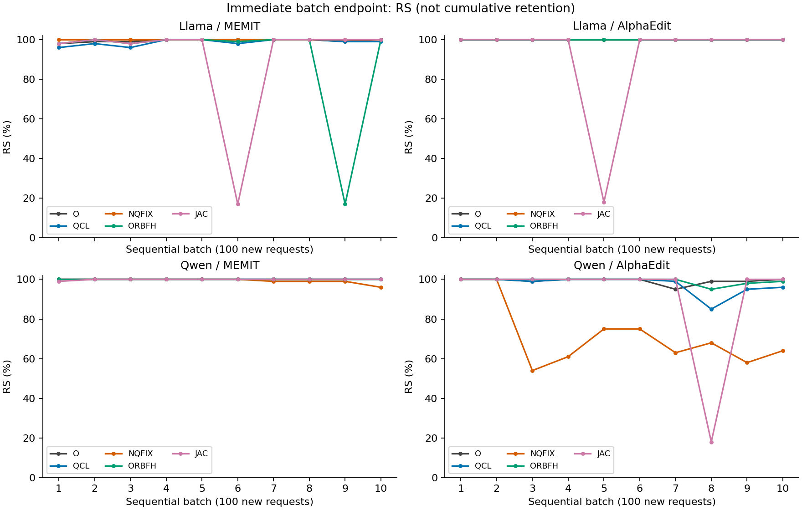
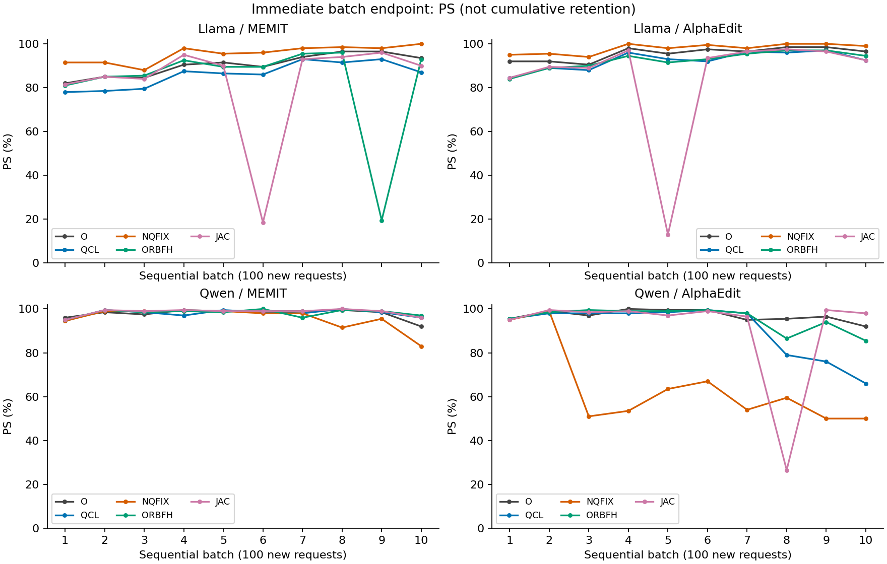
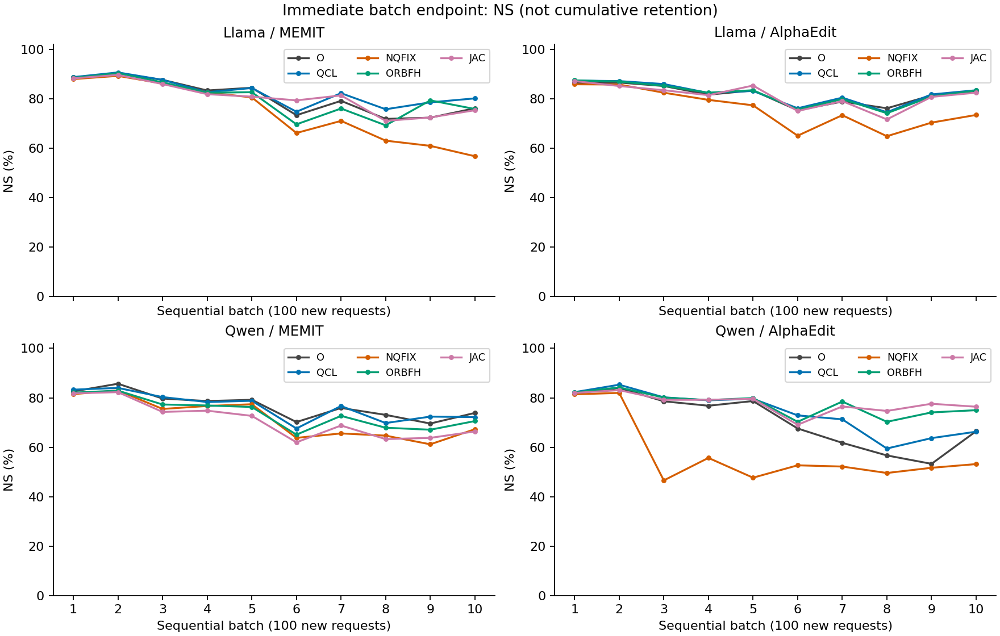
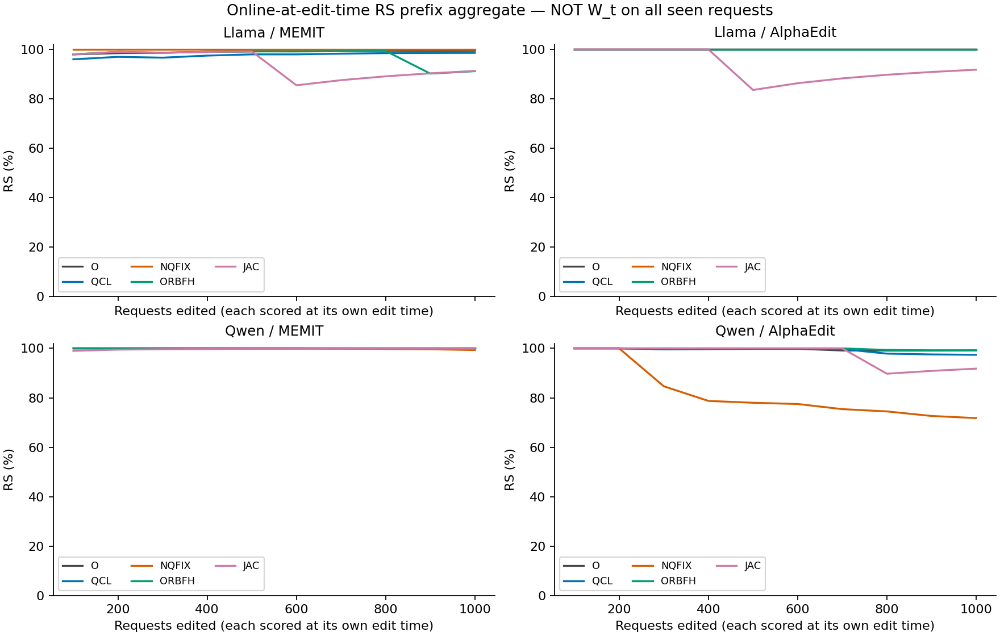
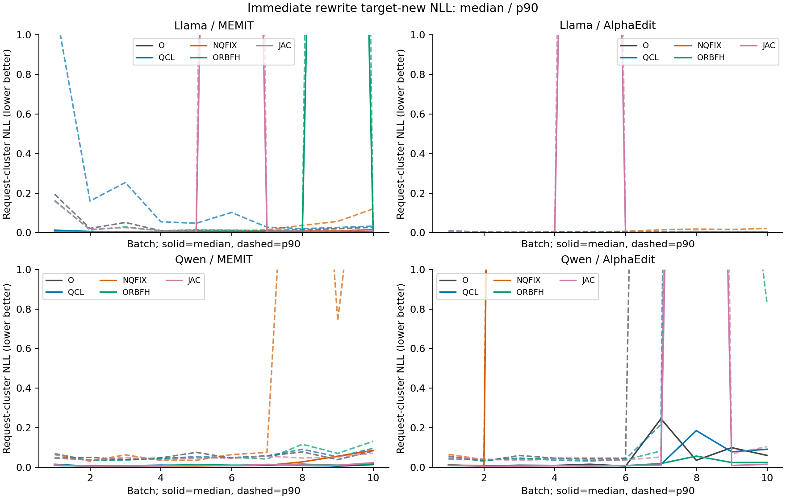
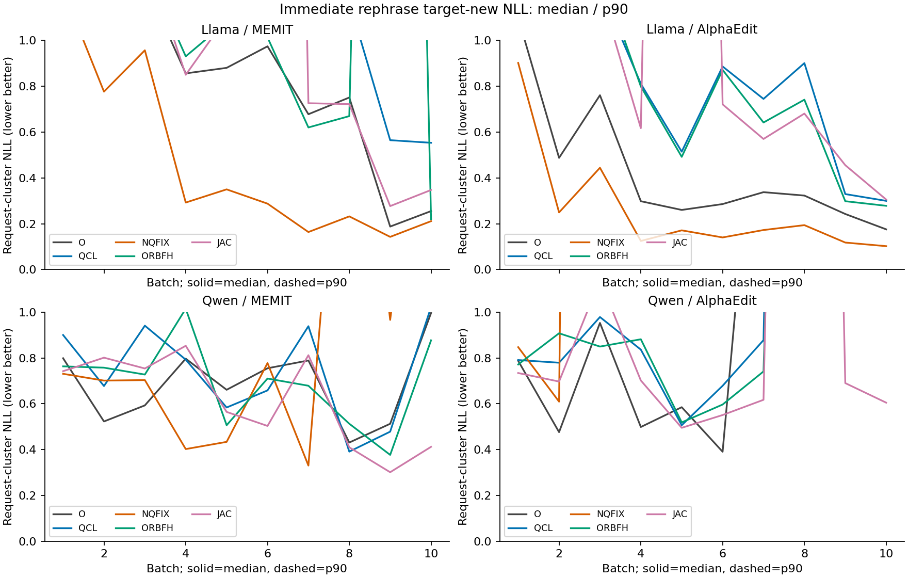
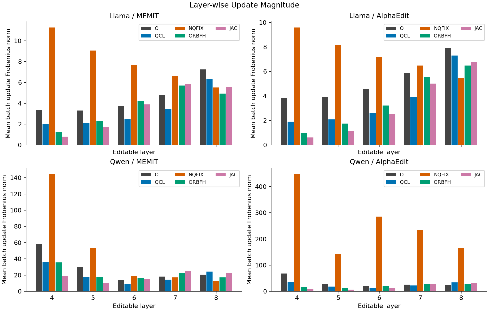
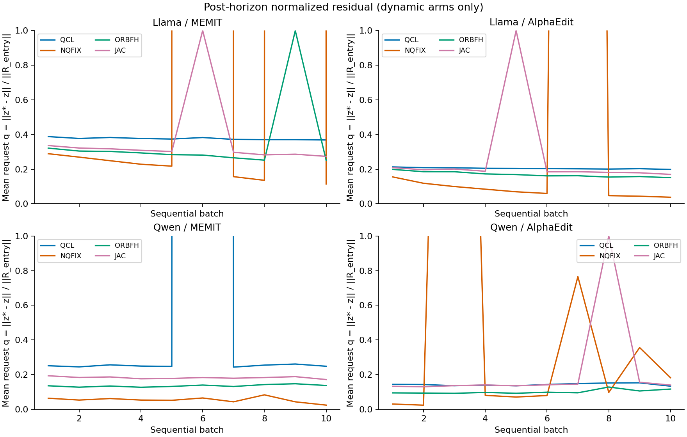
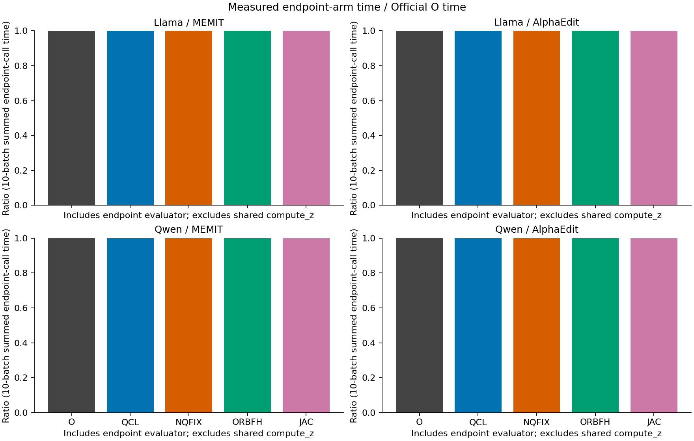

# ORBODE B100×10 sequential — 4-cell factual report (Server4)

## 1. 핵심 결과와 평가 범위

이 실험은 **arm 내부 B1→B10 cumulative W/cache sequential**이다. 각 cell에서 O/QCL/NQFIX/ORBFH/JAC가 동일 W0·cold method state로 각각 시작하고, arm 안에서는 앞 batch의 물리적 W와 applicable AlphaEdit cache를 다음 batch로 전달했다. 모든 요청은 해당 batch entry state에서 z*를 한 번 계산했다. 네 arm을 선별하거나 나쁜 결과를 분모에서 제외하지 않았다.

다음 첫 표는 **서로 다른 W1…W10에서 각각 자기 batch를 편집한 직후 측정한 1,000건 합계**다. 최종 W10으로 전체 1,000건을 재평가한 값이 아니다. 후자의 평가와 복원 가능한 W checkpoint는 저장되지 않았다. 따라서 최종 전체 유지율·진짜 누적 seen-prefix 성능·forgetting은 **NOT_RECORDED_NO_WEIGHT_CHECKPOINT**다. 사용자 지시(보고서 먼저)에 따라 이번 분석에서 GPU 재실행·edit replay·값 추정은 하지 않았다.

| cell | arm | RS | PS | PS strict | NS | rewrite acc | rephrase acc |
| --- | --- | --- | --- | --- | --- | --- | --- |
| LM | O | 995/1000 (99.50%) | 1807/2000 (90.35%) | 857/1000 (85.70%) | 8078/10000 (80.78%) | 984/1000 (98.40%) | 1255/2000 (62.75%) |
| LM | QCL | 986/1000 (98.60%) | 1721/2000 (86.05%) | 789/1000 (78.90%) | 8260/10000 (82.60%) | 970/1000 (97.00%) | 1144/2000 (57.20%) |
| LM | NQFIX | 1000/1000 (100.00%) | 1910/2000 (95.50%) | 927/1000 (92.70%) | 7449/10000 (74.49%) | 997/1000 (99.70%) | 1483/2000 (74.15%) |
| LM | ORBFH | 912/1000 (91.20%) | 1654/2000 (82.70%) | 765/1000 (76.50%) | 8012/10000 (80.12%) | 894/1000 (89.40%) | 1127/2000 (56.35%) |
| LM | JAC | 913/1000 (91.30%) | 1654/2000 (82.70%) | 768/1000 (76.80%) | 8066/10000 (80.66%) | 893/1000 (89.30%) | 1149/2000 (57.45%) |
| LA | O | 1000/1000 (100.00%) | 1911/2000 (95.55%) | 931/1000 (93.10%) | 8186/10000 (81.86%) | 1000/1000 (100.00%) | 1453/2000 (72.65%) |
| LA | QCL | 1000/1000 (100.00%) | 1849/2000 (92.45%) | 884/1000 (88.40%) | 8228/10000 (82.28%) | 999/1000 (99.90%) | 1321/2000 (66.05%) |
| LA | NQFIX | 1000/1000 (100.00%) | 1958/2000 (97.90%) | 968/1000 (96.80%) | 7585/10000 (75.85%) | 1000/1000 (100.00%) | 1546/2000 (77.30%) |
| LA | ORBFH | 1000/1000 (100.00%) | 1852/2000 (92.60%) | 886/1000 (88.60%) | 8200/10000 (82.00%) | 999/1000 (99.90%) | 1315/2000 (65.75%) |
| LA | JAC | 918/1000 (91.80%) | 1699/2000 (84.95%) | 807/1000 (80.70%) | 8120/10000 (81.20%) | 903/1000 (90.30%) | 1195/2000 (59.75%) |
| QM | O | 1000/1000 (100.00%) | 1957/2000 (97.85%) | 965/1000 (96.50%) | 7686/10000 (76.86%) | 994/1000 (99.40%) | 1385/2000 (69.25%) |
| QM | QCL | 1000/1000 (100.00%) | 1960/2000 (98.00%) | 965/1000 (96.50%) | 7634/10000 (76.34%) | 998/1000 (99.80%) | 1362/2000 (68.10%) |
| QM | NQFIX | 993/1000 (99.30%) | 1913/2000 (95.65%) | 933/1000 (93.30%) | 7167/10000 (71.67%) | 960/1000 (96.00%) | 1293/2000 (64.65%) |
| QM | ORBFH | 1000/1000 (100.00%) | 1964/2000 (98.20%) | 971/1000 (97.10%) | 7389/10000 (73.89%) | 996/1000 (99.60%) | 1397/2000 (69.85%) |
| QM | JAC | 999/1000 (99.90%) | 1970/2000 (98.50%) | 978/1000 (97.80%) | 7102/10000 (71.02%) | 997/1000 (99.70%) | 1425/2000 (71.25%) |
| QA | O | 992/1000 (99.20%) | 1939/2000 (96.95%) | 951/1000 (95.10%) | 7057/10000 (70.57%) | 931/1000 (93.10%) | 1269/2000 (63.45%) |
| QA | QCL | 974/1000 (97.40%) | 1813/2000 (90.65%) | 854/1000 (85.40%) | 7401/10000 (74.01%) | 894/1000 (89.40%) | 1067/2000 (53.35%) |
| QA | NQFIX | 718/1000 (71.80%) | 1285/2000 (64.25%) | 496/1000 (49.60%) | 5728/10000 (57.28%) | 244/1000 (24.40%) | 304/2000 (15.20%) |
| QA | ORBFH | 992/1000 (99.20%) | 1910/2000 (95.50%) | 924/1000 (92.40%) | 7737/10000 (77.37%) | 961/1000 (96.10%) | 1224/2000 (61.20%) |
| QA | JAC | 918/1000 (91.80%) | 1817/2000 (90.85%) | 885/1000 (88.50%) | 7774/10000 (77.74%) | 901/1000 (90.10%) | 1258/2000 (62.90%) |

분모: cell×arm당 request=1,000, RS=1,000 rewrite prompts, PS=2,000 rephrase prompts, NS=10,000 neighborhood prompts. 전체 20개 arm×1,000=20,000 request-arm 관측이며 독립된 20,000개 데이터가 아니다. 공통 unique requests는 1,000개다. LM=Llama/MEMIT, LA=Llama/AlphaEdit, QM=Qwen/MEMIT, QA=Qwen/AlphaEdit.

### 1.1 O 대비 산술 차이 (편집 직후 10-batch 합계)

| cell | arm−O | ΔRS pp | ΔPS pp | ΔNS pp | Δrewrite new NLL mean | Δrephrase new cluster-NLL mean |
| --- | --- | --- | --- | --- | --- | --- |
| LM | QCL | -0.90 | -4.30 | +1.82 | 0.117706 | 0.458813 |
| LM | NQFIX | +0.50 | +5.15 | -6.29 | -0.0609991 | -0.67747 |
| LM | ORBFH | -8.30 | -7.65 | -0.66 | 0.834139 | 0.69176 |
| LM | JAC | -8.20 | -7.65 | -0.12 | 0.941866 | 0.750642 |
| LA | QCL | +0.00 | -3.10 | +0.42 | 0.00424064 | 0.404053 |
| LA | NQFIX | +0.00 | +2.35 | -6.01 | 0.00515039 | -0.300589 |
| LA | ORBFH | +0.00 | -2.95 | +0.14 | 0.00377847 | 0.381768 |
| LA | JAC | -8.20 | -10.60 | -0.66 | 0.95771 | 1.12589 |
| QM | QCL | +0.00 | +0.15 | -0.52 | -0.00230222 | 0.0335994 |
| QM | NQFIX | -0.70 | -2.20 | -5.19 | 0.180872 | 0.298921 |
| QM | ORBFH | +0.00 | +0.35 | -2.97 | 0.00106481 | -0.0064662 |
| QM | JAC | -0.10 | +0.65 | -5.84 | -0.00918991 | -0.111805 |
| QA | QCL | -1.80 | -6.30 | +3.44 | 0.514456 | 1.06644 |
| QA | NQFIX | -27.40 | -32.70 | -13.29 | 10.2989 | 9.81268 |
| QA | ORBFH | +0.00 | -1.45 | +6.80 | -0.101536 | 0.271187 |
| QA | JAC | -7.40 | -6.10 | +7.17 | 0.435163 | 0.192134 |

주요 관측: ORBFH−O의 NS 차이는 QA +6.80pp, LA +0.14pp, QM −2.97pp, LM −0.66pp다. 동시에 PS 차이는 QA −1.45pp, LA −2.95pp, QM +0.35pp, LM −7.65pp다. 따라서 네 cell에서 동일한 성능 방향은 관측되지 않았다. QA NQFIX의 RS/PS/NS는 71.8/64.25/57.28%로 O의 99.2/96.95/70.57%보다 모두 낮았다. 이 수치들은 관측된 정책 간 산술 비교이며 단독 barrier의 인과 효과를 분리하지 않는다.

이 비교는 같은 요청·순서의 **전체 sequential 정책 차이**다. B2부터는 각 arm의 앞선 W/cache가 달라져 z*/keys도 그 arm의 entry state에서 계산된다. 동일 z*·동일 중간 W에서 controller 하나만 바꾼 paired ablation으로 해석하지 않는다.

## 2. 지표·arm 읽는 법

| 지표 | 정의 / 집계 단위 | 방향·주의 |
| --- | --- | --- |
| RS | 각 rewrite prompt에서 mean NLL(new) < mean NLL(true) | 높을수록 new 선호. tie=failure; 1/request |
| PS | 각 rephrase prompt에서 mean NLL(new) < mean NLL(true) | 높을수록 new 선호. 2/request를 개별 비교 |
| PS strict | 한 request의 두 rephrase 모두 PS 성공 | 1/request, PS prompt 평균과 다름 |
| NS | 각 neighborhood prompt에서 mean NLL(true) < mean NLL(new) | 높을수록 true 선호. tie=failure; 10/request |
| rewrite/rephrase acc | 해당 new target의 모든 teacher-forced token이 top-1 정답인 prompt 비율 | token 평균 accuracy 아님; free generation 아님 |
| PP-token | batch entry 대비 locality teacher-forced predicted token 일치수/비교 token수 | NS가 아니며 W0 대비 전체 retention도 아님 |
| NLL | target token당 평균 negative log probability | 낮을수록 해당 target 확률이 큼; token count로 이미 길이 정규화 |
| margin | NLL(true)−NLL(new) | 양수면 new 선호. locality에서는 음수가 true 선호 |
| prompt / request-cluster | 각 prompt 분포 / 먼저 request 안 prompt NLL 평균 후 request 분포 | rephrase2, locality10을 혼합하지 않음 |
| mean/median/IQR/p90/max | 산술평균/50%/25–75%/90%/최댓값; linear quantile | 분모는 표의 n. batch 평균들의 median을 전체 median으로 쓰지 않음 |
| q | //z*−z_terminal//₂ / //z*−z_entry//₂ (active request) | 낮으면 entry residual 대비 더 근접; O의 이 항목은 미기록 |
| V | active request에 대해 mean(q²)/2 | heldout NLL이 아닌 target activation potential |
| u / h | response gain / Euler h=.25; 적용 coefficient=h·u | O는 stock one-pass; dynamic은 N4×5 layers=20 visits |
| update magnitude | batch entry→endpoint의 layer별 //ΔW//F | 네 모델 raw norm pooling 금지. magnitude share와 squared-norm share 별도 |
| HORIZON_SEMANTIC_MISS | controller semantic predicate가 고정 horizon 안 all-request strict-hit하지 못함 | technical failure 아님; RS/PS/NS 성공과 동일하지 않음 |

| arm | accepted source semantics |
| --- | --- |
| O | Official family-native one-pass / remaining-layer allocation |
| QCL | current remaining-layer quota, unit response gain, per-visit refresh |
| NQFIX | current full residual (no quota), unit response gain, per-visit refresh |
| ORBFH | current full residual, current ordered-response gain, per-visit refresh; fixed horizon |
| JAC | current full residual/response gain, per-sweep frozen Jacobi refresh |
| ORBHit | ORBFH-derived materialized prefix; separate arm=0, primary denominator=0 |

## 3. Source / jobs / 정확한 분모와 무결성

| cell | canonical job | source HEAD | source tree | runtime wall h | peak allocated GiB |
| --- | --- | --- | --- | --- | --- |
| LM | 37151_0 | 9b167455c1562be076aa2437fa63565187804aa7 | 2af244e2dfe45d9fc8902d889b688b40231c6662 | 11.8611 | 41.681 |
| LA | 37214_1 | f47d035dc1ac35b1adcd8c036336ea69c5f32a4e | ce6debc1f0b0d8b03b3c9355320251f169c7e09c | 12.3879 | 39.7121 |
| QM | 37151_2 | 9b167455c1562be076aa2437fa63565187804aa7 | 2af244e2dfe45d9fc8902d889b688b40231c6662 | 9.79249 | 45.1471 |
| QA | 37214_3 | f47d035dc1ac35b1adcd8c036336ea69c5f32a4e | ce6debc1f0b0d8b03b3c9355320251f169c7e09c | 11.7194 | 41.9779 |

4/4 cell, 20/20 arm, 200/200 batch terminal-valid. 20,000/20,000 primary request endpoints; W commit→next entry 180/180, method-state link 180/180; compute_z=20000, batch 내부 recompute=0, final W0/method restore=4/4. 232 linked raw members와 1676 schema-bearing canonical identities를 다시 계산했다. 실패·nonfinite·duplicate·imputation은 canonical scientific rows에서 0이다.

AlphaEdit 각 arm: cache width 0→100→…→1000, 성공 batch당 append100; inner append/cache mutation0. MEMIT: covariance는 static computation cache, request-history append0. 상세 20개 chain은 `tables/chain-integrity.csv`.

Model parameters는 FP32; autocast/quantization/BF16/FP16 cast0. **stock MEMIT의 ephemeral linear solve는 기존 승인된 FP64이며 model/storage FP32와 분리한다.** 실행 source 두 lineage의 차이는 AlphaEdit cache_c_new lifecycle binding과 distinct launcher/run token의 기술 수정이다. source·hparam·HF/attention/dtype/numerical lock·EasyEdit identity 전체는 `tables/source-and-runtime-provenance.json`.

공통 stream root `467e5946ec0eb975284ca25e16f63f3b8ae0093503ca8b84948409689e0ad25a`; 1,000개 request order root `018be113361157d6f4050c37a4fec14fff78e60388e3898253d66f070d78cfc3`. 샘플 추가·교체·순서 변경·arm pruning0. 같은 seed의 단일 stream에 대한 기술적으로 유효한 관측이지 다중-seed 검증이 아니다.

## 4. Sequential 진행과 누적 분석 — 가능한 것과 없는 것

| 평가 타입 | 저장 여부 | 답하는 질문 |
| --- | --- | --- |
| IMMEDIATE_POST | 200×B100, 20,000 request-arm rows | W_b가 방금 편집한 B_b를 얼마나 잘 반영했나 |
| ENTRY_CURRENT_COHORT | 같은 200개 batch의 entry 평가 | 앞선 batch가 진행된 상태에서 새 B_b 편집 전 성능은 어떤가 |
| ONLINE_AT_EDIT_TIME_PREFIX | 저장 행의 정확한 누계, 아래 200 rows | 각 요청을 편집하던 시점의 성공률을 합치면 얼마인가 |
| CHECKPOINT_Wb_ON_ALL_SEEN | NOT_RECORDED_NO_WEIGHT_CHECKPOINT | W_b가 B1…B_b 모두를 현재 얼마나 유지하나: 판정 불가 |
| FINAL_W10_FULL1000 | NOT_RECORDED_NO_WEIGHT_CHECKPOINT | 최종 전체 1,000건 retention: 판정 불가 |
| W10_CURRENT_B10 | 20×B100만 있음 | 최종 상태의 마지막 100건 성능; 전체 유지율 아님 |

실제 runtime은 매 batch 현재 100개 요청만 evaluator에 bind하고 JSON scalar receipt만 publish한다. 완료 후 W0로 복구하며 checkpoint/delta tensor를 디스크에 저장하지 않는다. commit SHA는 byte identity의 증거이지 W를 재구성할 수 있는 state가 아니다. `cumulative-availability.csv`에 20 arms×10 시점의 부재를 명시했다. 편집 직후 누계를 진짜 누적 유지율로 대체하지 않는다. 재실행 승인은 이번 보고서 작업에 포함하지 않았다.

### 4.1 모든 batch의 편집 직후 성능과 entry→post 변화

#### LM — 50 batch endpoints

| arm | B | RS | PS | NS | ΔRS entry pp | ΔPS entry pp | ΔNS entry pp |
| --- | --- | --- | --- | --- | --- | --- | --- |
| O | 1 | 98/100 (98.00%) | 164/200 (82.00%) | 887/1000 (88.70%) | +85.0 | +68.0 | -0.6 |
| O | 2 | 99/100 (99.00%) | 170/200 (85.00%) | 904/1000 (90.40%) | +94.0 | +80.5 | -1.6 |
| O | 3 | 99/100 (99.00%) | 169/200 (84.50%) | 877/1000 (87.70%) | +94.0 | +78.5 | -2.9 |
| O | 4 | 100/100 (100.00%) | 181/200 (90.50%) | 834/1000 (83.40%) | +87.0 | +77.0 | -0.8 |
| O | 5 | 100/100 (100.00%) | 183/200 (91.50%) | 845/1000 (84.50%) | +87.0 | +81.5 | -2.4 |
| O | 6 | 100/100 (100.00%) | 179/200 (89.50%) | 734/1000 (73.40%) | +86.0 | +73.0 | -8.9 |
| O | 7 | 100/100 (100.00%) | 188/200 (94.00%) | 792/1000 (79.20%) | +88.0 | +80.0 | -5.7 |
| O | 8 | 100/100 (100.00%) | 193/200 (96.50%) | 719/1000 (71.90%) | +85.0 | +83.0 | -6.8 |
| O | 9 | 99/100 (99.00%) | 193/200 (96.50%) | 724/1000 (72.40%) | +81.0 | +81.5 | -9.2 |
| O | 10 | 100/100 (100.00%) | 187/200 (93.50%) | 762/1000 (76.20%) | +85.0 | +79.0 | -7.6 |
| QCL | 1 | 96/100 (96.00%) | 156/200 (78.00%) | 888/1000 (88.80%) | +83.0 | +64.0 | -0.5 |
| QCL | 2 | 98/100 (98.00%) | 157/200 (78.50%) | 907/1000 (90.70%) | +93.0 | +74.5 | -1.5 |
| QCL | 3 | 96/100 (96.00%) | 159/200 (79.50%) | 877/1000 (87.70%) | +91.0 | +73.0 | -3.1 |
| QCL | 4 | 100/100 (100.00%) | 175/200 (87.50%) | 827/1000 (82.70%) | +88.0 | +74.0 | -1.2 |
| QCL | 5 | 100/100 (100.00%) | 173/200 (86.50%) | 844/1000 (84.40%) | +86.0 | +76.0 | -2.9 |
| QCL | 6 | 98/100 (98.00%) | 172/200 (86.00%) | 748/1000 (74.80%) | +82.0 | +69.0 | -7.3 |
| QCL | 7 | 100/100 (100.00%) | 186/200 (93.00%) | 823/1000 (82.30%) | +90.0 | +80.0 | -2.9 |
| QCL | 8 | 100/100 (100.00%) | 183/200 (91.50%) | 758/1000 (75.80%) | +87.0 | +76.0 | -4.1 |
| QCL | 9 | 99/100 (99.00%) | 186/200 (93.00%) | 786/1000 (78.60%) | +84.0 | +79.5 | -6.1 |
| QCL | 10 | 99/100 (99.00%) | 174/200 (87.00%) | 802/1000 (80.20%) | +84.0 | +72.5 | -5.6 |
| NQFIX | 1 | 100/100 (100.00%) | 183/200 (91.50%) | 880/1000 (88.00%) | +87.0 | +77.5 | -1.3 |
| NQFIX | 2 | 100/100 (100.00%) | 183/200 (91.50%) | 893/1000 (89.30%) | +96.0 | +87.0 | -2.7 |
| NQFIX | 3 | 100/100 (100.00%) | 176/200 (88.00%) | 862/1000 (86.20%) | +95.0 | +82.0 | -3.6 |
| NQFIX | 4 | 100/100 (100.00%) | 196/200 (98.00%) | 826/1000 (82.60%) | +86.0 | +84.5 | -1.4 |
| NQFIX | 5 | 100/100 (100.00%) | 191/200 (95.50%) | 806/1000 (80.60%) | +86.0 | +84.5 | -5.0 |
| NQFIX | 6 | 100/100 (100.00%) | 192/200 (96.00%) | 662/1000 (66.20%) | +84.0 | +79.0 | -13.2 |
| NQFIX | 7 | 100/100 (100.00%) | 196/200 (98.00%) | 711/1000 (71.10%) | +78.0 | +79.5 | -8.8 |
| NQFIX | 8 | 100/100 (100.00%) | 197/200 (98.50%) | 631/1000 (63.10%) | +79.0 | +75.0 | -11.5 |
| NQFIX | 9 | 100/100 (100.00%) | 196/200 (98.00%) | 610/1000 (61.00%) | +70.0 | +72.5 | -14.3 |
| NQFIX | 10 | 100/100 (100.00%) | 200/200 (100.00%) | 568/1000 (56.80%) | +74.0 | +80.0 | -16.3 |
| ORBFH | 1 | 98/100 (98.00%) | 162/200 (81.00%) | 885/1000 (88.50%) | +85.0 | +67.0 | -0.8 |
| ORBFH | 2 | 100/100 (100.00%) | 170/200 (85.00%) | 904/1000 (90.40%) | +95.0 | +81.0 | -1.6 |
| ORBFH | 3 | 98/100 (98.00%) | 171/200 (85.50%) | 867/1000 (86.70%) | +93.0 | +78.5 | -4.0 |
| ORBFH | 4 | 100/100 (100.00%) | 185/200 (92.50%) | 825/1000 (82.50%) | +88.0 | +79.0 | -1.4 |
| ORBFH | 5 | 100/100 (100.00%) | 179/200 (89.50%) | 827/1000 (82.70%) | +86.0 | +79.0 | -3.7 |
| ORBFH | 6 | 99/100 (99.00%) | 179/200 (89.50%) | 697/1000 (69.70%) | +82.0 | +74.0 | -11.4 |
| ORBFH | 7 | 100/100 (100.00%) | 191/200 (95.50%) | 761/1000 (76.10%) | +86.0 | +77.5 | -8.0 |
| ORBFH | 8 | 100/100 (100.00%) | 192/200 (96.00%) | 693/1000 (69.30%) | +85.0 | +78.0 | -7.5 |
| ORBFH | 9 | 17/100 (17.00%) | 39/200 (19.50%) | 794/1000 (79.40%) | +0.0 | +0.0 | +0.0 |
| ORBFH | 10 | 100/100 (100.00%) | 186/200 (93.00%) | 759/1000 (75.90%) | +83.0 | +76.0 | -8.5 |
| JAC | 1 | 98/100 (98.00%) | 163/200 (81.50%) | 883/1000 (88.30%) | +85.0 | +67.5 | -1.0 |
| JAC | 2 | 100/100 (100.00%) | 170/200 (85.00%) | 897/1000 (89.70%) | +95.0 | +80.5 | -2.3 |
| JAC | 3 | 98/100 (98.00%) | 168/200 (84.00%) | 860/1000 (86.00%) | +93.0 | +77.0 | -4.4 |
| JAC | 4 | 100/100 (100.00%) | 190/200 (95.00%) | 819/1000 (81.90%) | +88.0 | +82.5 | -1.8 |
| JAC | 5 | 100/100 (100.00%) | 180/200 (90.00%) | 809/1000 (80.90%) | +86.0 | +78.0 | -4.9 |
| JAC | 6 | 17/100 (17.00%) | 37/200 (18.50%) | 794/1000 (79.40%) | +0.0 | +0.0 | +0.0 |
| JAC | 7 | 100/100 (100.00%) | 186/200 (93.00%) | 814/1000 (81.40%) | +92.0 | +78.0 | -4.8 |
| JAC | 8 | 100/100 (100.00%) | 188/200 (94.00%) | 711/1000 (71.10%) | +83.0 | +76.5 | -7.9 |
| JAC | 9 | 100/100 (100.00%) | 192/200 (96.00%) | 725/1000 (72.50%) | +86.0 | +78.5 | -9.9 |
| JAC | 10 | 100/100 (100.00%) | 180/200 (90.00%) | 754/1000 (75.40%) | +83.0 | +73.0 | -9.3 |

O: RS B1 98.0%→B10 100.0%; 최저 B1 98.0%, PS 82.0→93.5%, NS 88.7→76.2%. QCL: RS B1 96.0%→B10 99.0%; 최저 B1 96.0%, PS 78.0→87.0%, NS 88.8→80.2%. NQFIX: RS B1 100.0%→B10 100.0%; 최저 B1 100.0%, PS 91.5→100.0%, NS 88.0→56.8%. ORBFH: RS B1 98.0%→B10 100.0%; 최저 B9 17.0%, PS 81.0→93.0%, NS 88.5→75.9%. JAC: RS B1 98.0%→B10 100.0%; 최저 B6 17.0%, PS 81.5→90.0%, NS 88.3→75.4%. 각 batch의 요청 자체가 다르므로 이 변화만으로 과거 요청의 forgetting을 측정했다고 할 수 없다.

#### LA — 50 batch endpoints

| arm | B | RS | PS | NS | ΔRS entry pp | ΔPS entry pp | ΔNS entry pp |
| --- | --- | --- | --- | --- | --- | --- | --- |
| O | 1 | 100/100 (100.00%) | 184/200 (92.00%) | 866/1000 (86.60%) | +87.0 | +78.0 | -2.7 |
| O | 2 | 100/100 (100.00%) | 184/200 (92.00%) | 866/1000 (86.60%) | +96.0 | +87.0 | -5.0 |
| O | 3 | 100/100 (100.00%) | 181/200 (90.50%) | 852/1000 (85.20%) | +95.0 | +83.0 | -4.7 |
| O | 4 | 100/100 (100.00%) | 196/200 (98.00%) | 817/1000 (81.70%) | +88.0 | +85.0 | -2.4 |
| O | 5 | 100/100 (100.00%) | 191/200 (95.50%) | 834/1000 (83.40%) | +86.0 | +83.0 | -3.4 |
| O | 6 | 100/100 (100.00%) | 195/200 (97.50%) | 754/1000 (75.40%) | +86.0 | +81.0 | -6.1 |
| O | 7 | 100/100 (100.00%) | 193/200 (96.50%) | 789/1000 (78.90%) | +86.0 | +82.0 | -4.4 |
| O | 8 | 100/100 (100.00%) | 197/200 (98.50%) | 762/1000 (76.20%) | +86.0 | +80.5 | -1.7 |
| O | 9 | 100/100 (100.00%) | 197/200 (98.50%) | 814/1000 (81.40%) | +91.0 | +86.0 | -3.4 |
| O | 10 | 100/100 (100.00%) | 193/200 (96.50%) | 832/1000 (83.20%) | +88.0 | +84.0 | -3.5 |
| QCL | 1 | 100/100 (100.00%) | 169/200 (84.50%) | 874/1000 (87.40%) | +87.0 | +70.5 | -1.9 |
| QCL | 2 | 100/100 (100.00%) | 178/200 (89.00%) | 872/1000 (87.20%) | +95.0 | +84.0 | -5.0 |
| QCL | 3 | 100/100 (100.00%) | 176/200 (88.00%) | 860/1000 (86.00%) | +96.0 | +81.0 | -4.0 |
| QCL | 4 | 100/100 (100.00%) | 192/200 (96.00%) | 824/1000 (82.40%) | +87.0 | +83.5 | -1.9 |
| QCL | 5 | 100/100 (100.00%) | 186/200 (93.00%) | 832/1000 (83.20%) | +85.0 | +81.0 | -3.5 |
| QCL | 6 | 100/100 (100.00%) | 184/200 (92.00%) | 762/1000 (76.20%) | +85.0 | +77.5 | -5.5 |
| QCL | 7 | 100/100 (100.00%) | 193/200 (96.50%) | 805/1000 (80.50%) | +89.0 | +83.5 | -4.1 |
| QCL | 8 | 100/100 (100.00%) | 192/200 (96.00%) | 746/1000 (74.60%) | +88.0 | +80.0 | -3.9 |
| QCL | 9 | 100/100 (100.00%) | 194/200 (97.00%) | 818/1000 (81.80%) | +89.0 | +83.0 | -2.7 |
| QCL | 10 | 100/100 (100.00%) | 185/200 (92.50%) | 835/1000 (83.50%) | +91.0 | +81.5 | -3.8 |
| NQFIX | 1 | 100/100 (100.00%) | 190/200 (95.00%) | 859/1000 (85.90%) | +87.0 | +81.0 | -3.4 |
| NQFIX | 2 | 100/100 (100.00%) | 191/200 (95.50%) | 858/1000 (85.80%) | +96.0 | +90.0 | -5.5 |
| NQFIX | 3 | 100/100 (100.00%) | 188/200 (94.00%) | 825/1000 (82.50%) | +94.0 | +86.5 | -6.5 |
| NQFIX | 4 | 100/100 (100.00%) | 200/200 (100.00%) | 796/1000 (79.60%) | +87.0 | +85.0 | -3.9 |
| NQFIX | 5 | 100/100 (100.00%) | 196/200 (98.00%) | 774/1000 (77.40%) | +86.0 | +84.0 | -6.0 |
| NQFIX | 6 | 100/100 (100.00%) | 199/200 (99.50%) | 651/1000 (65.10%) | +81.0 | +79.0 | -11.9 |
| NQFIX | 7 | 100/100 (100.00%) | 196/200 (98.00%) | 734/1000 (73.40%) | +77.0 | +77.5 | -5.8 |
| NQFIX | 8 | 100/100 (100.00%) | 200/200 (100.00%) | 649/1000 (64.90%) | +77.0 | +77.5 | -8.6 |
| NQFIX | 9 | 100/100 (100.00%) | 200/200 (100.00%) | 704/1000 (70.40%) | +73.0 | +78.5 | -6.8 |
| NQFIX | 10 | 100/100 (100.00%) | 198/200 (99.00%) | 735/1000 (73.50%) | +78.0 | +81.5 | -7.7 |
| ORBFH | 1 | 100/100 (100.00%) | 168/200 (84.00%) | 875/1000 (87.50%) | +87.0 | +70.0 | -1.8 |
| ORBFH | 2 | 100/100 (100.00%) | 178/200 (89.00%) | 870/1000 (87.00%) | +95.0 | +84.0 | -5.0 |
| ORBFH | 3 | 100/100 (100.00%) | 180/200 (90.00%) | 853/1000 (85.30%) | +95.0 | +83.0 | -4.9 |
| ORBFH | 4 | 100/100 (100.00%) | 189/200 (94.50%) | 825/1000 (82.50%) | +89.0 | +81.5 | -2.0 |
| ORBFH | 5 | 100/100 (100.00%) | 183/200 (91.50%) | 835/1000 (83.50%) | +87.0 | +79.0 | -3.2 |
| ORBFH | 6 | 100/100 (100.00%) | 186/200 (93.00%) | 757/1000 (75.70%) | +83.0 | +77.0 | -6.0 |
| ORBFH | 7 | 100/100 (100.00%) | 191/200 (95.50%) | 799/1000 (79.90%) | +91.0 | +83.0 | -4.7 |
| ORBFH | 8 | 100/100 (100.00%) | 194/200 (97.00%) | 742/1000 (74.20%) | +89.0 | +79.0 | -4.6 |
| ORBFH | 9 | 100/100 (100.00%) | 194/200 (97.00%) | 810/1000 (81.00%) | +89.0 | +84.5 | -2.5 |
| ORBFH | 10 | 100/100 (100.00%) | 189/200 (94.50%) | 834/1000 (83.40%) | +88.0 | +83.5 | -3.5 |
| JAC | 1 | 100/100 (100.00%) | 169/200 (84.50%) | 872/1000 (87.20%) | +87.0 | +70.5 | -2.1 |
| JAC | 2 | 100/100 (100.00%) | 179/200 (89.50%) | 852/1000 (85.20%) | +94.0 | +84.5 | -6.9 |
| JAC | 3 | 100/100 (100.00%) | 178/200 (89.00%) | 835/1000 (83.50%) | +95.0 | +82.0 | -6.8 |
| JAC | 4 | 100/100 (100.00%) | 194/200 (97.00%) | 815/1000 (81.50%) | +88.0 | +84.0 | -2.7 |
| JAC | 5 | 18/100 (18.00%) | 26/200 (13.00%) | 854/1000 (85.40%) | +0.0 | +0.0 | +0.0 |
| JAC | 6 | 100/100 (100.00%) | 187/200 (93.50%) | 751/1000 (75.10%) | +85.0 | +80.0 | -7.8 |
| JAC | 7 | 100/100 (100.00%) | 193/200 (96.50%) | 791/1000 (79.10%) | +88.0 | +82.5 | -4.0 |
| JAC | 8 | 100/100 (100.00%) | 195/200 (97.50%) | 717/1000 (71.70%) | +89.0 | +82.5 | -6.5 |
| JAC | 9 | 100/100 (100.00%) | 193/200 (96.50%) | 808/1000 (80.80%) | +86.0 | +83.0 | -3.5 |
| JAC | 10 | 100/100 (100.00%) | 185/200 (92.50%) | 825/1000 (82.50%) | +84.0 | +80.5 | -3.2 |

O: RS B1 100.0%→B10 100.0%; 최저 B1 100.0%, PS 92.0→96.5%, NS 86.6→83.2%. QCL: RS B1 100.0%→B10 100.0%; 최저 B1 100.0%, PS 84.5→92.5%, NS 87.4→83.5%. NQFIX: RS B1 100.0%→B10 100.0%; 최저 B1 100.0%, PS 95.0→99.0%, NS 85.9→73.5%. ORBFH: RS B1 100.0%→B10 100.0%; 최저 B1 100.0%, PS 84.0→94.5%, NS 87.5→83.4%. JAC: RS B1 100.0%→B10 100.0%; 최저 B5 18.0%, PS 84.5→92.5%, NS 87.2→82.5%. 각 batch의 요청 자체가 다르므로 이 변화만으로 과거 요청의 forgetting을 측정했다고 할 수 없다.

#### QM — 50 batch endpoints

| arm | B | RS | PS | NS | ΔRS entry pp | ΔPS entry pp | ΔNS entry pp |
| --- | --- | --- | --- | --- | --- | --- | --- |
| O | 1 | 100/100 (100.00%) | 192/200 (96.00%) | 826/1000 (82.60%) | +89.0 | +76.5 | -2.3 |
| O | 2 | 100/100 (100.00%) | 197/200 (98.50%) | 857/1000 (85.70%) | +91.0 | +87.5 | -2.1 |
| O | 3 | 100/100 (100.00%) | 195/200 (97.50%) | 797/1000 (79.70%) | +89.0 | +82.0 | -7.0 |
| O | 4 | 100/100 (100.00%) | 199/200 (99.50%) | 787/1000 (78.70%) | +80.0 | +80.0 | -2.6 |
| O | 5 | 100/100 (100.00%) | 198/200 (99.00%) | 792/1000 (79.20%) | +80.0 | +81.0 | -4.1 |
| O | 6 | 100/100 (100.00%) | 198/200 (99.00%) | 702/1000 (70.20%) | +77.0 | +77.5 | -3.8 |
| O | 7 | 100/100 (100.00%) | 198/200 (99.00%) | 759/1000 (75.90%) | +81.0 | +71.0 | -3.8 |
| O | 8 | 100/100 (100.00%) | 199/200 (99.50%) | 731/1000 (73.10%) | +84.0 | +77.5 | -2.1 |
| O | 9 | 100/100 (100.00%) | 197/200 (98.50%) | 696/1000 (69.60%) | +81.0 | +78.0 | -6.3 |
| O | 10 | 100/100 (100.00%) | 184/200 (92.00%) | 739/1000 (73.90%) | +78.0 | +71.0 | -4.4 |
| QCL | 1 | 100/100 (100.00%) | 189/200 (94.50%) | 833/1000 (83.30%) | +89.0 | +75.0 | -1.6 |
| QCL | 2 | 100/100 (100.00%) | 199/200 (99.50%) | 840/1000 (84.00%) | +92.0 | +87.5 | -4.0 |
| QCL | 3 | 100/100 (100.00%) | 197/200 (98.50%) | 803/1000 (80.30%) | +87.0 | +82.5 | -7.2 |
| QCL | 4 | 100/100 (100.00%) | 194/200 (97.00%) | 783/1000 (78.30%) | +78.0 | +74.5 | -2.9 |
| QCL | 5 | 100/100 (100.00%) | 199/200 (99.50%) | 788/1000 (78.80%) | +80.0 | +82.0 | -4.1 |
| QCL | 6 | 100/100 (100.00%) | 197/200 (98.50%) | 676/1000 (67.60%) | +76.0 | +75.0 | -6.8 |
| QCL | 7 | 100/100 (100.00%) | 196/200 (98.00%) | 767/1000 (76.70%) | +80.0 | +72.5 | -3.5 |
| QCL | 8 | 100/100 (100.00%) | 200/200 (100.00%) | 698/1000 (69.80%) | +81.0 | +77.0 | -4.7 |
| QCL | 9 | 100/100 (100.00%) | 197/200 (98.50%) | 724/1000 (72.40%) | +75.0 | +74.0 | -6.1 |
| QCL | 10 | 100/100 (100.00%) | 192/200 (96.00%) | 722/1000 (72.20%) | +83.0 | +76.0 | -4.3 |
| NQFIX | 1 | 100/100 (100.00%) | 189/200 (94.50%) | 815/1000 (81.50%) | +89.0 | +75.0 | -3.4 |
| NQFIX | 2 | 100/100 (100.00%) | 198/200 (99.00%) | 830/1000 (83.00%) | +92.0 | +86.5 | -4.6 |
| NQFIX | 3 | 100/100 (100.00%) | 198/200 (99.00%) | 755/1000 (75.50%) | +88.0 | +80.5 | -9.6 |
| NQFIX | 4 | 100/100 (100.00%) | 198/200 (99.00%) | 767/1000 (76.70%) | +80.0 | +77.5 | -3.2 |
| NQFIX | 5 | 100/100 (100.00%) | 198/200 (99.00%) | 774/1000 (77.40%) | +81.0 | +82.0 | -5.0 |
| NQFIX | 6 | 100/100 (100.00%) | 196/200 (98.00%) | 638/1000 (63.80%) | +74.0 | +71.5 | -8.4 |
| NQFIX | 7 | 99/100 (99.00%) | 196/200 (98.00%) | 656/1000 (65.60%) | +73.0 | +71.0 | -6.3 |
| NQFIX | 8 | 99/100 (99.00%) | 183/200 (91.50%) | 647/1000 (64.70%) | +71.0 | +61.0 | -4.9 |
| NQFIX | 9 | 99/100 (99.00%) | 191/200 (95.50%) | 612/1000 (61.20%) | +72.0 | +64.0 | -8.9 |
| NQFIX | 10 | 96/100 (96.00%) | 166/200 (83.00%) | 673/1000 (67.30%) | +67.0 | +50.0 | -8.2 |
| ORBFH | 1 | 100/100 (100.00%) | 190/200 (95.00%) | 821/1000 (82.10%) | +89.0 | +75.5 | -2.8 |
| ORBFH | 2 | 100/100 (100.00%) | 199/200 (99.50%) | 829/1000 (82.90%) | +91.0 | +86.5 | -4.8 |
| ORBFH | 3 | 100/100 (100.00%) | 197/200 (98.50%) | 773/1000 (77.30%) | +88.0 | +82.0 | -9.2 |
| ORBFH | 4 | 100/100 (100.00%) | 198/200 (99.00%) | 769/1000 (76.90%) | +75.0 | +76.5 | -3.4 |
| ORBFH | 5 | 100/100 (100.00%) | 197/200 (98.50%) | 763/1000 (76.30%) | +76.0 | +79.0 | -4.2 |
| ORBFH | 6 | 100/100 (100.00%) | 200/200 (100.00%) | 651/1000 (65.10%) | +71.0 | +73.0 | -7.3 |
| ORBFH | 7 | 100/100 (100.00%) | 192/200 (96.00%) | 727/1000 (72.70%) | +77.0 | +71.5 | -5.0 |
| ORBFH | 8 | 100/100 (100.00%) | 199/200 (99.50%) | 679/1000 (67.90%) | +79.0 | +76.0 | -3.6 |
| ORBFH | 9 | 100/100 (100.00%) | 198/200 (99.00%) | 671/1000 (67.10%) | +74.0 | +74.0 | -7.8 |
| ORBFH | 10 | 100/100 (100.00%) | 194/200 (97.00%) | 706/1000 (70.60%) | +78.0 | +76.5 | -5.2 |
| JAC | 1 | 99/100 (99.00%) | 190/200 (95.00%) | 818/1000 (81.80%) | +88.0 | +75.5 | -3.1 |
| JAC | 2 | 100/100 (100.00%) | 199/200 (99.50%) | 823/1000 (82.30%) | +90.0 | +86.0 | -5.8 |
| JAC | 3 | 100/100 (100.00%) | 198/200 (99.00%) | 743/1000 (74.30%) | +88.0 | +81.0 | -11.5 |
| JAC | 4 | 100/100 (100.00%) | 199/200 (99.50%) | 748/1000 (74.80%) | +76.0 | +76.5 | -4.6 |
| JAC | 5 | 100/100 (100.00%) | 198/200 (99.00%) | 727/1000 (72.70%) | +78.0 | +79.0 | -5.6 |
| JAC | 6 | 100/100 (100.00%) | 198/200 (99.00%) | 620/1000 (62.00%) | +70.0 | +70.0 | -9.0 |
| JAC | 7 | 100/100 (100.00%) | 198/200 (99.00%) | 688/1000 (68.80%) | +72.0 | +73.0 | -5.7 |
| JAC | 8 | 100/100 (100.00%) | 200/200 (100.00%) | 633/1000 (63.30%) | +78.0 | +71.5 | -8.0 |
| JAC | 9 | 100/100 (100.00%) | 198/200 (99.00%) | 638/1000 (63.80%) | +67.0 | +70.5 | -6.6 |
| JAC | 10 | 100/100 (100.00%) | 192/200 (96.00%) | 664/1000 (66.40%) | +81.0 | +74.5 | -7.0 |

O: RS B1 100.0%→B10 100.0%; 최저 B1 100.0%, PS 96.0→92.0%, NS 82.6→73.9%. QCL: RS B1 100.0%→B10 100.0%; 최저 B1 100.0%, PS 94.5→96.0%, NS 83.3→72.2%. NQFIX: RS B1 100.0%→B10 96.0%; 최저 B10 96.0%, PS 94.5→83.0%, NS 81.5→67.3%. ORBFH: RS B1 100.0%→B10 100.0%; 최저 B1 100.0%, PS 95.0→97.0%, NS 82.1→70.6%. JAC: RS B1 99.0%→B10 100.0%; 최저 B1 99.0%, PS 95.0→96.0%, NS 81.8→66.4%. 각 batch의 요청 자체가 다르므로 이 변화만으로 과거 요청의 forgetting을 측정했다고 할 수 없다.

#### QA — 50 batch endpoints

| arm | B | RS | PS | NS | ΔRS entry pp | ΔPS entry pp | ΔNS entry pp |
| --- | --- | --- | --- | --- | --- | --- | --- |
| O | 1 | 100/100 (100.00%) | 191/200 (95.50%) | 817/1000 (81.70%) | +89.0 | +76.0 | -3.2 |
| O | 2 | 100/100 (100.00%) | 198/200 (99.00%) | 840/1000 (84.00%) | +91.0 | +86.0 | -3.2 |
| O | 3 | 99/100 (99.00%) | 194/200 (97.00%) | 786/1000 (78.60%) | +86.0 | +80.0 | -7.1 |
| O | 4 | 100/100 (100.00%) | 200/200 (100.00%) | 768/1000 (76.80%) | +78.0 | +76.5 | -2.2 |
| O | 5 | 100/100 (100.00%) | 199/200 (99.50%) | 787/1000 (78.70%) | +78.0 | +82.5 | -3.2 |
| O | 6 | 100/100 (100.00%) | 199/200 (99.50%) | 676/1000 (67.60%) | +76.0 | +75.0 | -5.1 |
| O | 7 | 95/100 (95.00%) | 190/200 (95.00%) | 618/1000 (61.80%) | +70.0 | +67.0 | -14.2 |
| O | 8 | 99/100 (99.00%) | 191/200 (95.50%) | 567/1000 (56.70%) | +68.0 | +55.0 | -7.2 |
| O | 9 | 99/100 (99.00%) | 193/200 (96.50%) | 533/1000 (53.30%) | +64.0 | +55.5 | -7.0 |
| O | 10 | 100/100 (100.00%) | 184/200 (92.00%) | 665/1000 (66.50%) | +68.0 | +58.0 | -1.5 |
| QCL | 1 | 100/100 (100.00%) | 191/200 (95.50%) | 823/1000 (82.30%) | +89.0 | +76.0 | -2.6 |
| QCL | 2 | 100/100 (100.00%) | 196/200 (98.00%) | 853/1000 (85.30%) | +91.0 | +84.0 | -2.4 |
| QCL | 3 | 99/100 (99.00%) | 196/200 (98.00%) | 802/1000 (80.20%) | +86.0 | +82.0 | -6.6 |
| QCL | 4 | 100/100 (100.00%) | 196/200 (98.00%) | 790/1000 (79.00%) | +77.0 | +75.0 | -2.1 |
| QCL | 5 | 100/100 (100.00%) | 197/200 (98.50%) | 796/1000 (79.60%) | +80.0 | +80.5 | -2.4 |
| QCL | 6 | 100/100 (100.00%) | 199/200 (99.50%) | 729/1000 (72.90%) | +78.0 | +77.5 | -3.0 |
| QCL | 7 | 99/100 (99.00%) | 196/200 (98.00%) | 713/1000 (71.30%) | +77.0 | +72.0 | -10.5 |
| QCL | 8 | 85/100 (85.00%) | 158/200 (79.00%) | 595/1000 (59.50%) | +57.0 | +50.0 | -11.4 |
| QCL | 9 | 95/100 (95.00%) | 152/200 (76.00%) | 637/1000 (63.70%) | +65.0 | +41.0 | -2.7 |
| QCL | 10 | 96/100 (96.00%) | 132/200 (66.00%) | 663/1000 (66.30%) | +67.0 | +31.0 | -3.7 |
| NQFIX | 1 | 100/100 (100.00%) | 190/200 (95.00%) | 814/1000 (81.40%) | +89.0 | +75.5 | -3.5 |
| NQFIX | 2 | 100/100 (100.00%) | 198/200 (99.00%) | 820/1000 (82.00%) | +90.0 | +84.0 | -4.6 |
| NQFIX | 3 | 54/100 (54.00%) | 102/200 (51.00%) | 466/1000 (46.60%) | +37.0 | +34.0 | -37.6 |
| NQFIX | 4 | 61/100 (61.00%) | 107/200 (53.50%) | 557/1000 (55.70%) | +16.0 | +6.0 | +1.5 |
| NQFIX | 5 | 75/100 (75.00%) | 127/200 (63.50%) | 477/1000 (47.70%) | +13.0 | +13.0 | +1.3 |
| NQFIX | 6 | 75/100 (75.00%) | 134/200 (67.00%) | 527/1000 (52.70%) | +29.0 | +14.0 | +3.1 |
| NQFIX | 7 | 63/100 (63.00%) | 108/200 (54.00%) | 522/1000 (52.20%) | +24.0 | +8.0 | -4.2 |
| NQFIX | 8 | 68/100 (68.00%) | 119/200 (59.50%) | 496/1000 (49.60%) | +19.0 | +7.0 | -0.1 |
| NQFIX | 9 | 58/100 (58.00%) | 100/200 (50.00%) | 517/1000 (51.70%) | +2.0 | -3.0 | +3.0 |
| NQFIX | 10 | 64/100 (64.00%) | 100/200 (50.00%) | 532/1000 (53.20%) | +16.0 | +4.0 | +3.0 |
| ORBFH | 1 | 100/100 (100.00%) | 191/200 (95.50%) | 822/1000 (82.20%) | +89.0 | +76.0 | -2.7 |
| ORBFH | 2 | 100/100 (100.00%) | 197/200 (98.50%) | 842/1000 (84.20%) | +90.0 | +84.0 | -3.5 |
| ORBFH | 3 | 100/100 (100.00%) | 199/200 (99.50%) | 801/1000 (80.10%) | +88.0 | +83.0 | -6.6 |
| ORBFH | 4 | 100/100 (100.00%) | 198/200 (99.00%) | 791/1000 (79.10%) | +77.0 | +77.5 | -1.6 |
| ORBFH | 5 | 100/100 (100.00%) | 198/200 (99.00%) | 799/1000 (79.90%) | +80.0 | +83.0 | -2.6 |
| ORBFH | 6 | 100/100 (100.00%) | 199/200 (99.50%) | 703/1000 (70.30%) | +77.0 | +74.5 | -4.3 |
| ORBFH | 7 | 100/100 (100.00%) | 196/200 (98.00%) | 785/1000 (78.50%) | +78.0 | +71.5 | -2.2 |
| ORBFH | 8 | 95/100 (95.00%) | 173/200 (86.50%) | 703/1000 (70.30%) | +76.0 | +65.0 | -5.3 |
| ORBFH | 9 | 98/100 (98.00%) | 188/200 (94.00%) | 741/1000 (74.10%) | +69.0 | +55.0 | -3.7 |
| ORBFH | 10 | 99/100 (99.00%) | 171/200 (85.50%) | 750/1000 (75.00%) | +78.0 | +58.0 | -2.3 |
| JAC | 1 | 100/100 (100.00%) | 190/200 (95.00%) | 820/1000 (82.00%) | +89.0 | +75.5 | -2.9 |
| JAC | 2 | 100/100 (100.00%) | 199/200 (99.50%) | 831/1000 (83.10%) | +89.0 | +86.5 | -4.6 |
| JAC | 3 | 100/100 (100.00%) | 197/200 (98.50%) | 792/1000 (79.20%) | +86.0 | +81.5 | -6.8 |
| JAC | 4 | 100/100 (100.00%) | 198/200 (99.00%) | 792/1000 (79.20%) | +77.0 | +76.5 | -1.8 |
| JAC | 5 | 100/100 (100.00%) | 194/200 (97.00%) | 796/1000 (79.60%) | +82.0 | +81.5 | -2.7 |
| JAC | 6 | 100/100 (100.00%) | 198/200 (99.00%) | 691/1000 (69.10%) | +75.0 | +74.0 | -4.8 |
| JAC | 7 | 100/100 (100.00%) | 193/200 (96.50%) | 765/1000 (76.50%) | +79.0 | +71.5 | -3.7 |
| JAC | 8 | 18/100 (18.00%) | 53/200 (26.50%) | 747/1000 (74.70%) | +0.0 | +0.0 | +0.0 |
| JAC | 9 | 100/100 (100.00%) | 199/200 (99.50%) | 776/1000 (77.60%) | +80.0 | +75.5 | -2.7 |
| JAC | 10 | 100/100 (100.00%) | 196/200 (98.00%) | 764/1000 (76.40%) | +84.0 | +77.5 | -3.9 |

O: RS B1 100.0%→B10 100.0%; 최저 B7 95.0%, PS 95.5→92.0%, NS 81.7→66.5%. QCL: RS B1 100.0%→B10 96.0%; 최저 B8 85.0%, PS 95.5→66.0%, NS 82.3→66.3%. NQFIX: RS B1 100.0%→B10 64.0%; 최저 B3 54.0%, PS 95.0→50.0%, NS 81.4→53.2%. ORBFH: RS B1 100.0%→B10 99.0%; 최저 B8 95.0%, PS 95.5→85.5%, NS 82.2→75.0%. JAC: RS B1 100.0%→B10 100.0%; 최저 B8 18.0%, PS 95.0→98.0%, NS 82.0→76.4%. 각 batch의 요청 자체가 다르므로 이 변화만으로 과거 요청의 forgetting을 측정했다고 할 수 없다.

### 4.2 편집 직후 누계 (명시적으로 W_t 누적 재평가가 아님)

B1…B_b 각각의 자기 편집 직후 평가를 합친 값. N=100b; PS denominator=2N, NS=10N. 아래 누계는 early requests를 W_b에서 다시 평가하지 않는다. 낮아지거나 높아지는 값 모두 관측 누계이며 retention 판정은 유보한다.

#### LM — online prefix

| arm | through B | N | RS | PS | NS |
| --- | --- | --- | --- | --- | --- |
| O | 1 | 100 | 98/100 (98.00%) | 164/200 (82.00%) | 887/1000 (88.70%) |
| O | 2 | 200 | 197/200 (98.50%) | 334/400 (83.50%) | 1791/2000 (89.55%) |
| O | 3 | 300 | 296/300 (98.67%) | 503/600 (83.83%) | 2668/3000 (88.93%) |
| O | 4 | 400 | 396/400 (99.00%) | 684/800 (85.50%) | 3502/4000 (87.55%) |
| O | 5 | 500 | 496/500 (99.20%) | 867/1000 (86.70%) | 4347/5000 (86.94%) |
| O | 6 | 600 | 596/600 (99.33%) | 1046/1200 (87.17%) | 5081/6000 (84.68%) |
| O | 7 | 700 | 696/700 (99.43%) | 1234/1400 (88.14%) | 5873/7000 (83.90%) |
| O | 8 | 800 | 796/800 (99.50%) | 1427/1600 (89.19%) | 6592/8000 (82.40%) |
| O | 9 | 900 | 895/900 (99.44%) | 1620/1800 (90.00%) | 7316/9000 (81.29%) |
| O | 10 | 1000 | 995/1000 (99.50%) | 1807/2000 (90.35%) | 8078/10000 (80.78%) |
| QCL | 1 | 100 | 96/100 (96.00%) | 156/200 (78.00%) | 888/1000 (88.80%) |
| QCL | 2 | 200 | 194/200 (97.00%) | 313/400 (78.25%) | 1795/2000 (89.75%) |
| QCL | 3 | 300 | 290/300 (96.67%) | 472/600 (78.67%) | 2672/3000 (89.07%) |
| QCL | 4 | 400 | 390/400 (97.50%) | 647/800 (80.87%) | 3499/4000 (87.48%) |
| QCL | 5 | 500 | 490/500 (98.00%) | 820/1000 (82.00%) | 4343/5000 (86.86%) |
| QCL | 6 | 600 | 588/600 (98.00%) | 992/1200 (82.67%) | 5091/6000 (84.85%) |
| QCL | 7 | 700 | 688/700 (98.29%) | 1178/1400 (84.14%) | 5914/7000 (84.49%) |
| QCL | 8 | 800 | 788/800 (98.50%) | 1361/1600 (85.06%) | 6672/8000 (83.40%) |
| QCL | 9 | 900 | 887/900 (98.56%) | 1547/1800 (85.94%) | 7458/9000 (82.87%) |
| QCL | 10 | 1000 | 986/1000 (98.60%) | 1721/2000 (86.05%) | 8260/10000 (82.60%) |
| NQFIX | 1 | 100 | 100/100 (100.00%) | 183/200 (91.50%) | 880/1000 (88.00%) |
| NQFIX | 2 | 200 | 200/200 (100.00%) | 366/400 (91.50%) | 1773/2000 (88.65%) |
| NQFIX | 3 | 300 | 300/300 (100.00%) | 542/600 (90.33%) | 2635/3000 (87.83%) |
| NQFIX | 4 | 400 | 400/400 (100.00%) | 738/800 (92.25%) | 3461/4000 (86.52%) |
| NQFIX | 5 | 500 | 500/500 (100.00%) | 929/1000 (92.90%) | 4267/5000 (85.34%) |
| NQFIX | 6 | 600 | 600/600 (100.00%) | 1121/1200 (93.42%) | 4929/6000 (82.15%) |
| NQFIX | 7 | 700 | 700/700 (100.00%) | 1317/1400 (94.07%) | 5640/7000 (80.57%) |
| NQFIX | 8 | 800 | 800/800 (100.00%) | 1514/1600 (94.62%) | 6271/8000 (78.39%) |
| NQFIX | 9 | 900 | 900/900 (100.00%) | 1710/1800 (95.00%) | 6881/9000 (76.46%) |
| NQFIX | 10 | 1000 | 1000/1000 (100.00%) | 1910/2000 (95.50%) | 7449/10000 (74.49%) |
| ORBFH | 1 | 100 | 98/100 (98.00%) | 162/200 (81.00%) | 885/1000 (88.50%) |
| ORBFH | 2 | 200 | 198/200 (99.00%) | 332/400 (83.00%) | 1789/2000 (89.45%) |
| ORBFH | 3 | 300 | 296/300 (98.67%) | 503/600 (83.83%) | 2656/3000 (88.53%) |
| ORBFH | 4 | 400 | 396/400 (99.00%) | 688/800 (86.00%) | 3481/4000 (87.02%) |
| ORBFH | 5 | 500 | 496/500 (99.20%) | 867/1000 (86.70%) | 4308/5000 (86.16%) |
| ORBFH | 6 | 600 | 595/600 (99.17%) | 1046/1200 (87.17%) | 5005/6000 (83.42%) |
| ORBFH | 7 | 700 | 695/700 (99.29%) | 1237/1400 (88.36%) | 5766/7000 (82.37%) |
| ORBFH | 8 | 800 | 795/800 (99.38%) | 1429/1600 (89.31%) | 6459/8000 (80.74%) |
| ORBFH | 9 | 900 | 812/900 (90.22%) | 1468/1800 (81.56%) | 7253/9000 (80.59%) |
| ORBFH | 10 | 1000 | 912/1000 (91.20%) | 1654/2000 (82.70%) | 8012/10000 (80.12%) |
| JAC | 1 | 100 | 98/100 (98.00%) | 163/200 (81.50%) | 883/1000 (88.30%) |
| JAC | 2 | 200 | 198/200 (99.00%) | 333/400 (83.25%) | 1780/2000 (89.00%) |
| JAC | 3 | 300 | 296/300 (98.67%) | 501/600 (83.50%) | 2640/3000 (88.00%) |
| JAC | 4 | 400 | 396/400 (99.00%) | 691/800 (86.38%) | 3459/4000 (86.48%) |
| JAC | 5 | 500 | 496/500 (99.20%) | 871/1000 (87.10%) | 4268/5000 (85.36%) |
| JAC | 6 | 600 | 513/600 (85.50%) | 908/1200 (75.67%) | 5062/6000 (84.37%) |
| JAC | 7 | 700 | 613/700 (87.57%) | 1094/1400 (78.14%) | 5876/7000 (83.94%) |
| JAC | 8 | 800 | 713/800 (89.12%) | 1282/1600 (80.12%) | 6587/8000 (82.34%) |
| JAC | 9 | 900 | 813/900 (90.33%) | 1474/1800 (81.89%) | 7312/9000 (81.24%) |
| JAC | 10 | 1000 | 913/1000 (91.30%) | 1654/2000 (82.70%) | 8066/10000 (80.66%) |

#### LA — online prefix

| arm | through B | N | RS | PS | NS |
| --- | --- | --- | --- | --- | --- |
| O | 1 | 100 | 100/100 (100.00%) | 184/200 (92.00%) | 866/1000 (86.60%) |
| O | 2 | 200 | 200/200 (100.00%) | 368/400 (92.00%) | 1732/2000 (86.60%) |
| O | 3 | 300 | 300/300 (100.00%) | 549/600 (91.50%) | 2584/3000 (86.13%) |
| O | 4 | 400 | 400/400 (100.00%) | 745/800 (93.12%) | 3401/4000 (85.02%) |
| O | 5 | 500 | 500/500 (100.00%) | 936/1000 (93.60%) | 4235/5000 (84.70%) |
| O | 6 | 600 | 600/600 (100.00%) | 1131/1200 (94.25%) | 4989/6000 (83.15%) |
| O | 7 | 700 | 700/700 (100.00%) | 1324/1400 (94.57%) | 5778/7000 (82.54%) |
| O | 8 | 800 | 800/800 (100.00%) | 1521/1600 (95.06%) | 6540/8000 (81.75%) |
| O | 9 | 900 | 900/900 (100.00%) | 1718/1800 (95.44%) | 7354/9000 (81.71%) |
| O | 10 | 1000 | 1000/1000 (100.00%) | 1911/2000 (95.55%) | 8186/10000 (81.86%) |
| QCL | 1 | 100 | 100/100 (100.00%) | 169/200 (84.50%) | 874/1000 (87.40%) |
| QCL | 2 | 200 | 200/200 (100.00%) | 347/400 (86.75%) | 1746/2000 (87.30%) |
| QCL | 3 | 300 | 300/300 (100.00%) | 523/600 (87.17%) | 2606/3000 (86.87%) |
| QCL | 4 | 400 | 400/400 (100.00%) | 715/800 (89.38%) | 3430/4000 (85.75%) |
| QCL | 5 | 500 | 500/500 (100.00%) | 901/1000 (90.10%) | 4262/5000 (85.24%) |
| QCL | 6 | 600 | 600/600 (100.00%) | 1085/1200 (90.42%) | 5024/6000 (83.73%) |
| QCL | 7 | 700 | 700/700 (100.00%) | 1278/1400 (91.29%) | 5829/7000 (83.27%) |
| QCL | 8 | 800 | 800/800 (100.00%) | 1470/1600 (91.88%) | 6575/8000 (82.19%) |
| QCL | 9 | 900 | 900/900 (100.00%) | 1664/1800 (92.44%) | 7393/9000 (82.14%) |
| QCL | 10 | 1000 | 1000/1000 (100.00%) | 1849/2000 (92.45%) | 8228/10000 (82.28%) |
| NQFIX | 1 | 100 | 100/100 (100.00%) | 190/200 (95.00%) | 859/1000 (85.90%) |
| NQFIX | 2 | 200 | 200/200 (100.00%) | 381/400 (95.25%) | 1717/2000 (85.85%) |
| NQFIX | 3 | 300 | 300/300 (100.00%) | 569/600 (94.83%) | 2542/3000 (84.73%) |
| NQFIX | 4 | 400 | 400/400 (100.00%) | 769/800 (96.12%) | 3338/4000 (83.45%) |
| NQFIX | 5 | 500 | 500/500 (100.00%) | 965/1000 (96.50%) | 4112/5000 (82.24%) |
| NQFIX | 6 | 600 | 600/600 (100.00%) | 1164/1200 (97.00%) | 4763/6000 (79.38%) |
| NQFIX | 7 | 700 | 700/700 (100.00%) | 1360/1400 (97.14%) | 5497/7000 (78.53%) |
| NQFIX | 8 | 800 | 800/800 (100.00%) | 1560/1600 (97.50%) | 6146/8000 (76.82%) |
| NQFIX | 9 | 900 | 900/900 (100.00%) | 1760/1800 (97.78%) | 6850/9000 (76.11%) |
| NQFIX | 10 | 1000 | 1000/1000 (100.00%) | 1958/2000 (97.90%) | 7585/10000 (75.85%) |
| ORBFH | 1 | 100 | 100/100 (100.00%) | 168/200 (84.00%) | 875/1000 (87.50%) |
| ORBFH | 2 | 200 | 200/200 (100.00%) | 346/400 (86.50%) | 1745/2000 (87.25%) |
| ORBFH | 3 | 300 | 300/300 (100.00%) | 526/600 (87.67%) | 2598/3000 (86.60%) |
| ORBFH | 4 | 400 | 400/400 (100.00%) | 715/800 (89.38%) | 3423/4000 (85.58%) |
| ORBFH | 5 | 500 | 500/500 (100.00%) | 898/1000 (89.80%) | 4258/5000 (85.16%) |
| ORBFH | 6 | 600 | 600/600 (100.00%) | 1084/1200 (90.33%) | 5015/6000 (83.58%) |
| ORBFH | 7 | 700 | 700/700 (100.00%) | 1275/1400 (91.07%) | 5814/7000 (83.06%) |
| ORBFH | 8 | 800 | 800/800 (100.00%) | 1469/1600 (91.81%) | 6556/8000 (81.95%) |
| ORBFH | 9 | 900 | 900/900 (100.00%) | 1663/1800 (92.39%) | 7366/9000 (81.84%) |
| ORBFH | 10 | 1000 | 1000/1000 (100.00%) | 1852/2000 (92.60%) | 8200/10000 (82.00%) |
| JAC | 1 | 100 | 100/100 (100.00%) | 169/200 (84.50%) | 872/1000 (87.20%) |
| JAC | 2 | 200 | 200/200 (100.00%) | 348/400 (87.00%) | 1724/2000 (86.20%) |
| JAC | 3 | 300 | 300/300 (100.00%) | 526/600 (87.67%) | 2559/3000 (85.30%) |
| JAC | 4 | 400 | 400/400 (100.00%) | 720/800 (90.00%) | 3374/4000 (84.35%) |
| JAC | 5 | 500 | 418/500 (83.60%) | 746/1000 (74.60%) | 4228/5000 (84.56%) |
| JAC | 6 | 600 | 518/600 (86.33%) | 933/1200 (77.75%) | 4979/6000 (82.98%) |
| JAC | 7 | 700 | 618/700 (88.29%) | 1126/1400 (80.43%) | 5770/7000 (82.43%) |
| JAC | 8 | 800 | 718/800 (89.75%) | 1321/1600 (82.56%) | 6487/8000 (81.09%) |
| JAC | 9 | 900 | 818/900 (90.89%) | 1514/1800 (84.11%) | 7295/9000 (81.06%) |
| JAC | 10 | 1000 | 918/1000 (91.80%) | 1699/2000 (84.95%) | 8120/10000 (81.20%) |

#### QM — online prefix

| arm | through B | N | RS | PS | NS |
| --- | --- | --- | --- | --- | --- |
| O | 1 | 100 | 100/100 (100.00%) | 192/200 (96.00%) | 826/1000 (82.60%) |
| O | 2 | 200 | 200/200 (100.00%) | 389/400 (97.25%) | 1683/2000 (84.15%) |
| O | 3 | 300 | 300/300 (100.00%) | 584/600 (97.33%) | 2480/3000 (82.67%) |
| O | 4 | 400 | 400/400 (100.00%) | 783/800 (97.88%) | 3267/4000 (81.67%) |
| O | 5 | 500 | 500/500 (100.00%) | 981/1000 (98.10%) | 4059/5000 (81.18%) |
| O | 6 | 600 | 600/600 (100.00%) | 1179/1200 (98.25%) | 4761/6000 (79.35%) |
| O | 7 | 700 | 700/700 (100.00%) | 1377/1400 (98.36%) | 5520/7000 (78.86%) |
| O | 8 | 800 | 800/800 (100.00%) | 1576/1600 (98.50%) | 6251/8000 (78.14%) |
| O | 9 | 900 | 900/900 (100.00%) | 1773/1800 (98.50%) | 6947/9000 (77.19%) |
| O | 10 | 1000 | 1000/1000 (100.00%) | 1957/2000 (97.85%) | 7686/10000 (76.86%) |
| QCL | 1 | 100 | 100/100 (100.00%) | 189/200 (94.50%) | 833/1000 (83.30%) |
| QCL | 2 | 200 | 200/200 (100.00%) | 388/400 (97.00%) | 1673/2000 (83.65%) |
| QCL | 3 | 300 | 300/300 (100.00%) | 585/600 (97.50%) | 2476/3000 (82.53%) |
| QCL | 4 | 400 | 400/400 (100.00%) | 779/800 (97.38%) | 3259/4000 (81.47%) |
| QCL | 5 | 500 | 500/500 (100.00%) | 978/1000 (97.80%) | 4047/5000 (80.94%) |
| QCL | 6 | 600 | 600/600 (100.00%) | 1175/1200 (97.92%) | 4723/6000 (78.72%) |
| QCL | 7 | 700 | 700/700 (100.00%) | 1371/1400 (97.93%) | 5490/7000 (78.43%) |
| QCL | 8 | 800 | 800/800 (100.00%) | 1571/1600 (98.19%) | 6188/8000 (77.35%) |
| QCL | 9 | 900 | 900/900 (100.00%) | 1768/1800 (98.22%) | 6912/9000 (76.80%) |
| QCL | 10 | 1000 | 1000/1000 (100.00%) | 1960/2000 (98.00%) | 7634/10000 (76.34%) |
| NQFIX | 1 | 100 | 100/100 (100.00%) | 189/200 (94.50%) | 815/1000 (81.50%) |
| NQFIX | 2 | 200 | 200/200 (100.00%) | 387/400 (96.75%) | 1645/2000 (82.25%) |
| NQFIX | 3 | 300 | 300/300 (100.00%) | 585/600 (97.50%) | 2400/3000 (80.00%) |
| NQFIX | 4 | 400 | 400/400 (100.00%) | 783/800 (97.88%) | 3167/4000 (79.17%) |
| NQFIX | 5 | 500 | 500/500 (100.00%) | 981/1000 (98.10%) | 3941/5000 (78.82%) |
| NQFIX | 6 | 600 | 600/600 (100.00%) | 1177/1200 (98.08%) | 4579/6000 (76.32%) |
| NQFIX | 7 | 700 | 699/700 (99.86%) | 1373/1400 (98.07%) | 5235/7000 (74.79%) |
| NQFIX | 8 | 800 | 798/800 (99.75%) | 1556/1600 (97.25%) | 5882/8000 (73.52%) |
| NQFIX | 9 | 900 | 897/900 (99.67%) | 1747/1800 (97.06%) | 6494/9000 (72.16%) |
| NQFIX | 10 | 1000 | 993/1000 (99.30%) | 1913/2000 (95.65%) | 7167/10000 (71.67%) |
| ORBFH | 1 | 100 | 100/100 (100.00%) | 190/200 (95.00%) | 821/1000 (82.10%) |
| ORBFH | 2 | 200 | 200/200 (100.00%) | 389/400 (97.25%) | 1650/2000 (82.50%) |
| ORBFH | 3 | 300 | 300/300 (100.00%) | 586/600 (97.67%) | 2423/3000 (80.77%) |
| ORBFH | 4 | 400 | 400/400 (100.00%) | 784/800 (98.00%) | 3192/4000 (79.80%) |
| ORBFH | 5 | 500 | 500/500 (100.00%) | 981/1000 (98.10%) | 3955/5000 (79.10%) |
| ORBFH | 6 | 600 | 600/600 (100.00%) | 1181/1200 (98.42%) | 4606/6000 (76.77%) |
| ORBFH | 7 | 700 | 700/700 (100.00%) | 1373/1400 (98.07%) | 5333/7000 (76.19%) |
| ORBFH | 8 | 800 | 800/800 (100.00%) | 1572/1600 (98.25%) | 6012/8000 (75.15%) |
| ORBFH | 9 | 900 | 900/900 (100.00%) | 1770/1800 (98.33%) | 6683/9000 (74.26%) |
| ORBFH | 10 | 1000 | 1000/1000 (100.00%) | 1964/2000 (98.20%) | 7389/10000 (73.89%) |
| JAC | 1 | 100 | 99/100 (99.00%) | 190/200 (95.00%) | 818/1000 (81.80%) |
| JAC | 2 | 200 | 199/200 (99.50%) | 389/400 (97.25%) | 1641/2000 (82.05%) |
| JAC | 3 | 300 | 299/300 (99.67%) | 587/600 (97.83%) | 2384/3000 (79.47%) |
| JAC | 4 | 400 | 399/400 (99.75%) | 786/800 (98.25%) | 3132/4000 (78.30%) |
| JAC | 5 | 500 | 499/500 (99.80%) | 984/1000 (98.40%) | 3859/5000 (77.18%) |
| JAC | 6 | 600 | 599/600 (99.83%) | 1182/1200 (98.50%) | 4479/6000 (74.65%) |
| JAC | 7 | 700 | 699/700 (99.86%) | 1380/1400 (98.57%) | 5167/7000 (73.81%) |
| JAC | 8 | 800 | 799/800 (99.88%) | 1580/1600 (98.75%) | 5800/8000 (72.50%) |
| JAC | 9 | 900 | 899/900 (99.89%) | 1778/1800 (98.78%) | 6438/9000 (71.53%) |
| JAC | 10 | 1000 | 999/1000 (99.90%) | 1970/2000 (98.50%) | 7102/10000 (71.02%) |

#### QA — online prefix

| arm | through B | N | RS | PS | NS |
| --- | --- | --- | --- | --- | --- |
| O | 1 | 100 | 100/100 (100.00%) | 191/200 (95.50%) | 817/1000 (81.70%) |
| O | 2 | 200 | 200/200 (100.00%) | 389/400 (97.25%) | 1657/2000 (82.85%) |
| O | 3 | 300 | 299/300 (99.67%) | 583/600 (97.17%) | 2443/3000 (81.43%) |
| O | 4 | 400 | 399/400 (99.75%) | 783/800 (97.88%) | 3211/4000 (80.27%) |
| O | 5 | 500 | 499/500 (99.80%) | 982/1000 (98.20%) | 3998/5000 (79.96%) |
| O | 6 | 600 | 599/600 (99.83%) | 1181/1200 (98.42%) | 4674/6000 (77.90%) |
| O | 7 | 700 | 694/700 (99.14%) | 1371/1400 (97.93%) | 5292/7000 (75.60%) |
| O | 8 | 800 | 793/800 (99.12%) | 1562/1600 (97.62%) | 5859/8000 (73.24%) |
| O | 9 | 900 | 892/900 (99.11%) | 1755/1800 (97.50%) | 6392/9000 (71.02%) |
| O | 10 | 1000 | 992/1000 (99.20%) | 1939/2000 (96.95%) | 7057/10000 (70.57%) |
| QCL | 1 | 100 | 100/100 (100.00%) | 191/200 (95.50%) | 823/1000 (82.30%) |
| QCL | 2 | 200 | 200/200 (100.00%) | 387/400 (96.75%) | 1676/2000 (83.80%) |
| QCL | 3 | 300 | 299/300 (99.67%) | 583/600 (97.17%) | 2478/3000 (82.60%) |
| QCL | 4 | 400 | 399/400 (99.75%) | 779/800 (97.38%) | 3268/4000 (81.70%) |
| QCL | 5 | 500 | 499/500 (99.80%) | 976/1000 (97.60%) | 4064/5000 (81.28%) |
| QCL | 6 | 600 | 599/600 (99.83%) | 1175/1200 (97.92%) | 4793/6000 (79.88%) |
| QCL | 7 | 700 | 698/700 (99.71%) | 1371/1400 (97.93%) | 5506/7000 (78.66%) |
| QCL | 8 | 800 | 783/800 (97.88%) | 1529/1600 (95.56%) | 6101/8000 (76.26%) |
| QCL | 9 | 900 | 878/900 (97.56%) | 1681/1800 (93.39%) | 6738/9000 (74.87%) |
| QCL | 10 | 1000 | 974/1000 (97.40%) | 1813/2000 (90.65%) | 7401/10000 (74.01%) |
| NQFIX | 1 | 100 | 100/100 (100.00%) | 190/200 (95.00%) | 814/1000 (81.40%) |
| NQFIX | 2 | 200 | 200/200 (100.00%) | 388/400 (97.00%) | 1634/2000 (81.70%) |
| NQFIX | 3 | 300 | 254/300 (84.67%) | 490/600 (81.67%) | 2100/3000 (70.00%) |
| NQFIX | 4 | 400 | 315/400 (78.75%) | 597/800 (74.62%) | 2657/4000 (66.42%) |
| NQFIX | 5 | 500 | 390/500 (78.00%) | 724/1000 (72.40%) | 3134/5000 (62.68%) |
| NQFIX | 6 | 600 | 465/600 (77.50%) | 858/1200 (71.50%) | 3661/6000 (61.02%) |
| NQFIX | 7 | 700 | 528/700 (75.43%) | 966/1400 (69.00%) | 4183/7000 (59.76%) |
| NQFIX | 8 | 800 | 596/800 (74.50%) | 1085/1600 (67.81%) | 4679/8000 (58.49%) |
| NQFIX | 9 | 900 | 654/900 (72.67%) | 1185/1800 (65.83%) | 5196/9000 (57.73%) |
| NQFIX | 10 | 1000 | 718/1000 (71.80%) | 1285/2000 (64.25%) | 5728/10000 (57.28%) |
| ORBFH | 1 | 100 | 100/100 (100.00%) | 191/200 (95.50%) | 822/1000 (82.20%) |
| ORBFH | 2 | 200 | 200/200 (100.00%) | 388/400 (97.00%) | 1664/2000 (83.20%) |
| ORBFH | 3 | 300 | 300/300 (100.00%) | 587/600 (97.83%) | 2465/3000 (82.17%) |
| ORBFH | 4 | 400 | 400/400 (100.00%) | 785/800 (98.12%) | 3256/4000 (81.40%) |
| ORBFH | 5 | 500 | 500/500 (100.00%) | 983/1000 (98.30%) | 4055/5000 (81.10%) |
| ORBFH | 6 | 600 | 600/600 (100.00%) | 1182/1200 (98.50%) | 4758/6000 (79.30%) |
| ORBFH | 7 | 700 | 700/700 (100.00%) | 1378/1400 (98.43%) | 5543/7000 (79.19%) |
| ORBFH | 8 | 800 | 795/800 (99.38%) | 1551/1600 (96.94%) | 6246/8000 (78.08%) |
| ORBFH | 9 | 900 | 893/900 (99.22%) | 1739/1800 (96.61%) | 6987/9000 (77.63%) |
| ORBFH | 10 | 1000 | 992/1000 (99.20%) | 1910/2000 (95.50%) | 7737/10000 (77.37%) |
| JAC | 1 | 100 | 100/100 (100.00%) | 190/200 (95.00%) | 820/1000 (82.00%) |
| JAC | 2 | 200 | 200/200 (100.00%) | 389/400 (97.25%) | 1651/2000 (82.55%) |
| JAC | 3 | 300 | 300/300 (100.00%) | 586/600 (97.67%) | 2443/3000 (81.43%) |
| JAC | 4 | 400 | 400/400 (100.00%) | 784/800 (98.00%) | 3235/4000 (80.87%) |
| JAC | 5 | 500 | 500/500 (100.00%) | 978/1000 (97.80%) | 4031/5000 (80.62%) |
| JAC | 6 | 600 | 600/600 (100.00%) | 1176/1200 (98.00%) | 4722/6000 (78.70%) |
| JAC | 7 | 700 | 700/700 (100.00%) | 1369/1400 (97.79%) | 5487/7000 (78.39%) |
| JAC | 8 | 800 | 718/800 (89.75%) | 1422/1600 (88.88%) | 6234/8000 (77.92%) |
| JAC | 9 | 900 | 818/900 (90.89%) | 1621/1800 (90.06%) | 7010/9000 (77.89%) |
| JAC | 10 | 1000 | 918/1000 (91.80%) | 1817/2000 (90.85%) | 7774/10000 (77.74%) |

### 4.3 W10의 마지막 B10 100건 (전체 1,000건 아님)

| cell | arm | RS | PS | PS strict | NS | rewrite acc | rephrase acc |
| --- | --- | --- | --- | --- | --- | --- | --- |
| LM | O | 100/100 (100.00%) | 187/200 (93.50%) | 90/100 (90.00%) | 762/1000 (76.20%) | 100/100 (100.00%) | 145/200 (72.50%) |
| LM | QCL | 99/100 (99.00%) | 174/200 (87.00%) | 81/100 (81.00%) | 802/1000 (80.20%) | 99/100 (99.00%) | 131/200 (65.50%) |
| LM | NQFIX | 100/100 (100.00%) | 200/200 (100.00%) | 100/100 (100.00%) | 568/1000 (56.80%) | 99/100 (99.00%) | 175/200 (87.50%) |
| LM | ORBFH | 100/100 (100.00%) | 186/200 (93.00%) | 88/100 (88.00%) | 759/1000 (75.90%) | 100/100 (100.00%) | 140/200 (70.00%) |
| LM | JAC | 100/100 (100.00%) | 180/200 (90.00%) | 83/100 (83.00%) | 754/1000 (75.40%) | 100/100 (100.00%) | 140/200 (70.00%) |
| LA | O | 100/100 (100.00%) | 193/200 (96.50%) | 93/100 (93.00%) | 832/1000 (83.20%) | 100/100 (100.00%) | 157/200 (78.50%) |
| LA | QCL | 100/100 (100.00%) | 185/200 (92.50%) | 87/100 (87.00%) | 835/1000 (83.50%) | 100/100 (100.00%) | 142/200 (71.00%) |
| LA | NQFIX | 100/100 (100.00%) | 198/200 (99.00%) | 98/100 (98.00%) | 735/1000 (73.50%) | 100/100 (100.00%) | 173/200 (86.50%) |
| LA | ORBFH | 100/100 (100.00%) | 189/200 (94.50%) | 91/100 (91.00%) | 834/1000 (83.40%) | 100/100 (100.00%) | 141/200 (70.50%) |
| LA | JAC | 100/100 (100.00%) | 185/200 (92.50%) | 88/100 (88.00%) | 825/1000 (82.50%) | 100/100 (100.00%) | 140/200 (70.00%) |
| QM | O | 100/100 (100.00%) | 184/200 (92.00%) | 88/100 (88.00%) | 739/1000 (73.90%) | 99/100 (99.00%) | 129/200 (64.50%) |
| QM | QCL | 100/100 (100.00%) | 192/200 (96.00%) | 93/100 (93.00%) | 722/1000 (72.20%) | 100/100 (100.00%) | 124/200 (62.00%) |
| QM | NQFIX | 96/100 (96.00%) | 166/200 (83.00%) | 76/100 (76.00%) | 673/1000 (67.30%) | 85/100 (85.00%) | 90/200 (45.00%) |
| QM | ORBFH | 100/100 (100.00%) | 194/200 (97.00%) | 95/100 (95.00%) | 706/1000 (70.60%) | 100/100 (100.00%) | 135/200 (67.50%) |
| QM | JAC | 100/100 (100.00%) | 192/200 (96.00%) | 95/100 (95.00%) | 664/1000 (66.40%) | 100/100 (100.00%) | 147/200 (73.50%) |
| QA | O | 100/100 (100.00%) | 184/200 (92.00%) | 90/100 (90.00%) | 665/1000 (66.50%) | 93/100 (93.00%) | 106/200 (53.00%) |
| QA | QCL | 96/100 (96.00%) | 132/200 (66.00%) | 50/100 (50.00%) | 663/1000 (66.30%) | 74/100 (74.00%) | 41/200 (20.50%) |
| QA | NQFIX | 64/100 (64.00%) | 100/200 (50.00%) | 32/100 (32.00%) | 532/1000 (53.20%) | 6/100 (6.00%) | 1/200 (0.50%) |
| QA | ORBFH | 99/100 (99.00%) | 171/200 (85.50%) | 79/100 (79.00%) | 750/1000 (75.00%) | 91/100 (91.00%) | 85/200 (42.50%) |
| QA | JAC | 100/100 (100.00%) | 196/200 (98.00%) | 97/100 (97.00%) | 764/1000 (76.40%) | 100/100 (100.00%) | 139/200 (69.50%) |

## 5. Rewrite / rephrase / neighborhood NLL와 margin 분포

각 소표는 **request-cluster** 기준 mean/median/p90/max이다. rewrite는1 prompt, rephrase는 request 내2 prompts 평균, neighborhood는10 prompts 평균 후 1,000 request 분포를 계산했다. primary PS/NS는 이 평균 NLL 비교가 아니라 개별 prompt pair 비교다. 별도 prompt-level 전체분포와 모든 B100 분포는 `aggregate-distributions.csv`, `batch-distributions.csv`에 완전 수록. target-new/true 모두 제공하며 margin=true−new이다.

### LM

| arm | category | cluster n | new NLL mean/median/p90/max | true NLL mean/median/p90/max | margin mean/median/p90/max |
| --- | --- | --- | --- | --- | --- |
| O | rewrite | 1000 | 0.0842183/0.00265853/0.019962/13.5037 | 13.0357/12.778/18.2855/25.9593 | 12.9515/12.7668/18.281/25.9589 |
| O | rephrase | 1000 | 1.92047/0.861935/5.43559/18.8832 | 8.95031/8.81588/13.7799/22.4423 | 7.02984/7.21019/12.9807/22.4332 |
| O | locality | 1000 | 9.11013/9.22838/13.5523/18.4293 | 4.58882/4.26095/7.70365/13.1165 | -4.52131/-4.44103/0.708468/8.12862 |
| QCL | rewrite | 1000 | 0.201924/0.00563325/0.0660696/14.4537 | 11.7008/11.462/17.0913/25.1299 | 11.4988/11.4323/17.091/25.1294 |
| QCL | rephrase | 1000 | 2.37929/1.45557/6.16649/18.4788 | 8.15527/8.0185/12.8715/19.0922 | 5.77598/5.87794/12.0648/18.99 |
| QCL | locality | 1000 | 9.34682/9.45137/13.6121/18.3728 | 4.61344/4.33325/7.62017/13.0345 | -4.73337/-4.66462/0.186257/6.64932 |
| NQFIX | rewrite | 1000 | 0.0232192/0.00169223/0.0227395/5.21406 | 13.9065/13.4315/19.7592/31.9522 | 13.8833/13.4298/19.7587/31.9516 |
| NQFIX | rephrase | 1000 | 1.243/0.31962/3.58153/14.1428 | 10.2139/10.1098/15.1899/23.651 | 8.97087/9.02177/14.725/23.6495 |
| NQFIX | locality | 1000 | 8.29224/8.25664/12.8938/18.4632 | 4.83956/4.48503/8.10154/14.9937 | -3.45268/-3.2708/2.00603/11.4046 |
| ORBFH | rewrite | 1000 | 0.918357/0.00288992/2.5083/20.2206 | 12.3026/12.3575/18.4218/26.7965 | 11.3843/12.3386/18.4187/26.7964 |
| ORBFH | rephrase | 1000 | 2.61223/1.39504/7.33508/19.0736 | 8.43276/8.41097/13.4075/19.4686 | 5.82053/6.38895/12.717/19.1169 |
| ORBFH | locality | 1000 | 9.15598/9.24575/13.6311/18.2437 | 4.7262/4.45365/7.8153/13.1791 | -4.42978/-4.43756/0.710435/7.75508 |
| JAC | rewrite | 1000 | 1.02608/0.0028611/2.69036/18.5679 | 12.1762/12.3056/17.9612/29.9661 | 11.1501/12.2996/17.9563/29.9658 |
| JAC | rephrase | 1000 | 2.67111/1.29893/7.87199/18.9636 | 8.4701/8.48534/13.6622/22.9596 | 5.79899/6.40793/12.9883/22.958 |
| JAC | locality | 1000 | 9.10268/9.19431/13.4024/18.5132 | 4.6652/4.39846/7.6739/13.6187 | -4.43748/-4.42524/0.398844/7.98638 |

### LA

| arm | category | cluster n | new NLL mean/median/p90/max | true NLL mean/median/p90/max | margin mean/median/p90/max |
| --- | --- | --- | --- | --- | --- |
| O | rewrite | 1000 | 0.0014684/0.000729474/0.00332294/0.0347647 | 15.183/14.9621/20.7911/30.0676 | 15.1815/14.9618/20.7907/30.0673 |
| O | rephrase | 1000 | 1.35812/0.370113/3.75855/16.2694 | 10.4561/10.3843/15.273/23.5042 | 9.09794/9.22616/14.7611/23.5035 |
| O | locality | 1000 | 9.30605/9.33246/13.4296/18.8058 | 4.72617/4.48418/7.7454/13.7158 | -4.57988/-4.43524/0.110049/8.49708 |
| QCL | rewrite | 1000 | 0.00570904/0.0012046/0.00457732/2.58472 | 14.2734/13.8972/19.7585/26.5984 | 14.2676/13.8939/19.7575/26.598 |
| QCL | rephrase | 1000 | 1.76217/0.810772/4.78377/13.7509 | 9.41054/9.31012/14.3343/21.9794 | 7.64837/7.592/13.5439/21.9773 |
| QCL | locality | 1000 | 9.37356/9.4207/13.5198/18.5912 | 4.74567/4.46683/7.72686/13.7797 | -4.62789/-4.59199/0.0584108/6.15605 |
| NQFIX | rewrite | 1000 | 0.00661879/0.00114816/0.00959844/1.39456 | 14.6187/14.3261/20.4835/31.2631 | 14.6121/14.3213/20.4829/31.2631 |
| NQFIX | rephrase | 1000 | 1.05753/0.199933/3.11953/14.1504 | 10.9336/10.8122/16.2745/25.7708 | 9.87607/9.85417/15.7866/25.765 |
| NQFIX | locality | 1000 | 8.34663/8.17799/12.5725/17.5705 | 4.90658/4.58188/8.24996/15.5363 | -3.44005/-3.39924/1.88473/10.2826 |
| ORBFH | rewrite | 1000 | 0.00524687/0.00104444/0.00384877/2.77993 | 14.4838/14.1694/19.8868/27.8476 | 14.4785/14.1676/19.8848/27.8467 |
| ORBFH | rephrase | 1000 | 1.73988/0.78455/4.72349/13.9222 | 9.466/9.38913/14.1979/21.5995 | 7.72612/7.6924/13.6497/21.5949 |
| ORBFH | locality | 1000 | 9.34488/9.38235/13.5183/18.5022 | 4.76313/4.50267/7.79358/13.6605 | -4.58176/-4.49002/0.143887/6.20849 |
| JAC | rewrite | 1000 | 0.959178/0.00118567/0.298828/17.4846 | 13.5341/13.5738/19.8041/27.7155 | 12.5749/13.5729/19.804/27.7151 |
| JAC | rephrase | 1000 | 2.484/1.15131/7.05845/15.7445 | 8.9606/9.06957/13.6681/23.4342 | 6.47659/7.088/13.1585/23.4265 |
| JAC | locality | 1000 | 9.25825/9.32116/13.4247/18.4188 | 4.83964/4.58413/7.89478/15.3814 | -4.41861/-4.2299/0.244173/6.50866 |

### QM

| arm | category | cluster n | new NLL mean/median/p90/max | true NLL mean/median/p90/max | margin mean/median/p90/max |
| --- | --- | --- | --- | --- | --- |
| O | rewrite | 1000 | 0.0383328/0.00903919/0.0612393/4.62215 | 14.6601/14.4728/20.5839/31.6415 | 14.6217/14.4553/20.5825/31.6407 |
| O | rephrase | 1000 | 1.53988/0.617247/4.36513/10.9422 | 11.895/11.7712/17.1866/27.9464 | 10.3551/10.1341/16.5632/27.9456 |
| O | locality | 1000 | 8.89643/8.91381/12.5872/16.9661 | 5.68965/5.365/9.13257/16.4333 | -3.20678/-3.20019/1.18406/13.0815 |
| QCL | rewrite | 1000 | 0.0360306/0.00991651/0.0592214/6.64334 | 14.8086/14.7713/20.6634/29.8627 | 14.7725/14.754/20.6492/29.8624 |
| QCL | rephrase | 1000 | 1.57348/0.764461/4.33049/12.5532 | 11.6643/11.5401/16.9223/25.8958 | 10.0909/9.96817/16.1909/25.8798 |
| QCL | locality | 1000 | 8.72301/8.70602/12.5473/16.9092 | 5.57744/5.28621/8.8885/14.2638 | -3.14557/-3.06129/1.20736/10.6896 |
| NQFIX | rewrite | 1000 | 0.219204/0.0127561/0.231328/9.13015 | 13.6735/13.4327/20.1395/33.2222 | 13.4543/13.3961/20.1384/33.2209 |
| NQFIX | rephrase | 1000 | 1.8388/0.951306/5.00123/10.8407 | 11.3576/11.1408/16.5937/26.2964 | 9.51884/9.39385/15.996/26.2617 |
| NQFIX | locality | 1000 | 8.59625/8.5714/12.2437/16.9629 | 6.08592/5.81639/9.59221/16.4433 | -2.51033/-2.55529/1.884/13.3994 |
| ORBFH | rewrite | 1000 | 0.0393976/0.0102746/0.0589551/4.21508 | 14.529/14.5564/20.53/31.3214 | 14.4896/14.5456/20.5299/31.3211 |
| ORBFH | rephrase | 1000 | 1.53341/0.647606/4.45414/9.72494 | 11.8402/11.7202/16.8931/27.6333 | 10.3068/10.1185/16.2523/27.6213 |
| ORBFH | locality | 1000 | 8.61536/8.5664/12.4843/17.0156 | 5.76948/5.43423/9.41258/16.4573 | -2.84588/-2.75625/1.63838/12.8415 |
| JAC | rewrite | 1000 | 0.0291429/0.0105952/0.0501987/3.0482 | 14.6744/14.3725/20.6923/29.6934 | 14.6452/14.3604/20.6915/29.6931 |
| JAC | rephrase | 1000 | 1.42807/0.576525/4.18414/14.0258 | 11.8705/11.6976/17.045/26.4298 | 10.4424/10.2436/16.3711/26.4285 |
| JAC | locality | 1000 | 8.15766/8.08948/12.0306/16.8923 | 5.74447/5.43129/9.23354/15.2174 | -2.41319/-2.382/2.06585/11.5282 |

### QA

| arm | category | cluster n | new NLL mean/median/p90/max | true NLL mean/median/p90/max | margin mean/median/p90/max |
| --- | --- | --- | --- | --- | --- |
| O | rewrite | 1000 | 0.47073/0.0185505/0.66156/17.4751 | 13.7655/13.6011/19.4106/31.3565 | 13.2947/13.2579/19.408/31.3564 |
| O | rephrase | 1000 | 2.10279/0.965965/5.68834/15.8881 | 11.7913/11.7006/16.2794/26.6859 | 9.68846/9.61772/15.4585/26.6699 |
| O | locality | 1000 | 9.66149/9.67595/13.2062/19.982 | 7.19581/6.94963/11.203/16.5222 | -2.46568/-2.31177/1.8542/13.1184 |
| QCL | rewrite | 1000 | 0.985187/0.0133016/1.96636/22.2804 | 14.1657/13.9611/20.3492/32.8352 | 13.1805/13.5561/20.0545/32.8349 |
| QCL | rephrase | 1000 | 3.16923/1.9454/8.48399/20.5053 | 11.6119/11.5783/16.9152/29.5108 | 8.44263/8.52173/15.2274/29.5016 |
| QCL | locality | 1000 | 9.66481/9.52973/13.504/18.1299 | 6.7225/6.29573/10.9415/19.5123 | -2.94231/-2.82807/1.33955/13.6552 |
| NQFIX | rewrite | 1000 | 10.7696/12.8437/18.5523/27.4094 | 15.3253/15.1389/19.879/33.5889 | 4.55566/2.43823/15.8865/33.5881 |
| NQFIX | rephrase | 1000 | 11.9155/13.7082/18.1725/27.4889 | 14.8131/14.922/18.6874/26.3558 | 2.89763/1.36877/11.0002/26.3379 |
| NQFIX | locality | 1000 | 14.5087/15.0497/17.8425/25.1466 | 13.6981/14.9522/17.9061/24.6016 | -0.810631/-0.279059/1.99388/18.5457 |
| ORBFH | rewrite | 1000 | 0.369194/0.0116176/0.108453/19.7296 | 14.3152/14.2479/20.0879/33.0969 | 13.946/13.9777/20.0862/33.0966 |
| ORBFH | rephrase | 1000 | 2.37398/1.16713/6.64674/18.069 | 11.8042/11.7486/16.5866/28.6062 | 9.43024/9.33592/15.4863/28.5983 |
| ORBFH | locality | 1000 | 9.5187/9.49143/13.1848/19.3769 | 6.10836/5.83384/9.83928/17.398 | -3.41034/-3.38104/0.850309/13.8856 |
| JAC | rewrite | 1000 | 0.905893/0.0110207/1.20505/17.5068 | 13.9673/14.2972/20.4608/30.3625 | 13.0614/14.2375/20.4595/30.3616 |
| JAC | rephrase | 1000 | 2.29492/0.937424/6.99872/15.8666 | 11.3778/11.5205/16.5999/25.8383 | 9.08289/9.69759/16.1165/25.8363 |
| JAC | locality | 1000 | 9.08512/9.01233/12.7109/16.9053 | 5.72185/5.44533/9.07487/13.7032 | -3.36327/-3.3764/0.808802/9.86475 |

### 5.1 同一 request의 arm−O paired 차이

request hash와 batch index로 1:1 join한 1,000개 paired delta. min/max outcome에 의한 case selection0. 같은 batch 100개는 joint write를 공유하고 batch가 sequentially dependent하므로 독립 표본 p-value/확증 CI를 부여하지 않았다. positive/zero/negative counts와 모든 분포는 `paired-versus-official.csv`.

| cell | arm | metric | n | Δmean | Δmedian | Δp90 | Δmax | positive/zero/negative |
| --- | --- | --- | --- | --- | --- | --- | --- | --- |
| LM | QCL | canonical_ns_rate | 1000 | 0.0182 | 0 | 0.1 | 0.7 | 167/749/84 |
| LM | QCL | rewrite_target_new_nll | 1000 | 0.117706 | 0.00250098 | 0.0468942 | 9.6466 | 800/0/200 |
| LM | QCL | rephrase_target_new_nll_mean | 1000 | 0.458813 | 0.164233 | 1.56413 | 8.05757 | 770/0/230 |
| LM | NQFIX | canonical_ns_rate | 1000 | -0.0629 | 0 | 0 | 0.6 | 85/595/320 |
| LM | NQFIX | rewrite_target_new_nll | 1000 | -0.0609991 | -0.000430396 | 0.013761 | 3.12405 | 365/0/635 |
| LM | NQFIX | rephrase_target_new_nll_mean | 1000 | -0.67747 | -0.137329 | 0.26076 | 5.7321 | 263/0/737 |
| LM | ORBFH | canonical_ns_rate | 1000 | -0.0066 | 0 | 0.01 | 0.7 | 100/728/172 |
| LM | ORBFH | rewrite_target_new_nll | 1000 | 0.834139 | 8.03818e-05 | 1.12082 | 20.2076 | 550/0/450 |
| LM | ORBFH | rephrase_target_new_nll_mean | 1000 | 0.69176 | 0.00651158 | 2.48201 | 15.9778 | 557/0/443 |
| LM | JAC | canonical_ns_rate | 1000 | -0.0012 | 0 | 0.1 | 0.9 | 145/670/185 |
| LM | JAC | rewrite_target_new_nll | 1000 | 0.941866 | 0.000162824 | 0.556532 | 18.5676 | 562/0/438 |
| LM | JAC | rephrase_target_new_nll_mean | 1000 | 0.750642 | 0.00670955 | 2.66527 | 18.9603 | 545/0/455 |
| LA | QCL | canonical_ns_rate | 1000 | 0.0042 | 0 | 0.1 | 0.4 | 161/701/138 |
| LA | QCL | rewrite_target_new_nll | 1000 | 0.00424064 | 0.000327831 | 0.002847 | 2.56708 | 724/0/276 |
| LA | QCL | rephrase_target_new_nll_mean | 1000 | 0.404053 | 0.0800338 | 1.60803 | 7.09336 | 729/0/271 |
| LA | NQFIX | canonical_ns_rate | 1000 | -0.0601 | 0 | 0.1 | 0.6 | 102/552/346 |
| LA | NQFIX | rewrite_target_new_nll | 1000 | 0.00515039 | 0.00022718 | 0.00782703 | 1.39267 | 665/1/334 |
| LA | NQFIX | rephrase_target_new_nll_mean | 1000 | -0.300589 | -0.0111223 | 0.316114 | 4.98119 | 394/0/606 |
| LA | ORBFH | canonical_ns_rate | 1000 | 0.0014 | 0 | 0.1 | 0.4 | 154/691/155 |
| LA | ORBFH | rewrite_target_new_nll | 1000 | 0.00377847 | 0.000245001 | 0.00236483 | 2.7623 | 672/0/328 |
| LA | ORBFH | rephrase_target_new_nll_mean | 1000 | 0.381768 | 0.0682223 | 1.67226 | 8.27449 | 720/0/280 |
| LA | JAC | canonical_ns_rate | 1000 | -0.0066 | 0 | 0.1 | 0.4 | 163/643/194 |
| LA | JAC | rewrite_target_new_nll | 1000 | 0.95771 | 0.000361661 | 0.290517 | 17.4842 | 713/0/287 |
| LA | JAC | rephrase_target_new_nll_mean | 1000 | 1.12589 | 0.123976 | 4.07582 | 15.3395 | 737/0/263 |
| QM | QCL | canonical_ns_rate | 1000 | -0.0052 | 0 | 0.1 | 0.8 | 176/616/208 |
| QM | QCL | rewrite_target_new_nll | 1000 | -0.00230222 | 5.99046e-05 | 0.0313662 | 2.8967 | 502/0/498 |
| QM | QCL | rephrase_target_new_nll_mean | 1000 | 0.0335994 | 0.0104084 | 1.26429 | 7.24193 | 533/0/467 |
| QM | NQFIX | canonical_ns_rate | 1000 | -0.0519 | 0 | 0.1 | 0.6 | 141/507/352 |
| QM | NQFIX | rewrite_target_new_nll | 1000 | 0.180872 | 0.00131574 | 0.203613 | 8.86087 | 567/0/433 |
| QM | NQFIX | rephrase_target_new_nll_mean | 1000 | 0.298921 | 0.00925832 | 2.63635 | 10.775 | 529/0/471 |
| QM | ORBFH | canonical_ns_rate | 1000 | -0.0297 | 0 | 0.1 | 0.6 | 137/572/291 |
| QM | ORBFH | rewrite_target_new_nll | 1000 | 0.00106481 | 0.000347016 | 0.0330231 | 4.05701 | 536/0/464 |
| QM | ORBFH | rephrase_target_new_nll_mean | 1000 | -0.0064662 | -0.000902552 | 1.04763 | 7.46968 | 494/0/506 |
| QM | JAC | canonical_ns_rate | 1000 | -0.0584 | 0 | 0.1 | 0.6 | 126/506/368 |
| QM | JAC | rewrite_target_new_nll | 1000 | -0.00918991 | 0.000198569 | 0.0309601 | 3.01136 | 514/0/486 |
| QM | JAC | rephrase_target_new_nll_mean | 1000 | -0.111805 | -0.00413154 | 0.880159 | 10.2482 | 482/0/518 |
| QA | QCL | canonical_ns_rate | 1000 | 0.0344 | 0 | 0.3 | 0.9 | 342/448/210 |
| QA | QCL | rewrite_target_new_nll | 1000 | 0.514456 | -0.00124806 | 0.811328 | 22.2671 | 445/0/555 |
| QA | QCL | rephrase_target_new_nll_mean | 1000 | 1.06644 | 0.0447249 | 5.614 | 19.3695 | 570/0/430 |
| QA | NQFIX | canonical_ns_rate | 1000 | -0.1329 | -0.1 | 0.3 | 1 | 239/248/513 |
| QA | NQFIX | rewrite_target_new_nll | 1000 | 10.2989 | 12.1231 | 18.2397 | 27.4077 | 881/0/119 |
| QA | NQFIX | rephrase_target_new_nll_mean | 1000 | 9.81268 | 11.4821 | 16.8316 | 26.7002 | 886/0/114 |
| QA | ORBFH | canonical_ns_rate | 1000 | 0.068 | 0 | 0.3 | 1 | 385/455/160 |
| QA | ORBFH | rewrite_target_new_nll | 1000 | -0.101536 | -0.00185446 | 0.0466873 | 19.1551 | 427/0/573 |
| QA | ORBFH | rephrase_target_new_nll_mean | 1000 | 0.271187 | 0.000401129 | 3.36009 | 17.0485 | 501/0/499 |
| QA | JAC | canonical_ns_rate | 1000 | 0.0717 | 0 | 0.3 | 1 | 403/426/171 |
| QA | JAC | rewrite_target_new_nll | 1000 | 0.435163 | -0.00259253 | 0.197597 | 17.4917 | 408/0/592 |
| QA | JAC | rephrase_target_new_nll_mean | 1000 | 0.192134 | -0.0046711 | 3.26041 | 14.8067 | 487/0/513 |

## 6. Target trajectory / response / semantic horizon

각 dynamic batch는20 visits를 모두 실행한다. semantic first-hit 이후에도 fixed horizon을 완결하며 ORBHit는 별도 derived prefix다. HORIZON_SEMANTIC_MISS를 technical failure로 제외하지 않았다. semantic all-request strict는 별도 native-context 조건이어서 rewrite PS/RS와 같지 않다. raw에는 no-op/response gain0도 관측값으로 보존한다.

| cell | arm | batch n | horizon miss | semantic strict /1000 | node n | u=0 nodes | mean batch q-mean | worst q | mean ||ΔW||F |
| --- | --- | --- | --- | --- | --- | --- | --- | --- | --- |
| LM | O | 10 | 0 | 963 | 0 | NOT_RECORDED | NOT_RECORDED | NOT_RECORDED | 10.5715 |
| LM | QCL | 10 | 10 | 941 | 200 | 0 | 0.376432 | 0.52131 | 8.15664 |
| LM | NQFIX | 10 | 9 | 949 | 200 | 0 | 117.792 | 76830.7 | 18.4932 |
| LM | ORBFH | 10 | 8 | 873 | 200 | 8 | 0.355602 | 0.999998 | 9.01617 |
| LM | JAC | 10 | 9 | 873 | 200 | 18 | 0.372816 | 1.02618 | 9.18101 |
| LA | O | 10 | 0 | 995 | 0 | NOT_RECORDED | NOT_RECORDED | NOT_RECORDED | 12.1698 |
| LA | QCL | 10 | 7 | 984 | 200 | 0 | 0.204733 | 0.285498 | 9.14306 |
| LA | NQFIX | 10 | 3 | 997 | 200 | 0 | 1.7768 | 1699.73 | 16.8063 |
| LA | ORBFH | 10 | 7 | 984 | 200 | 0 | 0.169787 | 0.269176 | 9.37186 |
| LA | JAC | 10 | 6 | 887 | 200 | 28 | 0.269591 | 0.999994 | 8.92033 |
| QM | O | 10 | 0 | 744 | 0 | NOT_RECORDED | NOT_RECORDED | NOT_RECORDED | 72.103 |
| QM | QCL | 10 | 4 | 951 | 200 | 0 | 23.4357 | 23184.9 | 49.8955 |
| QM | NQFIX | 10 | 9 | 481 | 200 | 0 | 0.0541001 | 0.905499 | 157.111 |
| QM | ORBFH | 10 | 7 | 828 | 200 | 1 | 0.135334 | 0.940916 | 51.2954 |
| QM | JAC | 10 | 4 | 939 | 200 | 26 | 0.182171 | 0.955828 | 42.9803 |
| QA | O | 10 | 0 | 619 | 0 | NOT_RECORDED | NOT_RECORDED | NOT_RECORDED | 91.8001 |
| QA | QCL | 10 | 6 | 617 | 200 | 0 | 0.14256 | 1.21534 | 64.7473 |
| QA | NQFIX | 10 | 9 | 194 | 200 | 0 | 0.80103 | 40.6249 | 707.946 |
| QA | ORBFH | 10 | 6 | 685 | 200 | 6 | 0.101281 | 1.09655 | 49.1156 |
| QA | JAC | 10 | 4 | 819 | 200 | 51 | 0.225583 | 1.04712 | 46.1628 |

O의 q는 해당 telemetry schema에 없어 NOT_RECORDED; O의 horizon miss=0은 동적 horizon 판정 PASS를 뜻하지 않는다. `node-telemetry.csv.gz`는 각 visit의 residual/potential/JVP response/gain/rank/actual-vs-predicted reduction과 request-vector 통계(n,mean,median,IQR,p90,max)를 기록한다. 원본 per-request vectors는 rooted raw journal에 있으며 Git에 복사하지 않았다.

### 6.1 Layer-wise Update Magnitude

실제 각 batch entry→endpoint의 layer별 Frobenius update 크기. 아래는 10개 batch의 관측 평균이며 최종 W10−W0 크기가 아니다. 순차 ΔW의 norm을 더하면 최종 net norm이 된다고 가정하지 않는다. magnitude share=||ΔW_l||/Σ||ΔW_j||, squared share=||ΔW_l||²/Σ||ΔW_j||²를 별도 CSV column으로 유지한다.

| cell | arm | L4 | L5 | L6 | L7 | L8 |
| --- | --- | --- | --- | --- | --- | --- |
| LM | O | 3.36507 | 3.30202 | 3.7496 | 4.80219 | 7.23658 |
| LM | QCL | 2.01369 | 2.07487 | 2.47923 | 3.47559 | 6.32015 |
| LM | NQFIX | 11.2509 | 9.06259 | 7.65611 | 6.6058 | 5.51873 |
| LM | ORBFH | 1.24467 | 2.26619 | 4.1784 | 5.70326 | 4.93965 |
| LM | JAC | 0.809401 | 1.74089 | 3.90368 | 5.8678 | 5.54847 |
| LA | O | 3.81443 | 3.93304 | 4.57986 | 5.89713 | 7.89228 |
| LA | QCL | 1.92179 | 2.08655 | 2.61815 | 3.93072 | 7.29658 |
| LA | NQFIX | 9.57189 | 8.18013 | 7.19093 | 6.48739 | 5.47591 |
| LA | ORBFH | 0.990015 | 1.75343 | 3.22427 | 5.57352 | 6.49153 |
| LA | JAC | 0.619819 | 1.15509 | 2.55373 | 5.01928 | 6.78532 |
| QM | O | 57.9997 | 29.6505 | 13.984 | 18.105 | 20.5916 |
| QM | QCL | 35.9315 | 17.692 | 9.29619 | 14.3998 | 24.2455 |
| QM | NQFIX | 144.958 | 53.2438 | 19.0255 | 16.9813 | 12.4593 |
| QM | ORBFH | 35.4615 | 17.8831 | 15.9854 | 22.2544 | 17.2479 |
| QM | JAC | 19.1458 | 10.037 | 15.2726 | 25.2484 | 22.4623 |
| QA | O | 68.1362 | 28.4317 | 19.1037 | 25.6906 | 24.7829 |
| QA | QCL | 35.4022 | 17.8629 | 12.5558 | 21.9576 | 34.3098 |
| QA | NQFIX | 449.161 | 141.605 | 285.185 | 233.738 | 164.456 |
| QA | ORBFH | 15.786 | 13.4185 | 18.7599 | 28.4596 | 27.0307 |
| QA | JAC | 7.52447 | 6.45703 | 11.5869 | 28.6157 | 32.5576 |

### 6.2 ORBHit derived prefix

| cell | derived batches | first-hit observed | status counts |
| --- | --- | --- | --- |
| LM | 10 | 2 | {'HORIZON_SEMANTIC_MISS': 8, 'FIRST_HIT': 2} |
| LA | 10 | 3 | {'HORIZON_SEMANTIC_MISS': 7, 'FIRST_HIT': 3} |
| QM | 10 | 3 | {'HORIZON_SEMANTIC_MISS': 7, 'FIRST_HIT': 3} |
| QA | 10 | 4 | {'HORIZON_SEMANTIC_MISS': 6, 'FIRST_HIT': 4} |

ORBHit는 ORBFH에서 파생된 평가이므로 independent arm처럼 primary20개 분모에 추가하지 않는다. horizon miss이면 source가 제공한 derived status 그대로 남긴다. 상세 실제 평가분모/성능은 `derived-prefix.csv`.

## 7. 계산량과 wall time

아래 endpoint call wall은 method execution 및 그 endpoint evaluator를 포함하고, batch-entry의 shared compute_z와 pre-evaluation은 밖에 있다. 따라서 순수 solver/edit-core 시간으로 부르지 않는다. cell total에는 model load/모든 target 계산/entry+endpoint 평가/receipt 등이 포함된다. setup/evaluator-only 분리 시간, 전체 backward 횟수, CPU RSS는 NOT_RECORDED. JVP는 해당 scoped ledger 값이다. O의 adapter key/solve counter0은 stock 내부 호출을 계측하지 않는 scope의 0이지 stock solve가 없었다는 뜻이 아니다.

| cell | arm | endpoint call sum s | O 대비× | forward calls | JVP calls | factor builds | physical endpoint copies | temporary observation copies |
| --- | --- | --- | --- | --- | --- | --- | --- | --- |
| LM | O | 783.356 | 1 | 2170 | 0 | 50 | 10 | NOT_RECORDED |
| LM | QCL | 2597.64 | 3.31603 | 5280 | 0 | 200 | 10 | NOT_RECORDED |
| LM | NQFIX | 2758.16 | 3.52095 | 5280 | 0 | 200 | 10 | NOT_RECORDED |
| LM | ORBFH | 3055.59 | 3.90064 | 5569 | 200 | 200 | 10 | NOT_RECORDED |
| LM | JAC | 2836.8 | 3.62134 | 5122 | 200 | 200 | 10 | NOT_RECORDED |
| LA | O | 945.179 | 1 | 2420 | 0 | 50 | 10 | NOT_RECORDED |
| LA | QCL | 2905.9 | 3.07444 | 5530 | 0 | 200 | 10 | NOT_RECORDED |
| LA | NQFIX | 2922.31 | 3.0918 | 5530 | 0 | 200 | 10 | NOT_RECORDED |
| LA | ORBFH | 3301.94 | 3.49345 | 6261 | 200 | 200 | 10 | NOT_RECORDED |
| LA | JAC | 2955.34 | 3.12675 | 5262 | 200 | 200 | 10 | NOT_RECORDED |
| QM | O | 928.15 | 1 | 2170 | 0 | 50 | 10 | NOT_RECORDED |
| QM | QCL | 2643.34 | 2.84797 | 5280 | 0 | 200 | 10 | NOT_RECORDED |
| QM | NQFIX | 2688.7 | 2.89684 | 5280 | 0 | 200 | 10 | NOT_RECORDED |
| QM | ORBFH | 3032.55 | 3.26731 | 6000 | 200 | 200 | 10 | NOT_RECORDED |
| QM | JAC | 2791.47 | 3.00757 | 5034 | 200 | 200 | 10 | NOT_RECORDED |
| QA | O | 1014.52 | 1 | 2420 | 0 | 50 | 10 | NOT_RECORDED |
| QA | QCL | 3107.36 | 3.06288 | 5530 | 0 | 200 | 10 | NOT_RECORDED |
| QA | NQFIX | 3110.16 | 3.06564 | 5530 | 0 | 200 | 10 | NOT_RECORDED |
| QA | ORBFH | 3545.03 | 3.49428 | 6372 | 200 | 200 | 10 | NOT_RECORDED |
| QA | JAC | 2941.55 | 2.89944 | 5009 | 200 | 200 | 10 | NOT_RECORDED |

임시 observation copy의 exact per-batch 값은 raw endpoint에 남아 있으며 위 요약표에서는 미집계다. 내부 counter는 `batch-mechanism-compute.csv`의 계측 scope를 확인한다. 주어진 field가 없는 값은0으로 보충하지 않았다. model/storage FULL-FP32와 stock MEMIT ephemeral FP64의 경계는 §3과 동일하다.

## 8. 기술 제외·출처 보존

| lineage | 상태/원인 | 처리/과학 분모 |
| --- | --- | --- |
| 37151_1 (child37155) | FAILED 00:39:59: B2 Alpha cache pointer/content boundary | B1 1개 publish되었으나 이 failed lineage의 final denominator0; 원본 immutable |
| 37151_3 | CANCELLED_BEFORE_START, elapsed0 | 잘못된 cache binding 예방. denominator0 |
| 37214_1 / 37214_3 | TECH-R2 canonical completed | cache_c_new=true lifecycle repair와 run token 수정. source science/stream/tolerance unchanged |

모든 logs/result/실패 receipt는 local raw root에 보존했다. bytes/SHA는 `external-inputs.json`에 결속했다. MEMIT canonical job37151_0/2는 변경·재실행하지 않았다. 기존 raw/result bytes를 수정하거나 실패 분모를 성공과 합치지 않았다.

## 9. 한계·판정

FACT: 4 cell×5 arms×10 batch의 순차 실행 및 기술적 무결성은 확인됐다. canonical CounterFact RS/PS/NS는 prompt NLL pair로 다시 계산했으며 stored numerator/denominator 및 bit hash와 일치한다. 위 표의 성능 차이는 그대로 보존한다.

SCOPE: observed immediate batch endpoints와 native activation trajectory만 확인했다. 현재 저장 상태로 cumulative W_t all-seen retention, final W10 full1000 성능, edit-age forgetting, generation fluency, general benchmark, output-distribution KL은 확인할 수 없다. Missing 값을0으로 두지 않는다. 서로 다른 batch 성능 추세를 같은 요청 longitudinal forgetting으로 부르지 않는다.

DECISION: 보고서·코드 통합만 수행한다. 성능이 나쁘거나 horizon miss라는 이유의 사후 선택·재튜닝·재실행은0. ODE necessity, numerical convergence, barrier causal benefit 또는 보편적 모델 주장은 하지 않는다. scientific_promotion=false. 진짜 누적 성능을 요구하는 후속 실행은 W_t에서 seen-prefix 평가 또는 recoverable checkpoint를 저장하는 별도 사용자 승인 범위다.

## 10. 재현 가능한 그림

모든 PNG는 저장소 Python/Agg 코드로만 생성했다. 동일 명령 재생성 SHA를 비교했다. seed20260906, DPI160, 11×7 inch, DejaVu Sans, cell order LM/LA/QM/QA, arm order O/QCL/NQFIX/ORBFH/JAC, missing interpolation/imputation0. rate 축0–102%, NLL·norm 축0부터 actual data autoscale. plot source/input/output SHA와 command는 `plot-reproduction.json`.

각 B100에서 RS100 prompts; 서로 다른 cohort의 post-W_b 관측.

각 B100에서 PS200 prompts; request strict와 분리.

각 B100에서 NS1000 neighborhood prompt pairs; PP-token 아님.

각 시점 N=100b, 각 요청의 편집 직후 score 누계. W_t 누적 retention이 아님.

batch당 request100; 실선median, 점선p90; 단일 rewrite prompt NLL.

batch당 request100; 먼저 두 rephrase NLL 평균. 실선median, 점선p90.

각 bar는 10 sequential batches의 실제 layer update 크기 평균. 균등선/ideal line 없음.

dynamic arm당 batch100 requests의 terminal q 평균. O missing은 그리지 않음.

cell별 동일10 batch의 endpoint-call wall sum/O sum; evaluator 포함, compute_z 제외.

## 11. Artifact inventory / reproduction

제안/계약: GH-mediated authoritative local seals (`authoritative-documents.json`)을 authority로 사용했다. 원래 repository proposal path의 부재와 전송 FULL_READ identity를 보존했으며 문서 사본을 Git에 추가하지 않았다.

Raw root: `/data/janghj/ODE-edit/local/state/orbode-sequential-b100x10-server4-v1`. raw 로그·weight/checkpoint·model/cache·tensor·dataset·credential은 Git 포함0. 보고서에는 hash와 curated scalar 통계만 포함한다.

| table | rows | SHA256 |
| --- | --- | --- |
| [aggregate-distributions.csv](tables/aggregate-distributions.csv) | 528 | 2cfd88b22b0f13caae09d6f63ccef3a088b8792d7b3d921008ab7e6173c93ad5 |
| [analysis-audit.json](tables/analysis-audit.json) | JSON | a0d944bdd11c83efcd4ecbf0d55e2422a692aa991512f1a9e5a134946e892579 |
| [batch-distributions.csv](tables/batch-distributions.csv) | 5280 | 095da97bd8d62f80ca0d2e3bd9a03fd410f90dcb9f526fbaefde31e1d35c7b36 |
| [batch-mechanism-compute.csv](tables/batch-mechanism-compute.csv) | 200 | 5e35a41b2b2d13d5bc17448397e2ba4613e281e8e5e9184d8134fa2f3603cb3b |
| [batch-performance.csv](tables/batch-performance.csv) | 440 | a1586d4c4ef8391096870e9ac23b989d5ce11b653bca6dbbcbd69601ec737498 |
| [cell-provenance-compute.csv](tables/cell-provenance-compute.csv) | 4 | e700c93521bd4970ccb030276585aadd335e2055b4495d517351817e1fc609f0 |
| [chain-integrity.csv](tables/chain-integrity.csv) | 20 | 09d3594f4f2361bd7320668d3533ee848be99daed38be5011693bbc62b01bd53 |
| [cumulative-availability.csv](tables/cumulative-availability.csv) | JSON | 3d96f7e3ef5be2aa37b0b9289d45a851df722b901b084b93c5c8d80e1cf2a2ec |
| [derived-prefix.csv](tables/derived-prefix.csv) | 40 | 528978ba80a6f1b47d597d1588114c06669f6f4b323bbe01a9867d62446c1534 |
| [layer-updates.csv](tables/layer-updates.csv) | 1000 | 624854d1bbfa456654220a0e06d787f2faae51d1132ca729f484027e90508291 |
| [node-telemetry.csv.gz](tables/node-telemetry.csv.gz) | 3200 | 85f8ce7beb16bf0bf4a4c265f8b4a30bbca9386be16ca4bfd74e04eaf8d4b98e |
| [online-prefix-not-cumulative-W.csv](tables/online-prefix-not-cumulative-W.csv) | 200 | c305f0d0d8a71ec8ae2a0c9c11613920795a667e93b39026c5dd07c8c0dc57d0 |
| [outliers.csv](tables/outliers.csv) | 300 | ce17ded5da83843e8720d1d60cf3c6c4823dfb9efaa14573475d7c57bc5412e0 |
| [paired-batch-rate-deltas.csv](tables/paired-batch-rate-deltas.csv) | JSON | 82f32e48a17b7924fc48996df4a71a48322d591be2999d8e4cab7827143c577f |
| [paired-versus-official.csv](tables/paired-versus-official.csv) | 160 | 039d508d4acceb4a8ff6e726f0e36b6c15ed06a74d8e7e2ff5675f637fa0d824 |
| [performance-summary.csv](tables/performance-summary.csv) | 40 | ad3e0bec7665d26bf62e28838048398ebfd5cbe8b73efb686a592bd7516c3e1e |
| [prompt-pairs.csv.gz](tables/prompt-pairs.csv.gz) | 572000 | 746ca7c8f732d6193ce41fad8873c6106f34b7e869332813f1c57f10ad719ac8 |
| [raw-member-inventory.json](tables/raw-member-inventory.json) | JSON | 4fb61581d1a294e85cc6c6ea55e90789f7200c3d8eecea64f6c3927330dadd1d |
| [request-metrics.csv.gz](tables/request-metrics.csv.gz) | 44000 | 6730a1628d5fd6e9fc0590b62e76eeea6641d2f967834e4688709e19bbdcd6de |
| [source-and-runtime-provenance.json](tables/source-and-runtime-provenance.json) | JSON | f1ad9d0da9931d6fd176582407300dd83fb2e6e3b6ade04e05b3b5192774cd4f |
| [technical-exclusions.csv](tables/technical-exclusions.csv) | JSON | 4de62deaebe033a76858c01d8b4e0bd5ed7d10f8d91283113ab81f3506c6ae64 |

추가 `cumulative-availability.csv`, `paired-batch-rate-deltas.csv`, `technical-exclusions.csv`는 completeness/누적 한계/기술 lineage를 고정한다. 모든 package file은 `analysis-manifest.json`→`rooted-analysis-receipt.json`에 결속된다.

분석 재현: README.md의 aggregate→package 명령. 실행 source를 바꾸거나 model을 로드하지 않는다. 검증 테스트 및 package rehash 결과는 `verification.json`.

