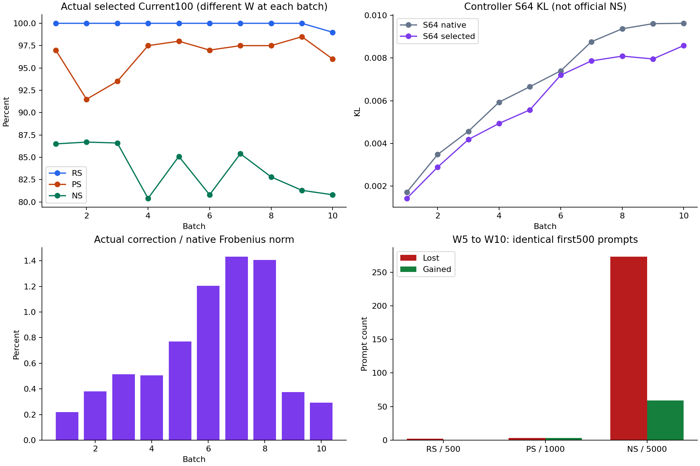

# Sequential EN-F 50071_1 완료 상세 사실 리뷰

상태: **COMPLETED_1000 / CPU_METRIC_AND_STORED_STATE_CHECKED**. 검증 경계: **T=SKIPPED_USER_DIRECTED / full_numerical_validation=NOT_ESTABLISHED / M→S=USER_DIRECTED_NOT_ESTABLISHED**.

본 보고서는 EN-F 한 sequential trajectory만 다룬다. EN-F4(50071_3)가 아니며 다른 현재 sibling의 scheduler/raw/result를 조회하지 않았다. 새 GPU·모델 로드·평가·FD·재실행·Slurm 변경은 0이다. 낮은 값과 반대 방향 변화, 실패 후보를 삭제하지 않았다.

## 1. 먼저 볼 실제 결과

actual W10의 전체 first1000을 원 NLL pair로 독립 재집계했다. RS/PS는 new NLL < true NLL, NS는 true NLL < new NLL이며 동점은 실패다. 13,000 pair 모두 finite, 분모·case/prompt/target/token identity·고정 순서·endpoint seal을 확인했고 동점은 0이다.

| 지표 | 실제 분자/분모 | 비율 |
| --- | --- | --- |
| RS | 997/1000 | 99.70% |
| PS | 1931/2000 | 96.55% |
| NS | 8034/10000 | 80.34% |

10/10 batch에서 nonzero correction이 선택됐고 native fallback은 0이다. 이는 유효한 실행 관측이며 방법의 효능·우월성 판정이 아니다. W0에서 맞았던 neighborhood 8,820개 중 7,857개 유지(89.0816%), 963개 소실; 원 W0 실패에서 177개 획득했다. S64 W10 KL=0.00858038860604, Dev128 W10 KL=0.0212651274958이다. S64는 선택 목적이고 Dev는 별도 관측이다.

첫 표는 metric 선행 보고였다. 현재 본문은 이후 완료한 tensor/chain/guard/cost 검사까지 포함한다. [첫 표](first-final-table.csv), [첫 표 당시 검증 receipt](first-table-receipt.json), [최종 표](final-table.csv).

## 2. 정확 대상·종료·출처

| 항목 | 확인값 |
| --- | --- |
| scheduler exact child / raw ID | 50071_1 / 50073; owner janghj; odeedit_enfc_S4_s4 |
| 종료 | COMPLETED / exit 0:0; 이번 recall 한 번 exact accounting |
| 할당 구간 KST | 2026-09-18 15:01:07 → 19:58:01 |
| 할당 / 프로그램 wall | 17,814 GPU-sec (4.948333 h) / 17,807.506516 s |
| resource | 1 GPU / 8 CPU / 60,416 MiB; server4 cap2 정책 유지 |
| frozen execution | 9e5884f5a2f8dcb7fc7406084f3fde94df450a55 |
| execution tree | aaacc6a0c55e19038a81516f40a9b4938c3fb38a |
| archive SHA256 | d2d31418632d98f9056db20666a663e79dde4bcb3c6ddbdc90cf0a2b771496bf |
| execution lock SHA256 | 4d600d4b57df58203fb21f447116c0362b8a731b9b6d71c4485353d913224d56 |
| analysis starting main | fdd9ccf16ffee339f79aa080c07b7fd4540228ba |
| 정확 raw root | /data/janghj/ODE-edit/local/single-layer-edit-preserving-correction/20260918-v1/S/attempt-v1/arms/EN-F/attempt-v1 |

실행 source와 분석/publication source는 별도다. 분석 source의 exact commit 및 member SHA는 analysis-manifest에 결속한다. 기존 initial 보고는 EN-S 대표 경계만 관측했다. 이번 사후 EN-F B1 검산을 당시 실시간 EN-F initial PASS로 소급하지 않는다. 다른 job을 조회하지 않았으므로 이번 exact 기록만으로 서버 전체 GPU 동시점유를 새로 인증하지 않는다. [한정 scheduler receipt](scheduler-receipt.json), [입력 manifest](input-manifest.json), [source inventory](source-input-inventory.csv).

## 3. 비교 조건과 재사용

| 항목 | 실제 결속 |
| --- | --- |
| model | Meta-Llama-3-8B-Instruct; revision 8afb486c1db24fe5011ec46dfbe5b5dccdb575c2 |
| 시작/순서 | fresh W0/zero M4; seed20260916; fixed first1000 B100×10 sequential |
| 계산 | FP32/eval/eager; matmul/cuDNN TF32 off; L4 down_proj [4096,14336] only |
| framework | torch2.9.1+cu128 / transformers4.44.2 / numpy2.2.6 / scipy1.15.3 |
| recorded hardware | RTX PRO 6000 Blackwell Server Edition |
| native | L2=1, lr=.1, decay=.5, clamp=.75, KL=.0625, max25 loss/24 Adam, native total early stop .05 |
| P | physical4 → asset0 → singleton local0; native P_raw unchanged |
| context | cold7 common text/token capsule; SHA 2d5d5c45bbbdf36ed859451242d7d84874d08cda4008d585945e565d9b3b1cb7 |
| dataset SHA | 3d7f5e31db47b23f3a281bb6fb447c2fb1776e3d4721cdfb5fe5c6f998f10ae1 |
| first1000 ordered root | 40fe1afb318a4a5da9630425213644a729a1e85fb4e78c18e9a4dcd2870eefdd |
| whole fixed10k ordered root | 5b01356928ad2e2e46effad5a2c5621c87746b610992b7b92bf3ace16b6f5729 |
| teacher manifest SHA | f81b798f44ce626ac1e2e402ca7438363b1dd60f5681ec0ac17b9e92d096761a |
| C4 reference identity | f5791dd3c986261a252796bd5d7293ece46339d261609449dcfe674970bbfde0 |

B1 native/초기 gradient/geometry는 적합 retained capsule을 재사용했다. B2–B10은 바로 앞 EN-F selected W/M에서 자신의 새 native fit을 수행했다. 다른 arm의 이후 native 결과 또는 M cold B2+를 가져온 경로가 아니다. 새 native fit은 9회/900 target이다. 이번 리뷰는 큰 model/teacher payload를 다시 전량 해시하거나 로드하지 않았다. 기존 봉인 identity와 이번 small-manifest hash/current stat의 검증 수준을 구분한다. [재사용 표](reuse.csv).

## 4. 최종·중간·at-write 분모 분리

| 상태 | RS | PS | NS |
| --- | --- | --- | --- |
| W5_full500 | 500/500 (100.00%) | 959/1000 (95.90%) | 4193/5000 (83.86%) |
| W10_full1000 | 997/1000 (99.70%) | 1931/2000 (96.55%) | 8034/10000 (80.34%) |
| W10_first500 | 498/500 (99.60%) | 959/1000 (95.90%) | 3979/5000 (79.58%) |
| W10_last500 | 499/500 (99.80%) | 972/1000 (97.20%) | 4055/5000 (81.10%) |
| pooled_atwrite1000_DIFFERENT_W | 999/1000 (99.90%) | 1928/2000 (96.40%) | 8364/10000 (83.64%) |

Pooled at-write는 서로 다른 W1…W10에서 각 Current100을 모은 값이며 W0 또는 단일 최종 모델 평가가 아니다. W5 first500과 W10 same-first500만 같은 문항의 시간 변화다. Fullseen에는 별도의 actual W에서 관측한 원문항 행을 사용하며 중복 분모를 만들지 않았다.

| 별도 지표 / actual W10 | 분자/분모 | 해석 |
| --- | --- | --- |
| rewrite TF strict | 994/1000 | target 모든 token argmax 일치 |
| P 각각 TF strict | 1357/2000 | PS NLL 비교와 다른 정의 |
| two-P / R+two-P TF strict | 515/1000 / 515/1000 | 요청 단위 두 paraphrase 모두 |
| R+two-P NLL joint | 945/1000 | 세 prompt 모두 new<true |
| rewrite target-token accuracy | 1009/1015 | token 분모 |
| P target-token accuracy | 1386/2030 | token 분모 |
| N true-target token accuracy | 1918/10110 | NS true<new와 다름 |
| greedy32 target-prefix match | 994/1000 | 자유생성 전체 문장 정확도 아님 |
| max32 도달 / target 길이 censor | 1000/1000 / 0/1000 | 생성 길이 ceiling과 target censor 별개 |

[strict/generation](strict-generation.csv), [token 표](token-accuracy.csv).

## 5. Current entry → own native → selected

| B | RS entry→native→selected /100 | PS entry→native→selected /200 | NS entry→native→selected /1000 |
| --- | --- | --- | --- |
| 1 | 5 → 100 → 100 | 20 → 194 → 194 | 886 → 865 → 865 |
| 2 | 11 → 100 → 100 | 28 → 183 → 183 | 881 → 867 → 867 |
| 3 | 8 → 100 → 100 | 24 → 187 → 187 | 880 → 866 → 866 |
| 4 | 13 → 100 → 100 | 33 → 195 → 195 | 843 → 804 → 804 |
| 5 | 7 → 100 → 100 | 27 → 196 → 196 | 864 → 851 → 851 |
| 6 | 12 → 100 → 100 | 28 → 194 → 194 | 820 → 808 → 808 |
| 7 | 8 → 100 → 100 | 23 → 195 → 195 | 868 → 854 → 854 |
| 8 | 14 → 100 → 100 | 26 → 195 → 195 | 867 → 827 → 828 |
| 9 | 13 → 100 → 100 | 23 → 197 → 197 | 855 → 813 → 813 |
| 10 | 12 → 99 → 99 | 29 → 192 → 192 | 836 → 808 → 808 |

같은 batch의 native→selected 전체 합계에서 RS 999→999, PS 1928→1928은 성공 ID 집합도 동일했다. NS 8363→8364는 1개 획득/0개 소실이다. 이 own-native는 EN-F 자신의 이전 보정까지 포함한 trajectory entry의 one-step shadow이며 독립 N4 sequential baseline이 아니다. Current native→selected canonical R 최대 new NLL 증가 7.152557e−6, P 평균 증가 0.000155976 / 최대 증가 0.025571346도 기록됐다. 즉 NLL 성공 count·ID 유지가 모든 P의 likelihood 불변을 뜻하지 않는다. 과거 전체 요청의 entry→native 패널은 저장되지 않아 native가 만든 과거 망각과 correction 효과를 모든 old 요청에 대해 분해하지 않는다. Past64는 WN anchor와 후보 비교만 검증 가능하다.

[모든 Current](batch-current.csv), [모든 paired NLL/margin 통계](paired.csv).

## 6. 유지·손실·회복, overwrite와 cohort

| 비교 | 지표 | 이전→이후 / 분모 | lost | gained | 순변화 pp |
| --- | --- | --- | --- | --- | --- |
| W5_to_W10_first500 | RS | 500→498 / 500 | 2 | 0 | -0.4 |
| W5_to_W10_first500 | PS | 959→959 / 1000 | 3 | 3 | 0 |
| W5_to_W10_first500 | NS | 4193→3979 / 5000 | 273 | 59 | -4.28 |
| ATWRITE_to_W10_all1000 | RS | 999→997 / 1000 | 2 | 0 | -0.2 |
| ATWRITE_to_W10_all1000 | PS | 1928→1931 / 2000 | 6 | 9 | 0.15 |
| ATWRITE_to_W10_all1000 | NS | 8364→8034 / 10000 | 450 | 120 | -3.3 |
| pooled_NATIVE_to_SELECTED | RS | 999→999 / 1000 | 0 | 0 | 0 |
| pooled_NATIVE_to_SELECTED | PS | 1928→1928 / 2000 | 0 | 0 | 0 |
| pooled_NATIVE_to_SELECTED | NS | 8363→8364 / 10000 | 0 | 1 | 0.01 |

W5→W10 first500 PS 총점은 같지만 3개 소실과 3개 획득이 교환됐다. at-write→W10의 RS 소실 case는 18415, 9763이며 둘 모두 ACTIVE다. SUPERSEDED case14566(ordinal94)는 W10 RS1/1·PS2/2를 유지했으므로 위 RS 손실을 합법적 overwrite로 설명할 수 없다. 현재 received1000 중 ACTIVE999/SUPERSEDED1이며 실패 요청을 ledger에서 제거하지 않았다. W5와 W10 사이 또는 checkpoint 밖 정확한 최초 실패/회복 시점은 관측되지 않았고 보간하지 않는다.

| population | RS | PS | NS |
| --- | --- | --- | --- |
| ALL | 997/1000 (99.70%) | 1931/2000 (96.55%) | 8034/10000 (80.34%) |
| ACTIVE | 996/999 (99.70%) | 1929/1998 (96.55%) | 8026/9990 (80.34%) |
| SUPERSEDED | 1/1 (100.00%) | 2/2 (100.00%) | 8/10 (80.00%) |

| 도착 cohort | W10 age(batch) | RS /100 | PS /200 | NS /1000 |
| --- | --- | --- | --- | --- |
| 1 | 9 | 100 | 195 | 818 |
| 2 | 8 | 98 | 185 | 813 |
| 3 | 7 | 100 | 189 | 799 |
| 4 | 6 | 100 | 194 | 751 |
| 5 | 5 | 100 | 196 | 798 |
| 6 | 4 | 100 | 194 | 771 |
| 7 | 3 | 100 | 197 | 841 |
| 8 | 2 | 100 | 192 | 826 |
| 9 | 1 | 100 | 197 | 809 |
| 10 | 0 | 99 | 192 | 808 |

W0-correct N은 이전 동일 case/prompt/target 봉인 관측과 연결한 조건부 분모 8,820이다. W10 유지7857, 소실963; ALL N10000과 혼합하지 않는다. W0를 이번 리뷰에서 재평가하지 않았다. Case-level 신뢰구간은 계산하지 않았다. 이 단일 fixed-order trajectory를 독립 cold10 반복으로 취급하지 않는다. [lost/gained exact case:prompt ID](loss-gain-identities.csv), [retention](retention.csv), [cohort](cohorts.csv), [population](population.csv).

| 별도 strict/generation 비교 | 지표 | 이전→이후 / 분모 | lost | gained |
| --- | --- | --- | --- | --- |
| ATWRITE_to_W10 | R_strict | 999→994 / 1000 | 5 | 0 |
| ATWRITE_to_W10 | twoP_strict | 501→515 / 1000 | 12 | 26 |
| ATWRITE_to_W10 | R_twoP_strict | 501→515 / 1000 | 12 | 26 |
| ATWRITE_to_W10 | R_twoP_NLL_joint | 943→945 / 1000 | 5 | 7 |
| ATWRITE_to_W10 | greedy32_prefix | 999→994 / 1000 | 5 | 0 |
| W5_to_W10_first500 | R_strict | 498→495 / 500 | 3 | 0 |
| W5_to_W10_first500 | twoP_strict | 250→255 / 500 | 9 | 14 |
| W5_to_W10_first500 | R_twoP_strict | 250→255 / 500 | 9 | 14 |
| W5_to_W10_first500 | R_twoP_NLL_joint | 466→468 / 500 | 1 | 3 |
| W5_to_W10_first500 | greedy32_prefix | 498→495 / 500 | 3 | 0 |

[strict paired 전체 표](strict-retention.csv).

## 7. NLL·desired margin 분포와 악화 tail

Desired margin은 R/P=true−new, N=new−true이다. 양수이면 canonical 성공이다. 아래는 W10 전체1000 실제 분포이며 부호를 섞지 않는다.

| 지표 | new NLL mean/p95/p99 | true NLL mean/p95/p99 | margin mean/min/p50 |
| --- | --- | --- | --- |
| RS | 0.0279536528 / 0.00577725009 / 0.0992217173 | 14.8570888 / 21.5101931 / 24.3299545 | 14.8291351 / -2.20324612 / 14.8380876 |
| PS | 1.51687738 / 6.72932305 / 10.190884 | 10.1633178 / 17.0481903 / 20.2638138 | 8.64644045 / -10.09454 / 8.50700275 |
| NS | 9.23318724 / 15.5611863 / 17.9306039 | 5.32094741 / 12.299237 / 14.9132681 | 3.91223983 / -19.4186554 / 3.94483936 |

같은 first500의 W5→W10 N true-NLL 변화는 mean +0.2592652, p95 +2.78218, p99 +7.31825, max +16.54394다. At-write→W10 N true-NLL 변화는 mean +0.1566682, p95 +2.41954, p99 +6.67245, max +16.84973다. NS 비교가 유지되는 문항에도 true likelihood 악화가 있을 수 있으므로 이를 별도 기록했다. 최소/중앙/최대와 desired-margin 변화는 [nll-tails](nll-tails.csv) 및 [paired](paired.csv)에 있다. 상세 행은 local paired-local-rows.csv에 보존하고 prompt/target raw는 Git에 넣지 않았다.

## 8. 설계 → 실제 실행 → 증거와 한계

실행 source 62개 member의 current SHA/bytes를 frozen lock과 대조했다. 주요 source 함수·line·fullSHA와 requirement별 근거는 [source-conformance.csv](source-conformance.csv)에 명시했다. 아래 판정은 model-level numerical PASS가 아니다.

| 요구 | 실제 구현 / 근거 | 판정 |
| --- | --- | --- |
| L4 only / own native | sequential_runtime.native_batch; ENTRY/native-binding/prev COMMIT | SOURCE_CONFIRMED + STORED_CONSISTENT |
| full-token old/new lock | binding.protected_sequences; 1400 new/old provenance rows; prefix+exact key dedup | SOURCE_CONFIRMED; full K_E 미보존 |
| allowed-range intersection | geometry.edit_null_space; FP64 V(I−UUᵀ)Vᵀ, spectrum/factors | stored spectrum 산술·factor hash 확인 |
| all-token weight response | alltoken.suffix_hidden; actual full weight F.linear + downstream suffix | SOURCE_CONFIRMED; physical/cached parity 미재실행 |
| fixed-W0 full-vocab KL | signed_forward_kl; FP32 logsoftmax / signed FP64 KL, clamp0 | document mean 독립 확인 |
| Polyak/Armijo | optimizer.optimize; L/chi, halving, actual dot-product | 20trial 산술/10actualD CPU 확인 |
| 개별 guard / ID subset | binding.quality_ok; Current/Past 별도 +1e−4, count 아닌 exact IDs | 14panels 독립 재판정 |
| Past received ledger | sequential_state.past64; latest active/current overwrite 제외/fixed SHA | 10 CP에서 exact IDs 재구성 |
| selected history once | sequential_runner.run; inner0/final1; M/link evidence | 10append/9link 확인; finalizer K 미보존 |
| P/N/Dev observer | selection/commit 봉인 후 observe_batch, W/RNG restore receipt | source+stored guard; 재평가0 |

K_E는 canonical 및 native rewrite context의 old/new valid-token prefix 합집합이다. Pad는 제외하며 임의 EOS나 P/N을 더하지 않는다. 각 batch protected new sequence는 canonical100+native-context600=700개이고 old와 합쳐 1400행이다. 서로 동일한 prefix와 실제 FP32 key byte인 경우만 alias 공유한다. 이번 보호는 현재의 고정 입력 반응에 대한 것이며 미관측 PS/모든 과거 편집/자유생성을 보장하지 않는다.

P_raw는 native 그대로, P_star는 허용 range basis V의 projector다. J=VᵀK_E의 blocked left basis U를 사용해 Q=V(I−UUᵀ)Vᵀ를 구현한다. 단순한 두 projector 순차곱이나 CA/output-span 제한이 아니다. FP64 tau=max(shape)·eps64·sigma_max, ambiguity[tau/10,10tau]를 그대로 사용했다. 모든 batch RESOLVED/ambiguous0이나 full K_E 재캡처나 SVD를 새로 실행한 결과는 아니다.

Preservation은 W0 full-vocab p0에 대한 signed KL(p0∥pW)이다. 64문서×128 scored positions, BOS+256 input=257이므로 한 S64 sweep input16,448 / scored8,192를 구분한다. 음의 KL을 임의0 clamp하지 않는다. Current/Past observer의 strict·pair ID는 own WN anchor이고 plateau .05는 없다; native fitting early-stop .05와 다른 규칙이다.

## 9. batch별 실제 correction 공간·step·선택

| B | rank J / q | G norm / GQ norm | chi | actual D norm | D/native % | trial 수 / 선택(0-based) |
| --- | --- | --- | --- | --- | --- | --- |
| 1 | 4596 / 9730 | 0.0693639649 / 0.0516931955 | 0.00267218647 | 0.0166454005 | 0.218683128 | 2 / 1 |
| 2 | 4727 / 9599 | 0.0813388857 / 0.0592916939 | 0.00351550497 | 0.0293554531 | 0.380656796 | 2 / 1 |
| 3 | 4494 / 9832 | 0.077586821 / 0.056811988 | 0.00322760198 | 0.0402104842 | 0.513098719 | 2 / 1 |
| 4 | 4542 / 9784 | 0.101816732 / 0.0753761295 | 0.00568156089 | 0.0393533113 | 0.504593469 | 2 / 1 |
| 5 | 4477 / 9849 | 0.0764855378 / 0.0552030217 | 0.00304737361 | 0.0602859209 | 0.770437483 | 2 / 1 |
| 6 | 4751 / 9575 | 0.10255614 / 0.0748940825 | 0.00560912359 | 0.0987571126 | 1.20318936 | 1 / 0 |
| 7 | 4683 / 9643 | 0.102754139 / 0.0745316425 | 0.00555496573 | 0.117518913 | 1.43138642 | 1 / 0 |
| 8 | 4691 / 9635 | 0.112098252 / 0.0819032611 | 0.00670814418 | 0.114314034 | 1.40565415 | 1 / 0 |
| 9 | 4349 / 9977 | 0.10097209 / 0.0743109282 | 0.00552211405 | 0.0323094211 | 0.374335041 | 3 / 2 |
| 10 | 4635 / 9691 | 0.0679464245 / 0.0476669181 | 0.00227213508 | 0.0252258866 | 0.293409364 | 4 / 3 |

P_star rank14326, q=9575…9977이다. GQ norm과 chi=||GQ||²는 저장 idealD/eta로 독립 재계산했다. GP norm은 NOT_RECORDED다. 새 9 gradient sweep과 B1 initial gradient reuse1을 구분한다. 선택 correction/native norm비는 0.218683%…1.431386%; 모든 batch 선택은 nonzero다. B2+ correction과 native delta의 cosine은 저장 entry/native/selected로 CPU 계산했으며 [checkpoint-state](checkpoint-state.csv)에 있다. 두 방향이 완전히 평행한 단순 native strength 변경은 아니지만 이를 성능 원인이나 기여율로 해석하지 않는다. 누적 ||W−W0||는 본 범위에 W0 weight를 새로 로드하지 않았으므로 NOT_AVAILABLE이다. step norm 합을 대신 쓰지 않는다.

| B | trial | eta | actual norm | 실제 KL decrease | actual p=<G,ΔW> | 사유 |
| --- | --- | --- | --- | --- | --- | --- |
| 1 | 0 | 0.644007393 | 0.0332907998 | -3.66014379e-05 | -0.00172090784 | ARMIJO_FAILED |
| 1 | 1 | 0.322003696 | 0.0166454005 | 0.000289691459 | -0.000860453923 | FIRST_RESOLVED_ACCEPTED |
| 2 | 0 | 0.99020456 | 0.0587109055 | -0.000782070195 | -0.00348106903 | ARMIJO_FAILED |
| 2 | 1 | 0.49510228 | 0.0293554531 | 0.000588728081 | -0.00174053454 | FIRST_RESOLVED_ACCEPTED |
| 3 | 0 | 1.41556335 | 0.080420968 | -0.000929207918 | -0.00456887506 | ARMIJO_FAILED |
| 3 | 1 | 0.707781676 | 0.0402104842 | 0.000385913934 | -0.00228443754 | FIRST_RESOLVED_ACCEPTED |
| 4 | 0 | 1.04418499 | 0.0787066231 | -3.61117324e-05 | -0.00593260059 | ARMIJO_FAILED |
| 4 | 1 | 0.522092495 | 0.0393533113 | 0.00099419806 | -0.00296630027 | FIRST_RESOLVED_ACCEPTED |
| 5 | 0 | 2.18415294 | 0.120571842 | -0.000838198318 | -0.00665593 | ARMIJO_FAILED |
| 5 | 1 | 1.09207647 | 0.0602859209 | 0.00108494841 | -0.00332796503 | FIRST_RESOLVED_ACCEPTED |
| 6 | 0 | 1.31862371 | 0.0987571126 | 0.000201636121 | -0.00739632333 | FIRST_RESOLVED_ACCEPTED |
| 7 | 0 | 1.57676538 | 0.117518913 | 0.000897574 | -0.00875887764 | FIRST_RESOLVED_ACCEPTED |
| 8 | 0 | 1.39572017 | 0.114314034 | 0.00127735318 | -0.00936269217 | FIRST_RESOLVED_ACCEPTED |
| 9 | 0 | 1.73914775 | 0.129237683 | 0.000144238134 | -0.00960377223 | QUALITY_GUARD_FAILED |
| 9 | 1 | 0.869573873 | 0.0646188417 | 0.00208788714 | -0.00480188611 | QUALITY_GUARD_FAILED |
| 9 | 2 | 0.434786936 | 0.0323094211 | 0.00165091421 | -0.00240094308 | FIRST_RESOLVED_ACCEPTED |
| 10 | 0 | 4.23369291 | 0.201807093 | -3.16683797e-05 | -0.00961952217 | ARMIJO_FAILED |
| 10 | 1 | 2.11684645 | 0.100903547 | 0.0022162529 | -0.00480976105 | QUALITY_GUARD_FAILED |
| 10 | 2 | 1.05842323 | 0.050451773 | 0.00175435925 | -0.00240488055 | QUALITY_GUARD_FAILED |
| 10 | 3 | 0.529211613 | 0.0252258866 | 0.00103913357 | -0.00120244029 | FIRST_RESOLVED_ACCEPTED |

20개 중 최초 resolved accepted10, Armijo 실패6, 개별 Past guard 실패4; duplicate/nonfinite0. 모든 batch는 1gradient/최대8trial 계약에서 첫 통과 후보를 선택했다. GRADIENT_BUDGET_EXHAUSTED는 승인된 1gradient 사용 종료이지 수렴 증명이나 런타임 실패가 아니다. Rejected probe 비용도 compute 표에 포함한다. [mechanism](mechanism.csv), [all trials](trials.csv).

## 10. 실제 guard·반응 보존과 worked examples

| B | trial | 통과 | Current 최대 ΔNLL | Past 최대 ΔNLL | Current/Past 탈락 수 |
| --- | --- | --- | --- | --- | --- |
| 1 | 1 | True | 3.35276127e-07 | 0 | 0/0 |
| 2 | 1 | True | 1.41859055e-05 | 2.25869007e-06 | 0/0 |
| 3 | 1 | True | 5.73694706e-07 | 7.96606764e-06 | 0/0 |
| 4 | 1 | True | 8.49366188e-07 | 6.40144572e-06 | 0/0 |
| 5 | 1 | True | 1.15633011e-05 | 1.38711184e-05 | 0/0 |
| 6 | 0 | True | 2.30967999e-07 | 1.94706954e-05 | 0/0 |
| 7 | 0 | True | 2.37720087e-07 | 6.41914085e-05 | 0/0 |
| 8 | 0 | True | 4.63798642e-07 | 9.60705802e-06 | 0/0 |
| 9 | 0 | False | 4.76837158e-06 | 0.000382743776 | 0/1 |
| 9 | 1 | False | 1.33514404e-05 | 0.000191219151 | 0/1 |
| 9 | 2 | True | 1.14440918e-05 | 9.57287848e-05 | 0/0 |
| 10 | 1 | False | 4.64916229e-06 | 0.000332586467 | 0/1 |
| 10 | 2 | False | 5.30481339e-06 | 0.000166252255 | 0/1 |
| 10 | 3 | True | 8.10623169e-06 | 8.37296247e-05 | 0/0 |

B1 Past는 empty, B2+는64개다. 최신 사실/현재 overwrite 제외/ENFC-v1|past|case_id SHA priority를 CP received ledger로 재구성했다. 성공 filtering은 없고, selected와 별개로 요청 전량을 ledger에 append한다. 4개 quality 실패는 모두 Past의 개별 new NLL 1개가 +1e−4를 넘었기 때문이며 strict/pair loss를 count로 숨긴 사례는 없었다. 규정 anchor는 이전 entry가 아니라 같은 batch own WN이다.

**예시 B1(최소 actual correction, 사전 기준: 전체10batch 최소 norm).** native norm7.611652799, B(WN)=0.00172090783911, chi=0.002672186466, eta0=0.644007392824. trial0 actual norm0.03329079976은 KL0.001757509277로 증가하여 Armijo 탈락했다. eta를 절반으로 한 trial1에서 actual norm0.01664540046, selected KL0.001431216380으로 감소하고 Current guard/invariant를 통과했다. Current R100/P194/N865는 native→selected 그대로이고, final history1 후 B2 entry와 W/M/context/RNG/ledger hash가 연결된다.

**예시 B9(실제 Past guard가 축소를 유발한 최초 batch).** own WN KL0.00960377220811; trial0/1의 Past 최대 증가0.000382743776/0.000191219151는 +1e−4를 초과했다. trial2는0.000095728785로 통과했고 actual norm0.03230942112, selected KL0.007952858001을 선택했다. B10도 trial0 Armijo 실패 후 trial1/2 Past 실패, trial3 Past 최대0.000083729625에서 수용했다. fallback 사례는 실제 0개이므로 만들어 제시하지 않는다. 최대 actual correction은 B7 norm0.1175189133(native대비1.431386%)이다.

10개 selected invariant의 기록상 최대값: ideal DK relative6.86456e−17(한도1e−10), actual token-normalized response2.70006e−8(1e−5), projection leakage3.03422e−6(1e−5), protected logit max9.87053e−5(1e−3), logit RMS 약3.52694e−6(1e−4), NLL 차5.91278e−5(1e−4), strict/pair ID변화0. 이는 저장 runtime scalar/ID와 한도의 재검산이다. Full K_E/full logits를 독립 재생성하지 않았으며 physical/cached parity나 derivative 정확성으로 승격하지 않는다. D_acc64와 actual FP32 D 차의 norm은 약1.97e−6…2.06e−6이다. 모든10개 실제selected는 (saved WN.double()+idealD64).float()와 byte-exact 일치했다. [guards](guards.csv), [invariants](invariants.csv).

## 11. S64와 Dev128 — 서로 다른 관측

| B | S64 own native | S64 selected | selected−native | Dev128 selected |
| --- | --- | --- | --- | --- |
| 1 | 0.00172090784 | 0.00143121638 | -0.000289691459 | NOT_MEASURED |
| 2 | 0.00348106905 | 0.00289234097 | -0.000588728081 | NOT_MEASURED |
| 3 | 0.00456887508 | 0.00418296114 | -0.000385913934 | NOT_MEASURED |
| 4 | 0.0059326006 | 0.00493840254 | -0.00099419806 | NOT_MEASURED |
| 5 | 0.00665593002 | 0.00557098161 | -0.00108494841 | 0.0107192056 |
| 6 | 0.00739632334 | 0.00719468722 | -0.000201636121 | NOT_MEASURED |
| 7 | 0.00875887763 | 0.00786130363 | -0.000897574 | NOT_MEASURED |
| 8 | 0.00936269217 | 0.00808533899 | -0.00127735318 | NOT_MEASURED |
| 9 | 0.00960377221 | 0.007952858 | -0.00165091421 | NOT_MEASURED |
| 10 | 0.00961952218 | 0.00858038861 | -0.00103913357 | 0.0212651275 |

S64는 controller 입력/step acceptance에 사용됐다. Dev128은 W5/W10 관측뿐이며 선택에 되먹이지 않는다. W10 S64 감소 −0.001039133574와 NS 성공 변화는 서로 다른 정의다. 전체trajectory NS 유지 또는 PS 개선을 S64 감소만으로 주장하지 않는다. Report256은 열지 않았다.

그림은 저장값만 코드로 생성했다. 연결선은 batch 관측을 잇는 표시이고 중간 미측정 모델의 평가값을 생성한 것이 아니다. [그림 입력/코드/출력 identity](figures/figure-provenance.json).

## 12. checkpoint·history·실물 무결성

현재 EN-F subtree **467 files / 30,011,203,130 bytes**를 fullSHA/size inventory했다. 저장 tensor 4120개 객체에 대해 CPU weights_only/mmap schema/finite를 확인했다. 원본 모델/공통teacher/다른arm의 inventory가 아니다.

| 검사 | 실제 범위 / 결과 |
| --- | --- |
| checkpoint | B1…B10 10개 실제 존재; W[4096,14336], M[1,14336,14336] FP32 finite |
| commit/state | 10commit, history10, candidate inner append0; next_batch2…11 |
| 인접 연결 | 9/9 selected W/M/context/RNG/received-ledger → next entry 일치 |
| materialization | 10/10 saved native+ideal64→FP32 selected 정확 일치 |
| actual p / chi | 저장 G,actualD로 dot 재계산; p gap0; chi 부동소수 산술 일치 |
| received ledger | 1000unique, ACTIVE999/SUPERSEDED1; Past64 IDs 독립 재구성 |
| 최종 W raw hash | 3ccda9a09a1b8c44feea268853feb4fb62b2416a36198e3f4ba9140e289227d5 |
| 최종 M raw hash | f38200b937fcae3d15d5fa760210f31fe65f48a1613f6ba4a1caac56bf7ec0bd |
| 최종 CP SHA / bytes | 6f5e7cf6800c6c2538a22a0a0c0ab7128b0f1e2d732ec8ee4984843a55991db1 / 1057211173 |

비선택 parameter는 실행 start hash 및 종료 runtime assertion으로 보호됐으나 전체 fullmodel tensor를 별도 보존·CPU재구성한 것은 아니다. Finalizer의 selected-current K 자체는 별도 저장되지 않아 M += KKᵀ를 독립 재연산했다고 쓰지 않는다. 보존 CP/RNG/context/ledger의 CPU 검사는 실제 GPU crash-resume/continuation PASS가 아니다. [raw inventory](raw-inventory.csv), [checkpoint state](checkpoint-state.csv), [commit links](commit-links.csv).

## 13. 계산량·시간·memory — 중첩 비용 분리

| 항목 | 실측/재사용 | 단위와 한계 |
| --- | --- | --- |
| 새 allocation | 17814 GPU-sec = 4.948333 GPUh | exact parent만; batch/extern 미가산 |
| program wall | 17807.506516 s | utilization 아님 |
| native 새 fit | 9 / 900target / 21600Adam / 22500loss / 9solve | B2–B10; max24stop900 / early0 / zero0 |
| B1 native 재사용 | 100target / 2400Adam / 2500loss / 1solve | 과거 약283.165502s; 이번 새 fitting 비용 아님 |
| neural gradient | 새9 sweep + 공유B1 reuse1 | sweep ≠ single forward |
| trial / guard / invariant | 20 / 14 / 10 | accepted10 + rejected10 비용 포함 |
| history | 10final / 0candidate | whole current100 각1회 |
| native fit inclusive | 2688.872249 s | target/key/solve 포함; 별도 합산0 |
| geometry | 721.487410 s | 새9 geometry; B1 priorreuse |
| correction total inclusive | 8251.672250 s | 아래 projection/objective/guard/invariant 중첩 |
| objective / guard / invariant | 812.515334 / 1676.573320 / 3298.760432 s | correction 내부 component |
| history finalize / model load / P load | 134.092860 / 9.409885 / 4.107724 s | program wall 내부 |
| peak allocated GPU bytes | 35702145536 | torch 기록; scheduler utilization 아님 |
| program host peak / scheduler batch MaxRSS | 34568672 KiB / 31869140 KiB | 서로 다른 계측자/시점, 동일값으로 강제0 |
| pure writer / checkpoint I/O | NOT_SEPARATED | 남는 wall을 writer로 추정하지 않음 |

Native target 총1000개(재사용100 포함) 모두 기록상24Adam/25loss였고 최종 native total loss 평균은 B별0.1251…0.1382다. 24step 도달은 수렴도 미수렴도 증명하지 않는다. Clamp hit 및 최종 loss의 NLL/KL/decay 세부 trace는 미저장으로 남긴다. 관측·teacher streaming·token/forward/backward 단위는 [work-counters](work-counters.csv), [cost components](cost-components.csv), [compute](compute.csv), [native counts](native-fit-counts.csv)에 모두 보존했다. 공식 Current entry/native/selected 및 fullseen, greedy32 generation 비용을 fitting에 섞지 않는다. Shared B1 native/teacher와 과거 T/M 실패·중단 비용은 prior lineage이며 이번17,814초에 더하지 않는다. 과거 paired-stop3231GPU-sec 등은 해당 기존 보고의 비용이며 이번에 해당 job을 재조회하지 않았다. 리뷰 자체 GPU시간0, 실제 EN-F raw약30.01GB와 이전 storage reserve 추정/공유volume 여유는 별개다.

## 14. 과거 baseline은 별도 참고

| 구분 | RS | PS | NS | 비교 수준 |
| --- | --- | --- | --- | --- |
| 현재 EN-F S W10 | 997/1000 | 1931/2000 | 8034/10000 | 본 리뷰 exact endpoint |
| 과거 cold7 N4 W10 | 999/1000 | 1934/2000 | 8026/10000 | REFERENCE_ONLY; 기존 sealed aggregate 재사용 |
| 산술 차 EN-F−과거N4 | −0.20pp | −0.15pp | +0.08pp | paired causal comparison 아님 |

기존 N4의 model/revision/coldW0/seed/order/context/native hparams/FP32/TF32 및 canonical 정의는 비교표에 결속되지만 source/controller/검증·observer·비용 protocol은 다르다. 과거 N4 allocation6004초는 그대로 prior이며 동등한 timed workload를 전제하지 않는다. 이번에는 과거 per-case raw를 재감사하지 않아 aggregate에서 paired lost/gained를 합성하지 않았다. SH1 single cold100과 현재 sibling 결과는 혼합하지 않는다. [baseline reuse identity/차이](baseline-reuse.json).

## 15. 검증 판정·한계·재현

| 항목 | 판정 | 범위/한계 |
| --- | --- | --- |
| terminal / final denominator | CPU_CHECKED | COMPLETED 10 batch / unique1000 / 1000,2000,10000; finite / ties / identity checked |
| raw NLL / paired transitions | INDEPENDENT_REDUCER_CHECKED | aggregate is comparison only; success recomputed from raw pairs |
| 10 CP / 9 links / selected materialization | CPU_WEIGHTS_ONLY_CHECKED | W/M/context/RNG/ledger/hash/next-index; all 10 exact stored FP32 reconstruction |
| history exactly once | STORED_EVIDENCE_CONSISTENT | 10 append / inner0, M before/after hash; selected finalizer K not retained |
| individual guards / Armijo / first acceptance | CPU_REPLAY_CHECKED | 14 guard panels / 20 trials / first accepted10 |
| P-star / blocked-space spectrum | STORED_FACTORS_AND_ARITHMETIC_CHECKED | fixed cutoff / ambiguity / q; prior P-star identity reused, no new SVD |
| full K_E / independent DK recomputation | NOT_RETAINED | provenance and hash aliases exist; original full captured keys do not |
| logits / response invariant | STORED_RUNTIME_SCALARS_CHECKED | recorded cached-route ceilings and IDs; no new forward |
| full physical model parity / derivative / FD | NOT_ESTABLISHED | T=SKIPPED_USER_DIRECTED; no GPU validation in review |
| GPU continuation / crash resume | NOT_TESTED | CPU checkpoint loading is not model-level continuation |
| GP norm / cumulative W-W0 | NOT_RECORDED_OR_NOT_AVAILABLE | G and GQ available; no pretrained model loaded to derive cumulative displacement |
| native clamp events / loss component traces | NOT_RECORDED | target final total loss and update counts only; no inferred clamp count |
| Past entry-to-native forgetting | NOT_RECORDED | own WN and candidate Past64 scores exist, corresponding entry Past64 panel absent |
| Report256 / new holdout / sibling arms | NOT_MEASURED_IN_SCOPE | unopened; no current EN-S/EN-COV/EN-F4 result access |
| independent reviewer / GPU use | NOT_RUN / ZERO | single reviewer + independent arithmetic reducer; no separate red agent |

이번 검산 범위에서 metric 분모/identity/selected tensor 연결/저장 guard 산술 불일치는 발견되지 않았다. 이 문장은 미측정 model-level derivative, GPU off/on parity, 전체 수치 검증까지 PASS라는 뜻이 아니다. T=SKIPPED_USER_DIRECTED, full_numerical_validation=NOT_ESTABLISHED, M→S=USER_DIRECTED_NOT_ESTABLISHED를 유지한다. 자체 red 관점 점검 및 독립 산술 reducer를 수행했으며 별도 reviewer agent는 사용하지 않았다. 원 execution/runtime/raw는 read-only, 분석 code와 새 compact package만 게시한다. 과학적 우월성·인과·후속 실험 선택은 본 보고에서 판단하지 않는다.

[재현 명령](README.md), [검사 receipt](validation-receipt.json), [analysis manifest](analysis-manifest.json), [rooted receipt](rooted-receipt.json). 최종 publication commit은 Git history 및 direct handoff에서 확인한다. 원 실행 commit과 혼동하지 않는다.
