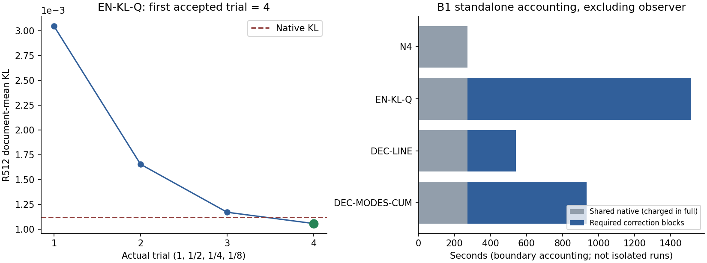
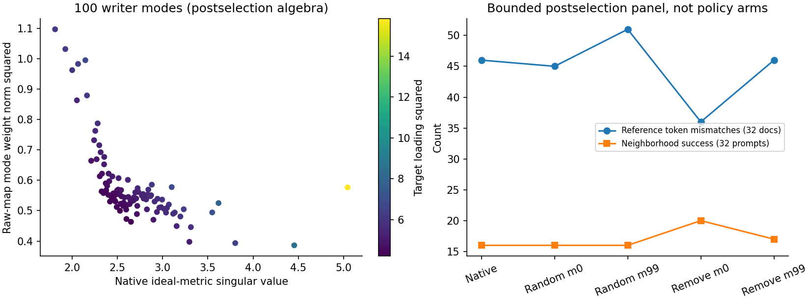

# Single-layer mechanism-first B1 완료 상세 리뷰 — 51058

상태: **B1 완료 / 네 arm 관측 완료 / B1→S3 gate FAIL / 전체 수치검증 미확립**. 이 문서는 2026-09-20의 CPU-only 완료 리뷰다. 새 GPU·모델·평가·Slurm 변경은 0이며, S3/S10을 제출하지 않았다.

## 1. 먼저 읽을 결과

같은 cold W0·zero M4에서 만든 fresh native B100 한 번을 N4, EN-KL-Q, DEC-LINE, DEC-MODES-CUM이 공유했다. 네 arm의 canonical 성공 집합은 동일했다. 다만 EN-KL-Q는 실제 비영 보정을 수용했고 NLL·Dev choice는 변했다. DEC 두 arm은 네 scale 모두 FP32 실제 변화가 0이어서 native로 돌아갔다.

| B1 arm | RS | PS | NS | N4 대비 RS/PS/NS pp | 실제 선택 |
| --- | --- | --- | --- | --- | --- |
| N4 | 100/100 (100%) | 194/200 (97%) | 865/1000 (86.5%) | 0 / 0 / 0 | fresh native |
| EN-KL-Q | 100/100 (100%) | 194/200 (97%) | 865/1000 (86.5%) | 0 / 0 / 0 | 4번째 trial 수용 |
| DEC-LINE | 100/100 (100%) | 194/200 (97%) | 865/1000 (86.5%) | 0 / 0 / 0 | native fallback |
| DEC-MODES-CUM | 100/100 (100%) | 194/200 (97%) | 865/1000 (86.5%) | 0 / 0 / 0 | native fallback |
| W0, 정확 저장 행 재사용 | 5/100 (5%) | 20/200 (10%) | 886/1000 (88.6%) | 주 대조 아님 | 편집 전 |

[첫 표](first-table.csv)의 SHA256은 `b1b4bc84f7d681dc20ed4ea49ba946a47ce06f74de7c1438343c222ac39c04ce`다. [최종 표](final-table.csv), [독립 reducer 결과](first-independent-reducer.json), [성공 ID 전이](paired-IDs.json)를 함께 봉인했다. STEP=CUM은 B1 alias로서 추가 endpoint·시행으로 세지 않는다.

핵심 경계는 다음과 같다.

- EN-KL-Q의 R512 train KL은 0.00112039035013→0.00105820016472로 감소했다. 그러나 선택된 EN의 R512 choice/Phi는 저장되지 않았다. KL 감소를 reference choice 회복으로 바꾸어 보고하지 않는다.
- Dev128에서는 EN의 총 mismatch가 306으로 같지만 native-safe token 2개가 새로 틀리고 기존 오류 2개가 회복됐다. Phi는 0.243813425306→0.244097931044로 증가했다.
- W0-correct N886개 중 native가 24개를 잃었고 기존 오답 3개를 얻었다. 어떤 보정도 그 24개를 성공으로 회복하지 않았다.
- primary CUM은 비영 보정·choice 또는 충분한 Phi 감소 조건을 충족하지 못했다. 유한 local 문제의 결과이며 전체 허용 공간의 불가능성이나 최적수렴 증명이 아니다.
- `FD=WAIVED_USER_DIRECTED`, `full_numerical_validation=NOT_ESTABLISHED`를 유지한다. 실제 보호검사와 CPU 산술 일치는 이 경계를 해제하지 않는다.

## 2. 정확 대상·완결성·계보

| 구분 | 확인 사실 | 검증 수준 |
| --- | --- | --- |
| 대상 | 51058 / odeedit_slmf_B1r4_s4 / janghj / server4 | exact accounting 1회 |
| Scheduler | COMPLETED, exit 0:0 | 과학 성공과 별도 |
| 실행 구간 | 2026-09-20 03:37:37–04:38:06 KST | parent allocation 3629초 |
| Scientific terminal | B1_COMPLETE_USER_LIMIT | maximum_batch=1, sequential_authorized=false |
| 과학 범위 | 고유 request100, 네 arm, history append4 | order·분모·commit·observer 대조 |
| Raw scope | 598파일, 4,105,376,328 bytes | 전체 scope full SHA inventory |
| 저장 tensor | 522파일, 1,133 tensor member, 4,049,070,960 bytes | CPU weights_only/mmap, shape/dtype/finite |
| 디스크 checkpoint | 0, 사용자 미저장 지시 | exact_resume=NOT_AVAILABLE |
| 리뷰 실행 | 새 GPU/model/forward/eval/Slurm write 0 | CPU source/reducer/plot만 |

실행 commit은 `5f79085629b10b2bb8bdee88d017e18a46bb4c74`, tree는 `a5b089229ab3e4edd2e3595c5c4f5226325b433e`다. Archive SHA256은 `cad46de07ea854f984b7d53b34c1a3fa59301ba7f37be50a6420b8839303b479`, lock은 `6a14ebaf32549cc9479f2d112ba1954b06ef00380fffc1091cd70090f9098f61`이다.

실제 자료 root는 `/data/janghj/ODE-edit/local/single-layer-mechanism-first/20260919-v1/PROGRAM/b1-fd-waiver-r4/`이다. 분석은 별도 `completed-b1-review-20260920-v1/` namespace와 clean branch에서 수행했다. 원 T0/실패/waiver/pending 기록과 원 raw·runtime은 수정하지 않았다.

새 분석 base는 `0150da2f02c830baa070944e1f504852f2fe6b01`이다. [provenance](provenance.json)에 실행 closure 228파일, archive/lock full rehash, 12개 기존 FULL_READ 정본의 재결속을 기록했다. 변경된 PROTOCOL·registry는 직접 읽었다. 대형 공통 자산 11개는 **prior full SHA + 현재 stat** 재사용이며 이번 전량 rehash가 아니다. 새 분석 source hash는 [analysis manifest](analysis-manifest.json), 보고 package root는 [rooted receipt](rooted-receipt.json)에 분리했다.

Pinned Llama revision `8afb486c1db24fe5011ec46dfbe5b5dccdb575c2`, L4 down_proj 한 개, FP32/eager, 양 TF32 off, seed20260916, P4→asset0, context/tokenizer/order/runtime import는 frozen lock과 실행 receipt로 결속했다. CPU 리뷰에서 pretrained model을 로드하거나 bitwise parity를 새로 시험하지 않았다.

Fixed10k dataset SHA `3d7f5e31db47b23f3a281bb6fb447c2fb1776e3d4721cdfb5fe5c6f998f10ae1`, whole order `5b01356928ad2e2e46effad5a2c5621c87746b610992b7b92bf3ace16b6f5729` 및 실제 첫100 case 순서를 lock/native/관측 세 경로에서 대조했다. 과거 EN/BPCW endpoint를 새 native 대신 쓰지 않았다.

## 3. 지표 정의와 독립 집계

RS/PS는 target-new NLL < target-true NLL, NS는 target-true NLL < target-new NLL이다. 엄격 부등식이며 tie=failure다. 이번 최종 R/P/N pair의 tie는 모두 0이다. NLL은 저장된 target sequence 평균이며 다른 길이의 old/new target을 동일 token 길이라고 가정하지 않았다.

각 arm마다 case ID·prompt index/text·target text/token ID·order를 결속하고, 누락·중복·finite·token flag cardinality를 확인했다. 공개 package에는 prompt/token 원문 대신 compact 결과·hash/ID만 넣었다. 동일 weight SHA만으로 점수를 대입하지 않았다. DEC fallback 관측은 source/endpoint/evaluator/selection-seal이 결속된 same-endpoint reuse이며, reducer는 보존된 실제 관측 행을 다시 집계했다.

| 지표 | 네 arm 모두 | W0 | 의미 |
| --- | --- | --- | --- |
| Rewrite TF-strict | 100/100 | 0/100 | new target 모든 token 정답 |
| P prompt TF-strict | 125/200 | 0/200 | 두 P를 따로 센 분모 |
| 두 P 모두 TF-strict | 44/100 | 0/100 | 요청 단위 |
| R+두 P TF-strict joint | 44/100 | 0/100 | 요청 단위 |
| R+두 P NLL preference joint | 96/100 | 5/100 | strict와 다른 지표 |
| N true-target TF-strict | 162/1000 | 171/1000 | NS pair 성공과 다른 지표 |
| R / P / N token correct | 101/101; 127/202; 192/1030 | 0/101; 0/202; 200/1030 | desired target token 기준 |

[strict/token 표](strict-token.csv)와 [greedy32](greedy32.csv)를 분리했다. Greedy target-prefix match는 100/100, target-length censor는 0이지만 original EOS로 종료한 요청은 0이고 모두 max32에 도달했다. 따라서 EOS 종료 품질이 확인됐다는 뜻은 아니다. DEC generation도 native의 명시된 동일 endpoint 관측을 재사용했다.

### 3.1 Native가 만든 변화와 보정의 추가 변화

W0→N4에서 RS gained95/lost0, PS gained174/lost0, NS gained3/lost24다. 모든 arm에서 N4 대비 R/P/N gained0/lost0이므로 **총점뿐 아니라 성공 집합도 같다**. EN의 NLL 값까지 같다는 뜻은 아니다.

| N 조건부 cohort | 분모 | native 성공 | EN 선택 성공 | native 이후 회복/추가 소실 |
| --- | --- | --- | --- | --- |
| 전체 N | 1000 | 865 | 865 | 0 / 0 |
| W0-correct → native-broken | 24 | 0 | 0 | 0 / 0 |
| Entry-correct → native-broken | 24 | 0 | 0 | 0 / 0 |
| W0와 native 모두 성공 | 862 | 862 | 862 | 0 / 0 |

B1 entry=W0이므로 두 broken cohort가 같다. W0-correct886 중 retained862/grosslost24이며, DEC도 동일하다. [조건부 NLL](N-conditioned.csv), [W0 retention](W0-N-retention.csv)에 true/new NLL을 따로 두었다. 과거 batch가 없으므로 past at-write→later, lifelong retention, first500/1000 분석은 NOT_APPLICABLE이다.

### 3.2 NLL·margin·tail — 같은 성공률 안의 차이

원하는 margin은 R/P에서 true−new, N에서 new−true다. 양수가 해당 canonical 성공이다.

| EN−N4 | 평균 desired-margin 변화 | 악화 prompt 수 | 변화 p01 | 변화 p99 |
| --- | --- | --- | --- | --- |
| R | −2.9088580e−7 | 43/100 | −4.9667358e−5 | +3.8283833e−5 |
| P | −8.4656792e−5 | 120/200 | −8.7288718e−4 | +5.8095694e−4 |
| N | +2.7466940e−5 | 437/1000 | −4.5305252e−4 | +5.9133768e−4 |

N4의 평균 true/new NLL은 R 15.158803959/0.001474779191, P 10.128058288/1.643415968, N 5.526379764/11.133343543이다. EN은 R 15.158803663/0.001474774438, P 10.127995677/1.643438014, N 5.526383671/11.133374917이다. DEC는 저장된 native 관측과 같다.

N true-NLL p95/p99는 N4 12.11783738/14.51451988, EN 12.11788478/14.51449907이다. 전체 평균·중앙값·p95/p99·범위는 [NLL 분포](NLL-distributions.csv), 변화 tail은 [paired 표](paired.csv)에 있다.

100 request cluster를 단위로 10,000 bootstrap, seed20260920을 적용했다. 같은 request의 R/P/N 관련 prompt는 묶었고 prompt를 독립 표본처럼 늘리지 않았다. EN−N4 평균 margin의 기술적 95% 구간은 R [−4.096041e−6,+3.362855e−6], P [−1.311932e−4,−4.385025e−5], N [+1.349700e−5,+4.234040e−5]다. [불확실성 표](paired-cluster-CI.csv)는 이 한 batch의 기술통계다. 관측 성공 전이가 모두0이어서 success-pp bootstrap도0이나 보편적 동등성/비열화 증명이 아니다.

## 4. R512/Dev128: 전체 참여와 서로 다른 효과

R512 input SHA는 `507b202108acc90e10810455f57da60df14e9e9e31ba567c8c75f51cf76afaeb`, generated manifest SHA는 `14bf1f5d98cf9e09e9fad6458bc4d7ae5fb2e81de635b63f2b03db4c405a73b4`다. 데이터 ID는 EN-R512-G256-v1이며 S64+Reserve320+train128, 별도 Dev128이다. Report256은 열지 않았다.

| 패널 | 문서 | 실제 generated scored 위치 | Ti 범위/평균 | configured EOS 종료 | max256 censor |
| --- | --- | --- | --- | --- | --- |
| R512 | 512 | 130235 | 55–256 / 254.365234375 | 11 | 501 |
| Dev128 | 128 | 32473 | 121–256 / 253.6953125 | 3 | 125 |

전640 capsule metadata의 완료/ID/SHA·중복·prompt129·TF 길이128+Ti·score 위치128..128+Ti−1을 확인했다. [capsule 길이](capsule-lengths.csv), [검산 요약](capsule-summary.json). W0 raw argmax/lowest-ID tie/EOS/max256 생성과 TF argmax=y0는 기존 preparation의 검증을 재사용했다. 이번에는 generation이나 전 teacher payload full rehash/argmax 검사를 재실행하지 않았다. Full vocabulary128256; Decision derivative는 512 backward와 130235 scored/195771 valid-input token 참여를 기록했다.

Phi_R는 문서별 최악 W0-token margin의 음수 부분 제곱을 문서 평균한 값이다. token mismatch, 문서 전체 보존, 평균 full-vocab KL과 서로 다르다. B1 Past가 없으므로 Psi=Phi_R다.

| 관측 | N4/native | EN 선택 | DEC 선택 |
| --- | --- | --- | --- |
| R512 train KL | 0.00112039035013 | 0.00105820016472 | native 관측 재사용 |
| R512 Phi | 0.163315117777 | NOT_MEASURED | native fallback과 결속 |
| R512 token mismatch | 1284/130235 | NOT_MEASURED | 1284/130235 |
| R512 모든 token 보존 문서 | 88/512 | NOT_MEASURED | 88/512 |
| R512 최악 margin | −6.86012935638 | NOT_MEASURED | native와 동일 |
| Dev128 KL | 0.00132717498673 | 0.00132607370785 | native 관측 재사용 |
| Dev128 Phi | 0.243813425306 | 0.244097931044 | native와 동일 |
| Dev128 token mismatch | 306/32473 | 306/32473 | native와 동일 |
| Dev128 모든 token 보존 문서 | 24/128 | 25/128 | native와 동일 |

Native R512 margin tie는0이다. EN Dev은 native-safe 신규 flip2, 기존 flip 회복2, 완전보존 문서 gained1/lost0이다. Dev 최악 margin은 −4.03785514832→−4.03802490234다. 평균 문서 최악 margin 변화는 −0.000228151679이다. [Dev 전이](Dev128-transitions.json)는 총 mismatch가 같아도 동일 token 집합이 아님을 보여준다.

EN R512 KL 감소 약5.55%를 decision Phi 5% 감소 gate에 대입하지 않는다. EN은 KL 목적 대조 arm이며 reference-choice acceptance를 실행한 DEC로 바꾸어 해석하지 않는다. `reference_pass` 공란은 PASS가 아니다. DEC의 `full512=true`도 **native derivative/scan coverage**이며, 실제 보정 후보 full512 scan은0이다. [coverage 한계](reference-coverage.json).

## 5. 실제 후보·solver 경로

### 5.1 EN-KL-Q: 한 gradient, 네 scale, 첫 통과

고정 native에서 full R512 gradient1회, chi=0.00027164796804009434, eta0=4.124420139094491이다. Current/Past와 실제 Q_E response 보호조건을 유지하고 최초 통과를 수용했다.

| trial | scale | 실제 delta norm | R512 KL | 결과 |
| --- | --- | --- | --- | --- |
| 1 | 1 | 0.0679776475882 | 0.00304722341764 | Armijo/감소 조건 탈락 |
| 2 | 0.5 | 0.0339888236937 | 0.00165511018423 | Armijo/감소 조건 탈락 |
| 3 | 0.25 | 0.0169944116742 | 0.00117178124755 | Armijo/감소 조건 탈락 |
| 4 | 0.125 | 0.00849720633951 | 0.00105820016472 | ACCEPTED_KL |

네 trial 모두 실제 측정값이다. 마지막 actual inner product는 −0.0001400487919833, Armijo RHS는 0.00112037634525다. 선택된 이상적 norm0.00849720590448과 실제 FP32 norm을 분리했다. 첫 세 후보의 불리한 결과·비용을 제외하지 않았다. [후보 산술](candidate-arithmetic.csv).

수용 trial의 Current 보호 1400 old/new canonical/native-context sequence row에 대해 저장된 max NLL 변화는 3.814697265625e−5, strict/pair ID symmetric difference는 각각0이다. 실제 logit max6.67572021484e−5/RMS3.19931809868e−6, normalized actual DK2.64539508374e−8, projection leakage5.89991001531e−6, ideal DK5.15661409955e−17이다. 각각 원 ceiling NLL1e−4, logit1e−3/1e−4, actual DK/leak1e−5, ideal1e−10 안에 든다.

이는 [저장 scalar/ID의 독립 threshold 대조](acceptance-arithmetic.json)다. 모든 anchor sequence row나 full D가 남아 있지 않아 per-sequence 차이와 full tensor invariant를 독립 재구성했다고 쓰지 않는다. Official final NLL은 별도 raw로 독립 집계했다.

### 5.2 DEC-LINE/CUM: local 해와 실제 FP32 no-move

공통 center는 own native다. 동일 endpoint의 reference gradient factor/J를 공유하며 추가 native z나 두 번째 model backward로 J를 만들지 않았다.

| 항목 | DEC-LINE | DEC-MODES-CUM |
| --- | --- | --- |
| 방향 rank | 1 | 5 |
| 구성 | projected gradient line | top3+gradient residual4 + covariance1 |
| radius | 0.0135970726489 | 0.0135970726489 |
| phase1/2 local risk | 0.163315117777 | 0.163315117777 |
| phase1 stationarity L2 | 0 | 8.8879250e−17 |
| phase1 최소 scaled slack | 0 | −3.4816888e−32 |
| phase1 최대 complementarity | 0 | 5.5254178e−31 |
| 첫 scale ideal norm | 0 | 3.8590895e−31 |
| 네 scale actual FP32 norm | 모두0 | 모두0 |
| 실제 candidate full512/Current 검사 | 0 / 0 | 0 / 0 |
| 선택 | FINITE_SEARCH_UNRESOLVED, native | FINITE_SEARCH_UNRESOLVED, native |

CUM의 functional gradient span 상대잔차8.2034088e−15, Gram 오차5.5511151e−15, 추가 covariance 방향 각도1.56857637028rad/norm0.00830471538712다. Raw gradient norm17.5153294917, projected norm12.0110498777이므로 raw/projected zero-gradient나 repair-space-empty 사유는 아니다.

LINE coefficient는 정확0이다. CUM coefficient는 대략 [1.523e−31,−1.397e−32,−2.696e−34,8.366e−34,3.543e−31]다. 저장된 local coefficient·row scaling·dual을 사용해 risk/linear slack/ball slack/stationarity/complementarity를 별도 CPU 산술로 대조했다. LINE active linear row23 dual13.09348745, CUM 주요 active row23/194/224/356/371을 [local solver](local-solver.json)에 모두 남겼다. Solver를 새로 돌리거나 수치를 조정하지 않았다.

`LOCAL_TWO_PHASE_SOLVED`는 고정 선형화된 QCQP의 해 기록이고, 뒤의 실제 FP32 candidate는 모두 무이동이다. 따라서 방법 실행의 fallback은 정상 유한 결과이며 OOM/NaN을 숨긴 N4 전환이 아니다. Reference PASS나 전체 공간 infeasibility certificate로 승격하지 않는다. No-risk/tie/zero-gradient branch는 이번 실제 종료 이유가 아니다.

그림의 점은 저장된 실제 trial이다. 점 사이 선은 읽기 보조이며 미측정 후보의 관측값이 아니다. 비용 막대는 독립 반복실행 walltime이 아니라 아래 §9의 standalone 경계 회계다.

## 6. 설계→코드→관측과 상태 한계

전체 26항목의 frozen file/function/line/SHA와 판정은 [source-conformance.csv](source-conformance.csv)에 있다. 아래는 중요한 항목이다. 파일은 실행 commit5f790856 기준이며 분석 source와 구분한다.

| 요구사항 | frozen 구현 | 저장 evidence/검산 | 판정과 한계 |
| --- | --- | --- | --- |
| own-entry native100 공유1회 | science.batch; native.CapturedHookedFitter | request/order/native counters | fresh fit1, z100/key1/solve1, correction z0 |
| L4-only/원 native solve | native.py; z_hook.py | native binding·P·write receipt | source/runtime guard, 새 model parity 아님 |
| K_E와 allowed range 교집합 | science.allowed_space; EN geometry | keys4596, allowed14326, blocked4596, q9730 | ambiguity empty, scalar/shape 확인 |
| 고정 cutoff | edit_null_space 호출/geometry receipt | tau1.05260215142e−10, band tau/10..10tau | 성능 기반 cutoff 변경 없음 |
| 한 center/최대5방향 | science.batch; basis | factors/J·rank/Gram/span | 실제 rank1/5, B1 STEP=CUM |
| 첫 통과/최대4 scale | controller.optimize_kl/optimize_decision | trial/counter/산술 | EN4번째, DEC무이동4회씩 |
| 전체 active-history | history.active_history | B1 panel empty | NOT_APPLICABLE, B2 미검증 |
| 선택 뒤 P/N/Dev | observers.evaluate; selection seal | controller observer_accesses0, postseal 완료 | source+ledger, 역류 관측 없음 |
| history exactly once | transaction.commit | arm별 append1, 후보/observer0 | 총4; noCP로 독립 M 재구성 불가 |
| 사용자 noCP | science._tensor_summary; transaction | terminal/522 tensor inventory | checkpoint0, exact resume 불가 |
| FD 원 기준 | reuse_t0_user_waiver | prior failed T0 + 새 waiver lock | WAIVED, 원 미확립 보존 |
| writer 총 timer | mechanism.analyze_writer | start 변수 재사용 | INVALID, 비용에서 제외 |

네 commit은 `COMMITTED_IN_MEMORY`다. 각 selected W hash·M before/after·RNG·selection ledger SHA·observer seal을 연결했고 history whole B100 key append1/inner0를 확인했다. 관측 후 W/RNG restore의 실행 검사와 source의 M append0를 구분한다. Observer 전후 별도 M hash 쌍은 NOT_RECORDED다.

두 tensor hash 규약도 구분했다. Controller는 shape/dtype/bytes를 포함하고 observer/commit은 raw bytes를 해시하므로 서로 다른 SHA가 곧 weight 불일치가 아니다. Native observer SHA는 `432348a3d07f1cd14446dafffadb3572d2e6781eee35c24cf7ae650ebc0e0d0a`, EN은 `cfc19e35f534823740a93e683fe79d3d51448d9d4d382faf8e88eec34d49490f`다. Ledger→commit→observer 경로를 검증했으나 noCP 상태에서 두 규약을 full tensor로 재변환한 것은 아니다.

522개 tensor 파일은 scientific key/native factor/activation-gradient factor/J 등의 보존 근거다. CPU inventory에서 full [4096,14336] 편집 weight 및 [14336,14336] M를 확인된 파일에 숨겨 저장한 것은 없었다. Native algebra로 일부 update를 분석할 수 있다는 것과 선택된 W/M/RNG 완전 crash-resume은 다르다. CPU full endpoint reload, GPU off-on continuation은 NOT_TESTED/NOT_AVAILABLE이다. 삭제·이동·새 checkpoint 생성은0이다.

## 7. z hook과 전송 제거 — actual 적용과 waiver

본실험의 실제 hook은 **batch1 cache+selected-head**다. 요청 batching16 성공으로 쓰지 않는다. 100요청 모두 같은 source/config에서 own-entry native를 계산했다.

| 항목 | actual B1 | 검증 경계 |
| --- | --- | --- |
| Prefix capture | 100회 | z call 내 고정 prefix, 새 요청/entry 별 cache |
| Nonlinear suffix | 2500회 | 25 loss step ×100 |
| Native loss / Adam / clamp | 2500 / 2400 / 2400 | 전100 request cap-stop |
| Native target/solve | target100 / solve1 | shared native1회 |
| 실제 batch size | 1 | batch16 NOT_TESTED |
| dtype/head | FP32/full vocabulary 필요한 위치 | KL은 별도 final L31 hidden |
| Native hparams | L2=1, lr.1, decay.5, clamp.75, KL.0625 | max25loss/24Adam 유지 |

Frozen z_hook.capture_prefix/suffix_hidden/native_losses는 tokenization·BOS·right-padding·lookup/target shift·mask/RoPE/tuple 반환과 z-call identity를 결속한다. Loss-layer target head와 최종 hidden KL을 혼용하지 않는다. 종료 row는 Adam 뒤 frozen delta 복원이 구현되어 있으나 이번100요청은 모두 cap-stop이라 early-stop row 동작을 B1 actual로 검증했다고 하지 않는다.

이전 한정 hook 검증은 z/loss/gradient/actual write를 비교했지만 최대 gradient 상대차1.3410963e−4가 원1e−4 기준을 넘었다. 사용자 lenient warning을 보존했다. 최대 NLL차2.6702881e−5, 실제 write NLL차8.9645386e−5, stop iteration/strict/pair 일치 기록은 해당 범위의 사실이다. 완전 bitwise 동일·batch16 parity·matched speedup은 미확립이다.

기존 T0의 4 reference direct/cached gradient는 모두 상대차0이었다. 그러나 원 FD의 고정12scale·인접2scale·1%/signal10 기준은 다음과 같았다.

| reference ID | 최소 상대오차 | 인접2scale 원 기준 |
| --- | --- | --- |
| 57 | 약0.626061% | 좋은 scale 비인접, UNRESOLVED |
| 125 | 약3.107715% | UNRESOLVED |
| 332 | 약1.295147% | UNRESOLVED |
| 337 | 약0.00044659% | PASS |

이는 이전 실제 receipt 재사용이다. 사용자 FD waiver 뒤 B1이 진행됐으며 FD를 다시 실행하거나 임계값을 늘리지 않았다. `full_numerical_validation=NOT_ESTABLISHED`다.

Decision derivative는 GPU FP64로 문서 순서/가중치를 유지해 누적했다. 실제 counter는 최종 dense gradient D2H 469,762,048 bytes 1회, activation factor D2H 3,207,512,064 bytes다. 512개 dense weight gradient를 CPU로 옮긴 경로가 아니다. 다만 empty-Past에서도 backward0인 zero-gradient 469,762,048-byte D2H가 한 번 기록됐다. EN gradient의 동일 누적 경로는 source에서 확인했으나 상세 final-transfer counter는 저장되지 않아 **NOT_RECORDED**로 남긴다.

Decision nested 시간은 suffix47.8495초, head15.2206초, backward42.0829초, factor write10.3209초, final dense transfer0.2743초다. 이는 상위 derivative122.8711초 안의 구간이며 더해서 중복 계상하지 않는다. 이전 unmatched native walltime이나 layer-call 감소 계산으로 speedup을 주장하지 않는다.

## 8. 기전 관측: H1–H5의 존재와 빈칸

[기전 coverage](mechanism-coverage.csv), [writer modes](writer-modes.csv), [algebra](mechanism-algebra.json)를 제공한다. 사실과 가설 채택은 분리한다.

H1의 실제 writer는 원 source 순서 P@(KKᵀ+M)+I와 direct solve를 유지했다. Runtime의 source-preserved endpoint replay는 max error0으로 기록됐다. 반면 R@thin-mapᵀ와 실제 FP32 delta의 상대차는 6.0738455e−6, 최대차9.1466313e−7이다. Ideal factor화와 실제 FP32 endpoint가 bitexact라고 쓰지 않는다. Native delta norm7.6117486471, current realization relative0.1300863530, allowed leakage6.9348698e−7이다.

100개의 ideal-metric thin mode가 저장됐다. 예를 들어 mode0 sigma5.04453618, target loading²15.84542043, ridge gain0.1907388484, realization gain0.9621890216이다. Singular value만으로 write 증폭을 결론내리지 않는다. K/solve 고정 R-column permutation은 R norm23.15629872를 유지하며 algebra delta norm7.61174862→7.65661124, 두 update 차이 norm10.75858802를 보였다. 이는 저비용 algebra control이지 새로운 의미 편집 arm이 아니다.

H2의 512문서/195771 valid-input action은 문서별 token평균→문서평균으로 재집계했다. B1 entry−W0=0이므로 entry energy와 cross-term은0이고 native step/net energy는0.0393897680290이다. Signed native exposed-margin derivative 평균−0.28845638378, 범위[−44.54969754,4.33321060], 양수35/512다. Activation energy를 locality 정답률로 대체하지 않는다.

H3은 EN의 실제 response 보호/Current 검사 및 KL 감소는 관측됐지만 독립 N 성공 회복은0이고 selected R512 choice는 미측정이다. H4는 KL-Q/LINE/MODES 경로를 같은 entry에서 측정했으나 DEC의 비영 endpoint가 없어 다방향 실현 이득을 비교할 관측이 없다. H5는 cold B1이라 NOT_APPLICABLE이다. CUM=STEP alias로 누적 변위 이득을 주장하지 않는다.

### 8.1 선택 뒤 작은 component panel

32 reference +32 neighborhood +Current100의 저장된 postselection panel을 독립 집계했다. Reference는 risk/displacement stratum+고정 SHA, N은 W0-correct native-lost16+stable16인 개발 진단 panel이다. 전체 N1000의 무작위 test로 읽지 않는다. Native endpoint 및 두 source mode 제거와 norm/rank-matched random controls만 저장된 실제 개입이다.

| postselection variant | ref mismatch | ref Phi, 32문서 | N 성공/32 | Current RS/100 | Current TF-strict/100 |
| --- | --- | --- | --- | --- | --- |
| own native | 46 | 0.0350905255653 | 16 | 100 | 100 |
| random matched mode0 | 45 | 0.0348691015110 | 16 | 100 | 100 |
| random matched mode99 | 51 | 0.0328395757983 | 16 | 100 | 100 |
| source mode0 제거 | 36 | 0.0112548818679 | 20 | 100 | 100 |
| source mode99 제거 | 46 | 0.0336588711261 | 17 | 100 | 99 |

Mode99 제거의 Current strict 손실도 숨기지 않았다. 이 panel endpoint들은 정책 선택/commit에 들어가지 않았으며 whole R512 또는 official final 성능을 대체하지 않는다. Source-mode 반응과 random control의 차이를 기록했을 뿐 새로운 방법 우월성·층 필요성·capacity 고갈의 판정은 하지 않는다.

그림은 저장된 100 mode 및 다섯 실제 panel 관측만 사용한다. 범주 사이 선은 미측정 intervention의 추정치가 아니다.

## 9. 계산 비용·메모리·저장

정확51058 parent allocation은3629 GPU-sec(약1.0081 GPU-hour), program wall3597.552280초다. Batch/extern 시간은 다시 더하지 않았다. GPU allocation을 GPU utilization이라 부르지 않는다.

| 비중첩 상위 경계 또는 별도 관측 | 초 | 해석 |
| --- | --- | --- |
| B1 batch inclusive | 2358.944354 | 아래 native/geometry/controller/commit 등을 포함 |
| shared native | 271.848648 | 연구 총비용1회 |
| geometry Current prefix | 60.098223 | 공통1회 |
| Decision reference derivative | 122.871104 | 공통1회, factors 포함 |
| projection + functional basis | 37.530809 | 공통 block, LINE 필요부분 미분리 |
| N4 controller | 0.990231 | native endpoint 선택 overhead |
| EN-KL-Q controller | 1179.517517 | 거절3+수용1, gradient/guards 포함 |
| DEC-LINE controller | 49.019762 | solver/무이동4회 포함 |
| DEC-MODES-CUM controller | 441.581442 | 추가 covariance/solver/무이동4회 포함 |
| postseal canonical/reference observers | 942.021194 | 정책 비용과 분리 |
| postselection mechanism inclusive | 216.898656 | 유효한 상위 timer |
| model load | 10.427192 | setup, 위 batch와 분리 |

[compute.csv](compute.csv)는 nested 여부/단위/경계를 갖는다. Native 내부 z250.377866초, key4.204252초, current output0.622805초, solve0.189237초는 native 총시간과 중복 합산하지 않는다. Commit wall은 N4 32.414604, EN29.587024, LINE30.496859, CUM30.201059초이며 history가 그 안에 포함된다. Pure writer와 hash/copy/I-O 일부는 NOT_SEPARATED다.

### 9.1 Shared 연구 회계와 standalone 경계 회계

| method | shared native 전액 | 필수 correction block | 합계, 초 | correction/native |
| --- | --- | --- | --- | --- |
| N4 | 271.848648 | 0.990231 | 272.838879 | 0.00364 |
| EN-KL-Q | 271.848648 | 1239.615740 | 1511.464388 | 4.55995 |
| DEC-LINE | 271.848648 | 269.519897 | 541.368545 | 0.99143 |
| DEC-MODES-CUM | 271.848648 | 662.081577 | 933.930225 | 2.43548 |

[standalone-accounting.csv](standalone-accounting.csv)는 각 method에 필요한 공통 block을 전액 배정했다. Arm 수로 나누어 낮추지 않았다. Observer/setup/commit·미분리 glue를 제외한 경계 회계이며 별도 독립 run walltime이 아니다. LINE의 projection+functional basis가 미분리되어 combined block을 전액 포함한 한계가 있다. 네 합계를 연구 총 GPU 비용으로 더하면 중복이다.

원 실용성 기준 median correction≤2×own-native는 S3 기준이다. 여기서는 B1 비율만 제시하고 S3 median gate를 측정했다고 하지 않는다. 비용을 이유로 과학 후보를 삭제하거나 timeout을 추가하지 않았다.

### 9.2 계측 오류·실패 비용

`mechanism/writer.json:timing.total_inclusive_seconds=7403588.902935249`는 무효다. Frozen mechanism.analyze_writer에서 monotonic 시작 변수 `start`를 `for start in range(0,m,128)`가 덮어써 마지막에 시각에서 loop index를 뺐다. [RCA/제외 receipt](timing-exclusions.json)를 남겼고 **원 raw/production 코드는 수정하지 않았다**. 유효한 상위 mechanism216.898656초와 개별 nested 구간만 사용했다.

이 실행이 참조하는 과거 실패/T0 parent 비용1113초는 기존 sealed receipt의 136+104+335+538이다. 신규51058 비용에 포함된 값이 아니며 현재 다른 job scheduler를 재조회하지 않았다. 기존 generated teacher/pretrained/P/cold input 준비 비용도 이 allocation에 새로 발생한 비용으로 이중 청구하지 않는다.

### 9.3 자원·파일 범위

Peak GPU allocated40,010,996,224 bytes(약37.263GiB), reserved46,279,950,336 bytes(약43.102GiB), program host ru_maxrss34,575,016KiB다. 서로 다른 allocator/RSS/외부 sampler 수치를 동일 peak로 섞지 않았다. 새 raw scope4,105,376,328bytes와 archive489,096,336bytes는 별도다. 공통 teacher/input은 기존 자산이며 새 copy 비용0이다. 공유 volume free-space 변화의 독점 원인을 추정하지 않았다.

## 10. B1 gate와 남은 미측정

| frozen B1→S3 항목 | 독립 판정 | 이유 |
| --- | --- | --- |
| primary CUM valid nonzero correction | FAIL | actual delta norm0, accepted=false |
| Current | PASS, 선택 상태 범위 | native fallback, DEC candidate guard는 실제0회 |
| full512 | PASS, native coverage만 | 512/130235; DEC candidate scan0 |
| 실제 choice 회복 또는 수치오차 초과 Phi≥5% 감소 | FAIL | 회복0/Phi gain0 |
| N4 대비 PS point nonloss | PASS | 194/200 동일 |
| strict/joint point nonloss | PASS | 100/44/44/96 동일 |
| 전체 B1→S3 | FAIL | 위 필수2조건 불충족 |
| 수치 검증 | NOT_ESTABLISHED | hook warning + FD waiver |
| S3 cost median | NOT_APPLICABLE | B1만 실행 |
| Sequential 권한 | NOT_AUTHORIZED | 사용자 B1-only, 리뷰도 CPU-only |

기계적 gate 재집계는 저장 판정과 일치했다. Gate PASS가 나왔더라도 이번 recall에는 S3/S10 권한이 없다. 결과의 해석·우열·후속 방법 선택은 GH global review 소유다.

주요 미측정은 selected EN R512 choice/Phi, full selected W/M 독립 재구성, EN gradient detailed transfer counter, observer M 독립 pre/post hash, nonempty-history 실제 보호, batch16 parity, 전체 FD numerical PASS, matched hook speedup, S3/S10 및 lifelong 효과다. Missing을0이나 PASS로 채우지 않았다.

## 11. 재현·검증·보존

[재현 명령](reproduce.md)은 원 raw read-only, 새 create-once 목적지로만 실행한다. [raw inventory](raw-inventory.json), [tensor inventory](tensor-inventory.json), [source conformance](source-conformance.csv), [publication checks](publication-checks.json), [analysis manifest](analysis-manifest.json), [rooted receipt](rooted-receipt.json)를 함께 사용한다.

Owner가 생산 evaluator와 분리된 raw NLL reducer, 저장 coefficient solver 산술, ID/분모·history·NLL/choice/시간 검산을 수행했다. CPU 회귀검사와 PNG 두 장의 코드 재생성/byte 대조, 육안 확인, Markdown table 열·상대 링크 및 실제 HTML rendering을 수행했다. 정확 실행 목록·도구 버전·결과는 publication-checks에 있다. 전체 GPU 수치검증으로 확대하지 않는다.

기존 hook 담당 helper는 bounded read-only source 검토를 추가했다. 그가 작성했던 hook/controller에 대해서는 **자기 재검토**이므로 독립 red라고 표시하지 않는다. 전체 수준은 owner audit + 독립 산술 reducer + 제한된 source peer review다.

Raw/pretrained/teacher/prompt/fullstdout은 Git에 넣지 않았다. 이 리뷰의 schema/hash 처리 오류는 새 analysis 코드에서만 수리하고 앞선 local partial 분석을 보존했다. 특히 hash protocol 차이와 old/new target 길이 차이는 원 실험 실패로 오인하지 않았다. 원 source/waiver/실패보고/초기 관측을 덮어쓰지 않았다.

종료: `TASK_COMPLETE_STOP`, `monitoring_active=false`, `automatic_resume=false`. 다른 paused task와 SH2 held51071은 접근/변경하지 않았다. `NO_BROADCAST_NOT_REQUIRED`: same-host 완료자료 CPU 리뷰이며 새 원격 raw 전송/삭제0.

