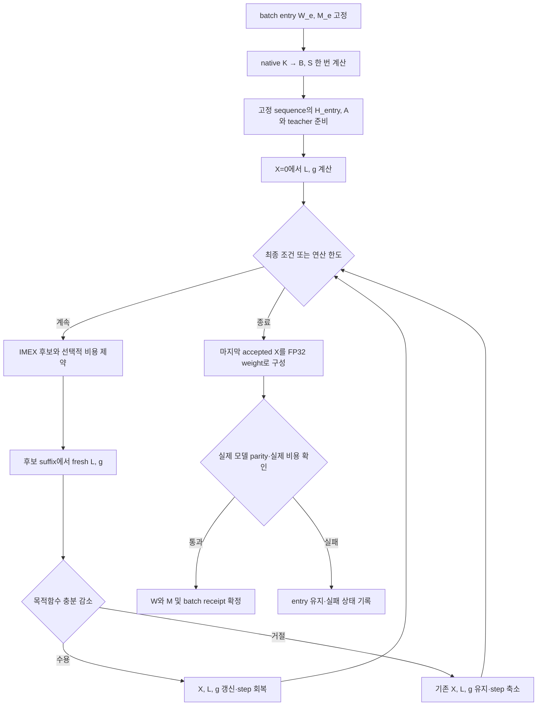

# Single-Layer Write-Coupled z-Flow: 실행 파이프라인 v1

작성: 2026-09-16. 근거: [설계 리뷰](/mnt/raid5/janghj/ODE-edit/audits/global/2026-09-16-single-layer-zflow-design-review-ko.md). 범위: method와 실행 계약의 구체화, CPU 참조 구현. 실제 Llama/GPU adapter와 과학 실험의 완료를 뜻하지 않는다.

## 1. 이번에 고정하는 방법

하나의 L4 down-projection에 대해 batch-entry에서 native writer map B를 한 번 만든다. X=0부터 시작해 실제 W_e+XB의 edit loss와 write 비용을 함께 최적화한다. 후보는 weight를 덮어쓰지 않고 정확한 single-layer affine cut을 통해 평가한다. 마지막 accepted X만 weight와 history에 확정한다.

**Main v1은 양의 write 비용을 갖는 barrier-off flow다.** Barrier는 같은 알고리즘의 선택 설정이다. `fixed`는 최종 cost cap, `exponential`은 cap에 접근하는 속도까지 제어한다. 이렇게 두면 barrier의 이득과 추가 모델 연산을 분리할 수 있다. 기존 MPES/L4-only/REFIT4 evidence는 개발 근거로 재사용하며 motivation 실험을 새 선행조건으로 추가하지 않는다.

Flow가 찾는 것은 native writer 공간에서의 actual-write trade-off endpoint다. 기존 Adam trajectory 위에서 시간 하나를 선택하는 방법으로 정의하지 않는다. ODE를 적분하는 과정에도 fresh gradient가 필요하며, 유한 endpoint와 보존 효과는 목적함수·비용·종료 정책의 결과다.

## 2. 좌표, 입력, 소유 상태

물리적 parameter는 `model.layers.4.mlp.down_proj.weight` 하나다. H라는 이름의 hidden cache와 metric을 혼동하지 않도록 구현에서는 `h_entry`와 `geom.h`를 구분한다.

| 기호/데이터 | shape | 의미·변경 시점 |
|---|---|---|
| W_e | d_out × d_in | 이번 batch의 실제 entry weight, inner loop 불변 |
| P | d_in × d_in | pretrained preservation projector, 물리 layer binding 확인 |
| M_e | d_in × d_in | entry history Gram, inner loop 불변 |
| K | d_in × q | native 규칙으로 평균한 이번 request key |
| E | m × q | residual expansion, pinned BLUE는 q=m/E=I |
| B | m × d_in | native fixed right factor, batch당 한 번 |
| S | m × m | 실제 write의 quadratic cost Gram |
| X | d_out × m | 유일한 flow state, X_0=0 |
| H_p,e | tokens × d_out | 고정 sequence의 entry L4 block output |
| A_p | tokens × m | K_p^T B^T, prefix cache 준비 후 불변 |
| teacher | selected positions × vocab | entry essence log-probability, 한 번 계산 |

수학 표기 H_p(X)=H_p,e+XA_p는 hidden×token 배치이며 코드에서는 H_p,e+A_p X^T의 token×hidden 배치를 쓴다. desired target Z=H_c,e+X와 실제 canonical hidden H_c,e+XBK_c를 구분한다.

### Batch input 계약

- 고정된 request ID/order, subject/relation, target_new token IDs.
- 기존 BLUE rewriting context snapshot 및 context group 순서.
- native canonical key/readout prompt와 teacher-forced training prompt의 구분.
- 원 tokenizer revision, special-token 처리, padding/attention mask, position_ids/cache_position/RoPE.
- W_e/M_e/P 및 source/config fingerprint.
- method settings와 batch_id. 서로 다른 entry의 미래 z/cache를 혼용하지 않는다.

Teacher-forced sequence를 구성할 때 target IDs[:-1]를 native 방식으로 decode하여 prompt에 붙이는 절차까지 보존한다. 문자열 prefix가 같아 보여도 token-ID prefix가 같다고 가정하지 않는다.

## 3. 단계 P0 — entry 고정과 transaction 시작

입력은 현재 sequential chain의 W_e/M_e다. 다른 parameter는 frozen이고 모델은 eval mode다. Inner optimizer는 모델 parameter나 history를 수정하지 않는다.

1. batch_id와 entry W/M fingerprint를 확보한다.
2. entry snapshot을 보존한다.
3. 수정 가능한 물리 layer가 L4 하나인지 확인한다.
4. config를 **첫 expensive oracle 전에** 검사한다.
5. 같은 batch_id가 이미 확정됐으면 receipt와 payload identity를 확인한다. 동일 재시도는 append하지 않는다. 다른 payload는 conflict다.

Scientific runtime에서는 durable checkpoint receipt가 필요하다. CPU transaction은 프로세스 안의 참조 계약만 구현한다.

## 4. 단계 P1 — native writer geometry 한 번 준비

\[
N=P(KK^\top+M_e)+\lambda_{write}I,\qquad
D=\operatorname{solve}(N,PK),\qquad B=ED^\top.
\]

\[
S=\frac{BM_eB^\top+\lambda_{write}BB^\top}{m}.
\]

- `lambda_write=1`은 pinned BLUE writer의 ridge다.
- `lambda_flow`는 뒤에서 edit loss와 cost를 교환하는 계수다. 두 값을 혼동하지 않는다.
- N은 일반적으로 비대칭이다. 임의 symmetrization/Cholesky 전환은 하지 않는다.
- pinned compute_ks는 context group 안 평균 후 group 간 평균을 낸다. Clean 1개와 generated 5개의 기본 구성에서 key 가중치는 clean 1/2, generated 각 1/10이다.
- Edit NLL의 context 가중치는 여섯 개 각각 1/6이다. Key 평균과 loss 평균은 별개의 규칙이다.
- S는 수학적으로 PSD이고, eigen decomposition을 한 번 수행한다. Metric H=S+epsilon I, epsilon=1e-3×mean(eigenvalues(S))를 reference 설정으로 둔다.
- B가 만드는 모든 write가 0인 degenerate geometry는 no-edit/typed failure로 처리한다. X만 크게 만들어 진행하지 않는다.

이번 단계는 native z fitting을 호출하지 않는다. Native endpoint cost나 j_native를 얻기 위한 선행 fit도 없다.

## 5. 단계 P2 — exact affine cache와 고정 teacher

### 5.1 Cache 준비

고정 training sequence별로 prefix를 한 번 계산하여 다음을 얻는다.

\[
K_p=\text{L4 down-projection input},\quad
H_{p,e}=\text{entry L4 block output},\quad A_p=BK_p.
\]

그 뒤 raw K_p는 해제하고 H_p,e와 A_p를 보관할 수 있다. Context 및 target token을 포함한 **모든 token**에 대해 준비한다.

후보 X에서의 oracle input은

\[
H_p(X)=H_{p,e}+XA_p.
\]

L5–31은 nonlinear suffix로 매 query마다 새로 계산한다. Downstream KV cache를 재사용하지 않는다. 생성 sequence의 token이 바뀌면 이 cache를 재사용하지 않는다.

### 5.2 Loss 위치와 weight

각 request i, context c, target token j의 CE 계수는

\[
w_{icj}=1/(m c_i T_i).
\]

이 전역 weight를 cache metadata에 넣는다. Microbatch loss를 다시 평균하지 않는다. Microbatch partition을 바꿔도 같은 objective/gradient가 나와야 한다.

실제 Llama adapter는 suffix hidden에서 필요한 prediction/KL 위치를 모은 뒤 full-vocabulary head를 적용한다. 전체 attention 계산은 유지한다. CPU callback 참조는 full logits를 반환하므로 이 head 절감이 구현됐다고 간주하지 않는다.

### 5.3 Essence teacher

Native request-derived `{} is a` prompt와 lookup 위치를 사용한다. Teacher는 entry에서 한 번 계산한다. KL 방향은 source와 같은

\[
L_{essence}=\frac1m\sum_i D_{KL}(p_i(X)\Vert p_i(0))
\]

이며 beta=.0625다. Strict edit-only 설정은 beta=0으로 별도 명시한다. Teacher 생성 forward는 별도 준비 비용으로 기록한다. Initial X=0에서 KL와 gradient가 0이라는 사실을 이용한 pass fusion은 이후 runtime 최적화이며 참조 구현에 자동 적용됐다고 세지 않는다.

## 6. 단계 P3 — expensive oracle와 저렴한 flow step

### 6.1 Oracle의 정확한 의미

`oracle(X) -> (L, g_X)`

\[
L=L_{edit}+\beta L_{essence},\quad
g_X=\sum_p G_p A_p^\top.
\]

전체 request/context를 논리적으로 한 번 순회한다. Microbatch마다 graph를 해제하면서 full X gradient를 누적한다. 비용 C의 gradient는 이 oracle에 포함하지 않는다.

Frozen suffix parameter도 X에 대한 input gradient를 전달해야 한다. 모델 parameter의 `.grad`를 만들 필요는 없다. Subject-only intervention이나 request별 column freeze는 사용하지 않는다.

### 6.2 Objective와 step

\[
C(X)=\tfrac12\operatorname{tr}(XSX^\top),\quad
F=L+\lambda_{flow}C.
\]

\[
\dot X=-(g_X+\lambda_{flow}XS)H^{-1},\quad
Y=(XH-\eta g_X)(H+\eta\lambda_{flow}S)^{-1}.
\]

S/H의 spectral basis에서 division/solve로 처리한다. 전체 model Hessian, HVP, nested native-z optimizer는 필요하지 않다.

### 6.3 수용/거절과 step 정책

1. X=0에서 L/g를 계산한다.
2. 현재 g로 candidate를 계산한다. 모델 호출 0회.
3. Candidate에서 fresh L/g를 한 번 계산한다.
4. F_new <= F_old − c_A ||Y−X||_H^2/eta 조건을 확인한다. Floating-point 허용오차도 기록한다.
5. 수용하면 X/L/g를 함께 carry한다. 같은 node gradient를 재계산하지 않는다.
6. 거절하면 X/L/g를 그대로 두고 eta를 1/2로 줄인다. 거절한 F+B도 비용이다.
7. 두 번 연속 clean accept 이후 eta를 1.5배 회복하되 eta_max를 넘지 않는다. Rejection 시 연속 accept count를 초기화한다.

Clean accept는 F 감소가 현재 floating-point rounding 허용폭보다 큰 경우다. 감소가 그 폭 안에 있으면 step 회복 count를 초기화한다. 이 영역에서는 이미 계산한 candidate gradient의 최종-set residual이 max(이전 residual, 종료 threshold)를 넘는 후보도 거절한다. Rounding만으로 step 회복 후 residual이 증폭되는 일을 막는 numerical guard이며 추가 model 호출은 없다. Trace에 `roundoff_limited`를 남긴다.

Reference 설정은 eta_0=1, eta_max=1이다. 초기 rejection으로 축소된 step을 회복하는 정책이며 native 최대보다 큰 step의 이득을 미리 가정하지 않는다. Eta_max 변경은 config로 기록한다.

## 7. 선택적 barrier — 세 가지 의미를 분리

| mode | 후보 제약 | 역할 |
|---|---|---|
| off | 없음 | lambda_flow C에 의한 soft trade-off |
| fixed | C(Y)<=b | 최종 cost budget을 직접 강제 |
| exponential | C(Y)<=C(X)+(1-exp(-kappa eta))(b-C(X)) | budget과 접근 속도 제어 |

Fixed/exponential 모두 unconstrained Y가 feasible이면 그대로 사용한다. 아니면 lambda_flow를 lambda_flow+nu로 바꾸고 nonnegative scalar nu를 찾아 constraint를 만족시킨다. Model forward/backward는 추가되지 않는다.

Exponential mode는 경계 상대 slack delta까지 필요한 pseudo-time이 최소 log(1/delta)/kappa라는 구조를 갖는다. Kappa=1은 reference 값이며 25회 내 수렴을 보장하지 않는다. Fixed cap과 비교하여 guidance의 이득과 추가 NFE를 확인한다.

**b는 전체 모델 locality budget이 아니라 이번 batch의 geometric write budget이다.** Native endpoint를 먼저 fit해서 b를 정하지 않는다. b=0은 명시적인 no-edit 정책으로 분리하며, positive-budget solver에 억지로 넣지 않는다.

## 8. 단계 P4 — endpoint와 종료 상태

Barrier off에서는 ||g+lambda_flow XS||_{H^-1}를 확인한다. Barrier on에서는 최종 집합 C<=b의 KKT 조건을 확인한다. Exponential step의 임시 cap에 붙었다는 이유로 종료하지 않는다.

작은 b에서 발생했던 오류를 방지하려면:

- active boundary는 상대 slack (b−C)/b로 판정한다.
- feasibility도 b에 대한 상대 위반으로 기록한다.
- reference complementarity score는 nu/max(1,nu) × abs((b−C)/b)다. Multiplier의 기준값 1은 선언한 loss/cost 단위의 reference scale이며 모든 목적함수 재스케일링에 대한 불변성을 주장하지 않는다. Raw nu×abs(b−C)도 함께 남긴다.
- 최종 raw/normalized 수치를 모두 기록하여 tolerance가 무엇을 의미하는지 확인할 수 있게 한다.

| solver 상태 | 의미 | 기본 terminal 정책 |
|---|---|---|
| FIRST_ORDER_STATIONARY | 선언한 reduced-space 1차 조건을 만족 | accepted state materialization 진행 |
| RESOURCE_STOP | oracle budget 소진 | 마지막 accepted state materialization 진행, 수렴으로 표시하지 않음 |
| NUMERICAL_STOP | 유한 step/계산에서 더 진행하기 어려움 | 마지막 accepted state가 있으면 parity 후 확정 가능, 수치 종료 표시 유지 |
| 설정/초기 oracle 실패 | 유효한 초기 상태/목적함수가 없음 | batch 미확정 |

Accepted step이 0회면 이번 batch의 새 edit를 확정하지 않고 `NO_ACCEPTED_UPDATE`로 기록한다. History를 자동으로 추가하지 않는다. X=0에서 이미 목적함수가 stationary인 경우도 이 규칙을 적용한다. 다른 정책이 필요하면 명시적인 history-only mode로 구분한다.

No-update 요청도 평가의 원 분모에 남긴다. Sequential runner가 다음 batch로 계속 진행한다면 W/M가 바뀌지 않은 no-op attempt receipt를 남겨 누락과 구분한다. 이를 successful edit나 history-append commit으로 집계하지 않는다.

FIRST_ORDER_STATIONARY는 local minimum, global optimality, RS/PS 성공의 인증이 아니다. Lambda=0이고 barrier off인 confidence-only ablation은 finite optimum이 없을 수 있으므로 main 설정과 구분한다.

## 9. 단계 P5 — materialization, parity, commit

### 9.1 실제 후보 만들기

\[
W_c=\operatorname{FP32}(W_e+XB),\quad
\Delta W_{actual}=\operatorname{FP64}(W_c)-\operatorname{FP64}(W_e).
\]

Cache algebra의 C(X) 외에 저장되는 두 FP32 weight의 차이를 FP64로 계산한 actual delta로도 cost를 측정한다. 차이를 다시 FP32로 반올림해 비용 정보를 잃지 않는다. B/S의 수치 경로와 actual dense write는 별개의 확인 대상이다. CPU demo는 FP64 X/B를 commit 입력에서 FP32로 변환하며 그 차이까지 terminal parity에 포함한다.

### 9.2 Terminal parity

Entry 상태를 보존한 functional/full-model 경로에서 W_c를 평가한다. Cached suffix와 full actual-write의 logits/NLL 차이를 확인한다. Tight barrier라면 actual delta cost가 b를 넘지 않는지도 확인한다. 실제 Llama의 tolerance는 pinned dtype/backend에서 확인하고 봉인하며, CPU 예제의 허용오차를 자동으로 GPU 기준으로 삼지 않는다.

Parity 실패 시 `COMMIT_PARITY_FAIL`, 실제 cost 초과 시 `COMMIT_COST_FAIL`로 batch를 미확정한다. Native25 warm-start나 다른 후보를 자동 생성해 성공처럼 대체하지 않는다. 추가 복구 정책이 있으면 별도 algorithm 설정과 추가 비용으로 기록한다.

### 9.3 History와 durable receipt

통과하면 이번 native key K에 대해

\[
M_{next}=M_e+K K^\top
\]

를 native CPU FP32 순서로 한 번 계산한다. Inner 후보/거절 단계 history append는 0회다.

실제 scientific runtime에서는 W_c/M_next/config/batch_id/parent receipt를 하나의 immutable checkpoint bundle로 저장하고 manifest 및 hashes를 마지막에 확정한다. 임시 디렉터리에 완성 후 같은 filesystem의 atomic publish/rename을 commit point로 삼는다. 재시작은 complete manifest만 읽는다. Commit 이후 동일 batch ID 재요청은 receipt를 반환하며 append하지 않는다. 다음 batch는 이 확정 bundle에서 출발한다.

CPU `InMemoryBatchTransaction`은 memory에서 같은 순서와 idempotency를 시험한다. 프로세스 crash, 파일 저장, fsync, GPU pointer 복원을 구현한 것으로 주장하지 않는다.

## 10. 설정을 구체적으로 고정하는 방법

실행 가능한 [reference 설정](/mnt/raid5/janghj/ODE-edit/plans/global/2026-09-16-single-layer-zflow-contract-v1.json)을 둔다.

| 설정 | Reference 값 | 성격 |
|---|---:|---|
| physical_layer | 4 | 기존 실험 기반 |
| lambda_write | 1 | pinned native writer |
| beta_essence | .0625 | inherited KL, 방향 p_current||p_entry |
| lambda_flow | 1 | **미튜닝 working setting**, 최적값/성과 주장 없음 |
| metric relative damping | 1e-3 | 수치·경로 설정 |
| eta_initial/max | 1/1 | rejection 후 회복 가능한 step |
| step_growth / clean accepts | 1.5 / 2 | 회복 규칙 |
| max_oracle_calls | 25 | 초기 complete-sweep 한도, 수렴 목표와 구분 |
| barrier_mode | off | main working setting |
| cost_budget | null | barrier 사용 시 양수 명시 필요 |
| kappa | 1 | exponential 사용 시에만 의미 있음 |

Lambda_flow=1은 raw cost 단위를 선언한 provisional 값이다. Native endpoint로 정규화한 값이 아니며 좋은 trade-off를 보장하지 않는다. 개발 결과를 보고 바꿀 수 있지만, 고정된 scientific comparison 안에서 evaluator N/PS를 보고 batch별로 조정하지 않는다. Lambda/b sweep를 매 candidate마다 수행하는 online method도 아니다.

25 oracle는 native 25 forward/24 backward와 정확한 work-equivalence가 아니다. 새 oracle는 전체 m의 sweep이고 마지막 후보 backward도 포함한다. 모든 결과에 실제 token/forward/backward counts를 제공한다.

## 11. 비용 장부

| 구간 | 준비/반복 횟수 | 기록할 것 |
|---|---|---|
| K 준비 | batch당 1 논리 준비 | native contexts/token F |
| B/S/eigen | batch당 1 | solve/eigen 시간, spectrum, memory |
| prefix cache | sequence당 1 | prefix F token, cache bytes |
| teacher | entry당 1 | suffix F token, vocab-head work |
| initial oracle | 1 | logical F+B sweep 및 microbatch 수 |
| candidate oracle | accepted+rejected | suffix F/B token, 유효/padded token |
| barrier algebra | proposal마다 | scalar iterations, CPU/GPU sync 시간 |
| terminal parity | 마지막 후보 1 | full actual-write F 및 비교 시간 |
| commit/history/save | 성공 batch당 1 | actual delta norm/cost, append count, 저장 시간 |

N_oracle=1+accepted+rejected를 invariant로 둔다. Teacher, prefix, parity는 이 숫자 밖의 비용이므로 별도로 더한다. Forward-only screen은 v1 기본 primitive가 아니다. 추가할 경우 accepted 후보 backward 재실행까지 별도 계수한다.

기존 L4-only에서 target이 편집 시간의 96.753%였다는 사실을 고려하면 fixed solve 재사용보다 suffix NFE와 token work 감소가 주된 효율 평가 대상이다. L4 prefix caching은 기존에 없던 prefix backward 제거를 주장하지 않는다.

## 12. 구현 산출물과 다음 연결 지점

새 namespace는 [single_layer_zflow](/mnt/raid5/janghj/ODE-edit/project/run_scripts/single_layer_zflow/README.md)다.

- flow_core.py: native map, cost/metric, IMEX, barrier modes, 종료, gradient carry.
- oracle.py: 명시적 전역 weights를 가진 all-token affine cache와 suffix callback.
- transaction.py: CPU FP32 materialization, parity/cost 검사, memory 내 history exactly-once.
- demo.py: nonlinear toy suffix를 연결한 end-to-end CPU 예제와 JSON receipt.
- tests/: tiny budget 종료, 수용/거절, weighted gradient/cache parity, commit/history 회귀 검사.

다음 실제 모델 연결은 native context/key extractor, Llama prefix/suffix adapter, durable checkpoint writer다. 이 세 부분을 CPU toy로 검증 완료했다고 쓰지 않는다. 기술 parity 점검은 구현 correctness 확인이며 새로운 motivation gate가 아니다.

과학 비교에서는 기존 L4-only를 기준으로 같은 B/L/C/cache를 쓰는 Adam과 IMEX, IMEX barrier off/on을 구분한다. 이 비교의 목적은 actual-write objective와 integrator/barrier의 기여를 분리하는 것이다. 기존 broad evidence를 매번 다시 생성할 필요는 없다.
