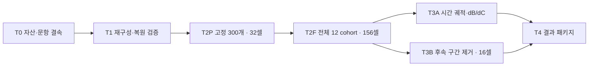

**과거 update 시간축 실험 설계 v1 — 2026-09-24**

기존 BASE_ALPHAEDIT·BASE_MEMIT에서 **과거 사실의 유지와 그 사실의 기록에 참여한 전체 구간 update의 기여 유지**를 분리한다. 단층·다층 및 allocation 분석은 제외했다.

**바로 읽을 문서**

- [실험 설계](design-ko.md): 연구 질문, 실제 표본, 156셀, 해석·통계·후속 16셀.
- [runner 구현 명세](runner-contract-ko.md): 원본 evaluator, 제거·복원, 수치 gate, resource, 저장 interface.
- [machine-readable 계약](experiment-contract.json), [단계 DAG](execution-dag.json), [행 schema](measurement.schema.json).
- [산출 개수](plan-summary.json), [설계 파일 검증](design-validation.json).



gate는 자산·수치·완결성을 확인한다. 유효한 음성 결과는 통과다. 기존 E3의 결과는 dependency가 아니다.

**이미 구체화한 표와 입력**

| 파일 | 내용 |
|---|---|
| [fact-ledger.csv](fact-ledger.csv) | 실제 10,000 case ID, 삽입 시점, 구간, target version 및 충돌·검열 flag |
| [cohorts.csv](cohorts.csv) | 12개 구간, 요청 수, active 분모, 이후 관찰 수 |
| [pilot-panel.csv](pilot-panel.csv), [pilot-cells.csv](pilot-cells.csv) | 결과와 무관하게 고정한 300개 문항과 32셀 |
| [main-cells.csv](main-cells.csv) | 두 BASE 합계 156개 비교 셀과 M/B의 state ID |
| [pair-candidates.csv](pair-candidates.csv), [pair-cells.csv](pair-cells.csv) | 후속 구간의 메타데이터 노출량 및 선택된 16개 개입 |
| [state-bank.csv](state-bank.csv), [score-tasks.csv](score-tasks.csv) | parameter 상태와 각 상태에서 실제로 평가할 cohort 패널을 구분 |
| [fidelity-panel.csv](fidelity-panel.csv) | 결과를 보기 전에 고정한 재구성 검증 문항 |
| [asset-bindings.json](asset-bindings.json), [checkpoint-bindings.csv](checkpoint-bindings.csv) | BASE lineage와 checkpoint의 기록 hash·위치 |
| [checkpoint-tensor-hashes.csv](checkpoint-tensor-hashes.csv), [source-receipts.json](source-receipts.json) | 저장 weight hash, 실제 확인한 데이터·코드 hash |
| [source-evidence/](source-evidence/) | 실제 실행 lock과 hash가 일치하는 evaluator 소스 4개 |

고정 dataset과 순서는 로컬 파일을 rehash했다. 24개 checkpoint의 원격 이관 경로는 기존 기록으로 확인했지만 현재 이 작업 환경에는 tensor가 연결돼 있지 않다. raw model payload 재검증, token manifest, GPU endpoint fidelity는 실행 단계에 남아 있다.

주 측정은 `M_t=m(θ_t)`, `B_t=m(θ_t−U)`, `C_t=M_t−B_t`와 `ΔM=ΔB+ΔC`다. 주 threshold는 0.10 nats/target-token이고 0.025/0.05/0.10/0.20 민감도를 함께 낸다. 표는 유지/상실×기여 감소/안정/증가다. 과거 기록 전체 U를 제거하며 개별 사실의 독립 update나 지식 trace 자체를 식별했다고 하지 않는다.

전체 156셀은 333,600 prompt×time 행이다. 새 단일 제거 parameter 상태는 132개, 후속 쌍 제거 단계에서 추가 상태는 16개다. score 재사용 전 full grid의 target sequence 상한은 약 133만 개, pair 단계는 추가 최대 19.2만 개다. 이는 모델 forward 호출 수나 GPU 시간 추정치가 아니다. 실제 시간은 pilot에서 측정한다.

**재생성과 검증**

아래 명령은 모델·GPU·scheduler를 사용하지 않는다. 기존 로컬 metadata와 dataset으로 설계 표를 다시 만든다. `build_plan.py`는 이 폴더의 생성 CSV/JSON을 덮어쓰므로 수정한 설계는 새 version 폴더에 보존한다. 문서·계약은 자동 수정하지 않는다.

```bash
python3 plans/global/2026-09-24-historical-update-timeaxis-v1/build_plan.py
python3 plans/global/2026-09-24-historical-update-timeaxis-v1/validate_plan.py
```

검증은 셀·state 식·문항 결속·DAG의 일관성을 확인하며, LLM 실험 통과를 뜻하지 않는다. 기존 BASE의 행동 결과는 이전 검토에서 이미 알려져 있다. 이번 설계는 **새 C 측정 결과를 보기 전에 분석 규칙과 표본을 고정한 것**이며 외부 기관에 독립 사전등록한 실험이라고 하지 않는다.

GPU runner는 아직 구현하지 않았다. 이번에 모델 forward·CPU toy gate·실험 제출·GH/SH4 지시 변경·모니터링 재개는 하지 않았다.
