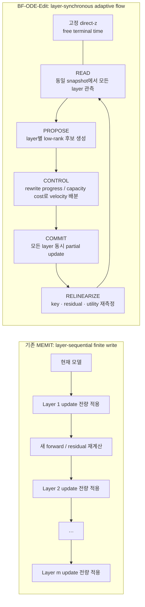
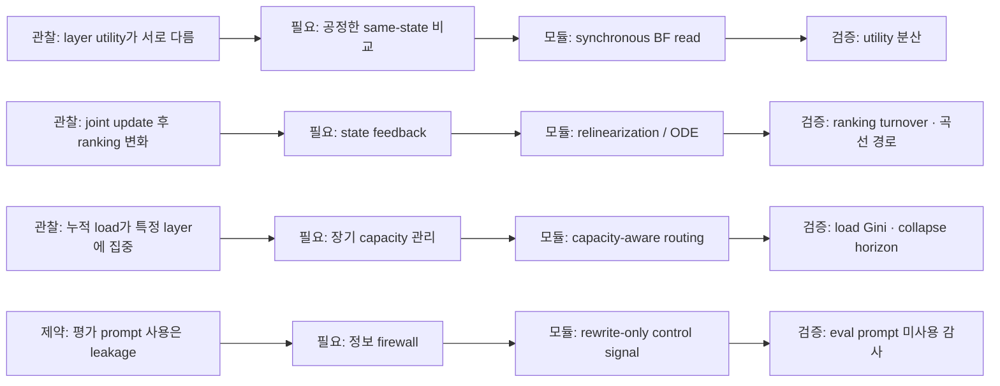

# BF-ODE-Edit

## Layer-Synchronous Capacity-Aware Flow for Robust Sequential Knowledge Editing

**연구 제안서 · Research Proposal Report**

> **핵심 명제**
> Locate-then-edit가 현재 모델에서 계산한 layer별 low-rank update는 유일한 최종 해가 아니라, 동일한 direct-z를 실현할 수 있는 여러 local actuator다. 이 actuator들을 layer 순서대로 전량 적용하는 대신, 동일한 모델 상태에서 함께 평가하고 rewrite progress 대비 누적 capacity cost가 낮은 layer로 write를 재배분하면 더 안정적인 parameter realization을 선택할 수 있다.

| 항목 | 내용 |
|---|---|
| 문서 상태 | Concept proposal; empirical validation pending |
| 기준일 | 2026년 7월 30일 |
| 문헌 범위 | 2026년 7월까지 |
| 1차 적용 대상 | MEMIT |
| 2차 확장 | AlphaEdit null-space proposal |
| 핵심 평가 시나리오 | CounterFact atomic sequential editing, 10K–full stream |
| Edit-time 정보 정책 | rewrite prompt + MEMIT 5-prefix만 허용; 평가 prompt는 완전 분리 |
| 작업명 | BF-ODE-Edit / Layer-Synchronous Edit Flow |

**한 문장 요약:** one-shot finite edit를 작은 step으로 단순 분할하는 것이 아니라, parameter-space edit trajectory의 각 intermediate state에서 layer별 low-rank proposal과 velocity를 다시 계산하는 state-dependent ODE로 재정식화한다.

---

# Executive Summary

본 제안의 출발점은 locate-then-edit가 현재 model state에서 계산한 local low-rank solution을 finite weight jump로 한 번에 실행한다는 데 있다. Direct-z와 layer별 write는 계산 당시의 key·residual·downstream activation에 의존하지만, 여러 layer에 finite update가 들어가는 순간 이 상태들이 변한다. 따라서 지식 편집의 기본 객체를 one-shot update ΔW가 아니라, 중간 모델 상태를 따라 진행되는 parameter-space edit trajectory W(t)로 재정의한다.

이 trajectory를 생성하는 ODE는 각 intermediate state에서 editor proposal을 다시 계산하는 state-dependent edit flow다. 모든 edit layer의 low-rank proposal을 동일 snapshot에서 생성하고, 허용된 rewrite context만으로 순간 utility를 측정하며, MEMIT covariance·weight norm·AlphaEdit null-space와 같은 editor-native geometry에 따라 layer별 velocity를 반복적으로 재배분한다. 동일한 direct-z가 유일한 parameter endpoint를 정하지 않기 때문에, 이 flow는 같은 semantic goal을 더 낮은 누적 capacity cost로 실현하는 parameter path를 탐색할 수 있다.

본 문서에서 W(t)는 parameter-space edit trajectory, 이를 생성하는 state-dependent dynamics는 edit flow, 수치 적분으로 얻는 W⁽⁰⁾,…,W⁽ˢ⁾는 integration waypoints 또는 intermediate edit states라 부른다. Waypoint를 많이 만드는 것 자체가 기여는 아니다. 고정 update를 K등분해 모두 적용하면 기존 editor와 동일한 endpoint에 도달한다. BF-ODE-Edit은 waypoint마다 key, residual, proposal direction, layer utility, capacity slack을 재평가하고 rewrite goal의 first-hitting state에서 적분을 종료한다.

### 핵심 용어

- **Edit trajectory**: 출발 모델에서 terminal edited model까지 이어지는 weight-space 해 곡선 $W(t)$.
- **Edit flow**: trajectory를 생성하는 state-dependent ODE $\dot W=F(W,Z)$.
- **Intermediate edit state / waypoint**: numerical integrator가 실제로 방문하는 $W^{(0)},W^{(1)},\ldots$.
- **Direct-z**: 초기 연구에서 고정하는 semantic activation goal. ODE가 직접 진화시키는 상태는 direct-z가 아니라 editable weights다.

| **항목**      | **제안 요약**                                                                                                            |
|---------------|--------------------------------------------------------------------------------------------------------------------------|
| **문제**      | 순차 full-write가 동일 layer 집합에 편집 부하를 반복 집중시키고, state 변화 후의 layer utility를 재평가하지 않음         |
| **Insight**   | direct-z는 semantic goal이며, 이를 구현하는 parameter solution은 다수 존재함                                             |
| **Method**    | same-snapshot BF proposal + rewrite-only utility + capacity-aware routing + relinearization + free terminal time         |
| **정보 제약** | CounterFact의 paraphrase·neighborhood·downstream prompt는 edit time에 사용하지 않음                                      |
| **1차 검증**  | MEMIT 기반 atomic sequential editing; 이후 AlphaEdit의 null-space proposal로 확장                                        |
| **성공 조건** | dynamic relinearization이 best static layer scaling 및 AlphaEdit+NAS 등 강한 baseline을 장기 성능/계산 frontier에서 능가 |


> **가장 중요한 falsification condition**  
> Static layer-wise scaling αₗ이 동일한 결과를 내거나, partial update 뒤 layer utility ranking이 거의 변하지 않는다면 ODE는 불필요하다. 이 경우 연구는 static capacity-aware routing으로 pivot해야 한다.


## 목차

- 1. Motivation: One-Shot Edit에서 State-Dependent Flow로

- 2. Problem Formulation: 정보 firewall과 연구 범위

- 3. Core Insight: direct-z, actuator, 그리고 세 비교 축

- 4. Naive Baseline과 대안가설

- 5. Proposed Method: BF-ODE-Edit

- 6. Barrier의 재해석과 AlphaEdit 확장

- 7. 이론적 성질과 검증 가능한 명제

- 8. 연구 질문, 가설, 실험 설계

- 9. Ablation·공정 비교·성공 기준

- 10. Expected Contribution과 paper narrative

- 11. 위험 요인, pivot 조건, 실행 계획

- 참고문헌

# 1 Motivation: One-Shot Edit에서 State-Dependent Flow로

## 1.1 One-shot finite jump와 local linearization gap

기존 locate-then-edit editor는 현재 모델 W₀에서 direct-z와 layer별 low-rank update를 계산한 뒤, 이를 finite jump로 commit한다. 그러나 이 update는 W₀에서 관측한 key, residual, downstream activation에 기반한 local prescription이다. Transformer의 여러 layer를 유한한 크기로 동시에 또는 순차 변경하면 이후 key와 top-layer activation이 달라지므로, 초기 proposal은 이동 도중 빠르게 stale해질 수 있다.


$$
W(0)=W_0,\qquad W(1)=W_0+\sum_l \Delta W_l(W_0,Z)
$$


따라서 자연스러운 연구 대상은 출발점과 endpoint만이 아니라 그 사이의 연속적인 model path다. Parameter-space edit trajectory W(t)를 따라 현재 state에서 유효한 editor proposal을 velocity field로 정의하고, 작은 적분 step 뒤 그 field를 다시 계산한다.


$$
\frac{dW_l(t)}{dt}=F_l(W(t),Z),\qquad W(0)=W_0
$$


수치적으로는 W⁽⁰⁾,W⁽¹⁾,…의 intermediate edit state를 따라 이동한다. 이때 작은 step의 역할은 update magnitude를 단순 분할하는 것이 아니라, 각 waypoint에서 local linearization의 유효성을 회복하는 것이다. 즉 ODE의 핵심은 trajectory discretization이 아니라 state-dependent relinearization이다.


$$
W_l^{(s+1)}=W_l^{(s)}+h_s v_l^{(s)}B_l(W^{(s)},Z)
$$


고정된 Bₗ을 여러 step으로 나누고 누적 coefficient를 동일하게 만들면 endpoint는 one-shot editor와 같다. 따라서 이후의 breadth-first scheduling, adaptive layer velocity, capacity-aware stopping은 ODE 표현에 덧붙인 선택적 장식이 아니라, vector field를 실제로 state-dependent하게 만들어 다른 edit trajectory와 endpoint를 생성하기 위한 필수 조건이다.

## 1.2 Locate-then-edit의 기본 구조

ROME과 MEMIT은 transformer MLP를 key-value memory로 해석하고, factual recall에 관여하는 middle-layer MLP weight를 직접 수정한다. MEMIT은 먼저 마지막 critical layer L에서 hidden intervention target zᵢ를 gradient descent로 계산한 뒤, edit layer 집합 𝓡을 ascending order로 방문한다. 현재 layer l에서는 변경된 모델을 다시 forward하여 key Kˡ와 마지막 layer activation hᴸ를 수집하고, 남은 direct-z residual을 남은 layer 수로 균등 분배한다. [1][2]


$$
r_i^l=\frac{z_i-h_i^L}{L-l+1}
$$


$$
\Delta W^l=R^l(K^l)^\top\left[C^l+K^l(K^l)^\top\right]^{-1}
$$


MEMIT은 앞 layer update가 downstream activation을 바꾸므로 각 layer 사이에서 residual을 재계산한다. 따라서 완전한 open-loop는 아니다. 그러나 각 layer에 할당된 update를 한 번에 commit하고, 이후의 joint state에서 앞 layer를 다시 비교하지 않는다는 점에서 layer-axis block Gauss-Seidel 또는 sequential full-write에 가깝다.

## 1.3 Sequential editing에서 관찰된 장기 실패

ROME과 MEMIT을 동일 모델에 반복 적용하면 과거 edit retention과 downstream 성능이 점진적으로 떨어지다가 특정 시점에서 급격히 붕괴할 수 있다. 초기 연구는 이러한 gradual/catastrophic forgetting과 edited weight의 원본 대비 거리 증가를 함께 보고했다. [10]

ENCORE는 direct-z optimization의 과도한 confidence와 edited matrix norm 증가를 핵심 원인으로 분석하고, most-probable early stopping과 Frobenius-norm constraint를 결합해 10,000 sequential edits에서 downstream 성능 보존을 목표로 했다. [7] Norm-Anchor Scaling(NAS)은 더 긴 horizon에서 norm explosion과 collapse의 강한 상관을 분석하고, write magnitude를 base-model anchor에 맞춰 rescale하는 간단한 plug-in으로 full CounterFact stream까지 안정성을 확장했다. [9]

이 결과들은 “update magnitude 제어”가 중요함을 보여주지만, 어느 layer가 현재 edit를 얼마나 담당해야 하는가라는 cross-layer allocation 문제는 별도로 남는다. 모든 layer를 동일 비율로 줄이는 scaling이나 특정 layer update를 clamp하는 방식은 억제된 edit progress를 다른 layer로 넘기지 못한다.

## 1.4 Breadth-first insight의 layer-axis 이전

Fine-tuning Done Right in Model Editing은 sample 하나를 수렴시킨 뒤 다음 sample로 넘어가는 depth-first pipeline과, 전체 edit dataset을 epoch 단위로 반복하는 breadth-first pipeline을 구분하고, 후자가 over-optimization과 interference를 완화할 수 있음을 보였다. [4] 본 제안은 이 스케줄링 원리를 sample 축이 아니라 edit-layer 축으로 이전한다.


> **용어상의 구분**  
> 인용 논문의 breadth-first는 edit sample/epoch 축이다. BF-ODE-Edit의 breadth-first는 하나의 edit request 내부에서 여러 editable layer를 동일 snapshot에서 읽고 동시에 partial update하는 layer-actuator 축이다. 두 방법은 아이디어의 원리는 공유하지만 알고리즘적 축은 다르다.


## 1.5 ODE를 쓰는 이유: 작은 step이 아니라 state-dependent flow

초기 motivation은 one-shot weight jump를 연속적인 edit trajectory로 바꾸는 것이다. ODESteer와 ODE-Merge가 주는 공통 교훈은 이 trajectory를 단순히 여러 step으로 나누는 것이 아니라, 현재 state에서 velocity를 다시 계산하는 feedback vector field로 만들어야 한다는 점이다. ODESteer는 activation state에 따라 desirability gradient를 재평가하며, ODE-M은 목표 모델 방향을 유지하되 현재 calibration loss를 높이는 성분만 감쇠한다. [5][6]

Knowledge editing의 edit flow도 같은 조건을 만족해야 한다. Joint partial update 뒤 key, residual, layer utility, capacity slack이 달라지고, 그 변화가 다음 layer velocity와 proposal direction을 바꿔야 한다. Breadth-first READ–PROPOSE–COMMIT은 모든 layer velocity를 동일 state에서 정의하기 위한 수치적 구조이며, adaptive relinearization이 없는 K-step split은 ODE-Edit이 아니라 단순한 update subdivision이다.



**그림 1.** 기존 MEMIT의 layer-sequential finite write와 BF-ODE-Edit의 layer-synchronous parameter-space edit trajectory.


## 1.6 Research gap

AlphaEdit은 preserved-key null space로 update를 projection하고, ENCORE·NAS는 norm 또는 confidence를 제어하며, LyapLock은 장기 보존 제약을 최적화한다. 2026년의 BetaEdit과 CrispEdit은 각각 approximate null-space leakage/history-aware update, capability curvature 기반 projection을 강화한다. [3][7][8][9][11][12] 그러나 editor가 생성한 여러 layer별 low-rank write를 동일 state에서 경쟁하는 actuator로 보고, barrier slack을 cross-layer routing signal로 사용해 매 round 재배분하는 문제는 별도의 설계 공간이다.

# 2 Problem Formulation: 정보 firewall과 연구 범위

## 2.1 Edit-time information firewall

CounterFact 기준으로 edit-time controller가 볼 수 있는 정보는 requested rewrite prompt, subject, target object, 그리고 기존 MEMIT direct-z 계산에 사용하는 5개의 context prefix로 제한한다. CounterFact의 paraphrase, neighborhood/locality prompt, downstream benchmark는 평가 전용이며 어떠한 gradient, step-size, layer-selection, early-stopping 신호에도 사용하지 않는다.


$$
\mathcal I_t=\{\text{rewrite request},\ \text{5 allowed prefixes},\ W_t,\ C_l,\ \text{optional }P_l\}
$$


$$
\mathcal D_{\mathrm{eval}}=\{\text{paraphrase, neighborhood/locality, downstream tasks}\}\ \perp\ \text{controller}
$$


이 firewall은 ODE-Merge의 calibration-gradient 방식을 그대로 가져올 수 없는 이유를 명확히 한다. 본 제안의 control signal은 평가 분포가 아니라 rewrite deficit과 editor-native parameter geometry에서만 도출되어야 한다.

| **구분**        | **정보 정책**                                                                                                                 |
|-----------------|-------------------------------------------------------------------------------------------------------------------------------|
| **허용**        | rewrite prompt, target object, subject, MEMIT 5-prefix, current hidden/key, precomputed covariance Cₗ, AlphaEdit projector Pₗ |
| **금지**        | CounterFact paraphrase, neighborhood, locality prompt, downstream labels/loss, validation 성능 기반 step tuning               |
| **조건부 확장** | 과거 edit 당시 허용된 key의 압축 통계; raw evaluation prompt replay는 금지                                                    |
| **평가 시점**   | 사전 지정 checkpoint에서만 external metrics 측정; 결과를 다음 edit controller에 되먹이지 않음                                 |

## 2.2 연구 대상과 범위

- 1차 대상: atomic one-request-per-step sequential MEMIT on CounterFact.

- 2차 확장: MEMIT proposal을 AlphaEdit의 null-space projected proposal로 교체.

- direct-z 계산 방식과 edit layer 집합은 초기 실험에서 고정하여 execution controller의 효과를 분리.

- 초기 controller는 non-negative layer velocity만 허용하고, rollback/negative velocity는 후속 확장으로 둠.

- 평가 prompt를 사용하는 capability-gradient 방법은 별도 information-budget track으로 보고 직접 동급 비교를 피함.

## 2.3 최적화 문제

각 edit t에서 direct-z Zₜ가 주어졌다고 하자. 목표는 one-shot update를 복제하거나 Zₜ를 정확히 재현하는 것이 아니라, editor-native low-rank vector field를 적분해 허용 context에서 target object가 충분히 우세해지는 terminal set에 도달하는 것이다. 가능한 여러 parameter-space edit trajectory 중 sequential stream 전체의 cumulative capacity cost가 최소인 경로를 찾는다.


$$
\min_{W(\cdot),T}\ \int_0^T\sum_l\mathcal C_l\!\left(W(t),\frac{dW_l}{dt}\right)dt
$$


$$
\text{s.t.}\quad \Phi_{\mathrm{rw}}(W(T))\le 0,\qquad \frac{dW_l}{dt}\in\operatorname{span}\{\operatorname{EditorProposal}_l(W(t),Z_t)\}
$$


이 문제는 full-weight fine-tuning이 아니라 editor가 제공한 low-rank subspace 안에서의 저차원 optimal control이다. “어떤 방향을 만들 것인가”는 MEMIT/AlphaEdit이 담당하고, “어느 layer 방향을 지금 얼마나 쓸 것인가”는 ODE controller가 담당한다.

# 3 Core Insight: direct-z, actuator, 그리고 비교 축

## 3.1 Direct-z는 semantic goal이지 유일한 parameter endpoint가 아니다

direct-z는 마지막 critical layer에서 hidden state를 Z로 강제 주입했을 때 원하는 object가 출력되도록 하는 intervention target이다. 그러나 여러 layer weight를 바꿔 같은 top-level activation 또는 동일 output margin을 만드는 parameter solution은 일반적으로 하나가 아니다.


$$
J_1[\Delta W_1]+J_2[\Delta W_2]+\cdots+J_m[\Delta W_m]\approx Z-H^L(W_0)
$$


편집 가능한 parameter 차원이 activation constraint 차원보다 크다면 위 linearized system에는 null space가 존재하며, 동일 semantic goal을 실현하는 여러 조합이 가능하다. MEMIT의 sequential order와 균등 residual spreading은 그중 하나를 선택하는 규칙일 뿐이다.

## 3.2 Layer별 low-rank update를 actuator로 재해석

현재 model state W에서 editor가 layer l에 대해 생성하는 proposal을 Bₗ(W,Z)라 하자. Bₗ은 최종 update가 아니라 해당 state에서 residual을 줄일 수 있는 local actuator direction이다. BF-ODE-Edit은 모든 Bₗ을 동일 snapshot에서 생성하고, 각 actuator의 순간 output vₗ을 공동 결정한다.


$$
\frac{dW_l(t)}{dt}=v_l(t)\,\widehat B_l(W(t),Z),\qquad l\in\mathcal R
$$


B̂ₗ은 covariance metric으로 normalize하여 vₗ이 단순 matrix scale이 아니라 비교 가능한 layer edit budget을 나타내게 한다.


$$
\widehat B_l=\frac{B_l}{\lVert B_l\rVert_{C_l}+\varepsilon},\qquad \lVert A\rVert_{C_l}^2=\operatorname{tr}(AC_lA^\top)
$$


## 3.3 세 개의 비교 축과 endpoint freedom

| **비교 축**                   | **질문**                                                               | **의미**                        |
|-------------------------------|------------------------------------------------------------------------|---------------------------------|
| **Synchronous comparability** | 모든 layer proposal과 utility가 동일 model snapshot에서 측정되는가?    | 순서 bias 없이 actuator 간 비교 |
| **State adaptivity**          | joint partial update 후 key·residual·direction·utility를 재계산하는가? | ODE/relinearization의 필요성    |
| **Capacity reroutability**    | 한 layer가 비효율적이거나 포화되면 progress를 다른 layer로 이전하는가? | long-horizon robustness         |
| **Endpoint freedom**          | 기존 editor의 full update와 다른 terminal model을 선택할 수 있는가?    | path-only degeneracy 방지       |

## 3.4 방법을 강제하는 진단 가설

방법을 먼저 만들고 설명을 붙이는 대신, 다음 세 진단이 성립할 때만 BF-ODE 형태가 정당화된다.

1.  Layer utility heterogeneity: 동일 residual에서도 aₗ = −DΦ_rw\[Bₗ\]가 layer마다 유의하게 다르다.

2.  Layer ranking non-stationarity: 한 번의 synchronous partial update 뒤 utility ranking이 변한다.

3.  Long-horizon capacity concentration: sequential edits가 특정 layer의 covariance-weighted displacement와 norm을 집중시키며, 이 concentration이 collapse/forgetting과 연관된다.



**그림 2.** 진단 가설에서 breadth-first read, ODE relinearization, capacity-aware routing, information firewall이 도출되는 구조. 진단이 성립하지 않으면 더 단순한 static routing으로 pivot한다.


# 4 Naive Baseline과 대안가설

## 4.1 Naive K-step split


> **한 줄 정의**  
> MEMIT/AlphaEdit이 한 번 계산한 layer별 low-rank update를 K등분하여 모든 layer에 synchronous하게 K회 적용한다.


$$
W_l^{(k+1)}=W_l^{(k)}+\frac{1}{K}\Delta W_l^{\mathrm{Editor}}
$$


$$
W_l^{(K)}=W_l^{(0)}+\sum_k\frac{1}{K}\Delta W_l^{\mathrm{Editor}}=W_l^{(0)}+\Delta W_l^{\mathrm{Editor}}
$$


고정 update를 끝까지 모두 적용하면 최종 weight가 기존 editor와 정확히 같아진다. 따라서 최종 efficacy, locality damage, sequential displacement도 같고 계산량만 증가한다. 이 baseline은 “작은 waypoint 자체”에는 효과가 없음을 보이는 필수 음성 대조군이다.

## 4.2 왜 더 단순한 X가 아닌가

| **대안**                         | **형태**                           | **한 문장 반박**                                                                  | **결핍 축**                        |
|----------------------------------|------------------------------------|-----------------------------------------------------------------------------------|------------------------------------|
| **X1. Global scaling**           | W′ₗ = Wₗ + αΔWₗ                    | 전체 손상량은 줄여도 layer 간 부담을 이전하지 못함                                | 모든 actuator를 하나로 취급        |
| **X2. Static layer scaling**     | W′ₗ = Wₗ + αₗΔWₗ⁽⁰⁾                | 초기 tangent basis 안에서만 allocation; joint update 후 stale direction 반영 불가 | state adaptivity 없음              |
| **X3. Projection / clamp / NAS** | 위험 방향 제거 또는 magnitude 제한 | 억제된 progress를 다른 layer로 재배분하지 못함                                    | suppression은 가능, routing은 불가 |


> **Reviewer-facing one-liner**  
> Global scaling controls how much the whole editor writes; static layer scaling controls a fixed initial decomposition; BF-ODE-Edit controls which layer should write now, after the model has changed.


## 4.3 강한 최신 대안과의 위치

NAS는 norm growth를 거의 추가 비용 없이 억제하는 강한 baseline이므로 반드시 비교해야 한다. BetaEdit은 approximate null-space leakage와 history-aware update를 강화하고, CrispEdit은 capability dataset의 curvature를 이용한 multi-layer projected optimization을 수행한다. [9][11][12] BF-ODE-Edit의 차별점은 외부 capability gradient 없이 editor-native low-rank proposal을 유지하면서, 동일 rewrite goal의 progress를 layer 간 동적으로 routing한다는 데 있다.

# 5 Proposed Method: BF-ODE-Edit

BF-ODE-Edit은 기존 editor가 산출한 finite update를 사후적으로 잘게 나누는 방식이 아니다. 각 current state에서 editor를 local vector-field generator로 호출하고, 그 proposal을 layer-synchronous velocity로 결합하여 parameter-space edit trajectory를 수치 적분한다.

## 5.1 전체 구조: Editor–Controller decomposition

| **모듈**           | **역할**                                                               | **초기 구현**            |
|--------------------|------------------------------------------------------------------------|--------------------------|
| **Editor**         | 현재 state와 direct-z에서 layer별 low-rank candidate direction Bₗ 생성 | MEMIT 또는 AlphaEdit     |
| **Controller**     | rewrite deficit과 capacity cost를 기준으로 layer velocity vₗ 결정      | 작은 layer-space QP      |
| **Integrator**     | 모든 layer에 simultaneous partial update 후 state 재측정               | Euler/Heun + trust ratio |
| **Event detector** | 허용 context에서 rewrite goal을 처음 만족하면 종료                     | free terminal time       |

## 5.2 Synchronous READ

Round s에서 W⁽ˢ⁾를 고정한 채 rewrite prompt와 5개의 허용 prefix를 한 번 forward한다. 모든 edit layer의 key Kₗ⁽ˢ⁾와 마지막 critical layer activation Hᴸ(W⁽ˢ⁾)를 같은 snapshot에서 수집한다. Forward 도중 weight를 바꾸지 않는다.


$$
E^{(s)}=Z-H^L(W^{(s)})
$$


## 5.3 Synchronous PROPOSE

동일 residual E⁽ˢ⁾를 기준으로 모든 layer의 MEMIT-style candidate를 계산한다. 기존 MEMIT의 1/(remaining layers) 분배는 제거하고, residual allocation을 controller에 맡긴다.


$$
B_l^{(s)}=E^{(s)}(K_l^{(s)})^\top\left[\lambda C_l+K_l^{(s)}(K_l^{(s)})^\top\right]^{-1}
$$


실제 코드에서는 기존 editor의 factorization과 covariance cache를 그대로 재사용하고, proposal은 low-rank factor UₗVₗᵀ로 유지하여 dense weight materialization을 마지막까지 미룬다.

## 5.4 Leakage-free rewrite deficit

허용 context c와 target token position j에서 target token yⱼ가 가장 강한 competitor보다 얼마나 낮은지를 margin deficit으로 정의한다. 여러 context/token 중 최악의 deficit을 smooth maximum으로 집계한다.


$$
d_{c,j}(W)=\operatorname{logsumexp}_{v\ne y_j}z_{c,j,v}(W)-z_{c,j,y_j}(W)
$$


$$
\Phi_{\mathrm{rw}}(W)=\tau\log\sum_{c,j}\exp\!\left(\frac{d_{c,j}(W)}{\tau}\right)
$$


Φ_rw≤0이면 모든 허용 context와 target token에서 target이 top-1이다. 이 정의는 쉬운 context의 높은 confidence가 어려운 context의 실패를 평균으로 가리는 문제를 줄인다. Direct-z optimization의 early stopping은 기존 MEMIT 또는 ENCORE 설정을 그대로 사용하되, ODE controller의 종료 조건과 분리해 ablate한다.

## 5.5 Layer utility: proposal이 rewrite를 얼마나 개선하는가

각 proposal에 scalar gate αₗ을 붙인 임시 low-rank branch를 구성한다. 허용 context에 대해 한 번 backward하면 모든 layer의 directional derivative를 동시에 얻을 수 있다.


$$
W_l(\alpha_l)=W_l+\alpha_l\widehat B_l
$$


aₗ(W) = \[ −∂Φ_rw/∂αₗ \|\_{α=0} \]₊ = \[ −⟨∇\_{Wₗ}Φ_rw, B̂ₗ⟩ \]₊

aₗ이 클수록 현재 state에서 해당 layer proposal이 rewrite deficit을 빠르게 줄인다. 모든 aₗ이 0이면 현재 proposal subspace가 local progress를 제공하지 못하는 것으로 보고 step을 거절하거나 direct-z/proposal을 재계산한다.

## 5.6 Cumulative capacity state

Sequential robustness의 핵심 state는 현재 edit만의 update norm이 아니라 stream 시작점 대비 누적 displacement다. Original/base weight를 Wₗ⁰, 현재 displacement를 Δₗ=Wₗ−Wₗ⁰라 두고 MEMIT covariance metric으로 normalized load를 정의한다.


$$
\Psi_l(W)=\frac{\operatorname{tr}(\Delta_l C_l\Delta_l^\top)}{\operatorname{tr}(W_l^0 C_l(W_l^0)^\top)+\varepsilon}
$$


후보 방향 B̂ₗ을 h·vₗ만큼 적용할 때의 predicted load increment는 다음 quadratic이다.


$$
\Delta\Psi_l^{\mathrm{pred}}(hv_l)=\frac{2hv_l\langle\Delta_lC_l,\widehat B_l\rangle+h^2v_l^2\lVert\widehat B_l\rVert_{C_l}^2}{D_l}
$$


$$
D_l=\operatorname{tr}(W_l^0C_l(W_l^0)^\top)+\varepsilon
$$


이 cost는 update 크기뿐 아니라 기존 누적 drift와 같은 방향으로 더 쌓이는지를 반영한다. Frobenius norm은 ablation으로 사용하고, primary metric은 editor가 이미 사용하는 covariance geometry로 정한다.

## 5.7 Minimum-capacity layer controller

각 round에서 필요한 rewrite progress를 만족하면서 predicted cumulative capacity 증가가 최소가 되도록 layer velocity를 결정한다. layer 수가 보통 5–6개이므로 QP는 매우 작다.


$$
\min_{v\ge0,\,\xi\ge0}\ \sum_l\Delta\Psi_l^{\mathrm{pred}}(hv_l)+\frac{\lambda_v}{2}\lVert v\rVert^2+\lambda_\xi\xi^2
$$


$$
\text{s.t.}\quad \sum_l a_lv_l\ge\kappa[\Phi_{\mathrm{rw}}(W)]_+-\xi,\qquad 0\le v_l\le v_l^{\max}
$$


Rewrite deficit이 크면 필요한 total progress가 커지고, deficit이 0에 가까워지면 velocity가 자동으로 줄어든다. 동일 progress를 낼 수 있는 layer 중 marginal capacity cost가 낮은 layer에 더 큰 velocity가 배정된다. 특정 layer의 cap이 활성화되면 다른 layer가 progress를 대신한다.

## 5.8 Barrier cap과 step-size

Barrier는 새로운 locality dataset이 아니라 editor-native capacity budget으로 정의한다. Continuous derivative constraint보다 discrete next-step constraint를 사용하면 quadratic capacity metric을 정확하게 제한할 수 있다.


$$
\Psi_l(W_l+hv_l\widehat B_l)\le\rho_l
$$


각 layer에 대해 위 scalar quadratic inequality를 풀어 vₗ^max를 얻는다. 별도로 total weight norm anchor를 둘 수 있지만, NAS/ENCORE와의 중복을 피하기 위해 main method는 covariance capacity를 primary로 두고 norm cap은 ablation 또는 safety fallback으로 사용한다.

Step size h는 CounterFact 평가 지표로 튜닝하지 않고, local linearization의 predicted progress와 actual progress의 비율로 조절한다.


$$
r_s=\frac{\Phi_{\mathrm{rw}}(W^{(s)})-\Phi_{\mathrm{rw}}(W^{(s+1)})}{h_s\sum_l a_l^{(s)}v_l^{(s)}+\varepsilon}
$$


- r_s≈1: proposal의 local prediction이 정확 — 다음 step 유지 또는 확대.

- r_s가 낮음: stale linearization — step 축소 후 재시도.

- Φ_rw 악화: step reject, model rollback, h 축소.

## 5.9 COMMIT, relinearization, terminal event


$$
W_l^{(s+1)}=W_l^{(s)}+h_sv_l^{(s)}\widehat B_l^{(s)},\qquad \forall l\in\mathcal R
$$


모든 layer를 동시에 commit한 뒤 다시 READ–PROPOSE–CONTROL을 수행한다. 이때 Kₗ, E, Bₗ, aₗ, Ψₗ가 변하므로 vector field가 state-dependent해진다. 모든 허용 context에서 rewrite condition을 처음 만족하는 시점에 적분을 종료한다.


$$
T^*=\inf\{t:\Phi_{\mathrm{rw}}(W(t))\le0\}
$$


따라서 모든 layer update를 100% 적용하지 않으며, layer별 누적 coefficient와 proposal direction이 기존 MEMIT endpoint와 달라질 수 있다.

## 5.10 초기 알고리즘


```text
Input: current model W, rewrite request, 5 MEMIT prefixes, layers R, cached C_l
1. Compute direct-z Z once using the unchanged base editor.
2. For s = 1,...,S_max:
READ: freeze W; run the six allowed contexts; collect all K_l and H^L.
STOP if Phi_rw(W) <= 0.
PROPOSE: compute B_l for every l from the same snapshot; C-normalize.
MEASURE: attach scalar gates and obtain a_l with one rewrite-only backward.
CAPACITY: compute cumulative Psi_l and per-layer safe caps v_l^max.
CONTROL: solve the small QP for v_l.
COMMIT: update all layers synchronously by h_s v_l B_l.
VERIFY: evaluate trust ratio; accept, shrink, or reject the step.
3. Return the first model satisfying the rewrite terminal condition.
```


## 5.11 계산량과 구현 예산

Naive하게 direct-z를 매 round 다시 최적화하면 비용이 폭증한다. 초기 버전은 direct-z를 한 번만 계산하고, covariance factorization과 projection을 cache한다. 한 BF round는 모든 layer의 key를 한 forward에서 수집하고, scalar gate를 통한 한 번의 backward로 utility를 얻는다.

| **항목**              | **권장 설정**                                       |
|-----------------------|-----------------------------------------------------|
| **Direct-z**          | 기존 editor와 동일, edit당 1회                      |
| **BF macro-round**    | 목표 평균 1.5–2회, 최대 3회                         |
| **Direction refresh** | 매 accepted macro-round                             |
| **QP**                | 5–6차원, 무시 가능한 비용                           |
| **Dense write**       | 최종 commit 시에만 materialize                      |
| **공정 비교**         | wall-clock, forward/backward count, NFE를 함께 보고 |

NAS가 사실상 runtime-free인 강한 baseline이라는 점을 고려하면, BF-ODE-Edit은 추가 계산량을 정당화할 만큼 long-horizon frontier를 개선해야 한다. 평균 round가 2를 크게 넘거나 정적 scaling 대비 이득이 작으면 방법을 단순화한다.

# 6 Barrier의 재해석과 AlphaEdit 확장

## 6.1 ODE 문헌의 barrier와 본 제안의 차이

ODE-Merge의 loss barrier는 두 endpoint를 잇는 경로 중간에서 loss가 솟는 정도를 뜻하며, 현재 velocity 중 loss-increasing component만 감쇠한다. ODESteer의 barrier function은 desirable activation 영역을 정의하고 그 값을 증가시키는 flow를 만든다. [5][6]

Knowledge editing에서는 edit-time locality gradient를 사용할 수 없으므로 동일한 방식의 calibration-loss barrier를 직접 도입하지 않는다. 대신 기존 editor 내부에 이미 존재하는 trust region과 feasible subspace의 slack을 layer routing signal로 사용한다.

| **요소**                    | **기존 역할**                                                        | **BF-ODE에서의 위치**                 |
|-----------------------------|----------------------------------------------------------------------|---------------------------------------|
| **Direct-z clamp / KL**     | activation target이 과도하게 이동하지 않도록 제한                    | target construction의 trust region    |
| **MEMIT covariance Cₗ**     | pre-existing key distribution에 대한 output disturbance를 regularize | capacity metric                       |
| **ENCORE/NAS norm control** | edited weight magnitude와 norm explosion 억제                        | 강한 external baseline / optional cap |
| **AlphaEdit Pₗ**            | preserved-key approximate null space로 update projection             | hard admissible subspace              |
| **BF-ODE controller**       | 제약으로 줄어든 progress를 다른 layer로 재배분                       | dynamic routing                       |


> **Novelty boundary**  
> Barrier나 norm constraint 자체가 새롭다는 주장을 하지 않는다. 새로운 지점은 barrier slack을 단순 suppression이 아니라 cross-layer progress routing의 상태 변수로 사용한다는 것이다.


## 6.2 AlphaEdit 확장

AlphaEdit은 perturbation을 preserved-key matrix의 approximate null space로 projection하여 이상적으로 ΔW·K₀=0을 만족시킨다. [3] BF-ODE-AlphaEdit에서는 MEMIT proposal 대신 projected proposal을 actuator로 사용한다.


$$
B_l^{\alpha}(W,Z)=\operatorname{EditorProposal}_l(W,Z)P_l
$$


$$
\frac{dW_l}{dt}=v_l^*(W)\widehat B_l^{\alpha}(W,Z)
$$


Pₗ은 움직일 수 있는 방향을 제한하고, capacity controller는 그 허용 방향들 사이에서 rewrite progress를 재배분한다. Approximate null-space leakage와 history-aware update가 이미 BetaEdit에서 중요한 문제로 지적되었으므로, BF-ODE-AlphaEdit은 memory-free main track과 history-sketch extension을 분리한다. [11]

## 6.3 History-aware extension

과거 edit raw prompt를 replay하지 않고, 당시 허용된 key의 compressed second-moment만 유지하는 확장을 고려할 수 있다.


$$
S_{t-1,l}=\sum_{i<t}K_{i,l}K_{i,l}^\top
$$


$$
\operatorname{risk}_{\mathrm{hist},l}(B_l)=\operatorname{tr}(B_lS_{t-1,l}B_l^\top)
$$


이 variant는 information leakage는 아니지만 memory budget이 달라지므로 memory-free 결과와 별도로 보고한다. BetaEdit처럼 projector를 주기적으로 refresh하는 설정도 비교 대상이다.

# 7 이론적 성질과 검증 가능한 명제

## 7.1 명제 1: Naive split endpoint equivalence

고정된 Bₗ을 K개의 동일 step으로 나누고 누적 coefficient가 1이 되도록 모두 적용하면 최종 모델은 one-shot editor와 동일하다. 따라서 path discretization만으로는 terminal performance를 바꿀 수 없다.

## 7.2 명제 2: direct-z의 parameter non-uniqueness

Linearized top-layer mapping JΔW=e에서 editable parameter 차원이 constraint rank보다 크면 solution set은 affine subspace이며, null(J) 방향을 따라 무한히 많은 parameter realization이 존재한다. 이 성질이 layer allocation optimization의 존재 근거다.

## 7.3 명제 3: AlphaEdit path invariance

모든 순간 velocity가 exact null space를 만족하면 integrated update도 preserved key에 작용하지 않는다.


$$
B_l(t)K_{0,l}=0\ \forall t\quad\Longrightarrow\quad [W_l(T)-W_l(0)]K_{0,l}=\int_0^T v_l(t)B_l(t)K_{0,l}\,dt=0
$$


실제 AlphaEdit projector는 thresholded approximation이므로 empirical leakage를 별도로 측정하며, exact guarantee를 과장하지 않는다.

## 7.4 명제 4: Per-step minimum predicted capacity

Local linear rewrite model과 quadratic capacity model이 유효한 범위에서 제안 QP는 요구된 first-order rewrite progress를 달성하는 velocity 중 predicted cumulative capacity 증가가 최소인 해를 선택한다. Global convergence가 아니라 local optimality와 trust-region acceptance만 주장한다.

## 7.5 Falsifiable mechanism predictions

- BF-ODE가 작동하면 layer velocity distribution은 edit 및 stream 시점에 따라 달라져야 한다.

- Dynamic relinearization이 유효하면 Bₗ⁽ˢ⁺¹⁾와 utility ranking이 Bₗ⁽ˢ⁾에서 유의하게 변해야 한다.

- Capacity-aware routing이 원인이라면 load concentration Gini 감소가 retention/downstream AUC 개선과 함께 나타나야 한다.

- 모든 vₗ이 동일하고 모든 round에서 ranking이 안정적이면 static scaling으로 충분하다.

# 8 연구 질문, 가설, 실험 설계

## 8.1 Research Questions

| **번호** | **질문**                                                                                                           |
|----------|--------------------------------------------------------------------------------------------------------------------|
| **RQ1**  | 동일 direct-z와 layer set에서 layer-synchronous BF execution이 sequential execution보다 나은 trade-off를 만드는가? |
| **RQ2**  | Dynamic relinearization이 best static global/layer scaling보다 추가 이득을 주는가?                                 |
| **RQ3**  | Cumulative capacity-aware routing이 10K–full stream에서 edit retention과 downstream 성능을 보존하는가?             |
| **RQ4**  | MEMIT에서 확인된 controller가 AlphaEdit의 null-space proposal과 상보적인가?                                        |
| **RQ5**  | 추가 계산량을 포함한 efficacy–retention–capability–compute frontier가 강한 최신 baseline보다 우수한가?             |

## 8.2 가설과 예측

| **가설**                      | **예측**                                                               | **측정**                           |
|-------------------------------|------------------------------------------------------------------------|------------------------------------|
| **H1 Utility heterogeneity**  | 동일 snapshot의 layer utility 분산이 0보다 유의하게 큼                 | aₗ 분포, top-layer turnover        |
| **H2 Non-stationarity**       | partial update 뒤 utility ranking이 변함                               | Spearman rank, top-k Jaccard       |
| **H3 Capacity concentration** | 기존 editor의 cumulative load가 소수 layer에 집중                      | Ψₗ Gini, max-load share            |
| **H4 Routing benefit**        | capacity-aware BF가 동일 rewrite success에서 load concentration을 낮춤 | matched-efficacy displacement      |
| **H5 Long-horizon benefit**   | 낮은 concentration이 retention/downstream AUC 개선과 연관              | trajectory correlation / mediation |

## 8.3 단계별 실험

| **단계**                      | **범위**                   | **목적**                                                             |
|-------------------------------|----------------------------|----------------------------------------------------------------------|
| **Stage A: Diagnostics**      | 100–1,000 edits            | utility heterogeneity, ranking turnover, capacity concentration 확인 |
| **Stage B: BF-ODE-MEMIT**     | 1K–10K 및 full CounterFact | controller 성능과 compute frontier 검증                              |
| **Stage C: BF-ODE-AlphaEdit** | 10K–full stream            | null-space와 routing의 상보성 검증                                   |
| **Stage D: Generalization**   | ZsRE / WikiBigEdit         | dataset·relation distribution 변화에 대한 재현성                     |

## 8.4 모델·데이터·checkpoint

- Primary backbone: Llama-3-8B 및 GPT-J 6B — MEMIT/AlphaEdit long-horizon literature와 직접 비교가 용이.

- Primary dataset: NAS가 사용한 filtered full CounterFact atomic stream(20,877 edits)을 동일 protocol로 재현. [9]

- Secondary: ZsRE full stream; 확장 시 WikiBigEdit 32,541 edits. [9]

- 평가 checkpoint: 0, 100, 500, 1K, 2K, 4K, 6K, 10K, 15K, full stream.

- Edit order: official order + 최소 2개 random permutation; subject conflict 정책을 고정.

## 8.5 평가 지표

| **축**            | **지표**                                                                                    |
|-------------------|---------------------------------------------------------------------------------------------|
| **현재 edit**     | Rewrite efficacy, target margin, success rate                                               |
| **일반화/특이성** | Paraphrase generalization, neighborhood specificity — 평가 시에만 사용                      |
| **과거 edit**     | retention rate, edit-age bin별 forgetting, trajectory AUC                                   |
| **일반 능력**     | GLUE-style tasks, MMLU/BoolQ/HellaSwag, perplexity — baseline protocol과 정렬               |
| **Mechanism**     | Ψₗ, Frobenius norm, activation norm, load Gini, layer velocity entropy, barrier-active rate |
| **계산량**        | seconds/edit, total GPU-hours, forward/backward/NFE, average accepted/rejected rounds       |

## 8.6 Baseline protocol

| **비교군**                     | **정책**                                                                                   |
|--------------------------------|--------------------------------------------------------------------------------------------|
| **동일 정보 예산**             | MEMIT, ENCORE, AlphaEdit, NAS, BetaEdit, BF-ODE variants                                   |
| **별도 capability-data track** | CrispEdit 등 external capability dataset/curvature를 사용하는 방법                         |
| **Contextual comparison**      | LocFT-BF — sample-axis BF fine-tuning으로 목적·update family가 다름                        |
| **동일 execution 조건**        | same direct-z, same edit layer, same covariance, same edit order, same stopping definition |
| **Compute-matched**            | 동일 NFE 및 wall-clock budget에서 추가 비교                                                |

# 9 Ablation·공정 비교·성공 기준

## 9.1 Design-choice ablation ladder

| **Variant**                 | **제거 요소**                  | **검증 질문**                 |
|-----------------------------|--------------------------------|-------------------------------|
| **Original MEMIT**          | 전체 제안 제거                 | 기본점                        |
| **Naive K-step split**      | feedback·endpoint freedom 제거 | 작은 step 자체의 무효성       |
| **Sequential small-step**   | BF 제거                        | synchronous scheduling 필요성 |
| **BF-uniform**              | adaptive allocation 제거       | BF 자체의 효과                |
| **Global α**                | layer granularity 제거         | 단순 under-edit 가설          |
| **Static αₗ**               | relinearization 제거           | 정적 layer scaling 대안       |
| **Dynamic v, fixed B⁽⁰⁾**   | direction refresh 제거         | coefficient feedback만의 효과 |
| **Dynamic B, no capacity**  | capacity state 제거            | rewrite-only greedy routing   |
| **Instantaneous cost only** | cumulative Ψ 제거              | long-horizon state 필요성     |
| **Frobenius metric**        | Cₗ geometry 제거               | editor-native metric 필요성   |
| **Fixed h**                 | trust-ratio solver 제거        | adaptive numerical control    |
| **Full endpoint**           | first-hitting stop 제거        | terminal freedom 필요성       |
| **BF-ODE-AlphaEdit**        | proposal 교체                  | editor generality             |

## 9.2 Go / No-Go 기준

| **판정**        | **기준**                                                                                       |
|-----------------|------------------------------------------------------------------------------------------------|
| **GO-1**        | H1–H3 진단이 최소 두 backbone에서 재현됨                                                       |
| **GO-2**        | Dynamic relinearization이 static αₗ보다 유의한 trajectory AUC 개선                             |
| **GO-3**        | 동일 rewrite efficacy에서 cumulative capacity 및 load Gini 감소                                |
| **GO-4**        | AlphaEdit+NAS/BetaEdit 대비 long-horizon edit–capability frontier 개선                         |
| **GO-5**        | 평균 accepted macro-round ≤2 또는 compute 대비 이득이 명확                                     |
| **NO-GO/Pivot** | ranking이 stationary하거나 static αₗ가 동등하면 ODE 제거 후 static capacity routing으로 단순화 |

## 9.3 통계·재현성

- 최소 3개 edit order 또는 seed; long-horizon 비용이 큰 경우 primary backbone 3회, secondary 1–2회.

- Checkpoint trajectory에 대해 bootstrap confidence interval과 AUC 비교.

- Dynamic layer ranking의 변화를 Spearman correlation·top-k turnover로 정량화.

- Controller가 평가 prompt를 사용하지 않았음을 log-level audit로 검증.

- 실패 edit, rejected step, QP slack/infeasibility 비율을 숨기지 않고 보고.

# 10 Expected Contribution과 Paper Narrative

## 10.1 Motivation–Insight–Novelty


> **Motivation**  
> Locate-then-edit는 현재 model state에서 계산한 local low-rank solution을 finite parameter jump로 실행한다. 이 jump가 key, residual, downstream activation을 바꾸면 initial proposal은 stale해지며, sequential full-write는 그 오차와 write load를 특정 layer에 누적시킬 수 있다.


> **Insight**  
> 동일 direct-z는 유일한 weight endpoint가 아니다. Editor가 생성한 layer별 low-rank update는 semantic goal을 실현할 수 있는 후보 actuator이며, 현재 rewrite progress와 누적 capacity cost에 따라 담당량을 재배분할 수 있다.


> **Novelty / Method**  
> 모든 layer proposal을 동일 state에서 synchronous하게 생성하고, rewrite-only directional utility와 editor-native cumulative capacity를 이용해 velocity를 공동 결정한 뒤, joint update 후 vector field를 재선형화하는 layer-axis breadth-first flow.


## 10.2 “우리는 제안한다” 없이 남는 contribution 문장

- Sequential locate-then-edit is an order-dependent fixed-allocation process whose layer updates are evaluated on different model states and can repeatedly concentrate write load on the same layers.

- Layer-synchronous edit flow treats editor-generated low-rank updates as competing actuators and reallocates rewrite progress toward layers with the lowest marginal capacity cost.

- All control signals are derived from edit-authorized rewrite contexts and editor-native covariance or null-space geometry, without access to paraphrase, locality, or downstream evaluation prompts.

- State-dependent breadth-first allocation selects a lower-capacity-cost parameter realization of the same direct-z target than sequential full-write editing.

## 10.3 후보 제목

- BF-ODE-Edit: Layer-Synchronous Adaptive Flow for Robust Sequential Knowledge Editing

- Locate, Then Flow: Capacity-Aware Breadth-First Execution of Low-Rank Knowledge Edits

- Reallocating the Write: State-Dependent Layer Routing for Lifelong Knowledge Editing

## 10.4 Proposal abstract draft


> **초록 초안**  
> Locate-then-edit methods compute low-rank updates for a small set of factual MLP layers, yet execute them with a fixed layer order and predetermined write allocation. This project studies whether the execution rule, rather than the direct-z target alone, limits long-horizon editing. The central hypothesis is that a direct-z target admits multiple parameter realizations and that sequential full-write editing repeatedly concentrates update load on the same layers. BF-ODE-Edit evaluates all editor-generated layer proposals on the same model snapshot, measures their rewrite-only directional utility, and continuously reallocates write velocity according to editor-native cumulative capacity. Joint partial updates are followed by state relinearization, while a first-hitting terminal rule avoids converging to the original full-update endpoint. The controller observes only the rewrite prompt and the five contexts already authorized by the base editor; paraphrase, locality, and downstream prompts remain evaluation-only. The study will first instantiate the flow over MEMIT proposals and then extend it to AlphaEdit null-space proposals, with long-horizon CounterFact evaluation against norm-, history-, and projection-based sequential editing baselines.


# 11 위험 요인, Pivot 조건, 실행 계획

## 11.1 주요 위험과 대응

| **위험**                                        | **영향**                                | **대응**                                                                       |
|-------------------------------------------------|-----------------------------------------|--------------------------------------------------------------------------------|
| **Static αₗ로 충분**                            | ODE novelty 소멸                        | 진단 단계에서 ranking turnover 확인; 미성립 시 static routing으로 pivot        |
| **NAS가 이미 대부분 해결**                      | 추가 계산 정당화 어려움                 | matched-norm baseline 및 AlphaEdit+NAS와 직접 비교; routing mechanism 분석     |
| **Capacity proxy가 downstream과 약한 상관**     | controller가 잘못된 layer 선택          | C-metric/Frobenius/activation-load 비교; proxy pre-registration                |
| **BF synchronous update가 causal order를 무시** | edit efficacy 저하/overshoot            | 작은 trust-region step, sequential-small-step baseline, rejected-step rollback |
| **계산량 과다**                                 | full stream 실험 불가                   | 평균 1–2 round, factor cache, scalar gates, early stop, staged evaluation      |
| **QP infeasible**                               | rewrite progress 정체                   | slack 변수, step shrink, best-utility fallback, direct-z 재검증                |
| **Architecture dependence**                     | AlphaEdit와 유사하게 일부 모델에서 실패 | GPT-J/Llama3 우선, Qwen 계열 추가 검증; claim 범위 제한                        |
| **최신 경쟁법과 중복**                          | novelty 약화                            | BetaEdit/CrispEdit/NAS와 정보 예산·update subspace·routing 축으로 명확히 구분  |

## 11.2 12주 실행 계획

| **기간**  | **주요 산출물**                                                     |
|-----------|---------------------------------------------------------------------|
| **1–2주** | MEMIT/AlphaEdit/NAS 재현, edit-time firewall instrumentation        |
| **3주**   | utility heterogeneity·ranking turnover·capacity concentration 진단  |
| **4주**   | Naive split, global α, static αₗ, sequential/BF small-step baseline |
| **5–6주** | BF-ODE-MEMIT MVP: rewrite utility, capacity QP, trust-ratio solver  |
| **7주**   | 1K–10K long-horizon tuning-free evaluation 및 runtime 최적화        |
| **8주**   | full CounterFact stream, mechanism metric·age-stratified retention  |
| **9주**   | AlphaEdit proposal 확장 및 AlphaEdit+NAS/BetaEdit 비교              |
| **10주**  | ZsRE 또는 WikiBigEdit 확장, information-budget track 정리           |
| **11주**  | ablation·통계·figure·theory 정리                                    |
| **12주**  | paper draft, reproducibility package, final decision gate           |

## 11.3 최종 의사결정


> **Proceed 조건**  
> Layer utility의 state-dependent 변화와 capacity concentration이 실증되고, dynamic BF routing이 best static scaling보다 long-horizon frontier를 개선할 때 ODE paper story를 유지한다.


> **Pivot 조건**  
> Utility ranking이 안정적이거나 relinearization의 이득이 없으면 ODE를 제거하고 “leakage-free static layer capacity routing”으로 단순화한다. Direct-z 개선은 별도 후속 프로젝트로 분리한다.


# 참고문헌

**[1]** Meng, K., Bau, D., Andonian, A., & Belinkov, Y. “Locating and Editing Factual Associations in GPT.” arXiv:2202.05262, 2022. [링크](https://arxiv.org/abs/2202.05262)

**[2]** Meng, K., Sharma, A. S., Andonian, A., Belinkov, Y., & Bau, D. “Mass-Editing Memory in a Transformer.” arXiv:2210.07229 / ICLR 2023. [링크](https://arxiv.org/abs/2210.07229)

**[3]** Fang, J. et al. “AlphaEdit: Null-Space Constrained Knowledge Editing for Language Models.” arXiv:2410.02355, 2024. [링크](https://arxiv.org/abs/2410.02355)

**[4]** Yang, W. et al. “Fine-tuning Done Right in Model Editing.” arXiv:2509.22072, 2025; accepted at ICLR 2026. [링크](https://arxiv.org/abs/2509.22072)

**[5]** Zhao, H. et al. “ODESteer: A Unified ODE-Based Steering Framework for LLM Alignment.” arXiv:2602.17560, 2026. [링크](https://arxiv.org/abs/2602.17560)

**[6]** Lin, L., & Kang, H. “Unlocking the Potential of Continual Model Merging: An ODE Perspective.” arXiv:2605.19409, 2026. [링크](https://arxiv.org/abs/2605.19409)

**[7]** Gupta, A. et al. “Lifelong Sequential Knowledge Editing without Model Degradation (ENCORE).” arXiv:2502.01636, 2025. [링크](https://arxiv.org/abs/2502.01636)

**[8]** Wang, P. et al. “LyapLock: Bounded Knowledge Preservation in Sequential Large Language Model Editing.” arXiv:2505.15702, 2025. [링크](https://arxiv.org/abs/2505.15702)

**[9]** Liu, M., Zhu, Z., Miao, Z., & Fujisawa, K. “Toward Ultra-Long-Horizon Sequential Model Editing.” arXiv:2602.02543, 2026. [링크](https://arxiv.org/abs/2602.02543)

**[10]** Gupta, A., Rao, A., & Anumanchipalli, G. “Model Editing at Scale Leads to Gradual and Catastrophic Forgetting.” arXiv:2401.07453, 2024. [링크](https://arxiv.org/abs/2401.07453)

**[11]** Liu, B., Liu, W., & Li, Y. “BetaEdit: Null-Space Constrained Sequential Model Editing.” arXiv:2605.09285 / IJCAI 2026. [링크](https://arxiv.org/abs/2605.09285)

**[12]** Ikram, Z. et al. “CrispEdit: Low-Curvature Projections for Scalable Non-Destructive LLM Editing.” arXiv:2602.15823, 2026. [링크](https://arxiv.org/abs/2602.15823)

**[13]** Suresh, A. K., & Hariharan, A. “Reproducibility Study of AlphaEdit.” arXiv:2606.26783, 2026. [링크](https://arxiv.org/abs/2606.26783)

*주의: 본 문서는 연구 제안 단계의 설계 보고서이며, 성능 우위와 이론적 명제는 아직 실험적으로 검증되지 않았다.*
